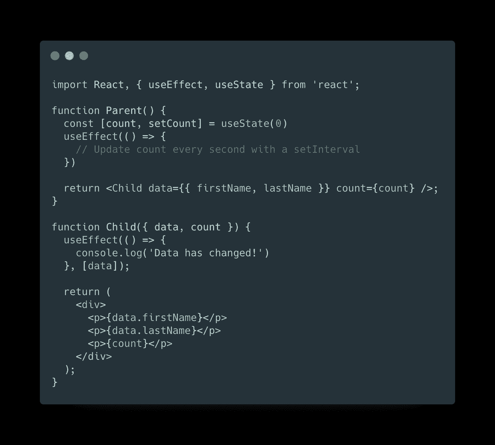
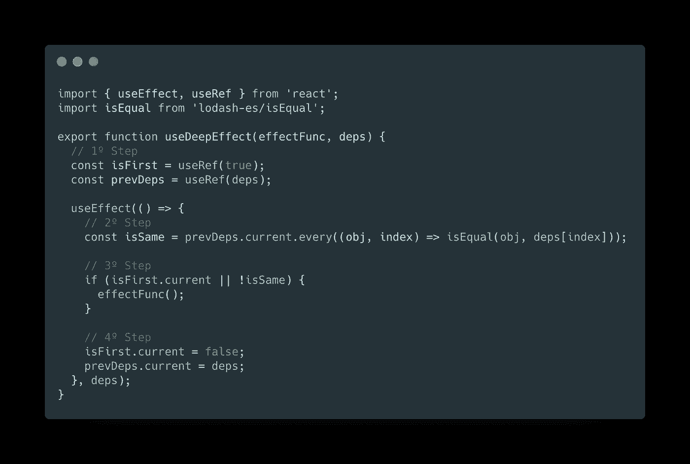

# 如何使用 React 挂钩 useDeepEffect

> 原文：<https://betterprogramming.pub/how-to-use-the-react-hook-usedeepeffect-815818c0ad9d>

## 自定义 React 挂钩，用于对 useEffect 挂钩的依赖项执行浅层相等检查

照片由 [Tim Swaan](https://unsplash.com/@timswaanphotography?utm_source=medium&utm_medium=referral) 在 [Unsplash](https://unsplash.com?utm_source=medium&utm_medium=referral) 上拍摄

在使用 React 钩子时，一个非常常见的情况是，我们需要增强它们的基本功能，以适应组件行为强加的需求，即使本机钩子实现非常有用，并且涵盖了我们需要的大部分内容。React 提供的挂钩可以组合起来创建自定义挂钩，以支持复杂的情况。

# 问题是

假设我们有一个组件，它接收一个对象作为道具，我们想在每次这个对象的一个属性改变时运行一个效果。我们可以编写一些基本代码来获得更好的想法:

此时，我们将一些数据传递给一个对象，并将一个计数值传递给子组件，它应该只在值`firstName`或`lastName`之一改变时运行效果，对吗？没有。

`useEffect`钩子不对对象进行简单的比较，但是它检查它的引用是否改变。

如果我们更好地看看上面的代码，您会看到`Parent` 在传递 props 时总是创建一个新的对象，所以每当 count 变量发生变化并且子组件被重新渲染时，即使数据属性 ***的值没有发生真正的变化，效果也会运行。***

我们需要一种方法，只在对象内容发生变化的情况下运行效果——检查对象属性。

# 解决方案

根据需求，我们需要一个特殊的钩子来检查是否有任何传递的依赖项改变了它的内容。我们可以编写`useDeepEffect`钩子，然后我将评论它的实现。

`useDeepEffect`挂钩实现

为了实现这个定制钩子，我们使用了 Lodash 函数`isEqual` ***，*** ，这将帮助我们深入比较两个传递的元素是否属于 object 类型。让我们回顾一下它是如何工作的:

1.  使用`useRef`钩子声明一个`isFirst`引用来跟踪效果的状态。我们稍后需要检查它是否是第一次运行。我们对`prevDeps` ref 做了同样的处理，总是有一个对钩子应该检查的先前依赖项的引用。
2.  使用`Array.propotype.every` 方法，遍历当前的依赖关系数组，并将它们中的每一个与之前的值进行比较。将结果存储在一个变量中，以确定是否有任何更改。
3.  是时候决定是否应该运行效果函数了。它应该只在第一次运行或者`isSame` 变量为`false`时运行，这意味着先前的依赖关系发生了变化。
4.  最后，我们应该确保这不是钩子第一次运行。我们还必须更新`prevDeps` 引用，使用我们刚刚用于比较的最后一个依赖项。

# 包扎

现在你可以用我们刚刚宣布的新`useDeepEffect`替换普通的`useEffect`。这种钩子用在很多场合。上面解释的是一个简单的例子，但它有助于理解它的用法。

关于这个话题的评论、分享和讨论总是很受欢迎，我很乐意回答你的任何问题！

*感谢阅读！*