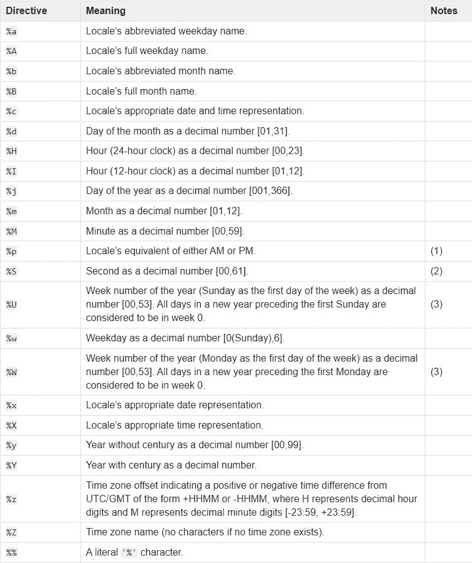

# 如何使用 Python 中的时间模块

> 原文：<https://betterprogramming.pub/how-to-use-the-time-module-in-python-6e8190416a4e>

## 使用 Python 时间模块对时间进行表示、转换和操作


照片由来自 [Pexels](https://www.pexels.com/photo/beige-analog-compass-697662/?utm_content=attributionCopyText&utm_medium=referral&utm_source=pexels) 的 [Ylanite Koppens](https://www.pexels.com/@nietjuh?utm_content=attributionCopyText&utm_medium=referral&utm_source=pexels) 拍摄

Python 中的`[time](https://docs.python.org/3/library/time.html)`模块在我们的代码中提供了许多表示和处理时间的功能。我们可以用不同的格式表示时间，将时间从一种格式转换成另一种格式，根据需要使用`time`模块在代码中使用时间。

在本文中，您将通过使用`time`模块正确理解如何在 Python 中处理时间。

```
**Table of Contents:**· [Python Time in Seconds as a Floating-Point Number](#15bf)
· [Time in Seconds to a String](#31c5)
· [The Time Tuple](#315d)
· [Python Time as an Object](#3046)
· [Floating-Point Time in Seconds to an Object](#148d)
  ∘ [UTC Time](#796b)
  ∘ [Local Time](#0943)
· [Time Object to a String](#539e)
  ∘ [Using asctime()](#1609)
  ∘ [Using strftime()](#16a9)
· [Python Time String to an Object](#9ad5)
· [time.sleep()](#4ac6)
· [References](#4592)
```

# 以秒为单位的浮点数形式的 Python 时间

`time`模块中时间的基本表示是以秒为单位的浮点数。`time.time()`会给你以秒为单位的当前时间。但是首先，你需要导入`time`模块。

```
>>> import time
>>> time.time()
1633525484.7117667
```

`time.time()`返回从时间起点开始经过的浮点秒数。时间的起点称为*纪元*。

`epoch`是时间开始的点，并且依赖于平台。对于 Unix，纪元是 1970 年 1 月 1 日 00:00:00 (UTC)。要了解给定平台上的时代，请查看`time.gmtime(0)` — [Python 文档](https://docs.python.org/3/library/time.html)

您可以使用`time.gmtime(0)`找到适合您平台的`epoch`

```
>>> import time
>>> time.gmtime(0)
time.struct_time(tm_year=1970, tm_mon=1, tm_mday=1, tm_hour=0, tm_min=0, tm_sec=0, tm_wday=3, tm_yday=1, tm_isdst=0)
```

这是时间作为物体的另一种表现。这将在本文后面讨论。目前，我们只是用它来寻找纪元。

通过将时间表示为浮点数，您可以轻松地在代码中使用它。这样计算就变得容易了。假设你想在你的代码中计算两点的时间差。你只需要减去两个点的时间值。

`time_diff.py`在 for 循环中做一些基本计算。使用这段代码中的浮点时间表示，我们可以很容易地计算两个状态之间的时间差。

# 以秒为单位的时间转换为字符串

使用`time.ctime()`您可以将从纪元开始以秒表示的时间转换为字符串。

```
>>> import time
>>> current_time = time.time()
>>> timestamp = time.ctime(current_time)
>>> print(timestamp)
Wed Oct 6 19:42:04 2021
```

这种时间的字符串表示也称为时间戳。`time.ctime()`以下列格式返回时间的字符串表示形式:

*   星期几(星期三)
*   一年中的月份(十月)
*   一个月中的第几天(6)
*   小时、分钟和秒(19 时 42 分 04 秒)
*   公元 2021 年

这是一种更易于人类阅读的时间表示方式。`time.ctime()`根据你的地理位置返回当地时间。

# 时间元组

如果你愿意，你可以把前面的`timestamp`表示成一个元组或者列表。时间元组的每个元素代表一个特定的时间元素。顺序是这样的:

*   年
*   月份(介于 1(1 月)和 12(12 月)之间的整数)
*   一月中的某一天
*   小时(0(上午 12 点)到 23(晚上 11 点)之间的整数)
*   分钟
*   第二
*   星期几(0(星期一)到 6(星期日)之间的整数)
*   一年中的某一天
*   夏令时(1 表示夏令时，0 表示标准时间，-1 表示未知时间)

所以，时间元组会是这样的——

```
>>> time_tuple = (2021, 10, 6, 19, 42, 4, 2, 59, 0)
```

# 作为对象的 Python 时间

您可能希望将时间表示为序列的原因是，使用这种序列表示可以将时间转换为对象。为此，您将使用`time.struct_time()`。

```
>>> import time
>>> time_tuple = (2021, 10, 6, 19, 42, 4, 2, 59, 0)
>>> time.struct_time(time_tuple)
time.struct_time(tm_year=2021, tm_mon=10, tm_mday=6, tm_hour=19, tm_min=42, tm_sec=4, tm_wday=2, tm_yday=59, tm_isdst=0)
```

这使您能够轻松访问时间对象的特定元素。

```
>>> time_obj = time.struct_time(time_tuple)
>>> time_obj.tm_yday
59
>>> time_obj.tm_hour
19
>>> time_obj.tm_year
2021
>>> time_obj.tm_mday
6
```

# **浮点**到一个对象的时间(秒)

*纪元*使用 UTC 进行定义。因此，从*纪元*开始经过的时间的单位也是 UTC。但是有两种方法可以将时间的浮点表示转换为对象:

1.  协调世界时。亦称 COORDINATED UNIVERSAL TIME
2.  当地时间

## UTC 时间

要将浮点时间转换为基于 UTC 的对象，您将使用`time.gmtime()`。我们之前用`time.gmtime(0)`找到了纪元。实际上`time.gmtime()`将从 epoch 到`struct_time`对象的浮点时间转换。`time.gmtime()`将当前时间作为对象返回。

```
>>> import time
>>> time.gmtime()
time.struct_time(tm_year=2021, tm_mon=10, tm_mday=6, tm_hour=14, tm_min=28, tm_sec=2, tm_wday=2, tm_yday=279, tm_isdst=0)
```

使用`time.gmtime()`浮点时间很容易转换成一个对象。但是反过来就有点复杂了。要将`struct_time`转换成浮点时间，您需要首先导入`calendar`模块。那就需要用`calendar.timegm()`。

```
>>> import time
>>> import calendar
>>> time_obj = time.gmtime()
>>> calendar.timegm(time_obj)
1633531197
```

如果您想要从*纪元*的某个时间之后的时间对象，您需要以秒为单位发送经过的时间作为`time.gmtime()`中的参数。假设您想要时间对象在*纪元*之后一年。一年= 60 * 60 * 24 * 365 = 31536000 秒。你需要把它作为一个参数放在`time.gmtime()`中。

```
>>> import time
>>> epoch = time.gmtime(0)
>>> epoch
time.struct_time(tm_year=1970, tm_mon=1, tm_mday=1, tm_hour=0, tm_min=0, tm_sec=0, tm_wday=3, tm_yday=1, tm_isdst=0)>>> elapsed_time = 60 * 60 * 24 * 365
>>> time.gmtime(elapsed_time)
time.struct_time(tm_year=1971, tm_mon=1, tm_mday=1, tm_hour=0, tm_min=0, tm_sec=0, tm_wday=4, tm_yday=1, tm_isdst=0)
```

看着`tm_year`。这是纪元后的一年。

## 当地时间

要将以秒为单位的浮点时间转换为本地时间的时间对象，需要使用`time.localtime()`。

```
>>> import time
>>> time.time()
1633531695.5643973
>>> time.localtime(time.time())
time.struct_time(tm_year=2021, tm_mon=10, tm_mday=6, tm_hour=20, tm_min=48, tm_sec=27, tm_wday=2, tm_yday=279, tm_isdst=0)
```

您也可以使用`tm_zone`查看时区。

```
>>> time.localtime(time.time()).tm_zone
‘+06’
```

要将本地时间对象转换回以秒为单位的浮点时间，只需使用`time.mktime()`。

```
>>> import time
>>> time_obj = time.localtime(time.time())
>>> time.mktime(time_obj)
1633532173.0
```

# 时间对象转换为字符串

## 使用 asctime()

使用`asctime()`您可以将`gmtime()`和`localtime()`都转换成一个字符串时间戳。

```
>>> import time
>>> time.asctime(time.gmtime())
‘Wed Oct 6 15:06:37 2021’
>>> time.asctime(time.localtime())
‘Wed Oct 6 21:06:44 2021’
```

## 使用 strftime()

`asctime()`不能根据需要灵活设置时间戳格式。但是使用`time.strftime()`你可以用一种更有意义的方式来格式化时间。`time.strftime()`需要两个参数:

1.  时间戳字符串的时间元素的格式
2.  时间元组(可选)

下面是在`strftime()`中格式化时间戳的完整图表:



截图摘自 [Python 文档](https://docs.python.org/3/library/time.html)

这里有一个使用`time.strftime()` 的例子——

```
>>> import time
>>> time_obj = time.localtime()
>>> time.strftime(‘%Y-%m-%d’, time_obj)
‘2021–10–06’
```

# 对象的 Python 时间字符串

使用`time.strptime()`你可以将一个字符串时间戳转换成一个时间对象。`strptime()`有两个参数—

1.  字符串时间戳
2.  格式(可选)

```
>>> import time
>>> time.strptime(‘2021–10–06’, ‘%Y-%m-%d’)
time.struct_time(tm_year=2021, tm_mon=10, tm_mday=6, tm_hour=0, tm_min=0, tm_sec=0, tm_wday=2, tm_yday=279, tm_isdst=-1)
```

格式可选，默认为格式`%a %b %d %H:%M:%S %Y`。所以如果你有这种格式的时间戳，你不需要提供第二个参数。

```
>>> import time
>>> time.strptime(‘Wed Oct 6 19:42:04 2021’)
time.struct_time(tm_year=2021, tm_mon=10, tm_mday=6, tm_hour=19, tm_min=42, tm_sec=4, tm_wday=2, tm_yday=279, tm_isdst=-1)
```

# 时间.睡眠()

`time.sleep()`函数要求有自己的节，因为它在程序中确实有用且常用。使用`time.sleep()`你可以暂停执行你的代码一段时间。

```
>>> import time
>>> time.ctime()
'Wed Oct  6 21:37:40 2021'
>>> time.sleep(10)
>>> time.ctime()
'Wed Oct  6 21:37:50 2021'
```

这里，代码的执行暂停了 10 秒钟。您也可以在`time.sleep()`中使用秒的分数值。

```
>>> time.sleep(0.7)
```

这里你的代码将休眠 0.7 秒。

当你需要让你的代码等待一段时间时，这是非常方便的。实现倒计时也很有用。

下面是一个 10 秒倒计时的基本实现:

# 结论

在本文中，我简要介绍了 Python `time`模块。我希望这有助于您为使用 Python 处理时间打下良好的基础。希望随着您继续使用和探索，您会发现`time`模块的其他功能和用例。

感谢阅读。如果您想了解 Python 模块和包，您可能会发现下面的文章对您很有帮助:

[](https://medium.com/geekculture/an-introduction-to-python-modules-and-packages-5da67bfb2a42) [## Python 模块和包的介绍

### 探索模块化 Python 代码的模块和包的概念。

medium.com](https://medium.com/geekculture/an-introduction-to-python-modules-and-packages-5da67bfb2a42) 

# 参考

*   [https://docs.python.org/3/library/time.html](https://docs.python.org/3/library/time.html)
*   [https://realpython.com/python-time-module/](https://realpython.com/python-time-module/)