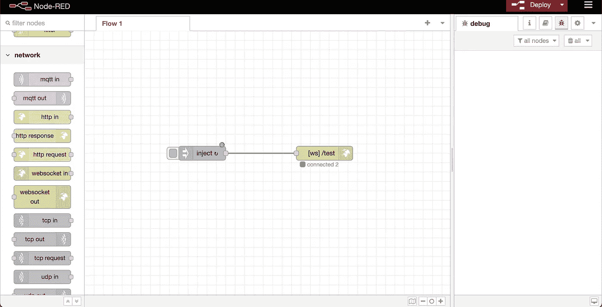
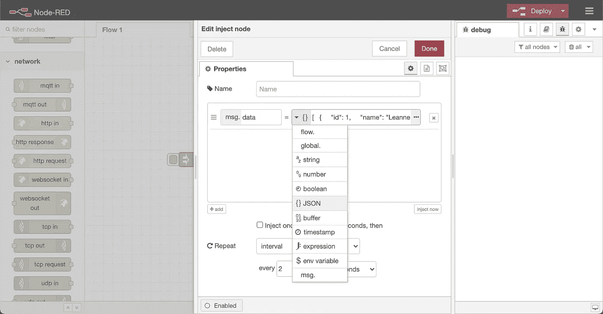
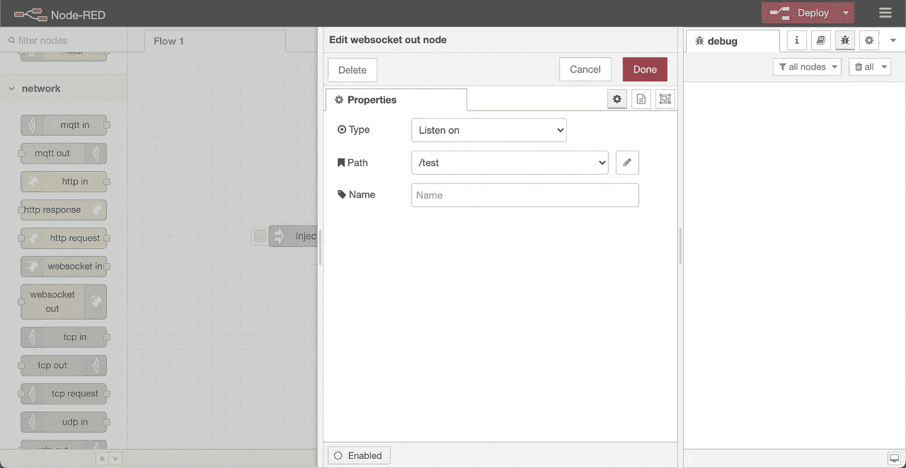
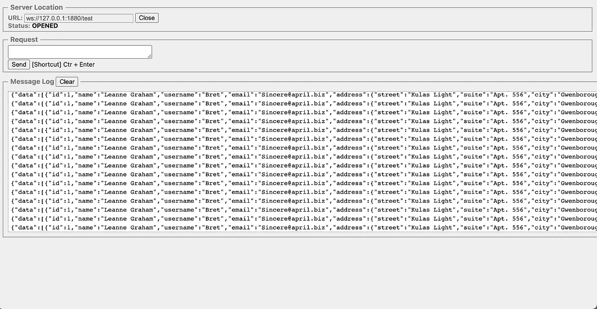
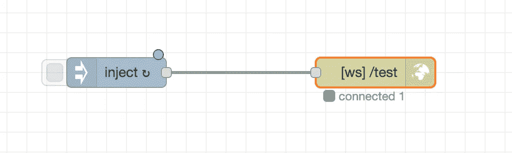
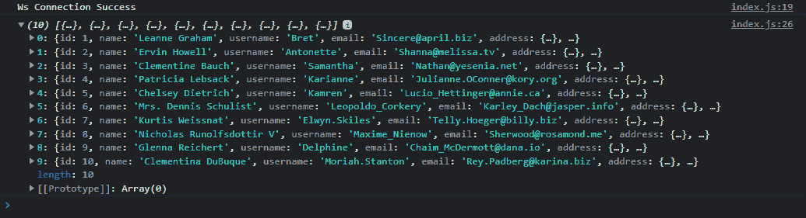
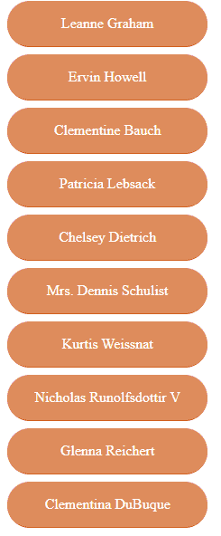

# 如何在 JavaScript 应用程序中使用 Node-Red 上的 WebSocket

> 原文：<https://betterprogramming.pub/how-to-use-the-websocket-on-node-red-in-javascript-apps-8876f2e001a0>

## 通过 Node-Red 为 WebSocket 数据传输设置测试数据


照片由 [Max Nayman](https://unsplash.com/@maxniceman?utm_source=medium&utm_medium=referral) 在 [Unsplash](https://unsplash.com?utm_source=medium&utm_medium=referral) 上拍摄

我将使用 Node-Red 通过 WebSocket 连接接收数据。它将在一个时间间隔内返回输入的数据。

## **在本地安装 Node-Red**

```
sudo npm install -g --unsafe-perm node-red
```

## **在本地运行 Node-Red**

现在，您打开 cmd 或终端，然后运行以下代码:

```
node-red
```

运行 node-red 后，我们会得到如下结果:



你需要添加`timestamp`和`WebSocket out`节点。在时间戳节点中，我们确定 JSON 数据。

您可以从仪表板创建 JSON 数据，如下所示:



双击时间戳后，粘贴您的数据。您可以根据需要对此进行更改:



你可以像这样编辑`WebSocket out`节点，路径对于你的连接 URL 是必要的。

## **测试您的 WebSocket 连接**

为了测试 WebSocket 连接，您可以使用这个 WebSocket 客户端扩展。

安装后，您可以在 127.0.0.1:1880/test 检查 WebSocket 连接 URL。



简单 WebSocket 客户端

当连接建立后，您将在 Node-Red WebSocket out 下看到“connected”。



## **JQuery 库连接**

首先，为了使用 JQuery，我们在脚本文件中添加了`jquery.min.js`包。当我们没有网络连接时，它将是我们的连接端口。当我编写 JavaScript 代码时，我更喜欢使用 jQuery 来简化我的工作。

我们将在 WebSocket 有效负载中使用大量调用，因此 JQuery 将减少我们的工作。

jQuery 提供的最大便利之一是我们可以轻松地管理 CSS。此外，我们可以非常容易地提供我们的 DOM 和 HTML 操作。

现在让我们看看 JQuey 在我们的`index.js`文件中的用法。

```
jQuery(function () { console.log(“test”);});
```

## **安装精简服务器**

```
npm install -g lite-server
```

让我们用`lite-server`命令在终端上运行我们的项目。

让我们来看看 DevTools 的控制台。如果你看到上面写着`test`，我们现在可以使用这个库了。

现在我们已经安装了这个库，我们可以调用我们的 app.json 文件。从这里我们将获得 WebSocket 和 Stomp 连接的 URL。

首先，我们创建一个名为`appSettings`的局部变量。

我们用`$.get()`方法调用变量来使用`app.json` 文件中的值。我们将收到的值放入自己创建的 appSettings 中。

由于`lite-server`现在正在运行，我们用 Ctrl+S 保存更改。如果控制台上的日志是“连接成功”，就说明我们已经建立了连接。

## **WebSocket 连接**

对于 WebSocket 连接，我们需要创建一个函数。创建这个函数后，我们将在 jQuery 内部调用它。

```
var ws = new WebSocket(appSettings.websocket.ws);// where appSettings.websocket.ws = ws://127.0.0.1:1880/test
```

我们正在建立我们的 WebSocket 连接。我们的港口将是`appSettings.websocket`港口。

我们可以从上面的代码中得出一些推论:

`ws.onopen = function(){}`的方法是用来检查我们的连接是否正常。如果有一段我们想运行的代码，我们会把它写在这里。

`ws.onclose = function(){}`此方法用于测试我们的连接是否断开:

我们首先将`ws`设置为 null，这样当我们的连接丢失时，传入的数据不会引起问题。

当连接丢失时，我们可能需要抛出一个请求。如果我们愿意，我们可以通过超时来恢复连接。

在上面的代码中，我们创建了一个单独的函数，这样我们就可以接收传入的消息。

如果你检查控制台，你会看到传入的消息。

在上面的代码中，我们需要检查是否有传入的消息。如果没有消息，就不应该做这些操作。

由于传入的消息是 JSON 格式的，我们需要将该消息转换成 JavaScript 对象。我们在`msg`函数中做这个操作。



消息数据

## **用 userList()函数调用用户名**

首先，我们需要在 index.html 文件中创建一个 id 为`userList`的 div 标签。

```
<div class=”userlist”></div>
```

在上面的代码中，我们重置了`userList`中的数据。否则，传入的数据将被覆盖。因为我们的消息结构是一个数组，所以我们将在一个循环中进行调用。我们将在循环中输出与数组长度一样长的名字。

我们创建与`userList`中的对象数量一样多的 div，并将带有`${object.name}` 的名称分配给它。

`user`和`userlist`类的 CSS 代码是:

我们已经使用`userlist`为将要创建的`divs`创建了一个动态空间。我用它来收集将要形成一个领域的`divs`。`user`是要创建的类名`divs`。

下面是最终结果:



感谢阅读。