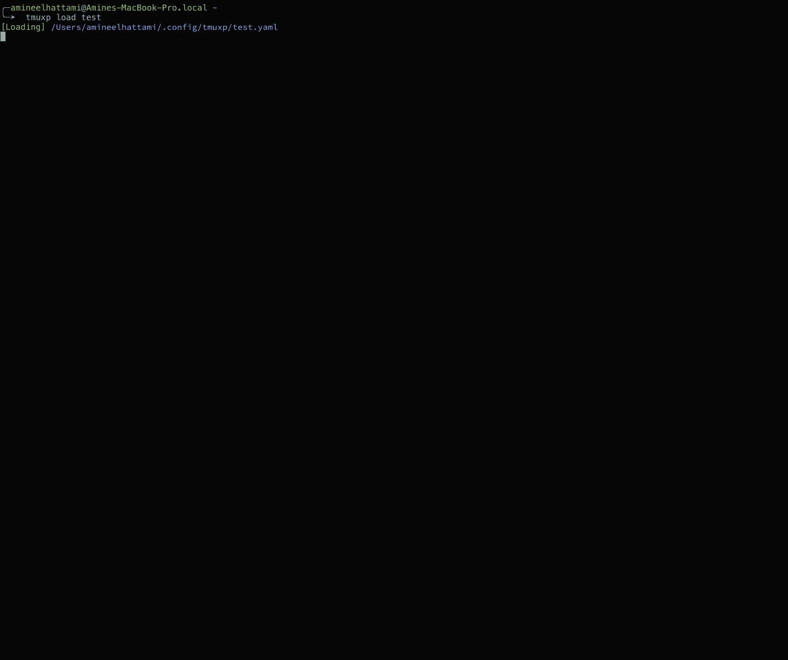
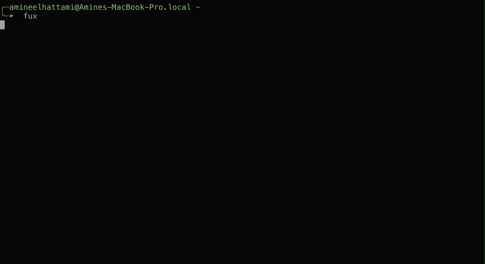

# 如何使用 tmuxp 管理您的 tmux 会话

> 原文：<https://betterprogramming.pub/how-to-use-tmuxp-to-manage-your-tmux-session-614b6d42d6b6>

## 控制您的 tmux 会话


Jorge Ramirez 在 [Unsplash](https://unsplash.com?utm_source=medium&utm_medium=referral) 上拍摄的照片

作为一名程序员，几乎每个工作日都是从为我正在处理的特定任务设置开发环境开始的。

在此期间，我会花几分钟来设置我的 [tmux](https://github.com/tmux/tmux) 窗口和窗格，每次，我都会对自己说，没有必要进行自动化，因为这不会花费太多时间。然而，当我在需要不同布局的任务之间来回切换时，这变得令人疲惫不堪。

起初，我试着使用一些基本的脚本，但很快就无法维护它们，因为需要花费相当大的精力来更新。然后，我找到了 [tmuxp](https://github.com/tmux-python/tmuxp) 。现在已经用了一段时间了，准备分享一下经验。

所以，如果你像我一样，喜欢为每个任务设计一个特定的布局，并且希望花最少的时间来管理配置，那么这篇文章绝对适合你。

# 设置

首先，确保你安装了 tmux 1.8 以上和 python 2.6 以上。然后，使用以下命令安装 tmuxp:

```
# For macOs
$ brew install tmuxp# Using pip (python package manager)
$ pip install --user tmuxp
```

安装后，您需要在 rc 文件中设置以下环境变量(即`.zshrc`)。

```
export DISABLE_AUTO_TITLE='true'
```

# 基础知识

## 存储配置

Tmuxp 配置要么是 YAML 文件，要么是 JSON 文件，您需要决定将它们存储在哪里。您可以保留配置文件:

*   在你文件系统的某个地方。
*   在你的项目目录中作为`.tmuxp.yaml`或者`.tmuxp.json`。
*   在你的`XDG_CONFIG_HOME` ( `$HOME/.config/tmuxp`)。
*   在`$HOME/.tmuxp`中。
*   在由`TMUXP_CONFIGDIR`环境变量引用的自定义路径中。

所有这些方法都会有相同的结果(用期望的配置启动 tmux)。但是，使用最后三个选项之一，您可以从文件系统中的任何位置启动 tmux 会话，而无需键入配置文件的路径。在我这边，我更喜欢使用`XDG_CONFIG_HOME`，因为我已经在其他工具上使用它了。

## 创建配置

从较高层次来看，创建配置文件包括两个主要步骤。首先是定义布局。第二步是选择您想要在每个面板中运行的应用程序或命令。

**创建布局:**创建布局有两个选项。你要么使用一个预定义的 tmux 布局(`even-horizontal`、`even-vertical`、`main-horizontal`、`main-vertical`、`tiled`)，要么创建一个自定义的，这是我通常做的。从技术上讲，您可以直接在配置文件中创建一个自定义布局，但是您已经得到了类似如下的结果:

```
layout: b8f1,104x67,0,0{52x67,0,0[52x45,0,0,1,52x21,0,46,3],51x67,53,0,2}. 
```

相反，您可以遵循以下步骤:

*   在您的配置目录中，创建包含以下内容的配置文件。就我而言，我将其命名为`starter.yaml`。

*   使用上面创建的文件启动 tmux 会话。

```
$ tmuxp load starter
```

*   使用 tmux 快捷方式，创建所需的布局。请注意，您还不需要启动应用程序或命令。完成后，使用交互式`freeze`命令保存当前会话。在下面的例子中，我将新配置命名为`demo.yaml`。

```
$ tmuxp freeze starter
Convert to [yaml]: <hit enter>  
---------------------------------------------------------------
Freeze does its best to snapshot live tmux sessions.The new config *WILL* require adjusting afterwards. Save config? [y/N]: y
Save to: .../.config/tmuxp/starter.yaml [.../.config/tmuxp/starter.yaml]: demo.yaml
Save to .../.config/tmuxp/demo.yaml? [y/N]: y
Saved to .../.config/tmuxp/demo.yaml.
```

*   最后，退出 tmux ( `:kill-session`)并加载您的新配置以查看保存的布局。

```
$ tmuxp load demo
```

在我们跳到下一步之前，我想指出，如果您喜欢 JSON 格式，您可以查看[文档](https://tmuxp.git-pull.com/examples.html#short-hand-inline)或者使用`tmuxp convert`命令进行从 YAML 到 JSON 的转换(`tmux convert config.yaml`)。

**选择要运行的命令:**现在您已经创建了布局，您可以在每个窗口和窗格中添加想要运行的命令。此外，您可以设置其他配置，如当前工作目录、窗口名称等。(查看[文件](https://tmuxp.git-pull.com/examples.html)了解更多详情)。在下面的例子中，我将第一个窗格设置为启动 Neovim ( `nvim`)，将第二个窗格设置为创建一个空终端(`blank`)。此外，我将窗口重命名为`main_window`，并将当前目录设置为`~/work/demo`。

# 现实世界的例子

像你们中的许多人一样，作为一名程序员，我对每项任务都有不同的布局。我有一个用来写代码，另一个用来调试或尝试一些新功能。我甚至在处理特定的特性或错误时会有不同的布局，这取决于它们触及的代码部分。因此，让我们尝试使用 tmuxp 来复制其中两种布局。

## 编写代码

在我的代码编写配置中，我通常有一个包含文本编辑器、终端和文件管理器的窗口，比如 [vifm](https://vifm.info/) 。此外，我激活正确的虚拟环境，并在所有窗格中设置当前工作目录。此外，我打开我的编辑器到最后编辑的文件，并在终端窗格中显示当前的 git 状态(在一个周末之后，这对于避免混合更改非常有用)。配置如下所示:


使用 tmuxp 的开发配置

## 测试

当尝试新功能时，我使用包含两个窗口的更复杂的布局。第一个有一个文本编辑器，一个发布命令的终端(`kubectl`、`curl`等)。)，以及一个查看主日志的终端。第二个窗口包含每个容器日志的窗格。此外，我配置`kubeclt`来使用正确的配置和上下文。配置如下所示:



使用 tmuxp 测试配置

## 临时演员

在我的配置之上，我使用以下助手来简化 tmuxp 的使用:

*   在我的 rc 文件中设置别名:`alias mux=’tmuxp’`。
*   使用 [GNU Stow](https://www.gnu.org/software/stow/) 来管理我的配置。
*   当我有太多配置时，使用 [fzf](https://towardsdatascience.com/turbocharge-your-command-line-game-3344b16bfeec) 帮助选择合适的配置:

```
alias fux='tmuxp load $(tmuxp ls | fzf --layout=reverse --info=inline --height=40%)'
```



使用 fzf 加载 tmuxp 配置

# 结论

这篇文章概述了一些基本的`tmuxp`特性，并向你展示了我如何构建我的一些配置。

最后，我觉得这个工具(或者类似的)值得一试。是的，您可以使用普通的 tmux 和一些 shell 脚本来完成我展示的所有内容。然而，管理器消除了处理和管理脚本的额外工作。此外，您总是可以从使用相同工具的其他用户那里获得一些灵感。

# 参考

*   [增强你的命令行游戏](https://towardsdatascience.com/turbocharge-your-command-line-game-3344b16bfeec)
*   [GitHub — tmux/tmux: tmux 源代码](https://github.com/tmux/tmux)
*   [GitHub—tmux-python/tmuxp:tmux 会话管理器。基于 libtmux 构建](https://github.com/tmux-python/tmuxp)
*   [Stow — GNU 项目—自由软件基金会](https://www.gnu.org/software/stow/)

## 想联系作者？

在 Twitter 上关注我，我经常在那里发关于软件开发和机器学习的微博。