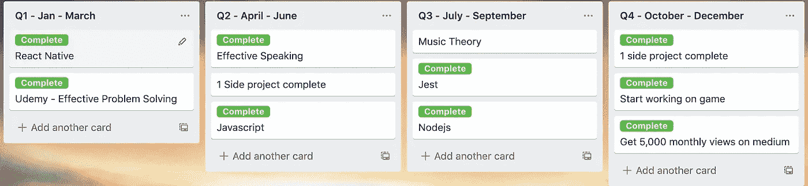

# 如何利用特雷罗达到你的目标

> 原文：<https://betterprogramming.pub/how-to-use-trello-to-reach-your-goals-de15a82dc989>

## 管理你的任务，最大化生产力，粉碎你今年的目标

# 介绍

当新的一年开始时，我会列出一个我想在这一年完成的目标。我总是试图找到最简单的方法来管理我的目标。心中有一个简单的目标是一回事，但是制定一个如何实现我所有目标的计划是另一回事。看到自己离最终梦想更近了一步，这无疑是一种信心的提升。

我首先列出短期和长期目标。它们是典型的格式:我对自己未来六个月到一年的展望，以及五年后的目标。我通常会花整个圣诞假期来思考我希望未来的自己在哪里。

# 季度目标

一旦我有了目标清单，我就开始列出为了实现这些目标我需要完成的任务。例如，去年我开始了一份新工作，所以我希望有一个在工作中表现出色的目标。所以我列了一个清单，列出了我这一年想做的事情，让自己变得更好。

## 特雷罗布局

2019 年目标

一旦我写下了我想要完成的任务，我就启动一个 Trello 板，并使用每个季度的日期范围创建列表。上面的截图是我去年用的 Trello 板，看起来我几乎完成了我想要的一切。

**附注:**我在董事会名称后附上年份，以备日后参考。

在每个季度下，我都添加了我知道会在这段时间内产生最大影响的任务。

我倾向于每个季度不完成四项任务，因为我给自己一个月的时间来完成一项任务。我不认为自己是一台机器，有时我不想做任何事情。它更像是一个缓冲器。

Trello 完整标签

我还做了一个名为`complete`的 Trello 标签，可以更容易地跟踪每个季度完成的任务。我给它加了一个绿色背景，让它看起来很成功。

# 复习时间

我总是回到我的特雷罗董事会，回顾每个季度需要完成的一切。当我的目标改变时，我也会通过添加/删除任务来进行调整。这是为了确保公告板保持最新。

当我觉得需要提醒我该做什么的时候，我的季度清单就会被审核。我通常一周复习一次，有时甚至几天复习一次，这取决于我进步了多少。这有点不稳定，但重要的是要有最新的任务列表。

当你做回顾的时候，确保在必要的时候贴上完整的标签。当我看到所有的绿色时，这是一个很大的动力。另一个原因是很难记住我一年中完成了多少，看到这些标签是一种提醒。所以回到我的特雷罗板上，看看我都做了些什么，总会推动我前进。

# 结论

我尝试过用不同的方式管理我的目标，到目前为止，这对我来说是最简单和最容易管理的方法。

我用“把事情做完”( GTD)来管理我的日常收件箱，但是没有指标表明我是否达到了目标。子弹杂志对我来说也是一样。我通常把在特雷罗的目标和在 GTD 的任务清单结合起来。