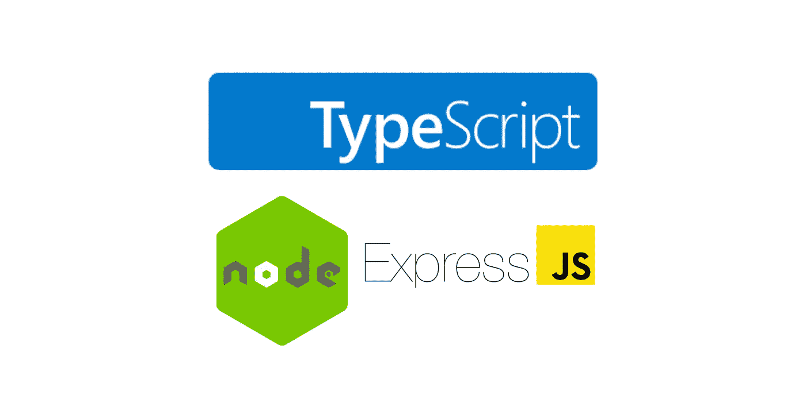

# 如何在 Node.js 和 Express 项目中使用 TypeScript

> 原文：<https://betterprogramming.pub/how-to-use-typescript-in-a-node-js-and-express-project-b94af787bb7a>

## 将 TypeScript 添加到现有 Node.js 应用程序中



作者照片。

在本教程中，您将学习如何在 Node.js 和 Express 项目中使用 TypeScript。本教程的目的是向您展示如何使用这些技术创建一个项目。它的目的不是争论是否应该添加 TypeScript。

在继续之前，先决条件是:

*   TypeScript、Node.js、Express 的基础知识。
*   具有从 v12 以上的节点版本，包括节点 12。

# 1.设置项目

第一步是为项目创建一个目录并初始化它。运行以下命令创建一个名为`typescript-nodejs`的空目录，并将当前目录更改为该目录:

```
mkdir typescript-nodejs
cd typescript-nodejs
```

现在您已经在`typescript-nodejs`目录中，您必须初始化节点项目。为此，请运行以下命令:

```
npm init -y
```

在上面的命令中使用`-y`标志生成带有默认值的`package.json`文件。npm 用默认值初始化文件，而不是我们自己添加项目的名称和描述等信息。

项目已经初始化，因此您可以进入下一部分——添加项目依赖项。

# 2.添加依赖关系

下一步是添加项目依赖项。这些是快速框架和类型脚本。通过运行以下命令添加这些依赖项:

```
npm install express
npm install typescript ts-node [@types/node](http://twitter.com/types/node) [@types/express](http://twitter.com/types/express) --save-dev
```

为什么把所有打字稿相关的东西都存成`devDependencies`？即使您使用 TypeScript 编写代码，代码也会被编译回普通的 JavaScript。运行应用程序本身不需要 TypeScript。因此，由于 TypeScript 仅由开发人员使用，所以它被保存为开发依赖项。

接下来，在安装完所有依赖项后，您的`package.json`应该如下所示:

# 3.配置 TypeScript

到目前为止，您已经安装了 TypeScript，但是您还不能使用它。原因是你需要配置它。您需要创建一个名为`tsconfig.json`的文件，表明该目录是 TypeScript 或 JavaScript 项目的根。

```
npx tsc --init
```

运行上面的命令创建了`tsconfig.json`文件，我们可以在其中定制 TypeScript 配置。新创建的文件包含大量代码，其中大部分都被注释掉了。但是，您需要了解一些设置:

*   `target` —使用此选项，您可以指定在项目中使用哪个 ECMAScript 版本。例如，如果您将`target`设置为`ES5`，然后使用箭头函数，代码会被编译成一个等价的 ES5 函数。可用版本有`ES3`(默认)`ES5``ES2015``ES2016``ES2017``ES2018``ES2019``ES2020``ESNEXT`。
*   `module` —使用此选项，您可以指定在生成的 JavaScript 代码中使用哪个模块管理器。您可以在以下值中选择:`none`、`commonjs`、`amd`、`system`、`umd`、`es2015`、`es2020`或`ESNext`。最常见的模块管理器(也是默认的)是`commonjs`。
*   `outDir` —使用此选项，您可以指定输出普通 JavaScript 代码的位置。
*   `rootDir` —此选项指定类型脚本文件的位置。
*   `strict` —该选项默认启用，启用严格的类型检查选项。
*   `esModuleInterop` —该选项默认为`true`，支持 CommonJS 和 es 模块之间的互操作性。它是怎么做到的？通过为所有导入创建命名空间对象。

关于所有可用选项的深入信息，我建议查看[类型脚本 TSConfig 参考](https://www.staging-typescript.org/tsconfig)。

# 4.创建 Express 服务器

配置好 TypeScript 之后，就可以创建 Express web 服务器了。首先，通过运行`touch index.ts`创建文件`index.ts`(注意文件扩展名)。

创建文件后，在其中编写以下代码:

现在您有了一个简单的 web 服务器，它显示“干得好！”当你访问`localhost:3000`时。服务器非常简单，并且没有利用 TypeScript。然而，本教程的目的是让这些技术协同工作，并创建一个样板文件。从这里，您可以构建任何您想要的应用程序。

每当您进行更改并希望运行应用程序时，您都需要将 TypeScript 编译成普通的 JavaScript。为此，您需要运行:

```
npx tsc --project ./
```

`tsc`命令将 TypeScript 编译成 JavaScript。`--project`标志指定从哪里挑选 TS 文件。最后，`./`指定了项目的根。

如果你进入`build`文件夹，你应该会看到编译好的 JavaScript 代码(即从你写的 TypeScript 代码编译的代码)。

但是，我们可以稍微简化一下这个过程。您将在下一节看到如何操作。

# 5.创建脚本

每次你想编译你的代码时，写`npx tsc --project ./`可能会很乏味。因此，我们可以在`package.json`中添加一个脚本来简化这个过程。

在`scripts`下的`package.json`中添加以下代码行:

```
"build": "tsc --project ./"
```

现在你可以运行`npm run build`来编译你的代码。这种方式更简单快捷。

# 结论

在本教程中，您学习了如何创建 TypeScript + Node.js + Express 样板文件。这只是冰山一角，因此您可以从这里构建任何您想要的应用程序。

*如果你对 JavaScript 教程感兴趣，我推荐* [*前端高手*](https://catalins.tech/frontend-masters-membership-is-it-worth-it) *！*

*如果你想用技术写作赚钱，去看看那些付钱让你写* *技术文章的* [*网站吧！*](https://catalins.tech/websites-that-pay-you-to-write-technical-articles)

*如果你想学习 JavaScript，我推荐这些* [*5 资源作为初学者学习 JavaScript*](https://catalins.tech/5-best-resources-to-learn-javascript-as-a-beginner)*！*

*谈判你的工资是必不可少的——学习* [*作为一名开发者如何谈判你的工资*](https://catalins.tech/how-to-negotiate-your-salary-as-a-developer) *！*

*用* [*加速你的开发 Git 别名*](https://catalins.tech/git-aliases-what-are-they-and-how-to-use-them) *。*

*如果你想以开发者的身份* [*开博*](https://catalins.tech/how-to-start-your-blog-as-a-developer) *，我推荐阅读《* [*如何以开发者的身份开博*](https://catalins.tech/how-to-start-your-blog-as-a-developer) *》一文！*

*你是否很难跟上科技领域的最新消息？参见* [*作为开发者保持最新状态的一种方法*](https://catalins.tech/one-way-to-stay-up-to-date-as-developer) *！*

*学习* [*如何在 JavaScript*](https://catalins.tech/how-to-use-asyncawait-in-javascript) *中使用 Async/Await！*

GitHub 简介目前风靡一时。了解 [*如何创建 GitHub 个人资料页面*](https://catalins.tech/how-to-create-a-kickass-github-profile-page) *！*

*看看这 7 个* [*资源，帮你通过求职面试*](https://catalins.tech/7-github-repositories-to-help-you-crush-your-job-interviews) *！*

*查看*[*JavaScript ECMAScript 2021 es 2021*](https://catalins.tech/javascript-es2021-you-need-to-see-these-ecmascript-2021-features)*即将推出的新功能！*

*你是初学程序员吗？查看这些* [*编程项目思路适合初学者*](https://catalins.tech/10-programming-project-ideas-for-beginners) *！*

你是在学习编码还是打算做编码？查看 [*免费学习编程的最佳去处*](https://catalins.tech/20-best-places-to-learn-programming-for-free) *！*

[*用这 9 个浏览器扩展提高你的开发者生产力*](https://catalins.tech/my-9-must-have-browser-extensions-for-increased-developer-productivity) *！*

*如果你是 Node.js 的开发者，我建议你查看 Node.js* *中的这些* [*4 种创意设计模式！*](https://catalins.tech/the-4-creational-design-patterns-in-nodejs-you-should-know)

*查看这些惊人的*[*JavaScript ECMAScript 2020 特性*](https://catalins.tech/javascript-es2020-the-features-you-should-know) *！*