# 如何在 iOS 故事板中使用 UIKit 扩展

> 原文：<https://betterprogramming.pub/how-to-use-uikit-extensions-with-ios-storyboards-3a20fdccaac7>

## 因为您的用户界面可以使用一些定制

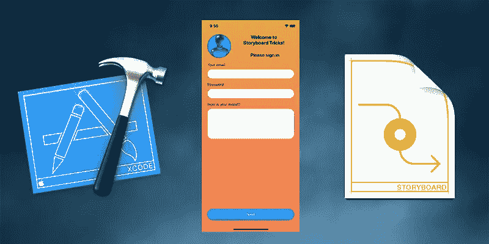

图片来源:作者

故事板是制作 iOS 用户界面的一种原生方式。最近苹果推出了 SwiftUI，据称它将取代 UIKit(用于故事板)，但目前，大多数 iOS 应用程序仍使用故事板。

故事板只能在 Xcode 中编辑；这是一种专有的文件格式。从逻辑上来说，它是一组笔尖，UI 的小部分——应用程序屏幕，可重复使用的单元，等等。它们还声明应用程序屏幕之间的连接。

应用内包故事板编译成`storyboardc`文件。它可以让 iPhone 或 iPad 快速有效地解析它们。

故事板最大的缺点是只能在 Xcode 中编辑。与 SwiftUI 布局不同，故事板不能手动编辑(可以，但是强烈不推荐)。

这个缺点导致了另一个缺点——UI 编辑并不完美。有些特性不能在故事板编辑器中编辑，但必须在代码中编辑。比如阴影、渐变、圆角等特征需要在代码中添加或者……先说这个*或者*。

# 圆角、内容裁剪和边框

UIKit 中的每个视图都是`UIView`的子类。每个`UIView`都有一层或多层。不能在故事板编辑器中直接编辑层。但是图层恰恰定义了圆角、内容裁剪和边框等属性。

我们需要做的就是使用`@IBInspectable`属性使它们可编辑。

为了让它与`UIView`及其所有子类(这意味着与所有视图)一起工作，我们可以创建一个扩展。

`CGColor`扩展只是一个简单的扩展，允许将其转换为`UIColor`而不会有任何麻烦。图层与`CGColor`一起工作，但是故事板“更喜欢”`UIColor`。

`UIView`扩展允许您编辑:

*   `borderWidth`定义边框宽度。0(默认值)表示没有边框。任何正值都会创建一个边框(只要定义了`borderColor`并且不透明)。
*   `borderColor`定义边框的颜色。
*   `cornerRadius`定义了圆角且大于 0 时。
*   `masksToBounds`层外作物含量。

让我们来看几个例子(见下面的截图):

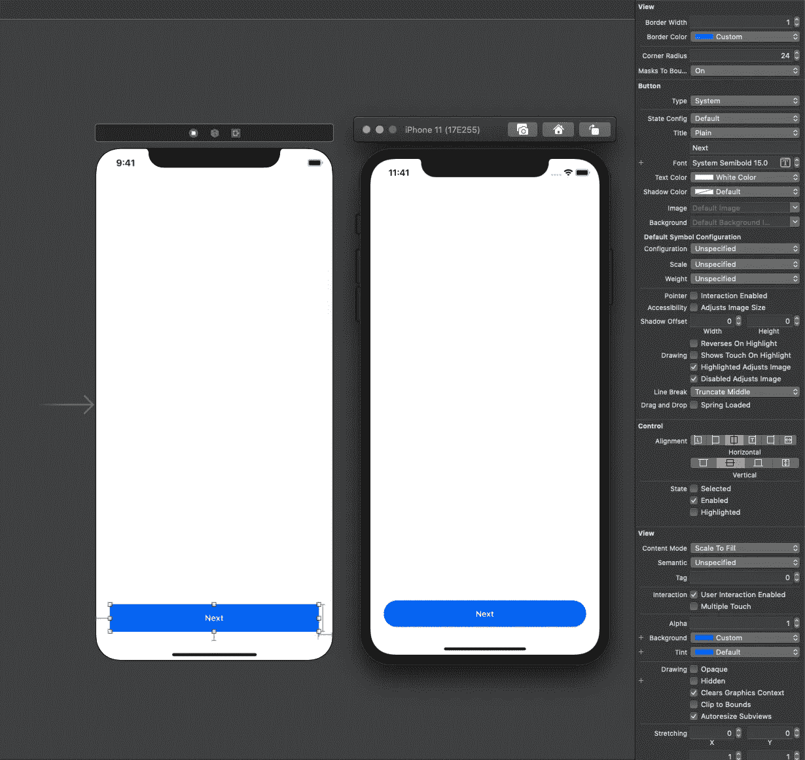

圆角和浅蓝色框架


MasksToBounds 断断续续

在这张图中，有两个`UIImageViews`具有相同的透明 PNG，但是背景颜色不同，并且`masksToBounds`也不同。正如你在前面的截图中看到的，`masksToBounds`属性影响内容，但不影响背景。

# 阴影

一个简单的矩形阴影几乎不成问题，但由于我们想要圆角，我们需要使用`UIBezierPath`来塑造我们的阴影。

另一个问题是属性的应用是随机的。嗯，这不是完全随机的，但是在我们创建阴影之前，我们不能确定对象的位置和大小。

让我们先看看代码:

我们的 shadow 是一个扩展，这意味着我们可以将它应用于任何`UIView`子类。在这个例子中，与其说是阴影，不如说是暗光，但是用不同的`shadowOffset`看起来会更模糊。

为什么我们需要`updateShadows`方法？当布局改变时更新我们所有的阴影！它可以是屏幕的旋转、动画和动态布局变化、键盘出现/消失等。

为了使它正确工作，我们需要将下面的代码添加到我们所有的视图控制器中。最简单的方法是为它们创建一些公共基类:

```
**override** **func** viewDidLayoutSubviews() {
    **super**.viewDidLayoutSubviews()
    view.updateShadows()
}
```

看起来是这样的:

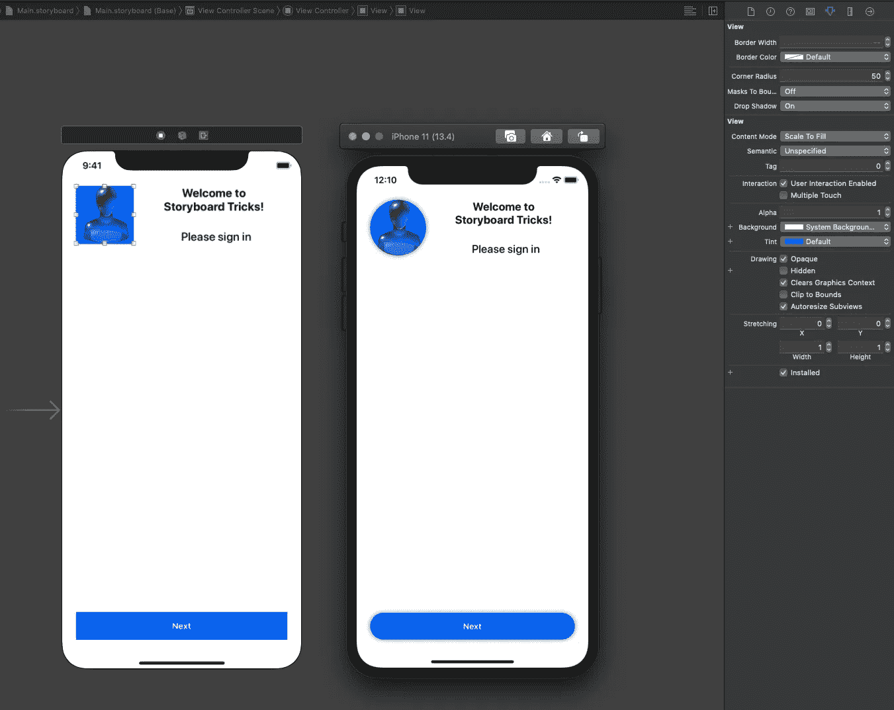

阴影

最后两点:

*   阴影与`masksToBounds`属性不兼容。遮罩只是从视图中剪切阴影。如果您需要裁剪内容并同时添加阴影，请添加另一个视图，就像上面的截图一样。
*   不要给背景透明或部分透明的视图添加阴影；否则，你会通过你的视角看到它。

# UITextField 填料

如果加上标准样式的`UITextField`，左右两边会有一点填充。但是我不记得有哪一个客户给我提供了一个标准外观的设计。一旦我们移除了标准边框，我们就会遇到一个问题——文本字段没有填充。带边框，阴影，圆角，还有其他效果，不好看。更有甚者，圆角可以切割一些文字。

这个问题可以通过改变插图来解决。我们不能用标准的方式改变它们。我们只能创建一个定制类，一个`UITextField`的子类:

这个类允许你编辑左边和右边的填充。您可以添加顶部和底部填充，但通常没有必要。

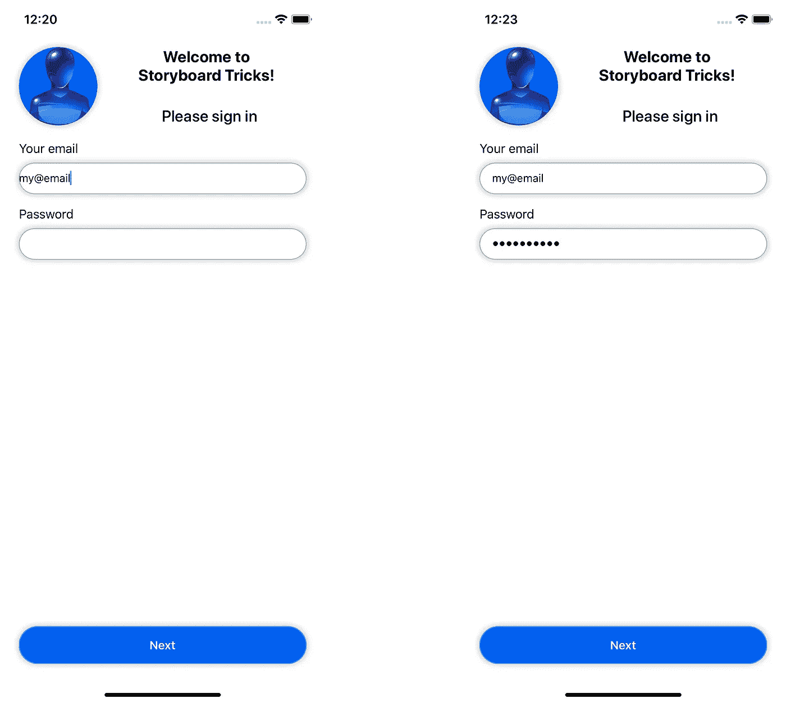

UITextField(左)和 TextFieldWithPadding(右)

对于故事板，视图子类和扩展是有区别的。在这两种情况下，属性都会出现在“属性”检查器中(Xcode 窗口右侧的面板)。但是当你子类化一个视图时，你可能会在故事板编辑器中看到结果，否则只能在应用程序运行时看到。

不幸的是，自定义视图的预览经常失败。如果你看到的是黑屏而不是你的布局，很可能就是这种情况。

# UITextView 占位符

`UITextField` 有一个属性叫做`Placeholder`。它可以在故事板中改变，只要你不打算改变它的风格，你就不需要写任何代码。与`UITextView` 的情况不同。

换句话说，我们不能在故事板中添加带有占位符的 iOS 应用程序中的多行可编辑文本字段——除非我们使用自定义视图。

为了给`UITextView`添加一个占位符，我推荐你使用一个库:[https://github.com/devxoul/UITextView-Placeholder](https://github.com/devxoul/UITextView-Placeholder)。

要安装它，请将这行代码添加到您的 pod 中:

```
pod 'UITextView+Placeholder'
```

该库用 Objective-C 编写，兼容所有版本的 Swift。

它允许您添加一个简单的属性占位符。可以在故事板中添加一个简单的占位符。不要忘记运行`pod install`或`pod update`，然后在编辑你的故事板之前构建你的项目。

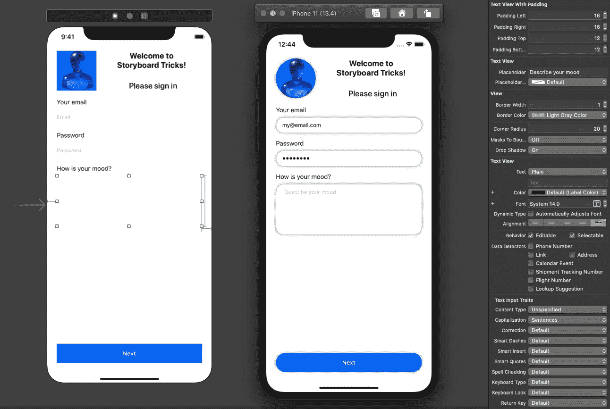

带有填充和占位符的 UITextView

我还没有解释如何在`UITextView` (及其子类)中进行填充。它类似于`UITextField`，但是您需要设置一个值，而不是覆盖一些方法，默认情况下，这个值在故事板中是不可编辑的:

# 梯度

正如我之前提到的，UIKit 中的视图有一层或多层。渐变可以作为附加层来实现。

给所有视图添加渐变没有太大意义。复杂视图中的子视图可能会有问题。让我们创建一个最简单的版本— `GradientView`，它是`UIView`的一个子类。然后，如果有必要，您可以尝试其他视图。

关于梯度我们需要知道的是:

*   颜色——至少两种不同的颜色，可能更多
*   方向—水平、垂直或对角

让我们来实现一个只有两种颜色(开始和结束)和两个方向选项(水平和垂直)的最小实现:

当我们有了源代码，让我们给我们的项目添加一个渐变背景。

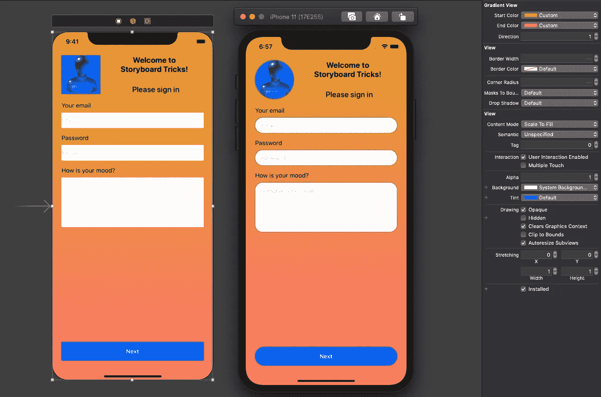

渐变背景

枚举不能与故事板编辑器集成。这就是为什么我们使用整数常量:0 代表水平渐变，1 代表垂直渐变。

丑？绝对的！但是代码是有效的。希望你有比我更好的设计师:)

# 快速创建出口和行动

本节不需要任何额外的代码，只是提示如何更有效地使用 Xcode。很多人都知道，但不是所有人。

Outlets 是我们在`UIViewController`、`UITableViewCell`、`UICollectionViewCell`或自定义`UIView` 子类中的视图的引用。使用 outlets，我们可以获取和设置视图的属性。

动作是来自交互式视图的回调，例如按钮。动作允许处理按钮点击、文本编辑、更改开关和复选框的值。

让我们把 Xcode 分成两个水平面板。为此，单击故事板编辑器右上角的“+”按钮。

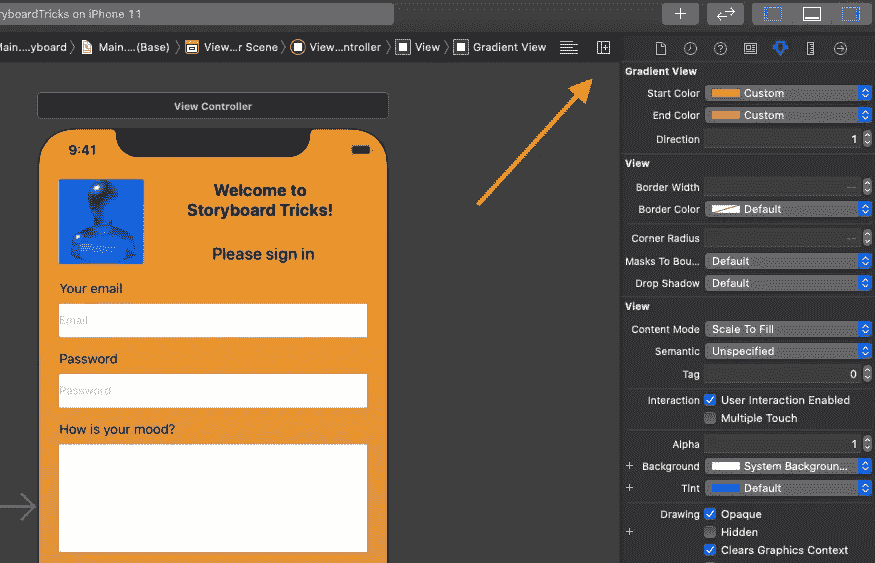

添加额外的面板

选择与您选择的视图或视图控制器匹配的源代码文件。通常是`UIViewController`、`UITableViewCell`或`UICollectionViewCell`的子类。在我们的例子中，它将是`ViewController`。

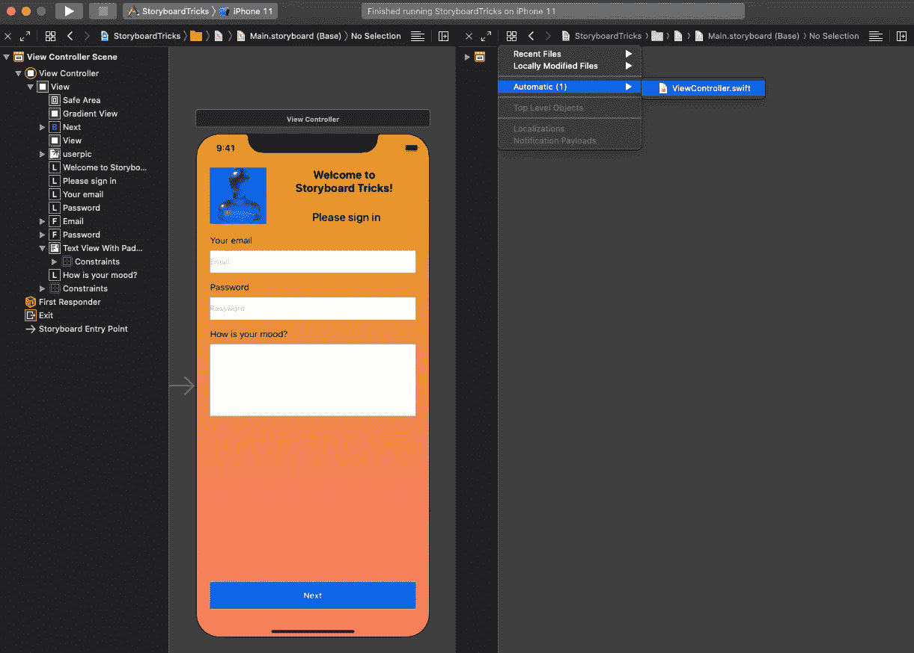

为右侧面板选择文件

找到您需要的视图，按住鼠标右键(或者 Ctrl+按钮，如果您的鼠标只有一个按钮)，将光标移动到源代码文件，然后释放鼠标。通常，Xcode 会很好地猜测您需要什么。对于`UITextField`，它会创造一个出口。对于`UIbutton`，它为`TouchUpInside` 事件创建一个动作(从技术上来说是点击/轻击)。

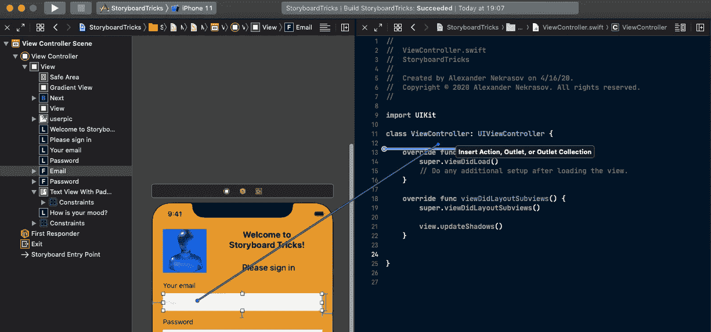

创造一个出口

如果您对 Xcode 的选择不满意，您可以随时在弹出式对话框中进行更改。

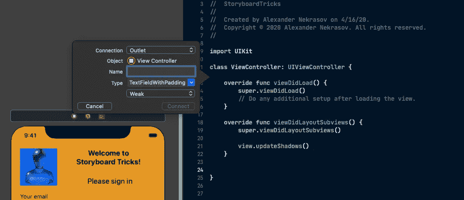

建立一个出口

行动也是一样。将一个按钮(或另一个交互式视图)拖到源代码中，您将得到一个操作。

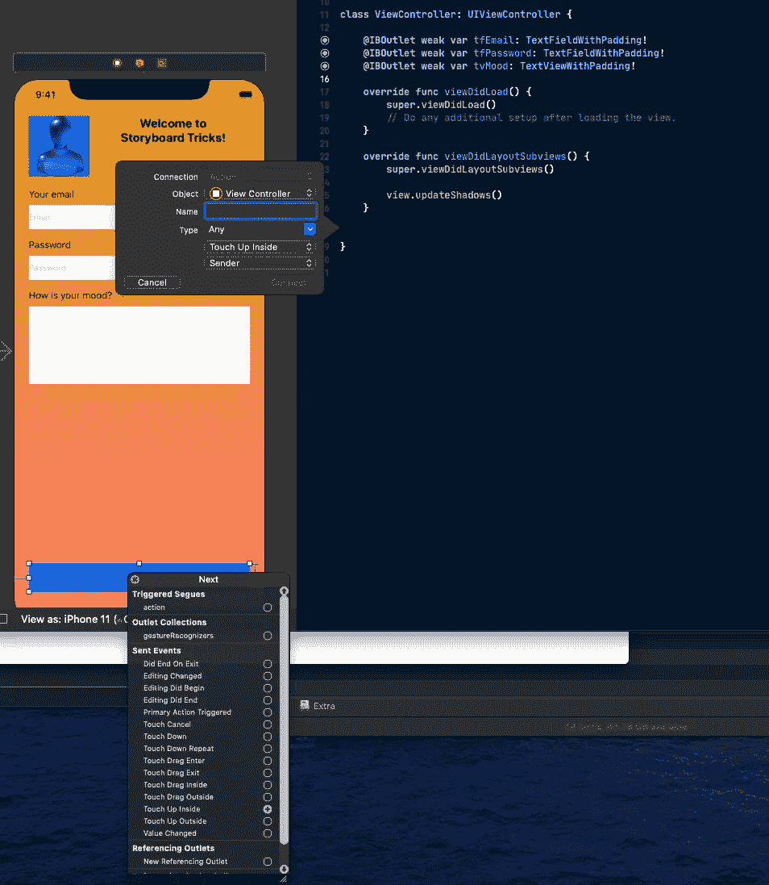

创建操作

就是这样！您可以设置代理和数据源，并以同样的方式建立其他连接。

# 结论

有了几个定制的类和扩展，故事板的编辑会容易得多。你可以通过在你的项目中添加一些[豆荚](https://cocoapods.org)来获得更多。

如果你喜欢这些技巧，开始在你的 iOS 项目中使用这些 [10 有用的 Swift 字符串扩展](https://medium.com/better-programming/10-useful-swift-string-extensions-e4280e55a554)。

下次见。编码快乐！