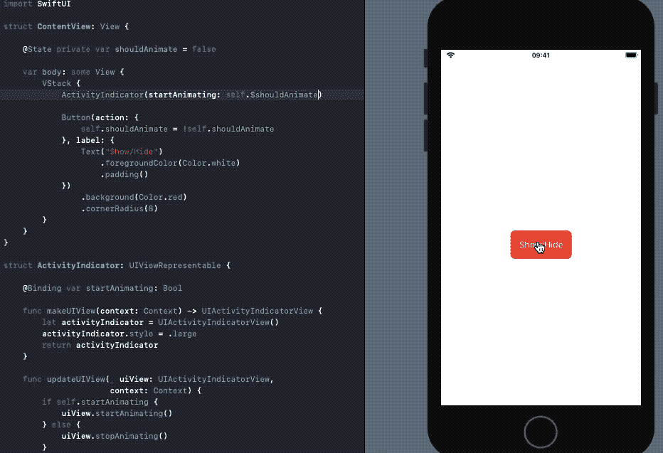
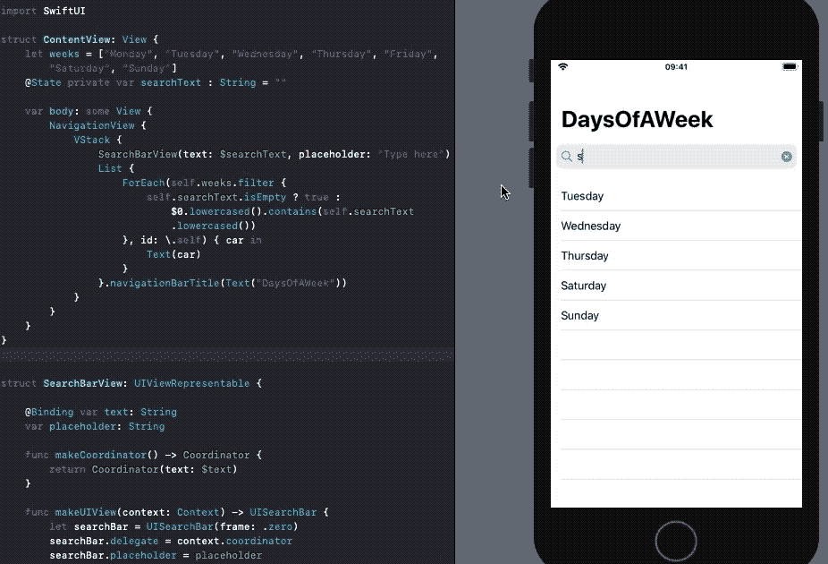
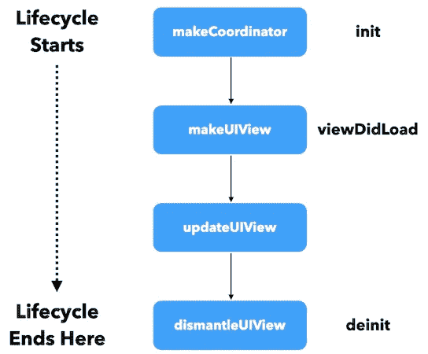
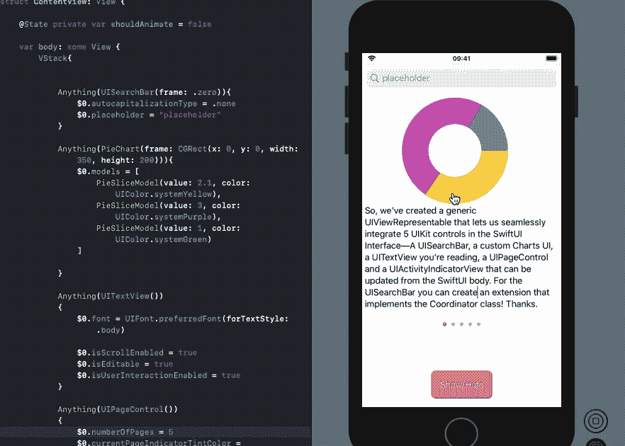

# 如何在 SwiftUI 中使用“UIViewRepresentable”

> 原文：<https://betterprogramming.pub/how-to-use-uiviewrepresentable-with-swiftui-7295bfec312b>

## 连接 SwiftUI 和 ui kit——并理解协调器、生命周期方法和通用类型


Radek Grzybowski 在 [Unsplash](https://unsplash.com?utm_source=medium&utm_medium=referral) 上的照片

SwiftUI 为我们在应用程序中构建用户界面的方式带来了范式转变，但它目前并不提供对所有 UI 控件的原生支持。现在，人们可能想知道如何将`UIActivityIndicator`、`MKMapView`、`WKWebView`或`UIPageControl`添加到他们基于 SwiftUI 的应用程序中。

很高兴 SwiftUI 为我们提供了一个`UIViewRepresentable`协议，允许我们包装 UIKit 视图并从 SwiftUI 视图中使用它们。还有一个`UIViewControllerRepresentable`让我们将`UIViewControllers`集成到 SwiftUI 中。

## 我们的目标

*   理解`UIViewRepresentable`如何工作并探索它的生命周期
*   使用`Coordinator`将数据从 UIKit 视图传递到 SwiftUI。我们将从 SwiftUI 视图中看到如何嵌入一个`UISearchBar`并与之交互。
*   创建一个通用的包装器，让我们能够在 SwiftUI 界面中快速集成任何 UIView

# “UIViewRepresentable”协议

在我们的定制实例中采用`UIViewRepresentable`让我们能够从 SwiftUI 界面创建和管理 UIKit 视图。最简单的实现需要您处理两个方法:`makeUIView`和`updateUIView`。

以下是在 SwiftUI 中嵌入`UIActivityIndicator`时如何使用它们的示例:

*   `makeUIView`允许我们建立可表示的视图(在我们的例子中是`UIActivityIndicatorView`)。在 SwiftUI 视图的生命周期中，它只会被调用一次。
*   每当其包含的 SwiftUI 视图改变其状态时，`updateUIView`就会被触发。在这个方法中，您可以对视图信息进行更改。为了从 SwiftUI 视图中获取数据，我们利用了一个`Binding`属性包装器——它可以读取和写入一个真实来源所拥有的值(在我们的例子中是`State`)。

让我们看一个简单的 SwiftUI 应用程序，它在点击按钮时显示和隐藏`UIActivityIndicatorView`。



在`@Binding`属性包装器中，让我们定义一个显式依赖项，其初始值来自 SwiftUI 状态。因此，每当按下按钮时，`@State`就会切换，相应地，绑定值也会改变，从而触发`updateUIView`。

# 与协调员合作

虽然`@Binding`属性包装器有助于将数据从 SwiftUI 传递到 UIKit 视图，但有时我们也需要反过来做。

SwiftUI 的协调者充当 UIKit 和 SwiftUI 视图之间的桥梁。它们允许我们通过使用委托或目标操作将 UIKit 视图更改传达给 SwiftUI 界面。`Coordinator`是一个类，我们可以在其中实现 UIKit 视图协议委托。

UIKit 控件有自己的委托方法，让我们可以给`MKMapView`添加注释，或者更新`UIPageViewController`中的当前页面索引。我们可以使用协调器实现这些委托方法，并使用绑定值调用`updateUIView`方法。

下面是一个定制的`Coordinator`类的代码，它实现了`UISearchBarDelegate`协议来通知 SwiftUI 可表示视图的文本更新:

接下来，让我们将`makeCoordinator()`方法添加到`UIViewRepresentable`包装器结构中。

在`makeUIView`方法中，我们将`context`参数中的`coordinator`属性设置为`UISearchControl`的`delegate`属性。

在上面的代码中，每次触发`Coordinator`类的`UISearchBarDelegate`时，文本都被传递到`updateUIView`，最终更新`UISearchBar`视图。这是 SwiftUI 应用程序的屏幕截图，其中 UISearchBar 被添加到 SwiftUI 列表中。



# “UIViewRepresentable”生命周期

既然我们已经看到了 UIKit 视图是如何嵌入 SwiftUI 的，以及数据流是如何使用绑定和协调器来更新视图的，那么让我们来可视化一个 UIKit 可表示视图的生命周期:



对于 UIKit 可表示视图,`dismantleUIView`的行为类似于`deinit`。您可以进行清理工作——例如删除通知观察器、计时器失效等。—在里面。

SwiftUI 视图中的`UIViewController`的生命周期以同样的方式工作，并且具有相似的函数签名——用`makeUIViewController`替换`makeUIView`,以此类推。

# 通用' UIViewRepresentable '

在前面的章节中，我们看到了添加一个简单的`UIActivityIndicatorView`和`UISearchBar`是如何需要创建单独的包装器结构的。

它不仅增加了样板代码，还拆分了视图逻辑——例如，`UIActivityIndicatorView`在 SwiftUI 中被实例化，而动画切换逻辑驻留在`UIViewRepresentable`中。

幸运的是，我们可以通过创建一个通用的`UIViewRepresentable`结构来解决这些问题，该结构允许您嵌入任何 UIKit 视图。让我们编写一个通用类型，它可以包装`UIViewRepresentable`中的任何`UIView`:

应用于上述闭包参数的`@autoclosure`属性自动从您传入的表达式中创建一个闭包。它有助于将闭包的执行推迟到真正需要的时候。

使用上面的通用`Anything`包装器，我们可以在 SwiftUI 中嵌入任何 UIKit 视图。当然，要创建自定义协调器实例，您可以扩展上面的泛型并设置特定于 UI 控件的委托。

下面看一下如何在 SwiftUI 主体中使用`Anything`包装器嵌入`UIActivityIndicatorView`:

```
**Anything**(UIActivityIndicatorView(style: .large)) {
    if self.shouldAnimate {
        $0.startAnimating()
    } else {
        $0.stopAnimating()
    }
}
```

在下图中，我们在通用包装器中又包装了四个 UIKit 控件— `UISearchBar`、一个[自定义图表 UI](https://github.com/i-schuetz/PieCharts) 、一个`UITextView`和一个`UIPageControl`。



# 结论

因此，我们看到了`UIViewRepresentable`如何使用 UIKit 包装器结构帮助集成缺失的 SwiftUI 控件。随后，我们与协调员合作，从 UIKit 更新 SwiftUI 视图，并看到了事件的生命周期。最后，我们为`UIViews`创建了一个通用的包装器。

完整的源代码可以在这个 [GitHub 库](https://github.com/anupamchugh/iowncode/tree/master/SwiftUIViewRepresentable)中找到。

感谢阅读。如果您想开始使用 Combine 框架，这里是一个很好的起点:

[](https://medium.com/better-programming/a-deep-dive-into-the-combine-framework-in-swift-cffdfcc6f32c) [## 深入探究 Swift 中的联合框架

### 让我们了解一下苹果自己的反应式框架

medium.com](https://medium.com/better-programming/a-deep-dive-into-the-combine-framework-in-swift-cffdfcc6f32c)