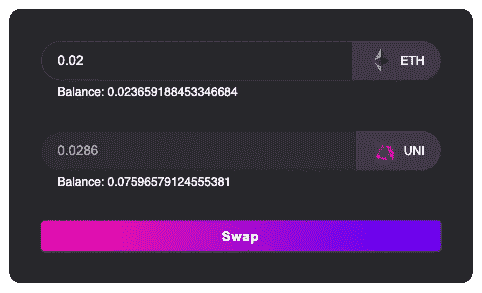
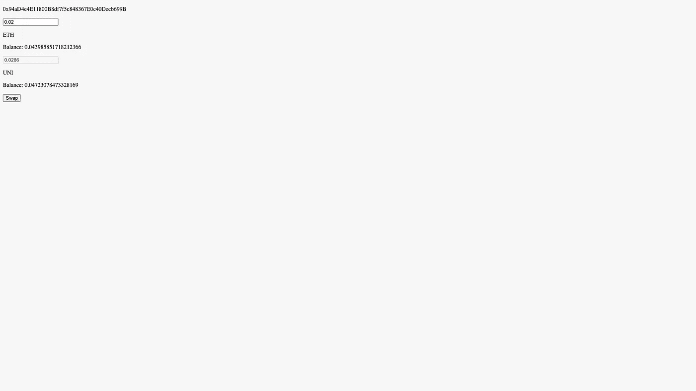
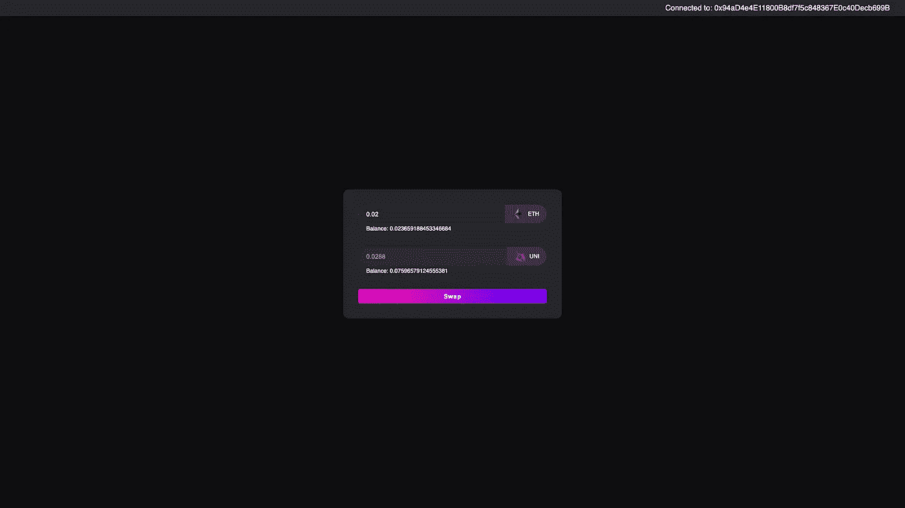

# 如何使用 Uniswap 从自定义前端交换令牌

> 原文：<https://betterprogramming.pub/how-to-use-uniswap-to-swap-tokens-from-a-custom-frontend-6e608dbaad22>

## 让我们建立自己的 dApp


照片由[钟登祥](https://unsplash.com/@dengxiangs?utm_source=medium&utm_medium=referral)在 [Unsplash](https://unsplash.com?utm_source=medium&utm_medium=referral) 上拍摄

构建自己的 dApp，让你不用写一行代码就能交换各种令牌，这多酷啊？嗯，通过 Uniswap SDK，您可以使用 Uniswap 的智能合约与您自己的自定义前端交换一大堆 ERC20 令牌。

在本教程中，我们将构建一个 React dApp，它可以让您将 ETH 替换为 UNI。

本教程重点介绍实际的逻辑，以及如何使用默认的用户代理 CSS 从用户界面连接到它。它不包含任何自定义样式。然而，我也创建了一个风格化版本的 dApp。

如果你对这是如何完成的感兴趣，请到页面底部我链接了资源库和实际网站的地方。



在后台使用 Uniswap 为 UNI 交换 ETH

为了遵循教程 npm 的基础知识，需要 React，ethers.js 和`wagmi.sh`。

首先，我们需要创建我们的 React dApp。我们将为这个项目使用 TypeScript。所以打开你的终端写下:

```
npx create-react-app uniswap-dapp --template typescript
```

接下来，将目录更改为新创建的目录，并安装依赖项:

```
cd uniswap-dapp
npm install ethers wagmi @uniswap/v3-sdk @uniswap/sdk-core
```

现在启动开发服务器。

```
npm start
```

您的默认 web 浏览器应该会打开并显示臭名昭著的 React 屏幕。

接下来，在您最喜欢的代码编辑器中打开新创建的项目。从一个干净的设置开始，删除所有样板代码。删除文件`index.css`和`App.css`中的所有内容。删除`logo.svg`文件，并删除`App.tsx`文件中的大部分内容，如下所示:

现在我们可以开始了！

# 钱包连接

我们将使用库`wagmi.sh`实现到 MetaMask 的简单钱包连接。如果你已经知道如何用 MetaMask 和`wagmi.sh`建立钱包连接，可以跳过这一节。

为了将我们的应用程序与以太坊节点连接起来，并能够从应用程序中的任何地方访问区块链相关的信息，我们必须用`WagmiConfig`提供者包装我们的整个应用程序，并传递它的配置选项。转到`App.tsx`，像这样修改文件:

在这次演示中，我们将使用 Goerli 测试网。我们还使用公共提供者，因为我们不必发送大量的事务。如果您的 dApp 超出了公共提供商的费率限制，您需要使用 Alchemy 或 Infura 等服务。

这样，我们就成功地连接到了以太坊节点，并且已经可以从区块链读取数据了。然而，为了进行交易和改变区块链状态，我们需要将我们的 dApp 连接到钱包。

我们将在 dApp 的头部实现我们的钱包连接按钮和逻辑。在名为`components`的新目录中创建一个新的`Header`组件，内容如下:

`InjectedConnector`引用元掩码扩展，我们通过传递值设置为 Goerli 的 id 的`chainId`属性来确保元掩码使用 Goerli 作为它的链。现在，我们应该能够通过页面上出现的这个漂亮按钮将 MetaMask 钱包连接到 dApp:


成功连接后，按钮会变成当前连接的钱包地址。


# 获取现货价格

既然钱包连接已经处理好了，我们可以关注本文的实际主题:如何使用 Uniswap 从您自己的定制前端交换令牌。我们将从在一个名为`hooks`的新目录中创建一个名为`useSwap`的新定制钩子开始。

为了获取令牌价格，我们需要与包含该令牌对的池的契约进行交互。正如开始所说，我们将与 ETH-UNI 池进行交互。在内部，ETH 被处理为封装以太网或简称 WETH，因为 Uniswap 只能处理 ERC20 令牌，而 ETH 本身不是令牌，而是一种货币。所以我们要找的游泳池实际上是一个 WETH-UNI 游泳池。稍后我会更详细地解释这一点。现在，我们将获得对池合同的引用，如下所示:

因为我们只阅读合同，不进行交易，所以使用提供者而不是签名者(有钱包连接的提供者)就足够了。

接下来，我们创建两个接口`Immutables`和`State`来模拟我们需要的链上池数据。

我们创建了两个函数`getPoolImmutables`和`getPoolState`，它们执行实际的数据获取并返回对应于各自接口的数据。

至此，我们已经拥有了报价所需的所有区块链数据。

我们在文件的顶部添加了两个常量。

现在，我们可以实现`getQuote`函数，该函数返回我们针对特定数量的 ETH 获得的 UNI 数量。

该函数调用我们之前定义的另外两个函数，以获取当前的区块链数据。这里值得注意的是，池的`token0`是 UNI，池的 token1 是 WETH。之后，Uniswap 的`Token`和`Pool`类用返回的数据进行实例化。最后，我们通过将 ETH 的数量乘以 UNI 相对于 ETH 的价格得到报价。

把所有的部分放在一起，从组件返回`getQuote`函数，你的文件应该看起来像这样:

我们现在可以开始构建调用函数并根据返回的报价进行更新的 UI。创建一个名为`SwapCard`的新组件，内容如下:

现在，如果您在 ETH 的输入字段中键入任何数字，如果您执行交换，您将获得的预期 UNI 数量将显示在第二个输入字段中。您的网站现在应该看起来像这样:


# 将 ETH 转化为 WETH 并批准支出

现在，在我们实际要求 Uniswap v3 路由器将我们的 ETH 交换到 UNI 之前，我们必须将我们的 ETH 转换为 weh，并允许路由器合同代表我们使用 weh。正如我前面提到的，实际上没有直接包含 ETH 的池。Uniswap 只使用 ERC20 令牌，这就是为什么我们需要将我们的 ETH 转换为 ERC20 令牌，它表示 ETH，即 weh。

所以我们首先创建一个名为`useWETH.tsx`的新文件，它是一个定制的 React 钩子，就像`useSwap`一样。

接下来，我们想要创建 WETH 令牌的契约实例。为此我们需要象征 ABI。用以下内容创建一个名为`abis`的新目录和一个名为`WETH.json`的新文件:

您也可以直接从[以太扫描](https://goerli.etherscan.io/address/0xB4FBF271143F4FBf7B91A5ded31805e42b2208d6#code)中复制 ABI。

现在，我们准备像这样实例化契约:

我们在顶部添加了一个额外的常数，它代表 WETH 令牌的小数位数。

接下来，我们创建一个名为`deposit`的函数，它解析输入金额并调用 WETH 契约上的存款函数。在这个函数的帮助下，我们将本机 ETH 转换为 wet 令牌，然后我们可以使用这些令牌进行令牌交换。

现在我们只需要再创建一个函数，我们已经具备了执行交换的所有先决条件。创建`approve`函数。为了让 Uniswap 路由器合同访问我们的 wet，它需要有这样做的权限。

在我们的`approve`函数中，我们调用 WETH 契约的 approve 函数，并定义路由器可以访问多少令牌。

现在我们已经准备好编写交换的逻辑了。

# 执行交换

转到`useSwap.tsx`文件并添加这个导入:

现在，将该常量添加到文件的顶部:

和下面这个已经存在的`useProvider`挂钩:

因为我们将改变区块链的状态，所以我们需要一个签名者，而不是路由器合同的提供者。此外，我们导入了我们在`useWETH`钩子中编写的函数。

现在最后创建执行交换的`swap`函数。

这个函数接受 ETH 中需要交换的数量作为参数。然后，它使用我们之前定义的`deposit`函数将 ETH 转换为 WETH，并批准 Uniswap v3 路由器在`approve`函数的帮助下访问 WETH 中的确切数量。

然后，它使用`getPoolImmutables`函数获取必要的池数据(令牌地址、费用),并构造一个 params 对象，该对象将作为参数传递给事务。

最后，我们调用 Uniswap 路由器契约上的`exactInputSingle`函数来执行交换。由于 MetaMask 无法估算此交易的燃气费，因此必须设置自定义燃气限制。

现在，您可以将交换函数添加到 return 语句中，您的文件应该如下所示:

现在转到`SwapCard.tsx`组件，添加逻辑来保存状态中的输入值，并添加一个按钮来启动与所述数量的交换。您的文件现在应该如下所示:

此外，我还添加了一个行为，即只有连接了钱包，交换按钮才会被激活。

现在转到 localhost:3000 来测试它，因为现在一切都应该工作了。只要确保你在 Goerli 网络上有足够的 ETH。

如果你需要更多的测试，去找一个 Goerli [水龙头](https://goerlifaucet.com/)就像炼金术士的那个。此外，请记住，挖掘这 3 个事务可能需要一段时间，并且我们目前没有任何关于当前事务状态的用户反馈。

# 显示当前 ETH 和 UNI 余额

为了直接看到你能交换多少 ETH，并得到一些关于交换结果的反馈，显示当前余额是很好的。幸运的是，有了 wagmi.sh，做到这一点非常容易。

将该常量添加到`SwapCard.tsx`文件的顶部:

然后，将其添加到`useAccount`钩下:

属性确保我们的余额总是最新的，方法是在每个新块之后检查余额是否改变。最后但同样重要的是，我们在模板中为这两个令牌添加了一点注释，比如 ETH 的这个:

现在把所有的东西放在一起，你的文件应该看起来有点像这样:

我们的无样式 dApp 现在应该看起来像这样:



如果您现在尝试交换代币，您将会看到在成功交换后，两个代币的余额会相应改变。

**恭喜恭喜！！！**

你成功地建造了一个 dApp，它可以让你用 ETH 换 UNI。在此基础上，你可以使它更漂亮，添加验证，用户反馈，更多的令牌等。可能性是无限的。

本教程只关注交换令牌背后的逻辑。没有 CSS，它看起来平淡无奇，这就是为什么我在本教程中为我们创建的 dApp 添加了样式。



附加样式的教程逻辑(查看下面的链接)

# 源代码和演示

*   如果你想查看整个代码，请点击这里。
*   如果你想查看整个代码，包括样式和一些更多的添加和调整，请点击[这里](https://github.com/JonWofr/uniswap-dapp-styled)。
*   如果你想获得 dApp 的演示，包括风格和一些更多的添加和调整:我在 Vercel [这里](https://uniswap-dapp-styled.vercel.app/)部署了它。

感谢阅读！