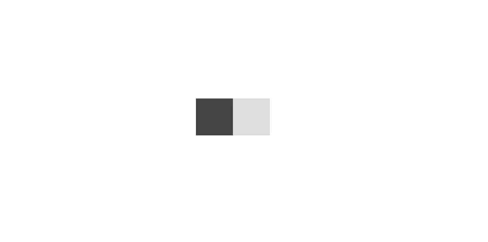
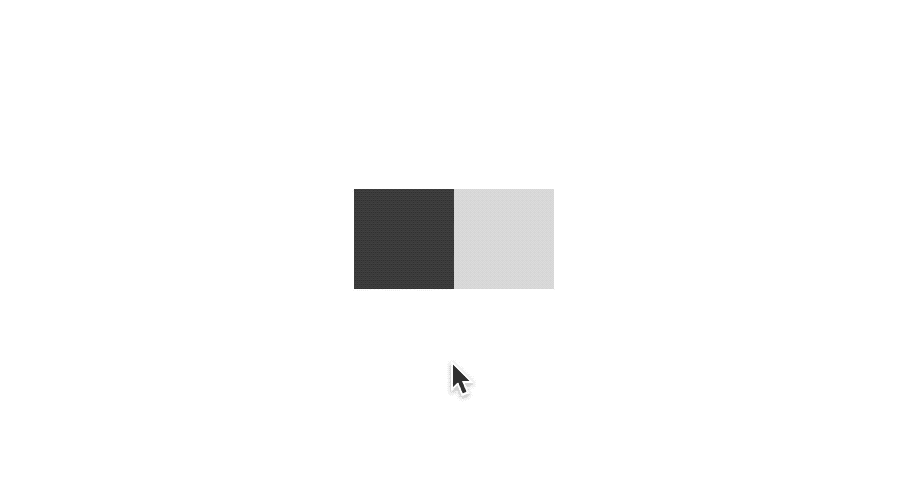
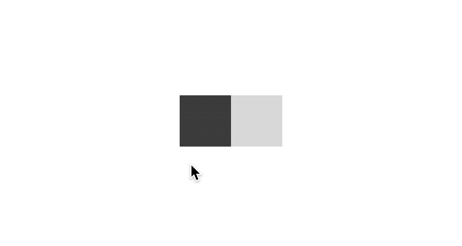

# 如何将 useDrag 与 React 一起使用

> 原文：<https://betterprogramming.pub/how-to-use-usedrag-with-react-134b02b58da3>

## 因为非交互性是一种阻力


保罗·基亚布兰多在 Unsplash[拍摄的照片](https://unsplash.com/s/photos/finger-painting?utm_source=unsplash&utm_medium=referral&utm_content=creditCopyText)

# 拖放式

谁不记得自己第一次在手机上重新整理 app 是什么时候？应用程序图标满天飞。然而，不知何故，它们神奇地排列成整齐的行和列。如今，这种体验是默认的。人们几乎不会注意到它。当首次推出时，它是最先进的，甚至令人瞠目结舌。早在智能手机出现之前，拖放就是一个众所周知的概念。但随着触摸界面的引入，它成为了一个广为人知的现象。

对虚拟拖拽有一定的感觉。事物变得有形。能够在屏幕上主动移动项目是一种令人愉快的感觉。不是所有的用例都是实用的。工作的人肯定有他们的位置。例如，拖放上传就是一个很好的模式。

这篇文章着眼于向另一个流行的模式添加拖动功能，即*开关*，也称为*切换*。向开关添加阻力可能不是特别有用。不过，有时将概念开玩笑地结合起来是有益的。即使最终结果并不那么有价值，其他有趣的结论也可能会出现。本文讨论的演示是由奥列格·弗罗洛夫拍摄的[可滴镜头的翻拍。这是最终结果的视频:](https://dribbble.com/shots/5429846-Switcher-XLIV)

useDrag 切换的视频

# useDrag 库

`useDrag`是[反应-使用-手势](https://github.com/react-spring/react-use-gesture)库的一部分。这是一个丰富的反应手势库。一定要去看看，因为这里有一些有用的例子和代码。

让我们开始吧！

# 纯反应组分

首先要做的是创建一个纯 React 功能组件。当使用 React 组件时，开始考虑组件应该有什么属性和状态几乎总是一个好主意。总会有某种输入或输出和/或状态。这个特定的组件需要知道触发器是否被切换。让我们加入一个状态和一些虚拟内容来开始吧。

```
function Toggle() {
  const [toggled, setToggled] = useState(false); return (<div>TOGGLE GOES HERE</div>)
}
```

# 反作用弹簧

方式`useDrag works`，或者说`useGesture`，是它建立在另一个叫做 [react-spring](https://www.react-spring.io/) 的库之上。react-use-gesture 库可以独立工作——您不必将两者结合起来。然而，当您结合使用它们时，您可以获得最大的收益。React-spring 是一个基于 spring 物理的动画库。它很好地集成到 React 中，并允许制作非常精细的动画。

如果你以前没有用过 react-spring，可能会有点混乱。动画部分隐藏在`useSpring`调用的后面。这种结构在开始时可能会感觉有点落后。然而，一旦你习惯了反作用力弹簧的做事方式，它会变得非常强大。作为库的用户，你不需要担心动画的内部工作。相反，您可以专注于将哪些样式属性连接到哪些返回值。这些值被称为*道具*。这些都可以作为道具(因此得名)传递给任何标记。例如，它可能是您想要连接到旋转动画的图像。在这篇文章中，我们正在寻找一个旋钮，我们想动画水平。

以下是使用`useSpring`时的事件链:

*   我们从调用`useSpring`钩子开始。该函数返回一组更新的动画值。这里的“更新”是指与动画当前所在的帧相对应的值。`useSpring`将保持钩子内部的状态。
*   如果动画属性没有期望的行为，它们可以再次被调整，或者用技术术语来说，被插值。这可能是遵循不同的轨迹，不同的行为，或者你有什么。
*   这些值通过 CSS-in-JS 注入到样式中。
*   样式规则最终通过 style/className 属性应用于标记。

另一个关键部分是组件的重新呈现。为了让任何东西在屏幕上移动，React 元素需要在整个动画期间更新自己。这一部分可能会增加混乱，因为所有这些都发生在引擎盖下。

我们将在下一节研究`useDrag`。现在，让我们看看如何让`useSpring`就位。本教程使用了接受函数作为参数的`useSpring`版本。挂钩有不同的版本。这种差异非常微妙，很难发现。根据您传递的参数不同，这些变量的行为会有所不同。更高级的选项，我们在这里使用的，返回一个名为 *set* 的更新函数。通过回调，组件自己决定何时触发其视图元素的移动。在这种情况下，我们希望当用户点击开关时，旋钮会显示动画。

*x* 是水平平移值。当样式应用于标记时，react-spring 将这个 *x* 值转换为 CSS 翻译转换。注意:这只适用于 react-spring 的第 9 版。在写这篇文章的时候，版本 9 还不是官方的，它在 next 标签下。最后但同样重要的是，我们还需要初始化 *x* 值。

```
const [{ x }, set] = useSpring(() => ({
  x: 0,
}));
```

# 第一部分。一个简单的开关

我们想逐步建立这个东西，以获得它的感觉。因此，让我们从根本上打破这种束缚。一个开关，最简单的形式是一个背景和一个旋钮。对这两个部分建模的最快方法是使用矩形。



简单切换模型

下面是 CSS-in-JS 中的样式:一个较大的矩形和一个较小的正方形。背景是浅灰色，手柄是深灰色。注意进入`knobStyle`的 *x* 。如上所述，将`useSpring`返回值注入到样式中可以实现动画。

```
 const backgroundStyle = {
  backgroundColor: "#ddd",
  cursor: "pointer",
  height: 50,
  width: 100,
};const knobStyle = {
  x,
  backgroundColor: "#444",
  height: 50,
  width: 50,
};
```

下面是相应的标记。为了让 react-spring 工作，JSX 元素需要以 animated 关键字为前缀。下面的旋钮使用了一个动画 div，因为我们希望它以 *x* 平移值向侧面移动。

```
<div // Background
  style={backgroundStyle}
>
  <animated.div // Knob
    style={knobStyle}
  ></animated.div>
</div>
```

现在我们有了代码，我们只差一个触发器了。一个简单的`onClick`处理程序就能搞定。注意我们都需要更新状态和触发动画。

```
<div // Background
  style={backgroundStyle}
  onClick={() => {
    set({ x: toggled ? 0 : 50 });
    setToggled(!toggled);
  }}
>
  ...
</div>
```

以下是我们目前掌握的情况:



轻敲开关

# 第二部分。移动到 useDrag

现在，是时候把`useDrag` 扔进等式里了。由于切换已经开始工作，所以从 tap 开始比较合适。点击是`useDrag`功能集的一部分。这是它的返回值之一。下面是调用钩子的代码:

```
const bind = useDrag(({ down, tap }) => {
  if (!down && tap) {
    set({ x: toggled ? 0 : RANGE });
    setToggled(!toggled);
  }
});
```

处理程序看起来非常相似。这与用于调用 set 函数和设置状态是一样的。不过，与之前的版本相比，还是有一点小小的不同。由于拖动处理程序是有状态的，我们需要查看状态变量`down`和`tap`。这两个参数将确保用户通过`down`变量释放触摸，并且足够短(即短到足以被认为是轻击)。如果是这种情况，那么`tap`变量被设置为`true`。同样，就像动画一样，我们需要将拖动处理程序应用到 React 节点。这就是绑定函数的用途。下面是我们如何通过传播它的返回值将它应用到节点:

```
<animated.div // Knob
  style={knobStyle}
  {...bind()}
></animated.div>
```

## 伸出旋钮

在这个阶段，我们只能通过实际点击旋钮本身来操作开关。这更符合真实(就像在现实生活中)开关的工作方式。虚拟开关允许用户点击后台的任何地方进行切换。它们实际上更加用户友好。一个简单的技巧是让底部容器看起来对触摸有反应。我们可以通过在透明区域的两侧延伸旋钮来做到这一点。将旋钮包装在一个更大的、不可见的包含 div 中解决了这个问题。

# 第三部分。拖延的

为了让拖拽工作起来，我们需要改变我们更新 react-spring 的方式。它需要持续，而不是像我们现在这样。目前，唯一触发移动的是当用户释放触摸时触发的独立事件。为了使它流畅，我们想在每次用户水平拖动旋钮时设置 *x* 值。这就是拖动处理程序的美妙之处。它让我们改变每一帧的外观。方法如下:

这里发生了一些事情。

首先，在点击处理程序和新的拖动逻辑之间有一个分离。在编码时，关注点分离几乎总是一个好主意。注意结束 tap 处理程序的 return 语句。它确保两个处理程序不会同时运行。

其次，对于用户释放触摸的情况，存在阈值逻辑。如果用户中途释放旋钮，我们希望旋钮动画化到它的一个极端，也就是说，我们希望将切换设置为完全打开或关闭。为了实现这一点，我们将 *x* 位置设置为我们希望旋钮结束的位置，即使这可能会导致数值跳变。这是因为在最后一次释放触摸后不再有帧。动画库将优雅地将旋钮动画到开始或结束位置。

我们在这里看到的第三种情况是拖动本身。如果用户拖动，我们传递的是视图上的 *x* 值，以相等的量移动手柄，即，与前一帧相比，对应于用户移动手指的量。

另一件需要注意的事情是我们添加到`useDrag`调用中的配置。该配置做两件事。首先，它设定了界限。这将保持旋钮在适当的位置，防止它误入歧途。其次，它初始化了价值。如果动画中断，需要后一部分来重新启动拖动会话。如果是这样，我们希望旋钮从其当前位置开始，而不是从其极端位置开始。你可以在这里阅读更多关于`[initial](https://use-gesture.netlify.app/docs/options/#initial)` [配置的信息](https://use-gesture.netlify.app/docs/options/#initial)。



拖动并点击开关

# 第四部分。橡皮带

橡皮筋总是很可爱。它增加了取悦用户的魅力时刻。要启用它，只需在配置中添加以下内容:

```
{
  ...
  bounds: ...,
  rubberband: true,
}
```

如果您想要对 rubberbanding 进行更细粒度的控制，您可以自己实现。作为一个练习，我已经在下面演示的源代码中实现了它。我使用下面的平方加速算法。

```
const RB_RANGE = 5;
const rubberband = (x) =>
  x > RB_RANGE ? RB_RANGE : RB_RANGE * (x / RB_RANGE) * (x / RB_RANGE);
```

# 第五部分。让它发光

有了模型，很容易加入一些 CSS 来突出整个事情。只是增加圆角使开关更值得信赖。我通过使用剪辑路径变形和添加一点颜色，进一步调整了演示和可滴镜头。我不会在这里详细讨论造型。有关 CSS 动画的更多信息，请参考下面的源代码。

# 第六部分。源代码

这是 Codepen 上的完整源代码

如果你做到了这一步，感谢你的阅读，祝你好运！

干杯，
米凯尔