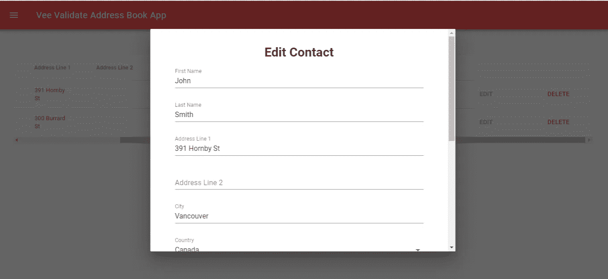
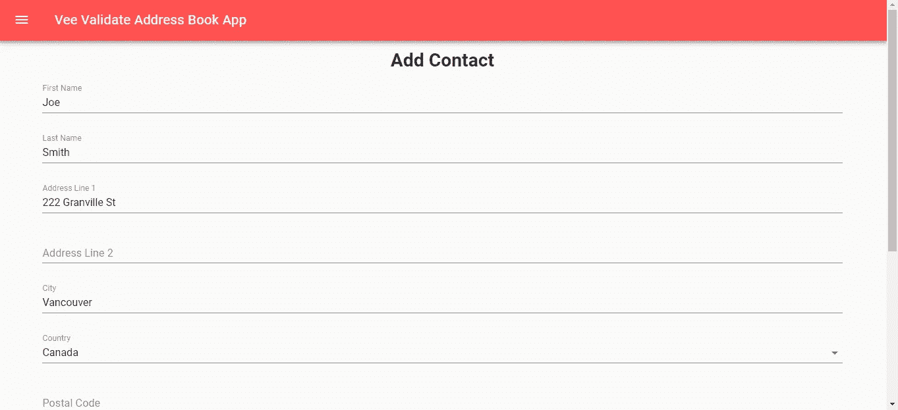
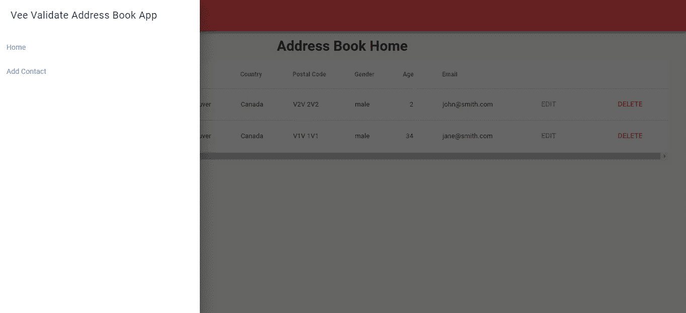
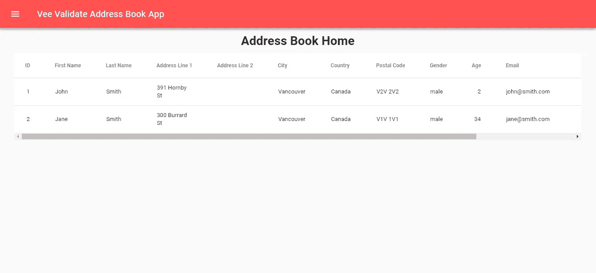

# 如何使用 Vee-Validate 进行表单验证

> 原文：<https://betterprogramming.pub/how-to-use-vee-validate-to-do-form-validation-e01e9c8b6ac6>

## 让我们做一些令人惊奇的表格

Vue.js 是构建前端 web 应用程序的一个很好的框架。它使用基于组件的架构，这使得组织代码变得容易。它允许您使用 JavaScript 提供的最新功能，这意味着编写代码来构建您的应用程序比以往任何时候都容易。它有很多插件，比如路由和流量存储，你可以在搭建应用时添加。

然而，缺少的一点是表单验证。这意味着我们必须找到自己的表单验证库来进行表单验证，或者自己编写表单验证代码。

如果我们选择使用一个库来做表单验证， [Vee-Validate](https://baianat.github.io/vee-validate/) 是直接插入 Vue.js 表单代码来做表单验证的绝佳选择。Vee-Validate primary 向 Vue.js 组件模板添加代码，以启用 Vue.js 表单的表单验证。它有多种输入的表单验证规则。因此，它是验证 Vue.js 表单的绝佳选择。

在这个故事中，我们将使用 Vue.js 构建一个地址簿应用程序，它使用 Vee-Validate 来验证我们的输入。该表单允许我们添加和编辑我们的联系人；此外，我们可以获取和删除联系人。

要构建我们的应用程序，首先，我们需要快速设置一个后端。为此，我们使用一个名为 JSON Server 的 Node.js 包来运行我们的后端。在这里找到[包的文档](https://github.com/typicode/json-server)。

一旦这是运行，它为我们提供了从前端保存我们的联系条目的路线。

要安装该软件包，请运行:

```
npm install -g json-server
```

我们将稍后运行此操作，以便保存我们的联系人。

现在我们可以开始构建我们的应用程序了。为此，请通过运行以下命令来安装 Vue CLI:

```
npm install -g @vue/cli
```

然后运行以下命令创建应用程序:

```
vue create vee-validate-address-book-app
```

`vee-validate-address-book-app`是我们的应用程序名称。运行向导时，请确保您选择包括 Vuex 和 Vue 路由器，因为我们稍后会用到它们。接下来，我们必须安装一些库。我们需要一个 HTTP 客户端，一个让我们的应用程序看起来不错的材料设计库，以及 Vee-Validate 库。

为此，运行`npm i axios vee-validate vue-material`。Axios 是我们用于与后端通信的 HTTP 客户端。Vue 材料是我们的材料设计库。

接下来，我们创建嵌套在页面组件中的组件。为此，在我们的项目文件夹中创建一个`components`文件夹，并在其中创建一个名为`ContactForm.vue`的文件。

在这个文件中，我们放入:

```
<template>
  <div class="contact-form">
    <div class="center">
      <h1>{{editing ? 'Edit': 'Add'}} Contact</h1>
    </div>
    <form novalidate class="md-layout" [@submit](http://twitter.com/submit)="save">
      <md-field :class="{ 'md-invalid': errors.has('firstName') }">
        <label for="firstName">First Name</label>
        <md-input
          name="firstName"
          v-model="contact.firstName"
          v-validate="'required'"
          :disabled="sending"
        />
        <span class="md-error" v-if="errors.has('firstName')">First Name is required.</span>
      </md-field><br /><md-field :class="{ 'md-invalid': errors.has('lastName') }">
        <label for="lastName">Last Name</label>
        <md-input
          name="lastName"
          v-model="contact.lastName"
          :disabled="sending"
          v-validate="'required'"
        />
        <span class="md-error" v-if="errors.has('lastName')">Last Name is required.</span>
      </md-field><br /><md-field :class="{ 'md-invalid': errors.has('addressLineOne') }">
        <label for="addressLineOne">Address Line 1</label>
        <md-input
          name="addressLineOne"
          v-model="contact.addressLineOne"
          :disabled="sending"
          v-validate="'required'"
        />
        <span class="md-error" v-if="errors.has('addressLineOne')">Address line 1 is required.</span>
      </md-field><br /><md-field :class="{ 'md-invalid': errors.has('addressLineTwo') }">
        <label for="addressLineTwo">Address Line 2</label>
        <md-input name="addressLineTwo" v-model="contact.addressLineTwo" :disabled="sending" />
        <span class="md-error" v-if="errors.has('addressLineTwo')">Address line 2 is required</span>
      </md-field><br /><md-field :class="{ 'md-invalid': errors.has('city') }">
        <label for="city">City</label>
        <md-input name="city" v-model="contact.city" :disabled="sending" v-validate="'required'" />
        <span class="md-error" v-if="errors.has('city')">City is required.</span>
      </md-field><br /><md-field :class="{ 'md-invalid': errors.has('country') }">
        <label for="country">Country</label>
        <md-select
          name="country"
          v-model="contact.country"
          md-dense
          :disabled="sending"
          v-validate.continues="'required'"
        >
          <md-option :value="c" :key="c" v-for="c in countries">{{c}}</md-option>
        </md-select>
        <span class="md-error" v-if="errors.firstByRule('country', 'required')">Country is required.</span>
      </md-field><br /><md-field :class="{ 'md-invalid': errors.has('postalCode') }">
        <label for="postalCode">Postal Code</label>
        <md-input
          name="postalCode"
          v-model="contact.postalCode"
          :disabled="sending"
          v-validate="{ required: true, regex: getPostalCodeRegex() }"
        />
        <span
          class="md-error"
          v-if="errors.firstByRule('postalCode', 'required')"
        >Postal Code is required.</span>
        <span
          class="md-error"
          v-if="errors.firstByRule('postalCode', 'regex')"
        >Postal Code is invalid.</span>
      </md-field><br /><md-field :class="{ 'md-invalid': errors.has('phone') }">
        <label for="phone">Phone</label>
        <md-input
          name="phone"
          v-model="contact.phone"
          :disabled="sending"
          v-validate="{ required: true, regex: getPhoneRegex() }"
        />
        <span class="md-error" v-if="errors.firstByRule('phone', 'required')">Phone is required.</span>
        <span class="md-error" v-if="errors.firstByRule('phone', 'regex')">Phone is invalid.</span>
      </md-field><br /><md-field :class="{ 'md-invalid': errors.has('gender') }">
        <label for="gender">Gender</label>
        <md-select
          name="gender"
          v-model="contact.gender"
          md-dense
          :disabled="sending"
          v-validate.continues="'required'"
        >
          <md-option value="male">Male</md-option>
          <md-option value="female">Female</md-option>
        </md-select>
        <span class="md-error" v-if="errors.firstByRule('gender', 'required')">Gender is required.</span>
      </md-field><br /><md-field :class="{ 'md-invalid': errors.has('age') }">
        <label for="age">Age</label>
        <md-input
          type="number"
          id="age"
          name="age"
          autocomplete="age"
          v-model="contact.age"
          :disabled="sending"
          v-validate="'required|between:0,200'"
        />
        <span class="md-error" v-if="errors.firstByRule('age', 'required')">Age is required.</span>
        <span class="md-error" v-if="errors.firstByRule('age', 'between')">Age must be 0 and 200.</span>
      </md-field><br />
      <md-field :class="{ 'md-invalid': errors.has('email') }">
        <label for="email">Email</label>
        <md-input
          type="email"
          name="email"
          autocomplete="email"
          v-model="contact.email"
          :disabled="sending"
          v-validate="'required|email'"
        />
        <span class="md-error" v-if="errors.firstByRule('email', 'required')">Email is required.</span>
        <span class="md-error" v-if="errors.firstByRule('email', 'email')">Email is invalid.</span>
      </md-field><md-progress-bar md-mode="indeterminate" v-if="sending" /><md-button type="submit" class="md-raised">{{editing ? 'Edit':'Create'}} Contact</md-button>
    </form>
  </div>
</template><script>
import { COUNTRIES } from "@/helpers/exports";
import { contactMixin } from "@/mixins/contactMixin";export default {
  name: "ContactForm",
  mixins: [contactMixin],
  props: {
    editing: Boolean,
    contactId: Number
  },
  computed: {
    isFormDirty() {
      return Object.keys(this.fields).some(key => this.fields[key].dirty);
    },
    contacts() {
      return this.$store.state.contacts;
    }
  },
  data() {
    return {
      sending: false,
      contact: {},
      countries: COUNTRIES.map(c => c.name)
    };
  }, beforeMount() {
    this.contact = this.contacts.find(c => c.id == this.contactId) || {};
  }, methods: {
    async save(evt) {
      evt.preventDefault();
      try {
        const result = await this.$validator.validateAll();
        if (!result) {
          return;
        }
        if (this.editing) {
          await this.updateContact(this.contact, this.contactId);
          await this.getAllContacts();
          this.$emit("contactSaved");
        } else {
          await this.addContact(this.contact);
          await this.getAllContacts();
          this.$router.push("/");
        }
      } catch (ex) {
        console.log(ex);
      }
    }, async getAllContacts() {
      try {
        const response = await this.getContacts();
        this.$store.commit("setContacts", response.data);
      } catch (ex) {
        console.log(ex);
      }
    }, getPostalCodeRegex() {
      if (this.contact.country == "United States") {
        return /^[0-9]{5}(?:-[0-9]{4})?$/;
      } else if (this.contact.country == "Canada") {
        return /^[A-Za-z]\d[A-Za-z][ -]?\d[A-Za-z]\d$/;
      }
      return /./;
    }, getPhoneRegex() {
      if (["United States", "Canada"].includes(this.contact.country)) {
        return /^[2-9]\d{2}[2-9]\d{2}\d{4}$/;
      }
      return /./;
    }
  }
};
</script><!-- Add "scoped" attribute to limit CSS to this component only -->
<style scoped lang="scss">
.contact-form {
  margin: 0 auto;
  width: 90%;
}
</style>
```

在上面的文件中，我们有在地址簿中添加和更新联系人的联系人表单，其中 Vee-Validate 使用得最多。注意，在`form`标签内的大多数输入控件中，我们有`v-validate`属性。

这是我们指定控件接受哪种输入的地方。

`required`表示表格字段是必填的。

`regex`表示我们根据指定的正则表达式进行验证。

这允许在没有可用的 Vee-Validate 内置规则的情况下，或者当您需要根据另一个字段的值以不同方式验证字段时，进行自定义表单验证。

例如对于一个电话号码，我们有这个函数:

```
getPhoneRegex() {
  if (["United States", "Canada"].includes(this.contact.country)){
    return /^[2-9]\d{2}[2-9]\d{2}\d{4}$/;
  }
  return /./;
}
```

当我们进入美国或加拿大时，它允许我们验证该号码以查看它是否匹配北美电话格式。否则，我们让人们想进就进。

同样，对于邮政编码，我们有:

```
getPostalCodeRegex() {
  if (this.contact.country == "United States") {
    return /^[0-9]{5}(?:-[0-9]{4})?$/;
  } else if (this.contact.country == "Canada") {
    return /^[A-Za-z]\d[A-Za-z][ -]?\d[A-Za-z]\d$/;
  }
  return /./;
}
```

这允许我们检查美国和加拿大的邮政编码。

为了显示错误，我们可以检查表单字段是否存在错误，然后显示它们。例如，对于名字，我们有:

```
<span class="md-error" v-if="errors.has('firstName')">First Name is required.</span>
```

`errors.has(‘firstName’)`检查名字字段是否符合指定的验证标准。因为我们正在检查它是否被填充，所以只有一个可能的错误，所以我们可以在`errors.has(‘firstName’)`返回`true`时显示唯一的错误。

对于更复杂的东西，比如电话号码，我们有:

```
<span class="md-error" v-if="errors.firstByRule('phone', 'required')">Phone is required.</span><span class="md-error" v-if="errors.firstByRule('phone', 'regex')">Phone is invalid.</span>
```

这允许我们分别检查每个验证规则。对于电话号码字段，我们必须检查它是否已填写，以及填写的内容是否具有有效的格式。`errors.firstByRule`功能允许我们这样做。

如果该字段未填写，则`errors.firstByRule(‘phone’, ‘required’)`返回`true`，否则返回`false`。

`errors.firstByRule(‘phone’, ‘regex’)`返回`true`是电话号码格式填写不正确，否则返回`false`。

Vee-Validate 为您的组件提供了一个`this.field`对象。因此，我们可以通过添加以下内容来检查字段是否是脏的，即它们是否被操作过:

```
Object.keys(this.fields).some(key => this.fields[key].dirty)
```

每个属性都是一个表单字段，`this.fields`对象的每个属性都有一个`dirty`属性，所以我们可以检查字段是否被操作。

在`methods`对象的`save`函数中，我们有:

```
async save(evt) {
  evt.preventDefault();
  try {
    const result = await this.$validator.validateAll();
    if (!result) {
      return;
    }
    if (this.editing) {
      await this.updateContact(this.contact, this.contactId);
      await this.getAllContacts();
      this.$emit("contactSaved");
    } else {
      await this.addContact(this.contact);
      await this.getAllContacts();
      this.$router.push("/");
    }
  } catch (ex) {
    console.log(ex);
  }
},
```

我们需要`evt.preventDefault()`来阻止表单以正常方式提交，即不调用下面的 Ajax 代码。

`this.$validator.validateAll()`验证表单。

`this.$validator`是 Vee-Validate 提供的对象。

它返回一个承诺，所以我们需要函数为`async,`，在函数调用之前需要`await`。

如果`result`是 falsy，那么表单验证失败，所以我们运行`return`来停止执行其余的函数。最后，如果表单域都有效，我们可以提交。由于这个表单用于添加和编辑联系人，我们必须检查我们正在做的是哪一个动作。如果我们编辑，然后我们打电话给`await this.updateContact(this.contact, this.contactId);`更新我们的联系方式。否则，我们添加联系人，因此我们调用`await this.addContact(this.contact);`

无论是哪种情况，我们都调用`await this.getAllContacts();`来刷新我们的联系人，并将他们放入商店。如果我们正在添加，那么我们将通过调用`this.$router.push(“/”);`重定向到最后的主页。`this.updateContact`、`this.addContact`、`this.getAllContacts`都来自我们马上要写的`contactMixin`。

接下来，我们编写一些助手代码。

创建一个名为`helpers`的文件夹，并在其中创建一个名为`export.js`的文件—放入以下内容:

```
export const COUNTRIES = [
    { "name": "Afghanistan", "code": "AF" },
    { "name": "Aland Islands", "code": "AX" },
    { "name": "Albania", "code": "AL" },
    { "name": "Algeria", "code": "DZ" },
    { "name": "American Samoa", "code": "AS" },
    { "name": "AndorrA", "code": "AD" },
    { "name": "Angola", "code": "AO" },
    { "name": "Anguilla", "code": "AI" },
    { "name": "Antarctica", "code": "AQ" },
    { "name": "Antigua and Barbuda", "code": "AG" },
    { "name": "Argentina", "code": "AR" },
    { "name": "Armenia", "code": "AM" },
    { "name": "Aruba", "code": "AW" },
    { "name": "Australia", "code": "AU" },
    { "name": "Austria", "code": "AT" },
    { "name": "Azerbaijan", "code": "AZ" },
    { "name": "Bahamas", "code": "BS" },
    { "name": "Bahrain", "code": "BH" },
    { "name": "Bangladesh", "code": "BD" },
    { "name": "Barbados", "code": "BB" },
    { "name": "Belarus", "code": "BY" },
    { "name": "Belgium", "code": "BE" },
    { "name": "Belize", "code": "BZ" },
    { "name": "Benin", "code": "BJ" },
    { "name": "Bermuda", "code": "BM" },
    { "name": "Bhutan", "code": "BT" },
    { "name": "Bolivia", "code": "BO" },
    { "name": "Bosnia and Herzegovina", "code": "BA" },
    { "name": "Botswana", "code": "BW" },
    { "name": "Bouvet Island", "code": "BV" },
    { "name": "Brazil", "code": "BR" },
    { "name": "British Indian Ocean Territory", "code": "IO" },
    { "name": "Brunei Darussalam", "code": "BN" },
    { "name": "Bulgaria", "code": "BG" },
    { "name": "Burkina Faso", "code": "BF" },
    { "name": "Burundi", "code": "BI" },
    { "name": "Cambodia", "code": "KH" },
    { "name": "Cameroon", "code": "CM" },
    { "name": "Canada", "code": "CA" },
    { "name": "Cape Verde", "code": "CV" },
    { "name": "Cayman Islands", "code": "KY" },
    { "name": "Central African Republic", "code": "CF" },
    { "name": "Chad", "code": "TD" },
    { "name": "Chile", "code": "CL" },
    { "name": "China", "code": "CN" },
    { "name": "Christmas Island", "code": "CX" },
    { "name": "Cocos (Keeling) Islands", "code": "CC" },
    { "name": "Colombia", "code": "CO" },
    { "name": "Comoros", "code": "KM" },
    { "name": "Congo", "code": "CG" },
    { "name": "Congo, The Democratic Republic of the", "code": "CD" },
    { "name": "Cook Islands", "code": "CK" },
    { "name": "Costa Rica", "code": "CR" },
    {
        "name": "Cote D\"Ivoire", "code": "CI"
    },
    { "name": "Croatia", "code": "HR" },
    { "name": "Cuba", "code": "CU" },
    { "name": "Cyprus", "code": "CY" },
    { "name": "Czech Republic", "code": "CZ" },
    { "name": "Denmark", "code": "DK" },
    { "name": "Djibouti", "code": "DJ" },
    { "name": "Dominica", "code": "DM" },
    { "name": "Dominican Republic", "code": "DO" },
    { "name": "Ecuador", "code": "EC" },
    { "name": "Egypt", "code": "EG" },
    { "name": "El Salvador", "code": "SV" },
    { "name": "Equatorial Guinea", "code": "GQ" },
    { "name": "Eritrea", "code": "ER" },
    { "name": "Estonia", "code": "EE" },
    { "name": "Ethiopia", "code": "ET" },
    { "name": "Falkland Islands (Malvinas)", "code": "FK" },
    { "name": "Faroe Islands", "code": "FO" },
    { "name": "Fiji", "code": "FJ" },
    { "name": "Finland", "code": "FI" },
    { "name": "France", "code": "FR" },
    { "name": "French Guiana", "code": "GF" },
    { "name": "French Polynesia", "code": "PF" },
    { "name": "French Southern Territories", "code": "TF" },
    { "name": "Gabon", "code": "GA" },
    { "name": "Gambia", "code": "GM" },
    { "name": "Georgia", "code": "GE" },
    { "name": "Germany", "code": "DE" },
    { "name": "Ghana", "code": "GH" },
    { "name": "Gibraltar", "code": "GI" },
    { "name": "Greece", "code": "GR" },
    { "name": "Greenland", "code": "GL" },
    { "name": "Grenada", "code": "GD" },
    { "name": "Guadeloupe", "code": "GP" },
    { "name": "Guam", "code": "GU" },
    { "name": "Guatemala", "code": "GT" },
    { "name": "Guernsey", "code": "GG" },
    { "name": "Guinea", "code": "GN" },
    { "name": "Guinea-Bissau", "code": "GW" },
    { "name": "Guyana", "code": "GY" },
    { "name": "Haiti", "code": "HT" },
    { "name": "Heard Island and Mcdonald Islands", "code": "HM" },
    { "name": "Holy See (Vatican City State)", "code": "VA" },
    { "name": "Honduras", "code": "HN" },
    { "name": "Hong Kong", "code": "HK" },
    { "name": "Hungary", "code": "HU" },
    { "name": "Iceland", "code": "IS" },
    { "name": "India", "code": "IN" },
    { "name": "Indonesia", "code": "ID" },
    { "name": "Iran, Islamic Republic Of", "code": "IR" },
    { "name": "Iraq", "code": "IQ" },
    { "name": "Ireland", "code": "IE" },
    { "name": "Isle of Man", "code": "IM" },
    { "name": "Israel", "code": "IL" },
    { "name": "Italy", "code": "IT" },
    { "name": "Jamaica", "code": "JM" },
    { "name": "Japan", "code": "JP" },
    { "name": "Jersey", "code": "JE" },
    { "name": "Jordan", "code": "JO" },
    { "name": "Kazakhstan", "code": "KZ" },
    { "name": "Kenya", "code": "KE" },
    { "name": "Kiribati", "code": "KI" },
    {
        "name": "Korea, Democratic People\"S Republic of", "code": "KP"
    },
    { "name": "Korea, Republic of", "code": "KR" },
    { "name": "Kuwait", "code": "KW" },
    { "name": "Kyrgyzstan", "code": "KG" },
    {
        "name": "Lao People\"S Democratic Republic", "code": "LA"
    },
    { "name": "Latvia", "code": "LV" },
    { "name": "Lebanon", "code": "LB" },
    { "name": "Lesotho", "code": "LS" },
    { "name": "Liberia", "code": "LR" },
    { "name": "Libyan Arab Jamahiriya", "code": "LY" },
    { "name": "Liechtenstein", "code": "LI" },
    { "name": "Lithuania", "code": "LT" },
    { "name": "Luxembourg", "code": "LU" },
    { "name": "Macao", "code": "MO" },
    { "name": "Macedonia, The Former Yugoslav Republic of", "code": "MK" },
    { "name": "Madagascar", "code": "MG" },
    { "name": "Malawi", "code": "MW" },
    { "name": "Malaysia", "code": "MY" },
    { "name": "Maldives", "code": "MV" },
    { "name": "Mali", "code": "ML" },
    { "name": "Malta", "code": "MT" },
    { "name": "Marshall Islands", "code": "MH" },
    { "name": "Martinique", "code": "MQ" },
    { "name": "Mauritania", "code": "MR" },
    { "name": "Mauritius", "code": "MU" },
    { "name": "Mayotte", "code": "YT" },
    { "name": "Mexico", "code": "MX" },
    { "name": "Micronesia, Federated States of", "code": "FM" },
    { "name": "Moldova, Republic of", "code": "MD" },
    { "name": "Monaco", "code": "MC" },
    { "name": "Mongolia", "code": "MN" },
    { "name": "Montenegro", "code": "ME" },
    { "name": "Montserrat", "code": "MS" },
    { "name": "Morocco", "code": "MA" },
    { "name": "Mozambique", "code": "MZ" },
    { "name": "Myanmar", "code": "MM" },
    { "name": "Namibia", "code": "NA" },
    { "name": "Nauru", "code": "NR" },
    { "name": "Nepal", "code": "NP" },
    { "name": "Netherlands", "code": "NL" },
    { "name": "Netherlands Antilles", "code": "AN" },
    { "name": "New Caledonia", "code": "NC" },
    { "name": "New Zealand", "code": "NZ" },
    { "name": "Nicaragua", "code": "NI" },
    { "name": "Niger", "code": "NE" },
    { "name": "Nigeria", "code": "NG" },
    { "name": "Niue", "code": "NU" },
    { "name": "Norfolk Island", "code": "NF" },
    { "name": "Northern Mariana Islands", "code": "MP" },
    { "name": "Norway", "code": "NO" },
    { "name": "Oman", "code": "OM" },
    { "name": "Pakistan", "code": "PK" },
    { "name": "Palau", "code": "PW" },
    { "name": "Palestinian Territory, Occupied", "code": "PS" },
    { "name": "Panama", "code": "PA" },
    { "name": "Papua New Guinea", "code": "PG" },
    { "name": "Paraguay", "code": "PY" },
    { "name": "Peru", "code": "PE" },
    { "name": "Philippines", "code": "PH" },
    { "name": "Pitcairn", "code": "PN" },
    { "name": "Poland", "code": "PL" },
    { "name": "Portugal", "code": "PT" },
    { "name": "Puerto Rico", "code": "PR" },
    { "name": "Qatar", "code": "QA" },
    { "name": "Reunion", "code": "RE" },
    { "name": "Romania", "code": "RO" },
    { "name": "Russian Federation", "code": "RU" },
    { "name": "RWANDA", "code": "RW" },
    { "name": "Saint Helena", "code": "SH" },
    { "name": "Saint Kitts and Nevis", "code": "KN" },
    { "name": "Saint Lucia", "code": "LC" },
    { "name": "Saint Pierre and Miquelon", "code": "PM" },
    { "name": "Saint Vincent and the Grenadines", "code": "VC" },
    { "name": "Samoa", "code": "WS" },
    { "name": "San Marino", "code": "SM" },
    { "name": "Sao Tome and Principe", "code": "ST" },
    { "name": "Saudi Arabia", "code": "SA" },
    { "name": "Senegal", "code": "SN" },
    { "name": "Serbia", "code": "RS" },
    { "name": "Seychelles", "code": "SC" },
    { "name": "Sierra Leone", "code": "SL" },
    { "name": "Singapore", "code": "SG" },
    { "name": "Slovakia", "code": "SK" },
    { "name": "Slovenia", "code": "SI" },
    { "name": "Solomon Islands", "code": "SB" },
    { "name": "Somalia", "code": "SO" },
    { "name": "South Africa", "code": "ZA" },
    { "name": "South Georgia and the South Sandwich Islands", "code": "GS" },
    { "name": "Spain", "code": "ES" },
    { "name": "Sri Lanka", "code": "LK" },
    { "name": "Sudan", "code": "SD" },
    { "name": "Suriname", "code": "SR" },
    { "name": "Svalbard and Jan Mayen", "code": "SJ" },
    { "name": "Swaziland", "code": "SZ" },
    { "name": "Sweden", "code": "SE" },
    { "name": "Switzerland", "code": "CH" },
    { "name": "Syrian Arab Republic", "code": "SY" },
    { "name": "Taiwan, Province of China", "code": "TW" },
    { "name": "Tajikistan", "code": "TJ" },
    { "name": "Tanzania, United Republic of", "code": "TZ" },
    { "name": "Thailand", "code": "TH" },
    { "name": "Timor-Leste", "code": "TL" },
    { "name": "Togo", "code": "TG" },
    { "name": "Tokelau", "code": "TK" },
    { "name": "Tonga", "code": "TO" },
    { "name": "Trinidad and Tobago", "code": "TT" },
    { "name": "Tunisia", "code": "TN" },
    { "name": "Turkey", "code": "TR" },
    { "name": "Turkmenistan", "code": "TM" },
    { "name": "Turks and Caicos Islands", "code": "TC" },
    { "name": "Tuvalu", "code": "TV" },
    { "name": "Uganda", "code": "UG" },
    { "name": "Ukraine", "code": "UA" },
    { "name": "United Arab Emirates", "code": "AE" },
    { "name": "United Kingdom", "code": "GB" },
    { "name": "United States", "code": "US" },
    { "name": "United States Minor Outlying Islands", "code": "UM" },
    { "name": "Uruguay", "code": "UY" },
    { "name": "Uzbekistan", "code": "UZ" },
    { "name": "Vanuatu", "code": "VU" },
    { "name": "Venezuela", "code": "VE" },
    { "name": "Viet Nam", "code": "VN" },
    { "name": "Virgin Islands, British", "code": "VG" },
    { "name": "Virgin Islands, U.S.", "code": "VI" },
    { "name": "Wallis and Futuna", "code": "WF" },
    { "name": "Western Sahara", "code": "EH" },
    { "name": "Yemen", "code": "YE" },
    { "name": "Zambia", "code": "ZM" },
    { "name": "Zimbabwe", "code": "ZW" }
]
```

这提供了我们在`ContactForm.vue`中引用的国家。

接下来，我们添加 mixin，通过与后端通信来操纵我们的联系人。我们创建一个名为`mixins`的文件夹，并在其中创建一个名为`contactMixin.js`的文件。

在文件中，我们放入:

```
const axios = require('axios');
const apiUrl = '[http://localhost:3000'](http://localhost:3000');export const contactMixin = {
    methods: {
        getContacts() {
            return axios.get(`${apiUrl}/contacts`);
        }, addContact(data) {
            return axios.post(`${apiUrl}/contacts`, data);
        }, updateContact(data, id) {
            return axios.put(`${apiUrl}/contacts/${id}`, data);
        }, deleteContact(id) {
            return axios.delete(`${apiUrl}/contacts/${id}`);
        }
    }
}
```

这将让我们通过把函数放在组件对象的`mixins`数组中，把函数包含在我们包含或混合的组件对象的`methods`对象中。

然后我们添加我们的页面。为此，创建一个`views`文件夹(如果它还不存在)并添加`ContactFormPage.vue`。

在那里，放上:

```
<template>
  <div class="about">
    <ContactForm :edit="false" />
  </div>
</template><script>
// @ is an alias to /src
import ContactForm from "@/components/ContactForm.vue";export default {
  name: "ContactFormPage",
  components: {
    ContactForm
  }
};
</script>
```

这只是显示了我们创建的`ContactForm`组件。我们将`:edit`属性设置为`false`，这样它会添加我们的联系人，而不是编辑。

接下来，我们添加主页来显示联系人列表。在`views`文件夹中，我们添加一个名为`Home.vue`的文件，如果它不存在的话。我们在里面放了:

```
<template>
  <div class="home">
    <div class="center">
      <h1>Address Book Home</h1>
    </div>
    <md-table>
      <md-table-row>
        <md-table-head md-numeric>ID</md-table-head>
        <md-table-head>First Name</md-table-head>
        <md-table-head>Last Name</md-table-head>
        <md-table-head>Address Line 1</md-table-head>
        <md-table-head>Address Line 2</md-table-head>
        <md-table-head>City</md-table-head>
        <md-table-head>Country</md-table-head>
        <md-table-head>Postal Code</md-table-head>
        <md-table-head>Gender</md-table-head>
        <md-table-head>Age</md-table-head>
        <md-table-head>Email</md-table-head>
        <md-table-head></md-table-head>
        <md-table-head></md-table-head>
      </md-table-row><md-table-row v-for="c in contacts" :key="c.id">
        <md-table-cell md-numeric>{{c.id}}</md-table-cell>
        <md-table-cell>{{c.firstName}}</md-table-cell>
        <md-table-cell>{{c.lastName}}</md-table-cell>
        <md-table-cell>{{c.addressLineOne}}</md-table-cell>
        <md-table-cell>{{c.addressLineTwo}}</md-table-cell>
        <md-table-cell>{{c.city}}</md-table-cell>
        <md-table-cell>{{c.country}}</md-table-cell>
        <md-table-cell>{{c.postalCode}}</md-table-cell>
        <md-table-cell>{{c.gender}}</md-table-cell>
        <md-table-cell md-numeric>{{c.age}}</md-table-cell>
        <md-table-cell>{{c.email}}</md-table-cell>
        <md-table-cell>
          <md-button class="md-primary" [@click](http://twitter.com/click)="selectedContactId = c.id; showDialog = true">Edit</md-button>
        </md-table-cell>
        <md-table-cell>
          <md-button class="md-accent" [@click](http://twitter.com/click)="removeContact(c.id)">Delete</md-button>
        </md-table-cell>
      </md-table-row>
    </md-table><md-dialog :md-active.sync="showDialog">
      <md-dialog-content>
        <ContactForm
          :editing="true"
          :contactId="selectedContactId"
          [@contactSaved](http://twitter.com/contactSaved)="selectedContactId = undefined; showDialog = false"
        />
      </md-dialog-content>
    </md-dialog>
  </div>
</template><script>
import { contactMixin } from "@/mixins/contactMixin";
import ContactForm from "@/components/ContactForm.vue";export default {
  name: "HomePage",
  mixins: [contactMixin],
  components: {
    ContactForm
  },
  props: {
    editing: Boolean,
    id: Number
  },
  computed: {
    contacts() {
      return this.$store.state.contacts;
    }
  },
  data() {
    return {
      showDialog: false,
      selectedContactId: undefined
    };
  }, beforeMount() {
    this.getAllContacts();
  }, methods: {
    async getAllContacts() {
      try {
        const response = await this.getContacts();
        this.$store.commit("setContacts", response.data);
      } catch (ex) {
        console.log(ex);
      }
    }, async removeContact(id) {
      try {
        await this.deleteContact(id);
        await this.getAllContacts();
      } catch (ex) {
        console.log(ex);
      }
    }
  }
};
</script><style scoped>
.md-dialog-container {
  padding: 20px;
}.md-content.md-table.md-theme-default {
  width: 95%;
  margin: 0 auto;
}
</style>
```

在页面加载期间，我们通过调用`beforeMount`函数中的`this.getAllContacts`函数来获取联系人。注意，我们的 mixin 中有`this.getContacts`函数。Mixins 允许我们重用代码。

mixinx 中的代码不能与组件中的`methods`对象中的函数同名，因为 mixin 函数直接挂钩到了我们的`methods,`，因为我们在 Mixin 代码中导出了一个带有`methods`字段的对象。

在`App.vue`中，我们通过添加以下内容来添加菜单和顶部栏:

```
<template>
  <div id="app">
    <md-toolbar class="md-accent">
      <md-button class="md-icon-button" [@click](http://twitter.com/click)="showNavigation = true">
        <md-icon>menu</md-icon>
      </md-button>
      <h3 class="md-title">Vee Validate Address Book App</h3>
    </md-toolbar>
    <md-drawer :md-active.sync="showNavigation" md-swipeable>
      <md-toolbar class="md-transparent" md-elevation="0">
        <span class="md-title">Vee Validate Address Book App</span>
      </md-toolbar><md-list>
        <md-list-item>
          <router-link to="/">
            <span class="md-list-item-text">Home</span>
          </router-link>
        </md-list-item><md-list-item>
          <router-link to="/contact">
            <span class="md-list-item-text">Add Contact</span>
          </router-link>
        </md-list-item>
      </md-list>
    </md-drawer><router-view />
  </div>
</template><script>
export default {
  name: "app",
  data: () => {
    return {
      showNavigation: false
    };
  }
};
</script><style lang="scss">
.center {
  text-align: center;
}
</style>
```

在`main.js`中，我们添加了样板代码，将 Vue 材料和 Vee-Validate 包含在我们的应用中:

```
import Vue from 'vue'
import App from './App.vue'
import router from './router'
import store from './store'
import VueMaterial from 'vue-material'
import 'vue-material/dist/vue-material.min.css'
import VeeValidate from 'vee-validate';Vue.use(VeeValidate);
Vue.use(VueMaterial);Vue.config.productionTip = falsenew Vue({
  router,
  store,
  render: h => h(App)
}).$mount('#app')
```

在`router.js`中，我们添加了我们的路线，这样我们就可以看到我们的页面:

```
import Vue from 'vue'
import Router from 'vue-router'
import HomePage from './views/HomePage.vue'
import ContactFormPage from './views/ContactFormPage.vue'Vue.use(Router)export default new Router({
  mode: 'history',
  base: process.env.BASE_URL,
  routes: [
    {
      path: '/',
      name: 'home',
      component: HomePage
    },
    {
      path: '/contact',
      name: 'contact',
      component: ContactFormPage
    }
  ]
})
```

在`store.js`中，我们把:

```
import Vue from 'vue'
import Vuex from 'vuex'Vue.use(Vuex)export default new Vuex.Store({
  state: {
    contacts: []
  },
  mutations: {
    setContacts(state, payload) {
      state.contacts = payload;
    }
  },
  actions: {}
})
```

将我们的联系人存储在所有组件都可以访问的地方。商店使用 Vuex 库，因此我们有一个`this.$store`对象用`this.$store.commit`函数调用我们的变异，并通过组件对象的`computed`属性从商店获取最新数据，如下所示:

```
contacts() {
  return this.$store.state.contacts;
}
```

最后在`index.html`中，我们把:

```
<!DOCTYPE html>
<html lang="en"><head>
  <meta charset="utf-8">
  <meta http-equiv="X-UA-Compatible" content="IE=edge">
  <meta name="viewport" content="width=device-width,initial-scale=1.0">
  <link rel="icon" href="<%= BASE_URL %>favicon.ico">
  <link rel="stylesheet" href="//fonts.googleapis.com/css?family=Roboto:400,500,700,400italic|Material+Icons">
  <link rel="stylesheet" href="[https://unpkg.com/vue-material/dist/vue-material.min.css](https://unpkg.com/vue-material/dist/vue-material.min.css)">
  <link rel="stylesheet" href="[https://unpkg.com/vue-material/dist/theme/default.css](https://unpkg.com/vue-material/dist/theme/default.css)">
  <title>Address Book App</title>
</head><body>
  <noscript>
    <strong>We're sorry but vee-validate-tutorial-app doesn't work properly without JavaScript enabled. Please enable it
      to continue.</strong>
  </noscript>
  <div id="app"></div>
  <!-- built files will be auto injected -->
</body></html>
```

将 Roboto 字体和材质图标添加到我们的应用程序中。

现在我们已经准备好启动我们的 JSON 服务器了。转到我们的项目文件夹并运行`json-server — watch db.json`来启动服务器。它将允许我们在没有任何配置的情况下调用这些路由:

```
GET    /contacts
POST   /contacts
PUT    /contacts/1
DELETE /contacts/1
```

这些都是我们需要的路线。数据将保存到我们所在文件夹的`db.json`中，这应该是我们应用的项目文件夹。

最后，我们有以下内容:

