# 25 个最好的 VS 代码扩展

> 原文：<https://betterprogramming.pub/how-to-use-vscode-like-a-pro-e120c428f45f>

## 使用这些工具，让你的生活更轻松、更有效率

照片由罗伯托·尼克森提供

拥有一个好的文本编辑器对你的效率、学习曲线和时间管理非常重要。

# 为什么选择 VSCode？

到目前为止，VSCode 可能是排名第一的代码编辑器。我喜欢它。

我认为它变得如此流行的原因很简单，就是 VSCode 提供了每个开发人员想要的东西，包括他们甚至不知道自己需要的特性。这就是 VSCode 的秘密魅力——它总能给你带来惊喜。

我相信，抓住一个人的心的最好方法之一，就是在他们知道自己需要什么之前，帮助他们意识到自己需要什么。实际上，这是市场营销中的强大推动力之一，而 VSCode 做得非常好。

大多数 VSCode 爱好者都是 JavaScript 开发人员——vs code 是为现代技术而创建的。今天，流行的 JavaScript 框架对于 VSCode 来说是完美的——它拥有您需要的一切。

说到选择文本编辑器，总是要选择最新最好的。技术日新月异，您不想落后。要成为一名优秀的开发人员，时间应该永远站在你这边。

我不是说你应该从一种语言跳到另一种语言，或者从一个框架跳到另一个框架——这太疯狂了。我所说的，也是我在以前的博客中一直在说的，是保持更新，保持敏锐，了解最新的，并与你目前正在使用的进行比较，了解差异，利弊，观察支持及其社区的增长，因为稳定性也很重要。你会惊讶于你的工作效率会有多高！

VSCode 有一个庞大的开源社区。它的成长和潜力是无限的，将来学习如何编码和编码本身会更容易。

# 1.自动关闭标签

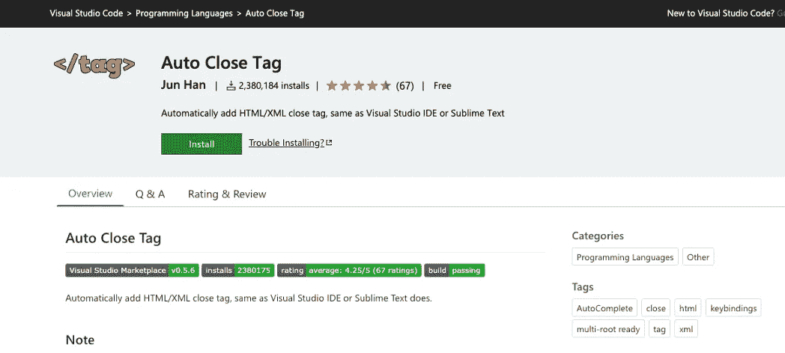

拥有这个扩展是必须的。编码是非常困难和疯狂的，不需要处理仅仅因为缺少结束标签而发现错误的问题

*你可以以后再感谢我！*

它的作用是自动添加您刚刚添加的开始标签的右括号，然后将鼠标光标放在标签之间。很酷，对吧？

 [## 自动关闭标签

### 编辑描述

marketplace.visualstudio.com](https://marketplace.visualstudio.com/items?itemName=formulahendry.auto-close-tag) 

# 2.可视编码综合终端

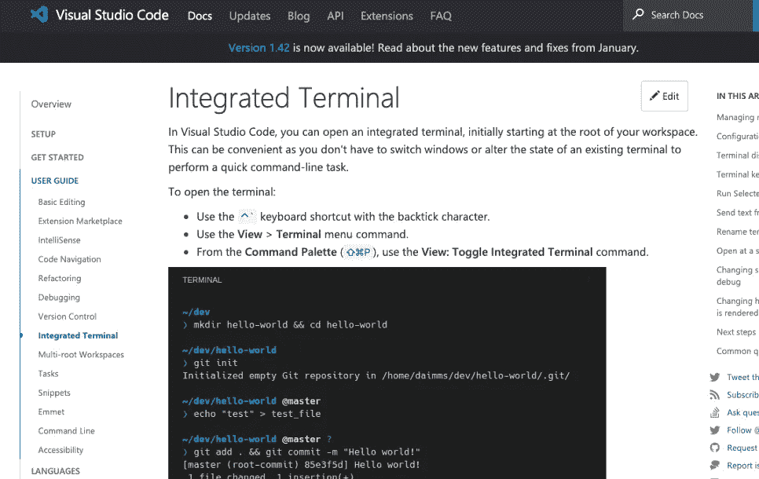

将命令/终端放在 VSCode 编辑器中不仅会让您的工作更轻松，还会节省空间。感谢 VSCode，让您的终端派上用场。

 [## Visual Studio 代码中的集成终端

### 在 Visual Studio 代码中，您可以打开一个集成的终端，最初从工作区的根目录开始。这可以…

code.visualstudio.com](https://code.visualstudio.com/docs/editor/integrated-terminal) 

# 3.括号对着色机

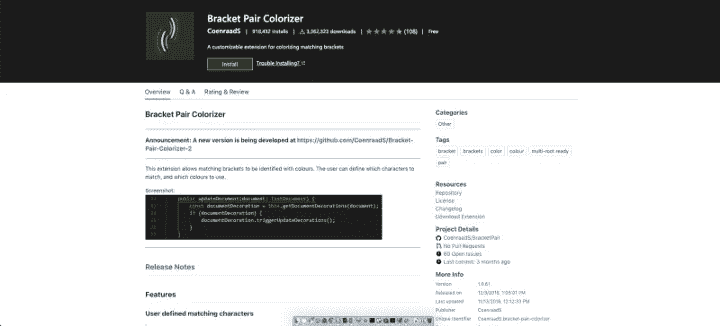

对于大多数开发人员来说，括号是一种痛苦，尤其是在处理大型项目时。如果你有意大利面条代码，那就更糟了。相信我，括号对彩色将节省你所有的压力。

有大量嵌套的长代码，特别是在使用 Javascript 时，几乎不可能确定哪些括号相互匹配。使用括号对可以帮助您更容易地找到开头和结尾。它们是彩色的这一事实使得你的代码更具可读性。下载这个！

是的，不客气！

 [## 括号对着色机

### 这个扩展允许用颜色来标识匹配的括号。用户可以定义匹配哪些字符…

marketplace.visualstudio.com](https://marketplace.visualstudio.com/items?itemName=CoenraadS.bracket-pair-colorizer) 

# 4.ESLint/TSLint

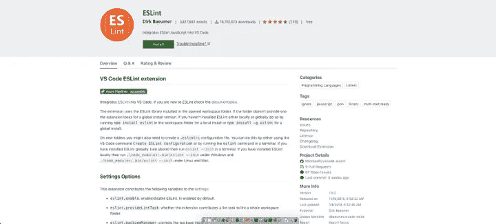

这个扩展的主要功能是自动格式化代码，以便在整个团队中保持一致的格式。ESLint 还可以被配置成自动格式化你的代码，每当你犯了一个错误，它就会对你发出一堆警告。

它有数百万的下载量是有原因的。

 [## 埃斯林特

### 编辑描述

marketplace.visualstudio.com](https://marketplace.visualstudio.com/items?itemName=dbaeumer.vscode-eslint) 

# 5.代码拼写检查器

如果你像我一样是非英语母语的人，英语不是你的第一语言，甚至可能不是你的第二语言，那么代码拼写检查对于保持你的代码没有打字错误和错误是非常有帮助的。没有人是完美的，无论你的英语是否流利，错别字都是不可避免的——你不会想花时间去发现它们，尤其是如果你有意大利面条一样的代码。

 [## 代码拼写检查器

### 编辑描述

marketplace.visualstudio.com](https://marketplace.visualstudio.com/items?itemName=streetsidesoftware.code-spell-checker) 

# 6.设置同步

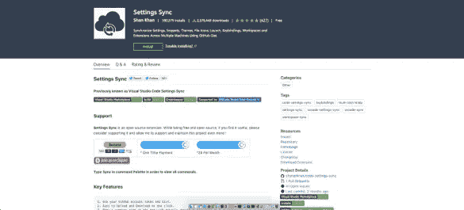

如果你像我一样使用多台机器，你会发现这个扩展很有用。根据 visual studio 的设置，设置同步可使所有计算机/笔记本电脑保持同步。

如果你是一个既在办公室又在家用电脑上工作的开发人员，你基本上将会在不同的工作站上工作。手动更改两者上的设置非常耗时，因为老实说，我们需要根据我们正在做的项目不时地更改设置，所以为了减少编程的压力，我建议您使用此扩展，以便您所做的所有更改都会自动同步到您的所有机器和工作站上。

 [## 设置同步

### 虽然是免费和开源的，但如果你觉得它有用，请考虑通过 PayPal 或 Open……

marketplace.visualstudio.com](https://marketplace.visualstudio.com/items?itemName=Shan.code-settings-sync) 

# 7.较美丽

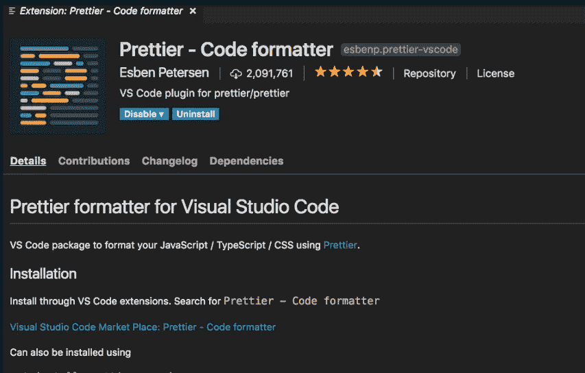

前面，我列出了 ESLint，它帮助您自动格式化一致的代码，并显示了几个警告和错误。

作为一名 React/Native 开发人员，保持我的代码整洁和正确对齐是必须的——这是没有商量余地的。为了更好地阅读代码，对代码进行适当的缩进和分隔是一个优先事项，尤其是在处理长代码时——使用样式、函数和处理程序进行分隔是至关重要的，不仅对您，而且对您的同事阅读和处理代码也是如此。

这是非常容易设置的，当你点击保存时，它会自动格式化。

 [## 更漂亮/更漂亮-vscode

### 更漂亮的 Visual Studio 代码扩展。在…上创建一个帐户，为更漂亮/更漂亮的 vscode 开发做贡献

github.com](https://github.com/prettier/prettier-vscode) 

# 8.材料图标主题

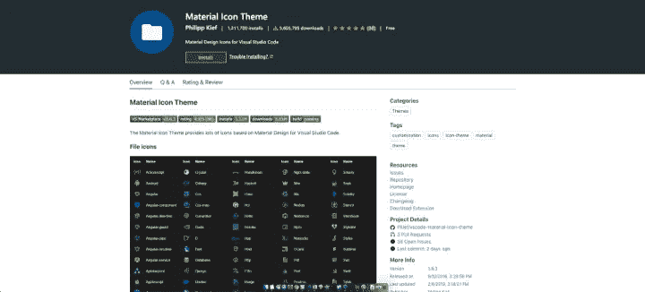

这个扩展为你的文件列表提供了漂亮的图标。如果文件是 JavaScript，那么它将在文件名旁边的材质样式中包含一个 JavaScript 图标。如果你是一个视觉开发人员，那么这个扩展适合你。它被数百万用户广泛使用。

 [## 材料图标主题

### 在你的 VS 代码中加入材质设计图标。

marketplace.visualstudio.com](https://marketplace.visualstudio.com/items?itemName=PKief.material-icon-theme) 

# 9.路径智能感知

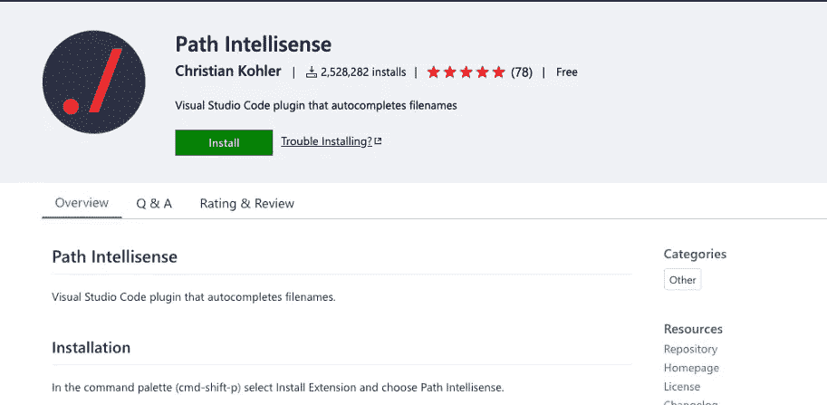

这个扩展是我离不开的扩展之一。相信我，这会节省你很多时间。我很健忘，作为一名前端开发人员，我有许多组件、扩展、包，尤其是 React 格式，我需要一些东西来帮助我处理文件路径。处理大型项目是疯狂的，path Intellisense 是你最好的朋友。当您尝试在引号中键入路径时，Intellisense 会自动填充或显示建议。

Path Intellisense 还可以帮助自动完成所有隐藏文件。

 [## 路径智能感知

### 编辑描述

marketplace.visualstudio.com](https://marketplace.visualstudio.com/items?itemName=christian-kohler.path-intellisense) 

# 10.浏览器预览

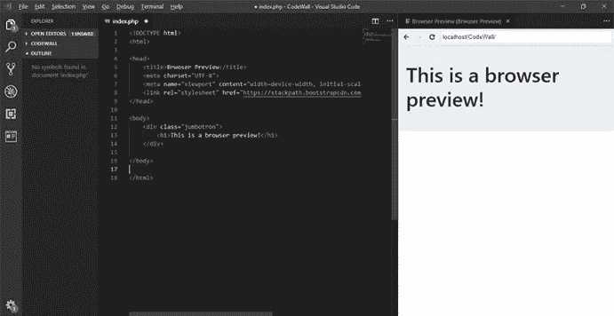

这个扩展是前端开发者必备的。不要为你的 Chrome 打开另一个窗口来查看你在代码中所做的更改，下载这个浏览器预览，这样你就可以在你的 VSCod 中完成所有的工作。这将向您显示代码的浏览器预览，因此不必再切换到浏览器来查看哪怕是很小的更改。它帮助你节省时间和空间。

 [## 浏览器预览

### 一个真正的浏览器预览在你的编辑器中，你可以调试。VS 代码的浏览器预览使您能够打开一个真正的…

marketplace.visualstudio.com](https://marketplace.visualstudio.com/items?itemName=auchenberg.vscode-browser-preview) 

# 11.Chrome 调试器

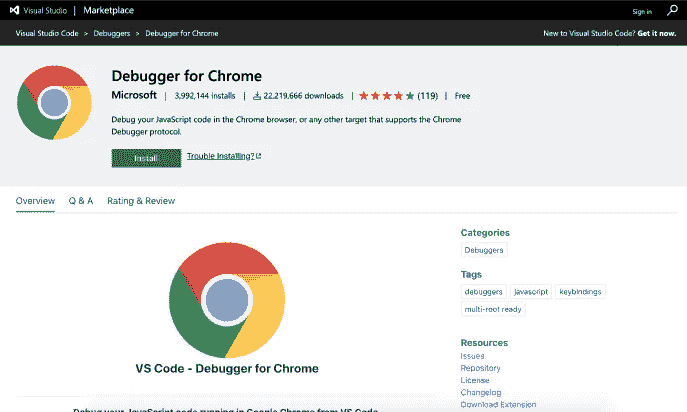

这是我最喜欢和最常用的 VSCode 扩展。作为一个前端 web 和移动开发者，Chrome 的调试器对我帮助很大。尤其是对于 JavaScript 开发者来说，它会节省你很多做小改动的时间。它对调试非常有帮助——它可以帮助您非常快速地解决和捕获 bug。

控制台在查找错误来自哪一行和哪一个函数，以及查看数据处理方面非常强大。

 [## Chrome 调试器

### 编辑描述

marketplace.visualstudio.com](https://marketplace.visualstudio.com/items?itemName=msjsdiag.debugger-for-chrome) 

# 12.Javascript (ES6)代码片段

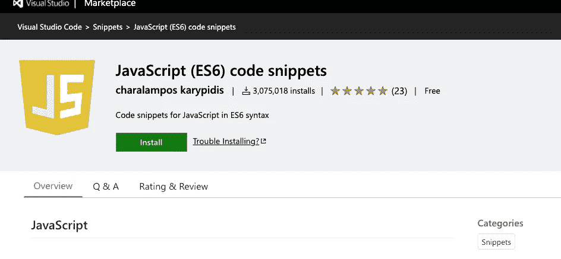

如果您是 JavaScript 开发人员，这将是您新的最好的朋友。无论您使用什么 JavaScript 框架，这个扩展都会帮助您。如果你一遍又一遍地输入相同的代码，我会说这不是很有效率。

这个方便的代码片段是一个轻量级的库扩展，它绑定了任何标准的 JavaScript 调用，因此只需键入快捷方式代码，就可以看到自动打印到编辑器中的完整通用代码。这个扩展不仅预建了对 Javascript ES6 的支持，还预建了对 Typescript、Reactjs、Vue 和 HTML 的支持。

 [## JavaScript (ES6)代码片段

### 编辑描述

marketplace.visualstudio.com](https://marketplace.visualstudio.com/items?itemName=xabikos.JavaScriptSnippets) 

# 13.实时服务器

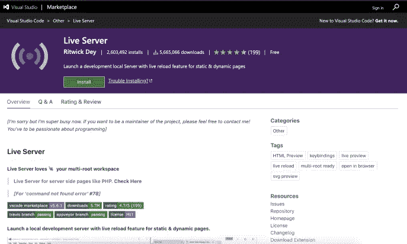

在使用 Live Server 时，这个 vscode 扩展将帮助您打开当前项目的 live web 服务器。通常，当使用像 Webpack 这样的构建器时，这通常就能完成工作，但是这个扩展已经证明了它更有用。您只需右键单击并运行 open with live server，它就会完成剩下的工作。

 [## 实时服务器

### 对不起，但是我现在非常忙。如果你想成为项目的维护者，欢迎随时联系我！你已经…

marketplace.visualstudio.com](https://marketplace.visualstudio.com/items?itemName=ritwickdey.LiveServer) 

# 14.阔卡

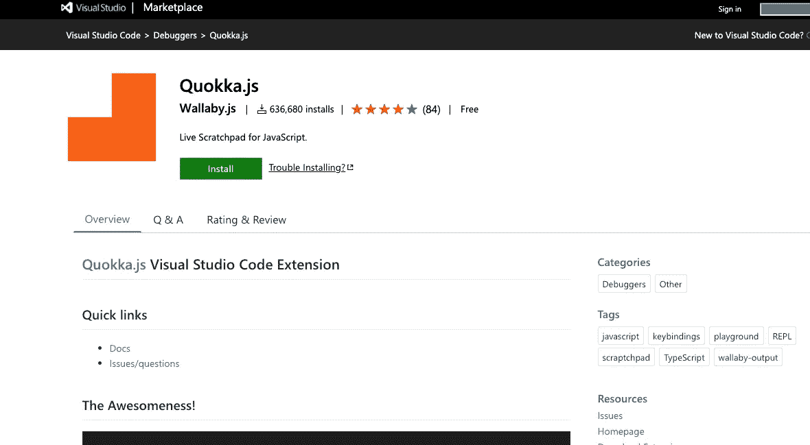

Quokka 被称为 JavaScript 开发人员的现代便签簿。它旨在帮助每个开发人员进行代码检查。这是一个完美的解决方案。

与其他 VSCode 扩展相比，它非常轻量级、高效且功能强大。它将促进你的工作流程，它是实时的，并将立即给你反馈。

它所做的是为每个结果使用固定的颜色类型，因此开发人员可以很容易地理解流程的执行。

 [## Quokka.js

### 现在就去拿。

marketplace.visualstudio.com](https://marketplace.visualstudio.com/items?itemName=WallabyJs.quokka-vscode) 

# 15.实时分享

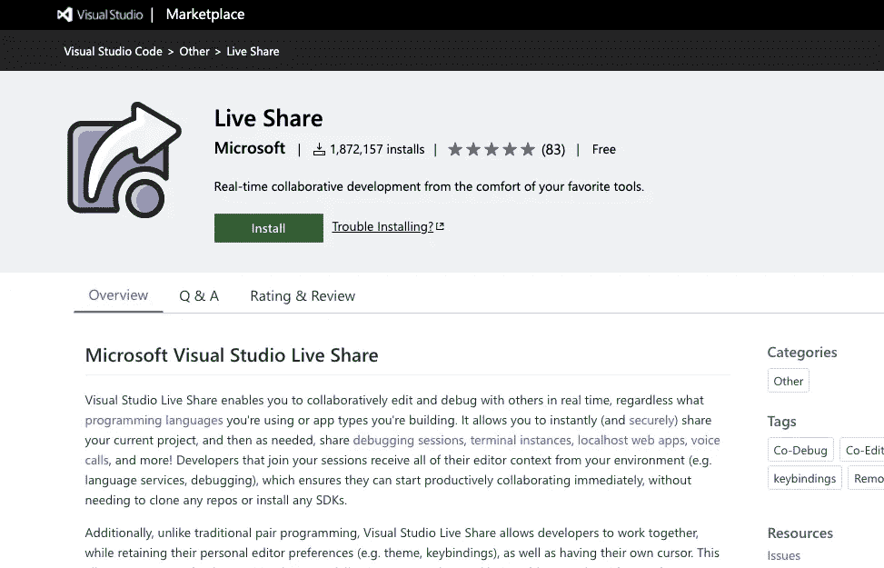

实时共享是 VSCode 文本编辑器中最高级的功能之一。和团队成员一起工作的时候很完美。它的功能之一是允许每个开发人员与其他开发人员实时共享代码片段。

这是完美的，有助于团队协作变得更加高效和多产。实时共享允许即时共享当前的项目，甚至在调试的时候——这多酷啊！

合作者不必安装任何存储库、SDK 或任何东西来连接其他开发人员的当前代码。团队中的每个人都可以通过协作会议来远程探索和解决问题。

 [## 实时分享

### Visual Studio Live Share 使您能够与其他人实时协作编辑和调试，无论…

marketplace.visualstudio.com](https://marketplace.visualstudio.com/items?itemName=MS-vsliveshare.vsliveshare) 

# 16.Github 扩展

如果你的团队正在使用 Github，或者你正在使用 Github 作为你的项目库，或者想要使用其他开发者的源代码库，那么这个扩展就是为你准备的。

顺便说一下，Github 现在由微软拥有和管理，对于那些不知道的人来说，所以 Github 和 VSCode 现在是微软产品的一部分。

通过使用 Github 扩展，您现在可以轻松地连接其他开发人员的存储库、您最喜欢的开发人员的存储库，甚至您自己的存储库。你可以很容易地拉和推——如果你经常使用 Github 的话，非常少。

 [## 开源代码库

### 这个 vscode 扩展与 GitHub 集成在一起。注意:我推荐使用 GitHub Pull 请求，而不是这个，因为…

marketplace.visualstudio.com](https://marketplace.visualstudio.com/items?itemName=KnisterPeter.vscode-github) 

# 17.吉特朗斯

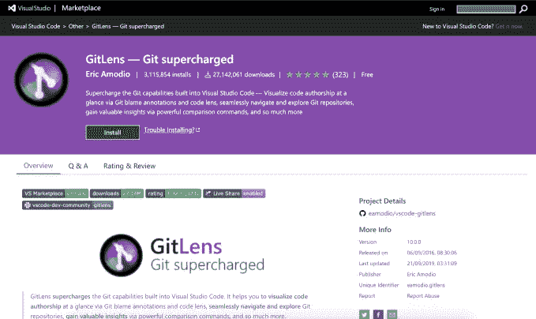

Gitlens 是另一个很棒的扩展。它增强了当前的 VSCode Git 功能，能够与您以前的提交和更改进行并行代码比较，并具有其他很酷的功能。

 [## GitLens — Git 增压

### GitLens 增强了 Visual Studio 代码中内置的 Git 功能。它可以帮助你在一个…

marketplace.visualstudio.com](https://marketplace.visualstudio.com/items?itemName=eamodio.gitlens) 

# 18.NPM

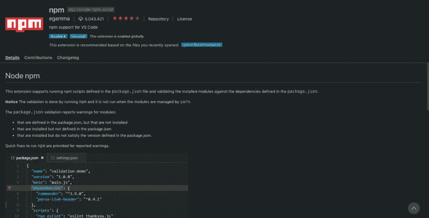

每个现代开发人员都已经知道什么是 NPM，以及它为什么重要。节点包管理器是一个帮助你管理`package.json`文件的扩展。如果需要的依赖项还没有安装，它会给你警告，还有你的 NPM 包的版本控制。

我一直在处理的大多数 bug 和错误都来自于使用 NPM 的包，函数和特性，因为它与其他包不兼容而无法工作。我发誓，没有它所要求的依赖，没有兼容的版本，是很有压力的！

*这个 VSCode 扩展是必须的:*

 [## npm

### 这个扩展支持运行 package.json 文件中定义的 npm 脚本，并验证安装的模块…

marketplace.visualstudio.com](https://marketplace.visualstudio.com/items?itemName=eg2.vscode-npm-script) 

# 19.美化

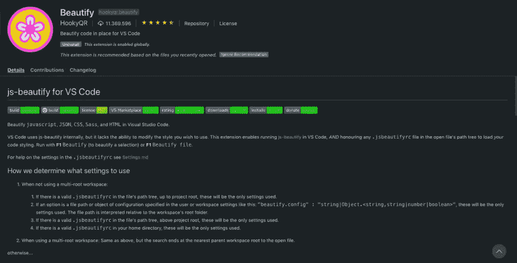

美化是代码格式化的另一个伟大的扩展，几乎和我前面提到的那个一样，更漂亮。它现在有将近 1200 万的下载量，所以这里没有什么可以让你相信为什么这个扩展如此有用。

它格式化用 Javascript、JSON、Sass、CSS 和 HTML 编写的代码。

 [## 美化

### 美化 Visual Studio 代码中的 javascript、JSON、CSS、Sass、HTML。VS 代码内部使用 js-美化，但是缺少…

marketplace.visualstudio.com](https://marketplace.visualstudio.com/items?itemName=HookyQR.beautify) 

# 20.实时 Sass 编译器

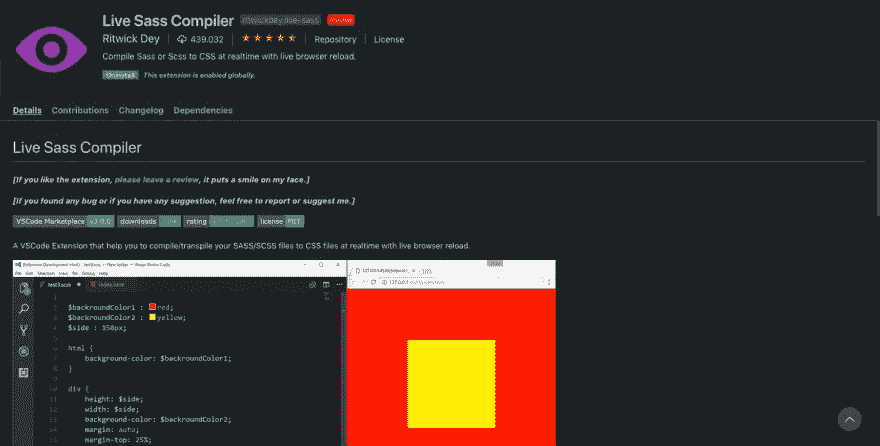

如果您是 Sass 的爱好者，或者只是因为它是项目应用程序需求的一部分而使用 Sass，那么这个 VSCode 扩展就是为您准备的！

它会实时将你的萨斯/SCSS 文件编译成 CSS 文件，并自动在你的浏览器中为你提供应用程序或编译样式的实时预览。

 [## 实时 Sass 编译器

### 如果你发现了任何漏洞或者有任何建议，请随时报告或建议我。VSCode 扩展有助于…

marketplace.visualstudio.com](https://marketplace.visualstudio.com/items?itemName=ritwickdey.live-sass) 

# 21.蚂蚁

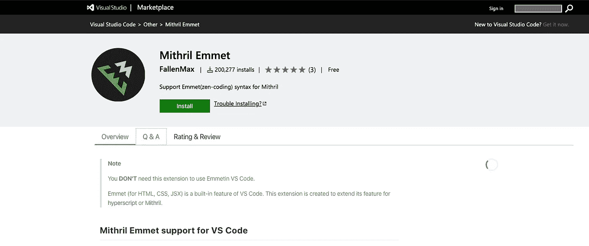

从开始用 VSCode 开始就一直用 Emmet。它帮助每个开发人员提高编写代码的速度。使用这个扩展，很快你将无法想象没有它的编码。

真实故事:

 [## 米特里尔·埃米特

### 使用 Emmetin VS 代码不需要这个扩展。Emmet(用于 HTML、CSS、JSX)是 VS 代码的内置特性。这个…

marketplace.visualstudio.com](https://marketplace.visualstudio.com/items?itemName=FallenMax.mithril-emmet) 

这里有一个奖励:Emmet 文档备忘单:

 [## 小抄

### 编辑描述

docs.emmet.io](https://docs.emmet.io/cheat-sheet/) 

# 22.虚拟代码图标

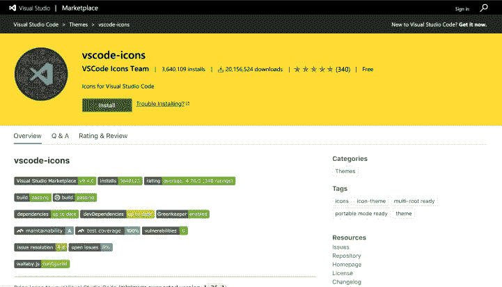

这是为我们的前端开发人员准备的。这个和我之前说的那个差不多，材质图标，但是设计不同。作为前端开发人员，我们爱看东西，对吧？所以这个图标会帮助你看到你拥有的文件的种类，以及它们是 HTML，CSS，Javascript 等等。

 [## 虚拟代码-图标

### 将图标添加到您的 Visual Studio 代码中(支持的最低版本:1.31.1)要安装该扩展，只需执行…

marketplace.visualstudio.com](https://marketplace.visualstudio.com/items?itemName=vscode-icons-team.vscode-icons) 

# 23.颜色选择器

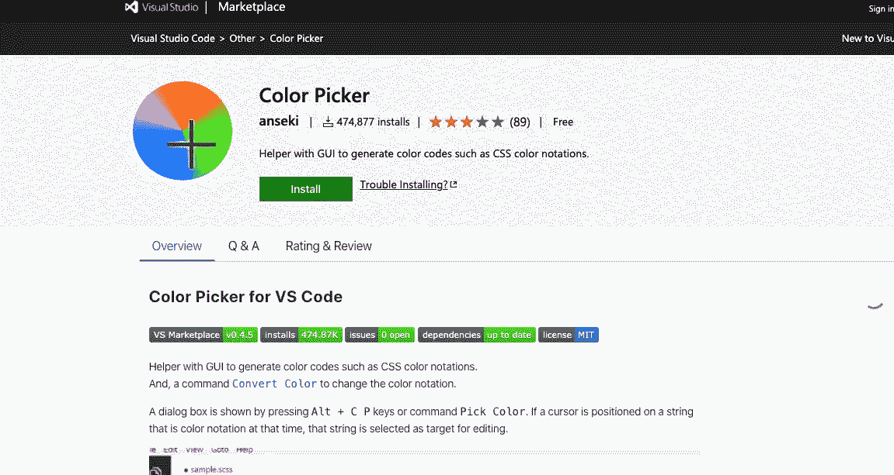

颜色选择器扩展帮助您轻松地在 CSS 文件中选择颜色。它将立即反映或应用于您当前正在处理的属性。如果您喜欢使用 RGBA 颜色，也可以使用它。

 [## 颜色选择器

### 帮助 GUI 生成颜色代码，如 CSS 颜色符号。还有，一个命令转换颜色来改变颜色…

marketplace.visualstudio.com](https://marketplace.visualstudio.com/items?itemName=anseki.vscode-color) 

# 24.ES7、React、Redux 和 GraphQL 片段

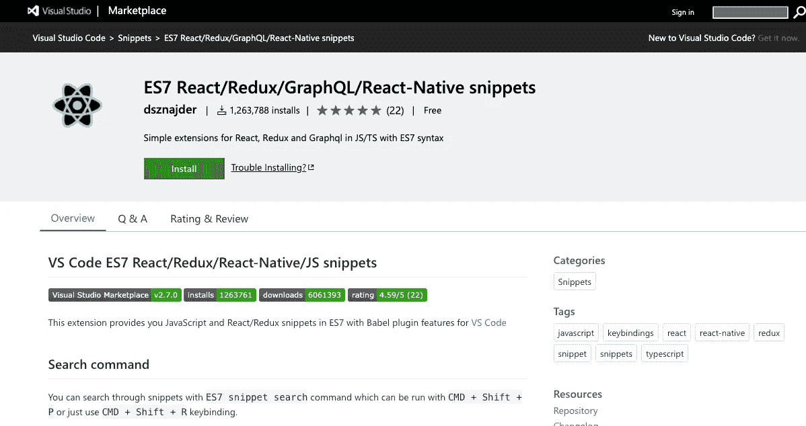

这是为那些正在使用 React 等 JavaScript 框架以及与其产品和复杂应用程序兼容的其他技术的高级开发人员准备的。

反复输入标准代码效率很低。在这个代码片段的帮助下，你可以很容易地创建基于类的组件、功能组件、导入、生命周期方法等等，只需输入快捷方式代码，这是我使用 Reactjs 和 React Native 以来最常用的扩展之一。

 [## ES7 React/Redux/graph QL/React-本机代码片段

### 这个扩展为你提供了 ES7 中的 JavaScript 和 React/Redux 代码片段，以及 VS 代码的 Babel 插件特性，你可以…

marketplace.visualstudio.com](https://marketplace.visualstudio.com/items?itemName=dsznajder.es7-react-js-snippets) 

# 25.REST 客户端

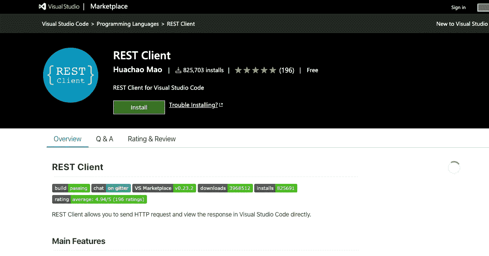

另一个高级工具，Rest 客户端扩展可以帮助你使用其他第三方工具和 API。如果您需要能够轻松地发出 HTTP 请求，这是很有用的。

这个扩展允许您轻松地直接在代码编辑器中调用和终结点。它节省了时间——yuo 可以用它来代替来回切换到你的浏览器或 postman 来发出请求。

 [## REST 客户端

### 编辑描述

marketplace.visualstudio.com](https://marketplace.visualstudio.com/items?itemName=humao.rest-client) 

感谢大家的阅读！