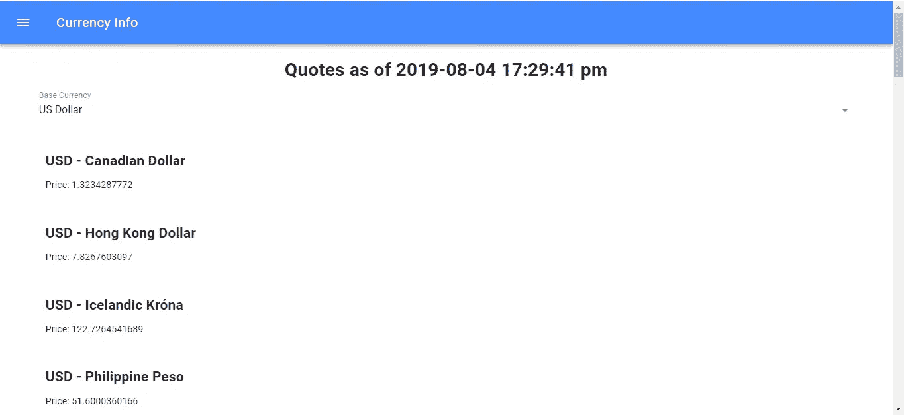
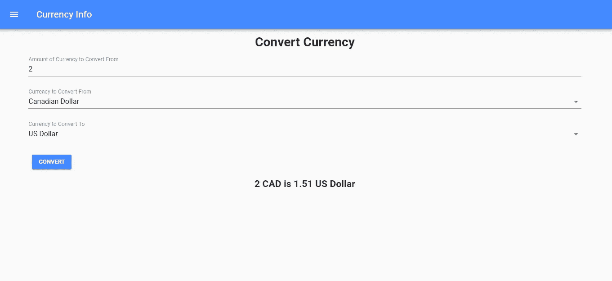

# 如何使用 Vue.js 搭建前端 App

> 原文：<https://betterprogramming.pub/how-to-use-vue-js-to-build-front-end-app-c5d94d22597d>

## 让我们构建一个货币转换器应用程序作为例子


照片由[克里斯蒂安·杜博万](https://unsplash.com/@cdubo?utm_source=unsplash&utm_medium=referral&utm_content=creditCopyText)在 [Unsplash](https://unsplash.com/search/photos/currency?utm_source=unsplash&utm_medium=referral&utm_content=creditCopyText) 上拍摄

Vue.js 是全球第三大流行的前端应用框架。

它越来越受欢迎，因为使用 Vue.js 可以非常容易地构建高质量的应用程序。向您的应用程序添加功能既简单又快速。它有自己的 CLI 程序来生成代码、开发和构建用于生产的应用程序。

它支持 JavaScript 的最新功能，该应用程序兼容大多数最新的浏览器，包括 Internet Explorer。

在这一部分中，我们将构建一个货币转换器。

# 入门指南

为了开始构建我们的应用程序，我们需要 [Vue CLI](https://cli.vuejs.org/) ，它包含一个开发服务器和生成样板代码的脚本。

运行`npm install -g @vue/cli`进行全局安装。

然后运行`vue create currency-converter`来生成样板代码。

现在我们准备开始编写代码。

由于我们正在构建一个单页面应用程序，我们需要一个路由器来将 URL 路由到我们的页面。 [Vue 路由器](https://router.vuejs.org/)是 Vue.js apps 最常用的路由器。

此外，我们需要表单验证和一个好看的用户界面。VeeValidate 是一个众所周知的用于 Vue.js 应用的表单验证库。它适用于许多表单验证案例，如检查必填字段和检查所需的数据类型，如数字。

我们还在应用程序中显示图表，因此我们希望使用一个库来简化这项任务。 [Vue-chartjs](https://vue-chartjs.org/) 是众所周知的 [Chart.js](https://www.chartjs.org/) 库的 Vue.js 包装器。

我们还需要从互联网上获取汇率，以便在我们的应用程序中显示和使用，因此我们需要一个 HTTP 客户端。 [SuperAgent](https://visionmedia.github.io/superagent/) 是满足我们需求的 HTTP 客户端。

之后，我们可以运行开发服务器，通过运行`npm run serve`来显示我们的应用程序。当我们更新代码时，它会自动刷新浏览器。

我们可以通过运行`npm i chart.js vue-chartjs vue-material vue-router`来安装它们。

现在我们已经安装了所有的库，我们可以开始编写逻辑代码了。我们首先编写一些常量，通过在`src`文件夹中添加`urls.js`，我们将在多个地方使用这些常量。

将以下内容添加到文件中:

```
const APIURL = '[https://api.exchangeratesapi.io'](https://api.exchangeratesapi.io');
export { APIURL };
```

在`main.js`中，输入该代码:

```
// The Vue build version to load with the `import` command
// (runtime-only or standalone) has been set in webpack.base.conf with an alias.
import Vue from 'vue'
import App from './App'
import router from './router'router.beforeEach((to, from, next) => {
  document.title = to.meta.title
  next()
})Vue.config.productionTip = false/* eslint-disable no-new */
new Vue({
  el: '#app',
  router,
  template: '<App/>',
  components: { App }
})
```

这是 app 的入口。

此区块:

```
router.beforeEach((to, from, next) => {
  document.title = to.meta.title
  next()
})
```

通过收听 Vue 路由器的导航事件，在我们导航到不同页面时更改标题。

此外，我们需要一个货币列表供人们选择:

```
export default {
    "USD": {
        "symbol": "$",
        "name": "US Dollar",
        "symbol_native": "$",
        "decimal_digits": 2,
        "rounding": 0,
        "code": "USD",
        "name_plural": "US dollars"
    },
    "CAD": {
        "symbol": "CA$",
        "name": "Canadian Dollar",
        "symbol_native": "$",
        "decimal_digits": 2,
        "rounding": 0,
        "code": "CAD",
        "name_plural": "Canadian dollars"
    },
    "EUR": {
        "symbol": "€",
        "name": "Euro",
        "symbol_native": "€",
        "decimal_digits": 2,
        "rounding": 0,
        "code": "EUR",
        "name_plural": "euros"
    },
    "AED": {
        "symbol": "AED",
        "name": "United Arab Emirates Dirham",
        "symbol_native": "د.إ.‏",
        "decimal_digits": 2,
        "rounding": 0,
        "code": "AED",
        "name_plural": "UAE dirhams"
    },
    "AFN": {
        "symbol": "Af",
        "name": "Afghan Afghani",
        "symbol_native": "؋",
        "decimal_digits": 0,
        "rounding": 0,
        "code": "AFN",
        "name_plural": "Afghan Afghanis"
    },
    "ALL": {
        "symbol": "ALL",
        "name": "Albanian Lek",
        "symbol_native": "Lek",
        "decimal_digits": 0,
        "rounding": 0,
        "code": "ALL",
        "name_plural": "Albanian lekë"
    },
    "AMD": {
        "symbol": "AMD",
        "name": "Armenian Dram",
        "symbol_native": "դր.",
        "decimal_digits": 0,
        "rounding": 0,
        "code": "AMD",
        "name_plural": "Armenian drams"
    },
    "ARS": {
        "symbol": "AR$",
        "name": "Argentine Peso",
        "symbol_native": "$",
        "decimal_digits": 2,
        "rounding": 0,
        "code": "ARS",
        "name_plural": "Argentine pesos"
    },
    "AUD": {
        "symbol": "AU$",
        "name": "Australian Dollar",
        "symbol_native": "$",
        "decimal_digits": 2,
        "rounding": 0,
        "code": "AUD",
        "name_plural": "Australian dollars"
    },
    "AZN": {
        "symbol": "man.",
        "name": "Azerbaijani Manat",
        "symbol_native": "ман.",
        "decimal_digits": 2,
        "rounding": 0,
        "code": "AZN",
        "name_plural": "Azerbaijani manats"
    },
    "BAM": {
        "symbol": "KM",
        "name": "Bosnia-Herzegovina Convertible Mark",
        "symbol_native": "KM",
        "decimal_digits": 2,
        "rounding": 0,
        "code": "BAM",
        "name_plural": "Bosnia-Herzegovina convertible marks"
    },
    "BDT": {
        "symbol": "Tk",
        "name": "Bangladeshi Taka",
        "symbol_native": "৳",
        "decimal_digits": 2,
        "rounding": 0,
        "code": "BDT",
        "name_plural": "Bangladeshi takas"
    },
    "BGN": {
        "symbol": "BGN",
        "name": "Bulgarian Lev",
        "symbol_native": "лв.",
        "decimal_digits": 2,
        "rounding": 0,
        "code": "BGN",
        "name_plural": "Bulgarian leva"
    },
    "BHD": {
        "symbol": "BD",
        "name": "Bahraini Dinar",
        "symbol_native": "د.ب.‏",
        "decimal_digits": 3,
        "rounding": 0,
        "code": "BHD",
        "name_plural": "Bahraini dinars"
    },
    "BIF": {
        "symbol": "FBu",
        "name": "Burundian Franc",
        "symbol_native": "FBu",
        "decimal_digits": 0,
        "rounding": 0,
        "code": "BIF",
        "name_plural": "Burundian francs"
    },
    "BND": {
        "symbol": "BN$",
        "name": "Brunei Dollar",
        "symbol_native": "$",
        "decimal_digits": 2,
        "rounding": 0,
        "code": "BND",
        "name_plural": "Brunei dollars"
    },
    "BOB": {
        "symbol": "Bs",
        "name": "Bolivian Boliviano",
        "symbol_native": "Bs",
        "decimal_digits": 2,
        "rounding": 0,
        "code": "BOB",
        "name_plural": "Bolivian bolivianos"
    },
    "BRL": {
        "symbol": "R$",
        "name": "Brazilian Real",
        "symbol_native": "R$",
        "decimal_digits": 2,
        "rounding": 0,
        "code": "BRL",
        "name_plural": "Brazilian reals"
    },
    "BWP": {
        "symbol": "BWP",
        "name": "Botswanan Pula",
        "symbol_native": "P",
        "decimal_digits": 2,
        "rounding": 0,
        "code": "BWP",
        "name_plural": "Botswanan pulas"
    },
    "BYR": {
        "symbol": "BYR",
        "name": "Belarusian Ruble",
        "symbol_native": "BYR",
        "decimal_digits": 0,
        "rounding": 0,
        "code": "BYR",
        "name_plural": "Belarusian rubles"
    },
    "BZD": {
        "symbol": "BZ$",
        "name": "Belize Dollar",
        "symbol_native": "$",
        "decimal_digits": 2,
        "rounding": 0,
        "code": "BZD",
        "name_plural": "Belize dollars"
    },
    "CDF": {
        "symbol": "CDF",
        "name": "Congolese Franc",
        "symbol_native": "FrCD",
        "decimal_digits": 2,
        "rounding": 0,
        "code": "CDF",
        "name_plural": "Congolese francs"
    },
    "CHF": {
        "symbol": "CHF",
        "name": "Swiss Franc",
        "symbol_native": "CHF",
        "decimal_digits": 2,
        "rounding": 0.05,
        "code": "CHF",
        "name_plural": "Swiss francs"
    },
    "CLP": {
        "symbol": "CL$",
        "name": "Chilean Peso",
        "symbol_native": "$",
        "decimal_digits": 0,
        "rounding": 0,
        "code": "CLP",
        "name_plural": "Chilean pesos"
    },
    "CNY": {
        "symbol": "CN¥",
        "name": "Chinese Yuan",
        "symbol_native": "CN¥",
        "decimal_digits": 2,
        "rounding": 0,
        "code": "CNY",
        "name_plural": "Chinese yuan"
    },
    "COP": {
        "symbol": "CO$",
        "name": "Colombian Peso",
        "symbol_native": "$",
        "decimal_digits": 0,
        "rounding": 0,
        "code": "COP",
        "name_plural": "Colombian pesos"
    },
    "CRC": {
        "symbol": "₡",
        "name": "Costa Rican Colón",
        "symbol_native": "₡",
        "decimal_digits": 0,
        "rounding": 0,
        "code": "CRC",
        "name_plural": "Costa Rican colóns"
    },
    "CVE": {
        "symbol": "CV$",
        "name": "Cape Verdean Escudo",
        "symbol_native": "CV$",
        "decimal_digits": 2,
        "rounding": 0,
        "code": "CVE",
        "name_plural": "Cape Verdean escudos"
    },
    "CZK": {
        "symbol": "Kč",
        "name": "Czech Republic Koruna",
        "symbol_native": "Kč",
        "decimal_digits": 2,
        "rounding": 0,
        "code": "CZK",
        "name_plural": "Czech Republic korunas"
    },
    "DJF": {
        "symbol": "Fdj",
        "name": "Djiboutian Franc",
        "symbol_native": "Fdj",
        "decimal_digits": 0,
        "rounding": 0,
        "code": "DJF",
        "name_plural": "Djiboutian francs"
    },
    "DKK": {
        "symbol": "Dkr",
        "name": "Danish Krone",
        "symbol_native": "kr",
        "decimal_digits": 2,
        "rounding": 0,
        "code": "DKK",
        "name_plural": "Danish kroner"
    },
    "DOP": {
        "symbol": "RD$",
        "name": "Dominican Peso",
        "symbol_native": "RD$",
        "decimal_digits": 2,
        "rounding": 0,
        "code": "DOP",
        "name_plural": "Dominican pesos"
    },
    "DZD": {
        "symbol": "DA",
        "name": "Algerian Dinar",
        "symbol_native": "د.ج.‏",
        "decimal_digits": 2,
        "rounding": 0,
        "code": "DZD",
        "name_plural": "Algerian dinars"
    },
    "EEK": {
        "symbol": "Ekr",
        "name": "Estonian Kroon",
        "symbol_native": "kr",
        "decimal_digits": 2,
        "rounding": 0,
        "code": "EEK",
        "name_plural": "Estonian kroons"
    },
    "EGP": {
        "symbol": "EGP",
        "name": "Egyptian Pound",
        "symbol_native": "ج.م.‏",
        "decimal_digits": 2,
        "rounding": 0,
        "code": "EGP",
        "name_plural": "Egyptian pounds"
    },
    "ERN": {
        "symbol": "Nfk",
        "name": "Eritrean Nakfa",
        "symbol_native": "Nfk",
        "decimal_digits": 2,
        "rounding": 0,
        "code": "ERN",
        "name_plural": "Eritrean nakfas"
    },
    "ETB": {
        "symbol": "Br",
        "name": "Ethiopian Birr",
        "symbol_native": "Br",
        "decimal_digits": 2,
        "rounding": 0,
        "code": "ETB",
        "name_plural": "Ethiopian birrs"
    },
    "GBP": {
        "symbol": "£",
        "name": "British Pound Sterling",
        "symbol_native": "£",
        "decimal_digits": 2,
        "rounding": 0,
        "code": "GBP",
        "name_plural": "British pounds sterling"
    },
    "GEL": {
        "symbol": "GEL",
        "name": "Georgian Lari",
        "symbol_native": "GEL",
        "decimal_digits": 2,
        "rounding": 0,
        "code": "GEL",
        "name_plural": "Georgian laris"
    },
    "GHS": {
        "symbol": "GH₵",
        "name": "Ghanaian Cedi",
        "symbol_native": "GH₵",
        "decimal_digits": 2,
        "rounding": 0,
        "code": "GHS",
        "name_plural": "Ghanaian cedis"
    },
    "GNF": {
        "symbol": "FG",
        "name": "Guinean Franc",
        "symbol_native": "FG",
        "decimal_digits": 0,
        "rounding": 0,
        "code": "GNF",
        "name_plural": "Guinean francs"
    },
    "GTQ": {
        "symbol": "GTQ",
        "name": "Guatemalan Quetzal",
        "symbol_native": "Q",
        "decimal_digits": 2,
        "rounding": 0,
        "code": "GTQ",
        "name_plural": "Guatemalan quetzals"
    },
    "HKD": {
        "symbol": "HK$",
        "name": "Hong Kong Dollar",
        "symbol_native": "$",
        "decimal_digits": 2,
        "rounding": 0,
        "code": "HKD",
        "name_plural": "Hong Kong dollars"
    },
    "HNL": {
        "symbol": "HNL",
        "name": "Honduran Lempira",
        "symbol_native": "L",
        "decimal_digits": 2,
        "rounding": 0,
        "code": "HNL",
        "name_plural": "Honduran lempiras"
    },
    "HRK": {
        "symbol": "kn",
        "name": "Croatian Kuna",
        "symbol_native": "kn",
        "decimal_digits": 2,
        "rounding": 0,
        "code": "HRK",
        "name_plural": "Croatian kunas"
    },
    "HUF": {
        "symbol": "Ft",
        "name": "Hungarian Forint",
        "symbol_native": "Ft",
        "decimal_digits": 0,
        "rounding": 0,
        "code": "HUF",
        "name_plural": "Hungarian forints"
    },
    "IDR": {
        "symbol": "Rp",
        "name": "Indonesian Rupiah",
        "symbol_native": "Rp",
        "decimal_digits": 0,
        "rounding": 0,
        "code": "IDR",
        "name_plural": "Indonesian rupiahs"
    },
    "ILS": {
        "symbol": "₪",
        "name": "Israeli New Sheqel",
        "symbol_native": "₪",
        "decimal_digits": 2,
        "rounding": 0,
        "code": "ILS",
        "name_plural": "Israeli new sheqels"
    },
    "INR": {
        "symbol": "Rs",
        "name": "Indian Rupee",
        "symbol_native": "টকা",
        "decimal_digits": 2,
        "rounding": 0,
        "code": "INR",
        "name_plural": "Indian rupees"
    },
    "IQD": {
        "symbol": "IQD",
        "name": "Iraqi Dinar",
        "symbol_native": "د.ع.‏",
        "decimal_digits": 0,
        "rounding": 0,
        "code": "IQD",
        "name_plural": "Iraqi dinars"
    },
    "IRR": {
        "symbol": "IRR",
        "name": "Iranian Rial",
        "symbol_native": "﷼",
        "decimal_digits": 0,
        "rounding": 0,
        "code": "IRR",
        "name_plural": "Iranian rials"
    },
    "ISK": {
        "symbol": "Ikr",
        "name": "Icelandic Króna",
        "symbol_native": "kr",
        "decimal_digits": 0,
        "rounding": 0,
        "code": "ISK",
        "name_plural": "Icelandic krónur"
    },
    "JMD": {
        "symbol": "J$",
        "name": "Jamaican Dollar",
        "symbol_native": "$",
        "decimal_digits": 2,
        "rounding": 0,
        "code": "JMD",
        "name_plural": "Jamaican dollars"
    },
    "JOD": {
        "symbol": "JD",
        "name": "Jordanian Dinar",
        "symbol_native": "د.أ.‏",
        "decimal_digits": 3,
        "rounding": 0,
        "code": "JOD",
        "name_plural": "Jordanian dinars"
    },
    "JPY": {
        "symbol": "¥",
        "name": "Japanese Yen",
        "symbol_native": "￥",
        "decimal_digits": 0,
        "rounding": 0,
        "code": "JPY",
        "name_plural": "Japanese yen"
    },
    "KES": {
        "symbol": "Ksh",
        "name": "Kenyan Shilling",
        "symbol_native": "Ksh",
        "decimal_digits": 2,
        "rounding": 0,
        "code": "KES",
        "name_plural": "Kenyan shillings"
    },
    "KHR": {
        "symbol": "KHR",
        "name": "Cambodian Riel",
        "symbol_native": "៛",
        "decimal_digits": 2,
        "rounding": 0,
        "code": "KHR",
        "name_plural": "Cambodian riels"
    },
    "KMF": {
        "symbol": "CF",
        "name": "Comorian Franc",
        "symbol_native": "FC",
        "decimal_digits": 0,
        "rounding": 0,
        "code": "KMF",
        "name_plural": "Comorian francs"
    },
    "KRW": {
        "symbol": "₩",
        "name": "South Korean Won",
        "symbol_native": "₩",
        "decimal_digits": 0,
        "rounding": 0,
        "code": "KRW",
        "name_plural": "South Korean won"
    },
    "KWD": {
        "symbol": "KD",
        "name": "Kuwaiti Dinar",
        "symbol_native": "د.ك.‏",
        "decimal_digits": 3,
        "rounding": 0,
        "code": "KWD",
        "name_plural": "Kuwaiti dinars"
    },
    "KZT": {
        "symbol": "KZT",
        "name": "Kazakhstani Tenge",
        "symbol_native": "тңг.",
        "decimal_digits": 2,
        "rounding": 0,
        "code": "KZT",
        "name_plural": "Kazakhstani tenges"
    },
    "LBP": {
        "symbol": "LB£",
        "name": "Lebanese Pound",
        "symbol_native": "ل.ل.‏",
        "decimal_digits": 0,
        "rounding": 0,
        "code": "LBP",
        "name_plural": "Lebanese pounds"
    },
    "LKR": {
        "symbol": "SLRs",
        "name": "Sri Lankan Rupee",
        "symbol_native": "SL Re",
        "decimal_digits": 2,
        "rounding": 0,
        "code": "LKR",
        "name_plural": "Sri Lankan rupees"
    },
    "LTL": {
        "symbol": "Lt",
        "name": "Lithuanian Litas",
        "symbol_native": "Lt",
        "decimal_digits": 2,
        "rounding": 0,
        "code": "LTL",
        "name_plural": "Lithuanian litai"
    },
    "LVL": {
        "symbol": "Ls",
        "name": "Latvian Lats",
        "symbol_native": "Ls",
        "decimal_digits": 2,
        "rounding": 0,
        "code": "LVL",
        "name_plural": "Latvian lati"
    },
    "LYD": {
        "symbol": "LD",
        "name": "Libyan Dinar",
        "symbol_native": "د.ل.‏",
        "decimal_digits": 3,
        "rounding": 0,
        "code": "LYD",
        "name_plural": "Libyan dinars"
    },
    "MAD": {
        "symbol": "MAD",
        "name": "Moroccan Dirham",
        "symbol_native": "د.م.‏",
        "decimal_digits": 2,
        "rounding": 0,
        "code": "MAD",
        "name_plural": "Moroccan dirhams"
    },
    "MDL": {
        "symbol": "MDL",
        "name": "Moldovan Leu",
        "symbol_native": "MDL",
        "decimal_digits": 2,
        "rounding": 0,
        "code": "MDL",
        "name_plural": "Moldovan lei"
    },
    "MGA": {
        "symbol": "MGA",
        "name": "Malagasy Ariary",
        "symbol_native": "MGA",
        "decimal_digits": 0,
        "rounding": 0,
        "code": "MGA",
        "name_plural": "Malagasy Ariaries"
    },
    "MKD": {
        "symbol": "MKD",
        "name": "Macedonian Denar",
        "symbol_native": "MKD",
        "decimal_digits": 2,
        "rounding": 0,
        "code": "MKD",
        "name_plural": "Macedonian denari"
    },
    "MMK": {
        "symbol": "MMK",
        "name": "Myanma Kyat",
        "symbol_native": "K",
        "decimal_digits": 0,
        "rounding": 0,
        "code": "MMK",
        "name_plural": "Myanma kyats"
    },
    "MOP": {
        "symbol": "MOP$",
        "name": "Macanese Pataca",
        "symbol_native": "MOP$",
        "decimal_digits": 2,
        "rounding": 0,
        "code": "MOP",
        "name_plural": "Macanese patacas"
    },
    "MUR": {
        "symbol": "MURs",
        "name": "Mauritian Rupee",
        "symbol_native": "MURs",
        "decimal_digits": 0,
        "rounding": 0,
        "code": "MUR",
        "name_plural": "Mauritian rupees"
    },
    "MXN": {
        "symbol": "MX$",
        "name": "Mexican Peso",
        "symbol_native": "$",
        "decimal_digits": 2,
        "rounding": 0,
        "code": "MXN",
        "name_plural": "Mexican pesos"
    },
    "MYR": {
        "symbol": "RM",
        "name": "Malaysian Ringgit",
        "symbol_native": "RM",
        "decimal_digits": 2,
        "rounding": 0,
        "code": "MYR",
        "name_plural": "Malaysian ringgits"
    },
    "MZN": {
        "symbol": "MTn",
        "name": "Mozambican Metical",
        "symbol_native": "MTn",
        "decimal_digits": 2,
        "rounding": 0,
        "code": "MZN",
        "name_plural": "Mozambican meticals"
    },
    "NAD": {
        "symbol": "N$",
        "name": "Namibian Dollar",
        "symbol_native": "N$",
        "decimal_digits": 2,
        "rounding": 0,
        "code": "NAD",
        "name_plural": "Namibian dollars"
    },
    "NGN": {
        "symbol": "₦",
        "name": "Nigerian Naira",
        "symbol_native": "₦",
        "decimal_digits": 2,
        "rounding": 0,
        "code": "NGN",
        "name_plural": "Nigerian nairas"
    },
    "NIO": {
        "symbol": "C$",
        "name": "Nicaraguan Córdoba",
        "symbol_native": "C$",
        "decimal_digits": 2,
        "rounding": 0,
        "code": "NIO",
        "name_plural": "Nicaraguan córdobas"
    },
    "NOK": {
        "symbol": "Nkr",
        "name": "Norwegian Krone",
        "symbol_native": "kr",
        "decimal_digits": 2,
        "rounding": 0,
        "code": "NOK",
        "name_plural": "Norwegian kroner"
    },
    "NPR": {
        "symbol": "NPRs",
        "name": "Nepalese Rupee",
        "symbol_native": "नेरू",
        "decimal_digits": 2,
        "rounding": 0,
        "code": "NPR",
        "name_plural": "Nepalese rupees"
    },
    "NZD": {
        "symbol": "NZ$",
        "name": "New Zealand Dollar",
        "symbol_native": "$",
        "decimal_digits": 2,
        "rounding": 0,
        "code": "NZD",
        "name_plural": "New Zealand dollars"
    },
    "OMR": {
        "symbol": "OMR",
        "name": "Omani Rial",
        "symbol_native": "ر.ع.‏",
        "decimal_digits": 3,
        "rounding": 0,
        "code": "OMR",
        "name_plural": "Omani rials"
    },
    "PAB": {
        "symbol": "B/.",
        "name": "Panamanian Balboa",
        "symbol_native": "B/.",
        "decimal_digits": 2,
        "rounding": 0,
        "code": "PAB",
        "name_plural": "Panamanian balboas"
    },
    "PEN": {
        "symbol": "S/.",
        "name": "Peruvian Nuevo Sol",
        "symbol_native": "S/.",
        "decimal_digits": 2,
        "rounding": 0,
        "code": "PEN",
        "name_plural": "Peruvian nuevos soles"
    },
    "PHP": {
        "symbol": "₱",
        "name": "Philippine Peso",
        "symbol_native": "₱",
        "decimal_digits": 2,
        "rounding": 0,
        "code": "PHP",
        "name_plural": "Philippine pesos"
    },
    "PKR": {
        "symbol": "PKRs",
        "name": "Pakistani Rupee",
        "symbol_native": "₨",
        "decimal_digits": 0,
        "rounding": 0,
        "code": "PKR",
        "name_plural": "Pakistani rupees"
    },
    "PLN": {
        "symbol": "zł",
        "name": "Polish Zloty",
        "symbol_native": "zł",
        "decimal_digits": 2,
        "rounding": 0,
        "code": "PLN",
        "name_plural": "Polish zlotys"
    },
    "PYG": {
        "symbol": "₲",
        "name": "Paraguayan Guarani",
        "symbol_native": "₲",
        "decimal_digits": 0,
        "rounding": 0,
        "code": "PYG",
        "name_plural": "Paraguayan guaranis"
    },
    "QAR": {
        "symbol": "QR",
        "name": "Qatari Rial",
        "symbol_native": "ر.ق.‏",
        "decimal_digits": 2,
        "rounding": 0,
        "code": "QAR",
        "name_plural": "Qatari rials"
    },
    "RON": {
        "symbol": "RON",
        "name": "Romanian Leu",
        "symbol_native": "RON",
        "decimal_digits": 2,
        "rounding": 0,
        "code": "RON",
        "name_plural": "Romanian lei"
    },
    "RSD": {
        "symbol": "din.",
        "name": "Serbian Dinar",
        "symbol_native": "дин.",
        "decimal_digits": 0,
        "rounding": 0,
        "code": "RSD",
        "name_plural": "Serbian dinars"
    },
    "RUB": {
        "symbol": "RUB",
        "name": "Russian Ruble",
        "symbol_native": "руб.",
        "decimal_digits": 2,
        "rounding": 0,
        "code": "RUB",
        "name_plural": "Russian rubles"
    },
    "RWF": {
        "symbol": "RWF",
        "name": "Rwandan Franc",
        "symbol_native": "FR",
        "decimal_digits": 0,
        "rounding": 0,
        "code": "RWF",
        "name_plural": "Rwandan francs"
    },
    "SAR": {
        "symbol": "SR",
        "name": "Saudi Riyal",
        "symbol_native": "ر.س.‏",
        "decimal_digits": 2,
        "rounding": 0,
        "code": "SAR",
        "name_plural": "Saudi riyals"
    },
    "SDG": {
        "symbol": "SDG",
        "name": "Sudanese Pound",
        "symbol_native": "SDG",
        "decimal_digits": 2,
        "rounding": 0,
        "code": "SDG",
        "name_plural": "Sudanese pounds"
    },
    "SEK": {
        "symbol": "Skr",
        "name": "Swedish Krona",
        "symbol_native": "kr",
        "decimal_digits": 2,
        "rounding": 0,
        "code": "SEK",
        "name_plural": "Swedish kronor"
    },
    "SGD": {
        "symbol": "S$",
        "name": "Singapore Dollar",
        "symbol_native": "$",
        "decimal_digits": 2,
        "rounding": 0,
        "code": "SGD",
        "name_plural": "Singapore dollars"
    },
    "SOS": {
        "symbol": "Ssh",
        "name": "Somali Shilling",
        "symbol_native": "Ssh",
        "decimal_digits": 0,
        "rounding": 0,
        "code": "SOS",
        "name_plural": "Somali shillings"
    },
    "SYP": {
        "symbol": "SY£",
        "name": "Syrian Pound",
        "symbol_native": "ل.س.‏",
        "decimal_digits": 0,
        "rounding": 0,
        "code": "SYP",
        "name_plural": "Syrian pounds"
    },
    "THB": {
        "symbol": "฿",
        "name": "Thai Baht",
        "symbol_native": "฿",
        "decimal_digits": 2,
        "rounding": 0,
        "code": "THB",
        "name_plural": "Thai baht"
    },
    "TND": {
        "symbol": "DT",
        "name": "Tunisian Dinar",
        "symbol_native": "د.ت.‏",
        "decimal_digits": 3,
        "rounding": 0,
        "code": "TND",
        "name_plural": "Tunisian dinars"
    },
    "TOP": {
        "symbol": "T$",
        "name": "Tongan Paʻanga",
        "symbol_native": "T$",
        "decimal_digits": 2,
        "rounding": 0,
        "code": "TOP",
        "name_plural": "Tongan paʻanga"
    },
    "TRY": {
        "symbol": "TL",
        "name": "Turkish Lira",
        "symbol_native": "TL",
        "decimal_digits": 2,
        "rounding": 0,
        "code": "TRY",
        "name_plural": "Turkish Lira"
    },
    "TTD": {
        "symbol": "TT$",
        "name": "Trinidad and Tobago Dollar",
        "symbol_native": "$",
        "decimal_digits": 2,
        "rounding": 0,
        "code": "TTD",
        "name_plural": "Trinidad and Tobago dollars"
    },
    "TWD": {
        "symbol": "NT$",
        "name": "New Taiwan Dollar",
        "symbol_native": "NT$",
        "decimal_digits": 2,
        "rounding": 0,
        "code": "TWD",
        "name_plural": "New Taiwan dollars"
    },
    "TZS": {
        "symbol": "TSh",
        "name": "Tanzanian Shilling",
        "symbol_native": "TSh",
        "decimal_digits": 0,
        "rounding": 0,
        "code": "TZS",
        "name_plural": "Tanzanian shillings"
    },
    "UAH": {
        "symbol": "₴",
        "name": "Ukrainian Hryvnia",
        "symbol_native": "₴",
        "decimal_digits": 2,
        "rounding": 0,
        "code": "UAH",
        "name_plural": "Ukrainian hryvnias"
    },
    "UGX": {
        "symbol": "USh",
        "name": "Ugandan Shilling",
        "symbol_native": "USh",
        "decimal_digits": 0,
        "rounding": 0,
        "code": "UGX",
        "name_plural": "Ugandan shillings"
    },
    "UYU": {
        "symbol": "$U",
        "name": "Uruguayan Peso",
        "symbol_native": "$",
        "decimal_digits": 2,
        "rounding": 0,
        "code": "UYU",
        "name_plural": "Uruguayan pesos"
    },
    "UZS": {
        "symbol": "UZS",
        "name": "Uzbekistan Som",
        "symbol_native": "UZS",
        "decimal_digits": 0,
        "rounding": 0,
        "code": "UZS",
        "name_plural": "Uzbekistan som"
    },
    "VEF": {
        "symbol": "Bs.F.",
        "name": "Venezuelan Bolívar",
        "symbol_native": "Bs.F.",
        "decimal_digits": 2,
        "rounding": 0,
        "code": "VEF",
        "name_plural": "Venezuelan bolívars"
    },
    "VND": {
        "symbol": "₫",
        "name": "Vietnamese Dong",
        "symbol_native": "₫",
        "decimal_digits": 0,
        "rounding": 0,
        "code": "VND",
        "name_plural": "Vietnamese dong"
    },
    "XAF": {
        "symbol": "FCFA",
        "name": "CFA Franc BEAC",
        "symbol_native": "FCFA",
        "decimal_digits": 0,
        "rounding": 0,
        "code": "XAF",
        "name_plural": "CFA francs BEAC"
    },
    "XOF": {
        "symbol": "CFA",
        "name": "CFA Franc BCEAO",
        "symbol_native": "CFA",
        "decimal_digits": 0,
        "rounding": 0,
        "code": "XOF",
        "name_plural": "CFA francs BCEAO"
    },
    "YER": {
        "symbol": "YR",
        "name": "Yemeni Rial",
        "symbol_native": "ر.ي.‏",
        "decimal_digits": 0,
        "rounding": 0,
        "code": "YER",
        "name_plural": "Yemeni rials"
    },
    "ZAR": {
        "symbol": "R",
        "name": "South African Rand",
        "symbol_native": "R",
        "decimal_digits": 2,
        "rounding": 0,
        "code": "ZAR",
        "name_plural": "South African rand"
    },
    "ZMK": {
        "symbol": "ZK",
        "name": "Zambian Kwacha",
        "symbol_native": "ZK",
        "decimal_digits": 0,
        "rounding": 0,
        "code": "ZMK",
        "name_plural": "Zambian kwachas"
    }
}
```

我们将在货币兑换页面中使用它。

在`index.html`中，我们加上:

```
<link rel="stylesheet" href="https://fonts.googleapis.com/css?family=Roboto:300,400,500,700,400italic|Material+Icons">
```

使用 [Roboto](https://fonts.google.com/specimen/Roboto) 以便我们的应用程序在使用[材质](https://api.flutter.dev/flutter/material/material-library.html)部件时看起来不错。

然后，在`src/router/index.js`中，我们添加:

```
import Vue from 'vue'
import Router from 'vue-router'
import VeeValidate from 'vee-validate';
import Quotes from '@/components/Quotes'
import Convert from '@/components/Convert'
import Drawer from '@/components/Drawer'
import Historical from '@/components/Historical'
import HistoricalRatesInPeriod from '@/components/HistoricalRatesInPeriod'
import HistoricalRatesInPeriodGraph from '@/components/HistoricalRatesInPeriodGraph'
import LineGraph from '@/components/LineGraph'
import currencies from '../currencies';
import VueMaterial from 'vue-material'
import 'vue-material/dist/vue-material.min.css'
import 'vue-material/dist/theme/default.css'Vue.component('drawer', Drawer);
Vue.component('line-graph', LineGraph);
Vue.use(VueMaterial)
Vue.use(Router)
Vue.use(VeeValidate);Vue.filter('currencyName', function (value) {
  if (currencies[value]) {
    return currencies[value].name;
  }
  else {
    return value;
  }})export default new Router({
  routes: [
    {
      path: '/',
      name: 'quotes',
      component: Quotes,
      meta: { title: 'Quotes' }
    },
    {
      path: '/convert',
      name: 'convert',
      component: Convert,
      meta: { title: 'Convert' }
    },
    {
      path: '/historical',
      name: 'historical',
      component: Historical,
      meta: { title: 'Historical Rates' }
    },
    {
      path: '/historicalratesinperiod',
      name: 'historicalratesinperiod',
      component: HistoricalRatesInPeriod,
      meta: { title: 'Historical Rates in a Period' }
    },
    {
      path: '/historicalratesinperiodgraph',
      name: 'historicalratesinperiodgraph',
      component: HistoricalRatesInPeriodGraph,
      meta: { title: 'Historical Rates in a Period' }
    }
  ]
})
```

这个模块是我们向 Vue 注册外部组件的地方，因此我们可以使用它作为模板:

```
Vue.component('drawer', Drawer);
Vue.component('line-graph', LineGraph);
Vue.use(VueMaterial)
Vue.use(Router)
Vue.use(VeeValidate);
```

Vue 还有一个元素，叫做*过滤器*，允许我们在模板中将一个值映射到另一个值。

此区块:

```
Vue.filter('currencyName', function (value) {
  if (currencies[value]) {
    return currencies[value].name;
  }
  else {
    return value;
  }})
```

获取货币代码并获取名称。

这些是我们应用程序每个页面的路线。

每个页面的标题都在每个路由中的`meta`对象的`title`属性中。路径是每个页面的相对 URL。我们必须添加我们在上面的文件中导入的组件。

接下来，我们为货币兑换表单创建页面。我们在`src/components`文件夹中添加一个名为`Convert.vue`的文件。

`vue`扩展名表示它是一个单独的文件组件，这意味着组件的逻辑、样式和模板都包含在一个文件中。

`Convert.vue`的代码如下所示:

```
<template>
  <div class="page-container md-layout-column">
    <drawer></drawer>
    <div class="container">
      <h1 class="center">Convert Currency</h1>
      <form [@submit](http://twitter.com/submit).prevent="convert">
        <div class="md-layout-item">
          <md-field :class="{'md-invalid': errors.first('price') }">
            <label>Amount of Currency to Convert From</label>
            <md-input v-model="form.price" v-validate="'required'" name="price"></md-input>
            <span class="md-error">{{ errors.first('price') }}</span>
          </md-field>
          <md-field :class="{'md-invalid': errors.first('from') }">
            <label for="from">Currency to Convert From</label>
            <md-select v-model="form.from" name="from" v-validate="'required'">
              <md-option :value="s.code" v-for="s in fromSymbols" :key="s.code">{{s.name}}</md-option>
            </md-select>
            <span class="md-error">{{ errors.first('from') }}</span>
          </md-field>
          <md-field :class="{'md-invalid': errors.first('to') }">
            <label for="to">Currency to Convert To</label>
            <md-select v-model="form.to" name="to" v-validate="'required'">
              <md-option :value="s.code" v-for="s in toSymbols" :key="s.code">{{s.name}}</md-option>
            </md-select>
            <span class="md-error">{{ errors.first('to') }}</span>
          </md-field>
        </div>
        <md-button class="md-dense md-raised md-primary" type="submit">Convert</md-button>
      </form>
      <div v-if="hasResult" class="center">
        <h2
          v-if="isNumber(result)"
        >{{form.price | currencyName}} {{form.from}} is {{result}} {{form.to | currencyName}}</h2>
        <h2 v-if="!isNumber(result)">Exchange rate not found.</h2>
      </div>
    </div>
  </div>
</template><script>
import currencies from "../currencies";
import { APIURL } from "../urls";
import * as moment from "moment";
const request = require("superagent");export default {
  name: "convert",
  data() {
    return {
      form: {
        price: 0,
        from: "",
        to: ""
      },
      result: null,
      currencies,
      currentTime: "",
      err: null,
      hasResult: false,
      symbols: [],
      fromSymbols: [],
      toSymbols: []
    };
  },
  watch: {
    form: {
      handler(val) {
        if (!this.form) {
          this.toSymbols = this.symbols;
          this.fromSymbols = this.symbols;
          return;
        }this.hasResult = false;
        if (this.form.from) {
          this.toSymbols = this.symbols.filter(s => s.code != this.form.from);
        }if (this.form.to) {
          this.fromSymbols = this.symbols.filter(s => s.code != this.form.to);
        }
      },
      deep: true
    }
  },
  methods: {
    convert(evt) {
      this.hasResult = false;
      evt.preventDefault();
      if (this.errors.items.length > 0) {
        return;
      }request.get(`${APIURL}/latest?base=${this.form.from}`).end((err, res) => {
        let body = res.body;
        this.hasResult = true;
        this.result = (+this.form.price * +body.rates[this.form.to]).toFixed(2);
        this.currentTime = moment(this.result.timestamp * 1000).format(
          "YYYY-MM-DD HH:mm:ss a"
        );
      });
    },
    isNumber(number) {
      return !isNaN(number);
    }
  },
  beforeMount() {
    this.symbols = Object.keys(this.currencies).map(k => {
      return {
        symbol: k,
        ...this.currencies[k]
      };
    });
    this.toSymbols = JSON.parse(JSON.stringify(this.symbols));
    this.fromSymbols = JSON.parse(JSON.stringify(this.symbols));
  }
};
</script><!-- Add "scoped" attribute to limit CSS to this component only -->
<style scoped>
.result {
  margin-top: 30px;
}
</style>
```

注意，它使用了我们之前定义的`currencyName`过滤器。

`template`标签之间的部分是表单。对于我们转换的货币，分别有一个输入和两个选择下拉列表。

在每个表单字段中，我们检查它是否已经填充了`v-validate="'required'"`属性。这些选项是从 JSON 文件中导入的，包含所有货币。

我们移除在`script`标签中导出的对象的`watch`块的下拉列表中已经选择的货币:

```
watch: {
    form: {
      handler(val) {
        if (!this.form) {
          this.toSymbols = this.symbols;
          this.fromSymbols = this.symbols;
          return;
        }this.hasResult = false;
        if (this.form.from) {
          this.toSymbols = this.symbols.filter(s => s.code != this.form.from);
        }if (this.form.to) {
          this.fromSymbols = this.symbols.filter(s => s.code != this.form.to);
        }
      },
      deep: true
    }
  },
```

所以我们在两个下拉列表中没有相同的选择。

一旦用户单击 submit 按钮，`convert`函数就会运行，它会获取汇率并计算转换后的金额。

对象中的`this`是模板变量绑定到逻辑变量的地方。我们使用`moment`来格式化时间，所以我们必须通过运行`npm i moment`来安装它。

我们通过分配给`this`的字段来显示结果。模板将自动更新。

为了创建导航的侧菜单，我们添加了一个名为`Drawer.vue`的文件，我们在`index.js`中导入并注册了该文件，因此我们可以将它包含在我们的模板中。

代码是这样的:

```
<template>
  <div>
    <md-drawer :md-active.sync="showNavigation" md-swipeable>
      <md-toolbar class="md-transparent" md-elevation="0">
        <span class="md-title">Currency Info</span>
      </md-toolbar><md-list>
        <md-list-item>
          <router-link to="/">
            <span class="md-list-item-text">Exchange Rates</span>
          </router-link>
        </md-list-item><md-list-item>
          <router-link to="/convert">
            <span class="md-list-item-text">Convert Currency</span>
          </router-link>
        </md-list-item><md-list-item>
          <router-link to="/historical">
            <span class="md-list-item-text">Historical Rates</span>
          </router-link>
        </md-list-item><md-list-item>
          <router-link to="/historicalratesinperiod">
            <span class="md-list-item-text">Historical Rates in a Period</span>
          </router-link>
        </md-list-item><md-list-item>
          <router-link to="/historicalratesinperiodgraph">
            <span class="md-list-item-text">Historical Rates in a Period Graph</span>
          </router-link>
        </md-list-item>
      </md-list>
    </md-drawer>
    <md-toolbar class="md-primary">
      <md-button class="md-icon-button" [@click](http://twitter.com/click)="showNavigation = true">
        <md-icon>menu</md-icon>
      </md-button>
      <h3 class="md-title">Currency Info</h3>
    </md-toolbar>
  </div>
</template><script>
export default {
  name: "nav-bar",
  data() {
    return {
      msg: "Welcome to Your Vue.js App",
      showNavigation: false
    };
  }
};
</script><!-- Add "scoped" attribute to limit CSS to this component only -->
<style scoped>
</style>
```

现在，我们以类似的方式创建其余的组件文件。都在`src/components`里。

我们创建一个名为`Historical.vue`的文件，并添加以下内容:

```
<template>
  <div class="page-container md-layout-column">
    <drawer></drawer>
    <div class="container">
      <h1 class="center">Historical Exchange Rates</h1>
      <form [@submit](http://twitter.com/submit).prevent="getHistoricalRate">
        <div class="md-layout-item">
          <label>Date</label>
          <md-datepicker
            v-model="form.date"
            v-validate="'required'"
            name="date"
            :md-disabled-dates="futureDates"
          ></md-datepicker>
          <md-field :class="{'md-invalid': errors.first('baseCurrency') }">
            <label for="baseCurrency">Currency Symbol</label>
            <md-select v-model="form.baseCurrency" name="baseCurrency" v-validate="'required'">
              <md-option :value="s.code" v-for="s in symbols" :key="s.code">{{s.name}}</md-option>
            </md-select>
            <span class="md-error">{{ errors.first('baseCurrency') }}</span>
          </md-field>
        </div>
        <md-button class="md-dense md-raised md-primary" type="submit">Find Rate</md-button>
      </form>
      <div>
        <md-content class="md-layout-item" v-for="(r, index) in rates" :key="index">
          <h2>{{form.baseCurrency | currencyName}} - {{r.symbol| currencyName}}</h2>
          <p>{{r.rate}}</p>
        </md-content>
      </div>
    </div>
  </div>
</template><script>
import currencies from "../currencies";
import { APIURL } from "../urls";
import * as moment from "moment";
const request = require("superagent");export default {
  data() {
    return {
      form: {
        date: new Date(),
        baseCurrency: ""
      },
      rates: [],
      symbols: [],
      currencies
    };
  },
  methods: {
    getHistoricalRate(evt) {
      this.hasResult = false;
      evt.preventDefault();
      if (this.errors.items.length > 0) {
        return;
      }request
        .get(
          `${APIURL}/${moment(this.form.date).format("YYYY-MM-DD")}?base=${
            this.form.baseCurrency
          }`
        )
        .end((err, res) => {
          let body = res.body;
          this.hasResult = true;
          this.rates = Object.keys(body.rates).map(k => {
            return {
              symbol: k,
              rate: body.rates[k]
            };
          });
        });
    },
    futureDates(evt) {
      return +evt > +new Date();
    }
  },
  beforeMount() {
    this.symbols = Object.keys(this.currencies).map(k => {
      return {
        symbol: k,
        ...this.currencies[k]
      };
    });
  }
};
</script><style>
</style>
```

在该组件中，`getHistoricalRate`函数运行代码向 API 发出一个`GET`请求，以便与我们的 SuperAgent HTTP 客户端库进行交换。

一旦请求完成，链接到`get`函数的`then`函数将获取汇率结果并进行计算。

然后，我们在同一个文件夹中创建`HistoricalRatesInPeriod.vue`，并添加以下内容:

```
<template>
  <div class="page-container md-layout-column">
    <drawer></drawer>
    <div class="container">
      <h1 class="center">Historical Exchange Rates in a Period</h1>
      <form [@submit](http://twitter.com/submit).prevent="getHistoricalRate">
        <div class="md-layout-item">
          <label>Start Date</label>
          <md-datepicker
            v-model="form.startDate"
            v-validate="'required'"
            name="date"
            :md-disabled-dates="invalidStartDates"
          ></md-datepicker>
          <label>End Date</label>
          <md-datepicker
            v-model="form.endDate"
            v-validate="'required'"
            name="date"
            :md-disabled-dates="invalidEndDates"
          ></md-datepicker>
          <md-field :class="{'md-invalid': errors.first('baseCurrency') }">
            <label for="baseCurrency">Currency Symbol</label>
            <md-select v-model="form.baseCurrency" name="baseCurrency" v-validate="'required'">
              <md-option :value="s.code" v-for="s in symbols" :key="s.code">{{s.name}}</md-option>
            </md-select>
            <span class="md-error">{{ errors.first('baseCurrency') }}</span>
          </md-field>
        </div>
        <md-button class="md-dense md-raised md-primary" type="submit">Find Rate</md-button>
      </form>
      <div>
        <md-content class="md-layout-item" v-for="(r, index) in rates" :key="index">
          <h2>{{r.date}}</h2>
          <md-content class="md-layout-item" v-for="(rr, index) in r.rates" :key="index">
            <h3>{{form.baseCurrency | currencyName}} - {{rr.symbol| currencyName}}</h3>
            <p>{{rr.rate}}</p>
          </md-content>
        </md-content>
      </div>
    </div>
  </div>
</template><script>
import currencies from "../currencies";
import { APIURL } from "../urls";
import * as moment from "moment";
const request = require("superagent");export default {
  data() {
    return {
      form: {
        startDate: new Date(),
        endDate: new Date(),
        baseCurrency: ""
      },
      rates: [],
      symbols: [],
      currencies
    };
  },
  methods: {
    getHistoricalRate(evt) {
      this.hasResult = false;
      evt.preventDefault();
      if (this.errors.items.length > 0) {
        return;
      }request
        .get(
          `${APIURL}/history?start_at=${moment(this.form.startDate).format(
            "YYYY-MM-DD"
          )}&end_at=${moment(this.form.endDate).format("YYYY-MM-DD")}&base=${
            this.form.baseCurrency
          }`
        )
        .end((err, res) => {
          let body = res.body;
          this.hasResult = true;
          this.rates = Object.keys(body.rates)
            .map(date => {
              return {
                date: moment(date).format("YYYY-MM-DD"),
                rates: Object.keys(body.rates[date]).map(k => {
                  return {
                    symbol: k,
                    rate: body.rates[date][k]
                  };
                })
              };
            })
            .sort((a, b) => +new Date(a.date) - +new Date(b.date));
        });
    },
    invalidStartDates(evt) {
      return +evt > +new Date();
    },
    invalidEndDates(evt) {
      return +evt < +this.form.startDate || +evt > +new Date();
    }
  },
  beforeMount() {
    this.symbols = Object.keys(this.currencies).map(k => {
      return {
        symbol: k,
        ...this.currencies[k]
      };
    });
  }
};
</script><style>
</style>
```

日期选择器和其他组件都注册在`index.js`中，这样我们可以将它们包含在我们的模板中。

接下来，我们通过添加一个名为`HistoreicalRatesInPeriodGraph.vue`的文件并添加以下代码，为图表中的历史汇率数据添加一个页面:

```
<template>
  <div class="page-container md-layout-column">
    <drawer></drawer>
    <div class="container">
      <h1 class="center">Historical Exchange Rates in a Period Graph</h1>
      <form [@submit](http://twitter.com/submit).prevent="getHistoricalRate">
        <div class="md-layout-item">
          <label>Start Date</label>
          <md-datepicker
            v-model="form.startDate"
            v-validate="'required'"
            name="date"
            :md-disabled-dates="invalidStartDates"
          ></md-datepicker>
          <label>End Date</label>
          <md-datepicker
            v-model="form.endDate"
            v-validate="'required'"
            name="date"
            :md-disabled-dates="invalidEndDates"
          ></md-datepicker>
          <md-field :class="{'md-invalid': errors.first('from') }">
            <label for="from">Currency to Convert From</label>
            <md-select v-model="form.from" name="from" v-validate="'required'">
              <md-option :value="s.code" v-for="s in fromSymbols" :key="s.code">{{s.name}}</md-option>
            </md-select>
            <span class="md-error">{{ errors.first('from') }}</span>
          </md-field>
          <md-field :class="{'md-invalid': errors.first('to') }">
            <label for="to">Currency to Convert To</label>
            <md-select v-model="form.to" name="to" v-validate="'required'">
              <md-option :value="s.code" v-for="s in toSymbols" :key="s.code">{{s.name}}</md-option>
            </md-select>
            <span class="md-error">{{ errors.first('to') }}</span>
          </md-field>
        </div>
        <md-button class="md-dense md-raised md-primary" type="submit">Find Historical Rates</md-button>
      </form>
      <div>
        <line-graph v-if="hasResult && !resultNotFound" :chartdata="graphData" :options="options"></line-graph>
        <h2 v-if="hasResult && resultNotFound">Exchange rates not found.</h2>
      </div>
    </div>
  </div>
</template><script>
import currencies from "../currencies";
import { APIURL } from "../urls";
import * as moment from "moment";
const request = require("superagent");export default {
  data() {
    return {
      form: {
        startDate: new Date(),
        endDate: new Date(),
        from: "",
        to: ""
      },
      rates: [],
      symbols: [],
      fromSymbols: [],
      toSymbols: [],
      currencies,
      graphData: {},
      options: {
        responsive: true,
        maintainAspectRatio: false
      },
      hasResult: false,
      resultNotFound: false
    };
  },
  watch: {
    form: {
      handler(val) {
        if (!this.form) {
          this.toSymbols = this.symbols;
          this.fromSymbols = this.symbols;
          return;
        }

        if (this.form.from) {
          this.toSymbols = this.symbols.filter(s => s.code != this.form.from);
        }if (this.form.to) {
          this.fromSymbols = this.symbols.filter(s => s.code != this.form.to);
        }
      },
      deep: true
    }
  },
  methods: {
    getHistoricalRate(evt) {
      this.hasResult = false;
      evt.preventDefault();
      if (this.errors.items.length > 0) {
        return;
      }request
        .get(
          `${APIURL}/history?start_at=${moment(this.form.startDate).format(
            "YYYY-MM-DD"
          )}&end_at=${moment(this.form.endDate).format("YYYY-MM-DD")}&base=${
            this.form.from
          }`
        )
        .end((err, res) => {
          let body = res.body;
          this.hasResult = true;
          if (!body.rates) {
            this.resultNotFound = true;
            return;
          } else {
            this.resultNotFound = false;
          }
          let rates = Object.keys(body.rates)
            .map(date => {
              return {
                date: moment(date).format("YYYY-MM-DD"),
                rates: Object.keys(body.rates[date]).map(k => {
                  return {
                    symbol: k,
                    rate: body.rates[date][k]
                  };
                })
              };
            })
            .sort((a, b) => +new Date(a.date) - +new Date(b.date));let exchangeRates = [];
          rates.forEach(r => {
            let currency = r.rates.find(rr => rr.symbol == this.form.to);
            let rate;
            if (currency) {
              rate = currency.rate;
            }
            if (rate) {
              exchangeRates.push(rate);
            }
          });this.graphData = {
            labels: rates.map(r => r.date),
            datasets: [
              {
                label: `Exchange Rate ${this.form.from} - ${this.form.to}`,
                backgroundColor: "#f87979",
                data: exchangeRates,
                fill: false
              }
            ]
          };if (exchangeRates.length == 0) {
            this.resultNotFound = true;
          }
        });
    },
    invalidStartDates(evt) {
      return +evt > +new Date();
    },
    invalidEndDates(evt) {
      return +evt < +this.form.startDate || +evt > +new Date();
    }
  },
  beforeMount() {
    this.symbols = Object.keys(this.currencies).map(k => {
      return {
        symbol: k,
        ...this.currencies[k]
      };
    });
    this.toSymbols = JSON.parse(JSON.stringify(this.symbols));
    this.fromSymbols = JSON.parse(JSON.stringify(this.symbols));
  }
};
</script><style>
</style>
```

要在我们的应用程序中显示我们的线图，我们必须创建 Vue-chart.js 所需的组件。创建一个名为`LineGraph.vue`的文件，并添加以下内容:

```
<script>
import { Line } from 'vue-chartjs'export default {
  extends: Line,
  props: ['chartdata', 'options'],
  mounted () {
    this.renderChart(this.chartdata, this.options)
  }
}
</script><style>
</style>
```

然后，我们创建一个页面来显示我们的报价。称之为`Quotes.vue`并添加以下内容:

```
<template>
  <div class="page-container md-layout-column">
    <drawer></drawer>
    <md-content>
      <h1 class="center">Quotes as of {{currentTime}}</h1>
      <div class="container">
        <div class="md-layout-item">
          <md-field>
            <label for="movie">Base Currency</label>
            <md-select v-model="baseCurrency" name="baseCurrency">
              <md-option value="EUR">Euro</md-option>
              <md-option value="USD">US Dollar</md-option>
              <md-option value="CAD">Canadian Dollar</md-option>
            </md-select>
          </md-field>
        </div>
        <div>
          <md-content class="md-layout-item" v-for="(q, index) in quoteData.rates" :key="index">
            <h2>{{quoteData.base}} - {{q.symbol| currencyName}}</h2>
            <p>Price: {{q.rate}}</p>
          </md-content>
        </div>
      </div>
    </md-content>
  </div>
</template><script>
import currencies from "../currencies";
import { APIURL } from "../urls";
import * as moment from "moment";
const request = require("superagent");export default {
  name: "quotes",
  data() {
    return {
      quoteData: {},
      currentTime: moment().format("YYYY-MM-DD HH:mm:ss a"),
      baseCurrency: null,
      showNavigation: false
    };
  },
  methods: {
    getQuotes() {
      let url = `${APIURL}/latest`;
      if (this.baseCurrency) {
        url = `${APIURL}/latest?base=${this.baseCurrency}`;
      }
      request.get(url).end((err, res) => {
        this.quoteData = res.body;
        this.quoteData.rates = Object.keys(this.quoteData.rates).map(k => {
          return {
            symbol: k,
            rate: this.quoteData.rates[k]
          };
        });
        this.currentTime = moment().format("YYYY-MM-DD HH:mm:ss a");
      });
    }
  },
  beforeMount() {
    this.getQuotes();
  },
  watch: {
    baseCurrency: function() {
      this.getQuotes();
    }
  }
};
</script><!-- Add "scoped" attribute to limit CSS to this component only -->
<style></style>
```

最后，我们得到了一个用 Vue 编写的工作货币转换器应用程序:



要为生产部署构建我们的应用程序，运行`npm run build`。