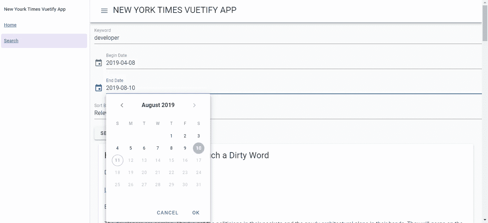
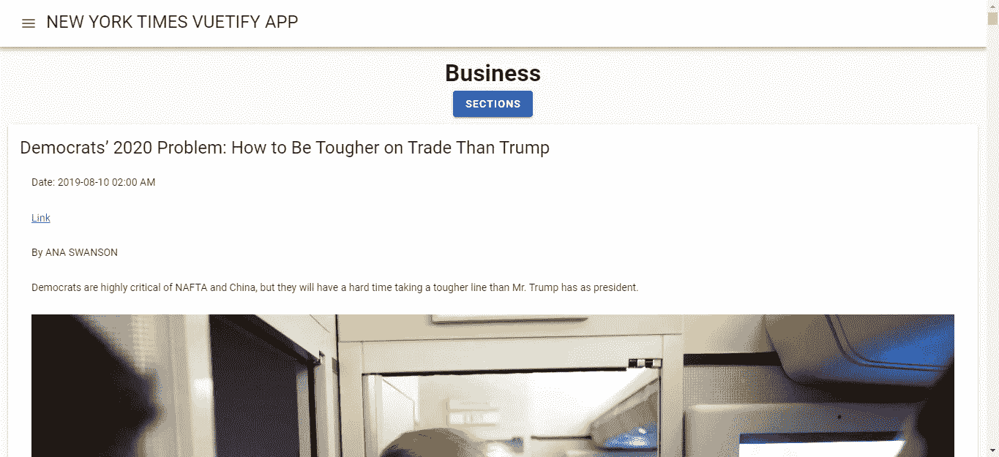
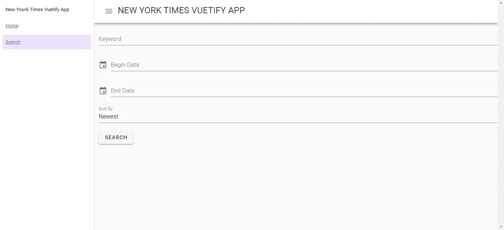

# 如何在 Vue.js 中使用 Vue 化

> 原文：<https://betterprogramming.pub/how-to-use-vuetify-in-vue-js-467f9fd07ecd>

## 构建显示来自纽约时报 API 的数据的应用程序


照片由[斯蒂芬·瓦伦丁](https://unsplash.com/@valentinsteph?utm_source=unsplash&utm_medium=referral&utm_content=creditCopyText)在 [Unsplash](https://unsplash.com/search/photos/new-york-times?utm_source=unsplash&utm_medium=referral&utm_content=creditCopyText) 上拍摄

Vue.js 中对[材质设计](https://material.io/design/)有很大的支持，Vue.js 可用的库之一是 [Vuetify](https://vuetifyjs.com/en/) 。它很容易集成到你的 Vue.js 应用程序中，并且结果吸引了用户的眼球。

在这一部分，我们将构建一个显示来自纽约时报 API 的数据的应用程序。你可以在[https://developer.nytimes.com/](https://developer.nytimes.com/)注册一个 API 密匙。之后，我们可以开始构建应用程序。

要开始构建应用程序，我们必须安装 Vue CLI。我们通过运行以下命令来实现这一点:

```
npm install -g @vue/cli
```

运行 Vue CLI 需要 Node.js 8.9 或更高版本。我没能让 Vue CLI 在 Windows 版本的 Node.js 上运行，Ubuntu 帮我运行 Vue CLI 没有问题。

然后，我们运行:

```
vue create vuetify-nyt-app
```

创建项目文件夹并创建文件。在向导中，我们不使用默认选项，而是选择“手动选择功能”。我们通过按空格键从选项列表中选择 [Babel](https://babeljs.io/) 、 [Router](https://router.vuejs.org/) 和 [Vuex](https://vuex.vuejs.org/) 。如果它们是绿色的，就意味着它们被选中了。

现在我们需要安装一些库。我们需要安装一个 HTTP 客户端，一个用于格式化日期的库，一个用于从对象生成`GET`查询字符串，另一个用于表单验证。

此外，我们需要安装 [Vue 素材](https://vuematerial.io/)库本身。我们通过运行以下命令来实现这一点:

```
npm i axios moment querystring vee-validate
```

`axios`是我们的 HTTP 客户端，`moment`是操纵日期，`querystring`是从对象生成查询字符串，`vee-validate`是 Vue.js 做验证的附加包。

然后，我们必须添加`vuetify`的样板文件。我们通过运行`vue add vuetify`来做到这一点。这会将库和对它的引用添加到我们的应用程序中，添加到代码中相应的位置。

现在我们已经安装了所有的库，我们可以开始构建我们的应用程序了。

首先，我们创建一些组件。在`views`文件夹中，我们创建了`Home.vue`和`Search.vue`。这些是我们页面的代码文件。然后，创建一个`mixins`文件夹，创建一个文件，名为`nytMixin.js`。

Mixins 是代码片段，可以直接合并到 Vue.js 组件中，就像直接在组件中一样使用。然后，我们添加一些过滤器。

过滤器是从一件事映射到另一件事的 Vue.js 代码。我们创建一个`filters`文件夹并添加`capitalize.js`和`formatDate.js`。

在`components`文件夹中，我们创建一个名为`SearchResults.vue`的文件。`components`文件夹包含不是页面的 Vue.js 组件。

为了使组件之间的数据传递更容易、更有组织，我们使用 Vuex 进行状态管理。因为我们在运行`vue create`时选择了 Vuex，所以在我们的项目文件夹中应该有一个`store.js`。如果没有，就创建它。

在`store.js`中，我们输入:

```
import Vue from 'vue'
import Vuex from 'vuex'Vue.use(Vuex)export default new Vuex.Store({
  state: {
    searchResults: []
  },
  mutations: {
    setSearchResults(state, payload) {
      state.searchResults = payload;
    }
  },
  actions: {}
})
```

`state`对象是存储状态的地方。对象是我们可以操纵状态的地方。

当我们在代码中调用`this.$store.commit(“setSearchResults”, searchResults)`时，假设`searchResults`被定义，`state.searchResults`将被设置为`searchResults`。

然后我们可以使用`this.$store.state.searchResults`得到结果。

我们需要添加一些样板代码到我们的应用程序中。首先，我们添加我们的过滤器。在`capitalize.js`中，我们把:

```
export const capitalize = (str) => {
    if (typeof str == 'string') {
        if (str == 'realestate') {
            return 'Real Estate';
        }
        if (str == 'sundayreview') {
            return 'Sunday Review';
        }if (str == 'tmagazine') {
            return 'T Magazine';
        }
        return `${str[0].toUpperCase()}${str.slice(1)}`;
    }
}
```

这允许我们将纽约时报的版块名称大写，列在[纽约时报开发者页面](https://developer.nytimes.com/docs/top-stories-product/1/routes/%7Bsection%7D.json/get)中。然后，在`formatDate.js`中，我们放入:

```
import * as moment from 'moment';export const formatDate = (date) => {
    if (date) {
        return moment(date).format('YYYY-MM-DD hh:mm A');
    }
}
```

把我们的约会格式化成人类可读的格式。

在`main.js`中，我们把:

```
import Vue from 'vue'
import App from './App.vue'
import router from './router'
import store from './store'
import { formatDate } from './filters/formatDate';
import { capitalize } from './filters/capitalize';
import VeeValidate from 'vee-validate';
import Vuetify from 'vuetify/lib'
import vuetify from './plugins/vuetify';
import '[@mdi/font](http://twitter.com/mdi/font)/css/materialdesignicons.css'Vue.config.productionTip = false;Vue.use(VeeValidate);
Vue.use(Vuetify);
Vue.filter('formatDate', formatDate);
Vue.filter('capitalize', capitalize);new Vue({
  router,
  store,
  vuetify,
  render: h => h(App)
}).$mount('#app')
```

注意，在上面的文件中，我们必须通过调用 Vue.js 上的`Vue.use`来注册我们使用的库，以便它们可以在我们的应用程序模板中使用。

我们在过滤器函数上调用`Vue.filter`,这样我们就可以在模板中使用它们，方法是在变量的右边添加一个管道和过滤器名称。

然后，在`router.js`中，我们把:

```
import Vue from 'vue'
import Router from 'vue-router'
import Home from './views/Home.vue';
import Search from './views/Search.vue';Vue.use(Router)export default new Router({
  mode: 'history',
  base: process.env.BASE_URL,
  routes: [
    {
      path: '/',
      name: 'home',
      component: Home
    },
    {
      path: '/search',
      name: 'search',
      component: Search
    }
  ]
})
```

这样，当我们输入列出的 URL 时，就可以进入页面。

`mode: ‘history’`意味着在基本 URL 和我们的路线之间不会有散列符号。

如果我们部署我们的应用程序，我们需要配置我们的 web 服务器，以便所有的请求都将被重定向到`index.html`，这样我们在重新加载应用程序时就不会出错。

例如，在 Apache 中，我们做到了:

```
<IfModule mod_rewrite.c>
  RewriteEngine On
  RewriteBase /
  RewriteRule ^index\.html$ - [L]
  RewriteCond %{REQUEST_FILENAME} !-f
  RewriteCond %{REQUEST_FILENAME} !-d
  RewriteRule . /index.html [L]
</IfModule>
```

并且，在 [NGINX](https://www.nginx.com/) 中，我们把:

```
location / {
  try_files $uri $uri/ /index.html;
}
```

请参阅您的 web 服务器文档，了解如何在您的 web 服务器上做同样的事情。

现在，我们为组件编写代码。在`SearchResult.vue`中，我们输入:

```
<template>
  <v-container>
    <v-card v-for="s in searchResults" :key="s.id" class="mx-auto">
      <v-card-title>{{s.headline.main}}</v-card-title><v-list-item>
        <v-list-item-content>Date: {{s.pub_date | formatDate}}</v-list-item-content>
      </v-list-item>
      <v-list-item>
        <v-list-item-content>
          <a :href="s.web_url">Link</a>
        </v-list-item-content>
      </v-list-item>
      <v-list-item v-if="s.byline.original">
        <v-list-item-content>{{s.byline.original}}</v-list-item-content>
      </v-list-item>
      <v-list-item>
        <v-list-item-content>{{s.lead_paragraph}}</v-list-item-content>
      </v-list-item>
      <v-list-item>
        <v-list-item-content>{{s.snippet}}</v-list-item-content>
      </v-list-item>
    </v-card>
  </v-container>
</template><script>
export default {
  computed: {
    searchResults() {
      return this.$store.state.searchResults;
    }
  }
};
</script><style scoped>
.title {
  margin: 0 15px !important;
}#search-results {
  margin: 0 auto;
  width: 95vw;
}
</style>
```

这是从 Vuex 商店获取我们的搜索结果并显示它们的地方。

我们在应用程序的`computed`属性的函数中返回`this.$store.state.searchResults`，这样当商店的`searchResults`状态更新时，搜索结果将自动刷新。

`md-card`是一个卡片小部件，用于在一个框中显示数据。`v-for`用于循环数组条目并显示所有内容。`md-list`是一个列表小部件，用于在页面上整齐地显示列表中的项目。`{{s.pub_date | formatDate}}`是我们应用`formatDate`过滤器的地方。

接下来，我们编写我们的 mixin。我们将在 mixin 中为 HTTP 调用添加代码。

在`nytMixin.js`中，我们输入:

```
const axios = require('axios');
const querystring = require('querystring');
const apiUrl = '[https://api.nytimes.com/svc'](https://api.nytimes.com/svc');
const apikey = 'your api key';export const nytMixin = {
    methods: {
        getArticles(section) {
            return axios.get(`${apiUrl}/topstories/v2/${section}.json?api-key=${apikey}`);
        },searchArticles(data) {
            let params = Object.assign({}, data);
            params['api-key'] = apikey;
            Object.keys(params).forEach(key => {
                if (!params[key]) {
                    delete params[key];
                }
            })
            const queryString = querystring.stringify(params);
            return axios.get(`${apiUrl}/search/v2/articlesearch.json?${queryString}`);
        }
    }
}
```

我们返回 HTTP 请求在每个函数中获取文章的承诺。在`searchArticles`函数中，我们将传递给对象的消息传递到一个查询字符串中，我们将该字符串传递到我们的请求中。

确保将应用程序中的 API 键放入`apiKey`常量中，并删除任何未定义的内容，使用:

```
Object.keys(params).forEach(key => {
  if (!params[key]) {
     delete params[key];
  }
})
```

在`Home.vue`中，我们把:

```
<template>
  <div>
    <div class="text-center" id="header">
      <h1>{{selectedSection | capitalize}}</h1>
      <v-spacer></v-spacer>
      <v-menu offset-y>
        <template v-slot:activator="{ on }">
          <v-btn color="primary" dark v-on="on">Sections</v-btn>
        </template>
        <v-list>
          <v-list-item v-for="(s, index) in sections" :key="index" [@click](http://twitter.com/click)="selectSection(s)">
            <v-list-item-title>{{ s | capitalize}}</v-list-item-title>
          </v-list-item>
        </v-list>
      </v-menu>
      <v-spacer></v-spacer>
      <v-spacer></v-spacer>
    </div>
    <v-spacer></v-spacer>
    <v-card v-for="a in articles" :key="a.id" class="mx-auto">
      <v-card-title>{{a.title}}</v-card-title>
      <v-card-text>
        <v-list-item>
          <v-list-item-content>Date: {{a.published_date | formatDate}}</v-list-item-content>
        </v-list-item>
        <v-list-item>
          <v-list-item-content>
            <a :href="a.url">Link</a>
          </v-list-item-content>
        </v-list-item>
        <v-list-item v-if="a.byline">
          <v-list-item-content>{{a.byline}}</v-list-item-content>
        </v-list-item>
        <v-list-item>
          <v-list-item-content>{{a.abstract}}</v-list-item-content>
        </v-list-item>
        <v-list-item>
          <v-list-item-content>
            
          </v-list-item-content>
        </v-list-item>
      </v-card-text>
    </v-card>
  </div>
</template><script>
import { nytMixin } from "../mixins/nytMixin";export default {
  name: "home",
  mixins: [nytMixin],
  computed: {},data() {
    return {
      selectedSection: "home",
      articles: [],
      sections: `arts, automobiles, books, business, fashion, food, health,
    home, insider, magazine, movies, national, nyregion, obituaries,
    opinion, politics, realestate, science, sports, sundayreview,
    technology, theater, tmagazine, travel, upshot, world`
        .replace(/ /g, "")
        .split(",")
    };
  },beforeMount() {
    this.getNewsArticles(this.selectedSection);
  },methods: {
    async getNewsArticles(section) {
      const response = await this.getArticles(section);
      this.articles = response.data.results;
    },selectSection(section) {
      this.selectedSection = section;
      this.getNewsArticles(section);
    }
  }
};
</script><style scoped>
.image {
  width: 100%;
}.title {
  color: rgba(0, 0, 0, 0.87) !important;
  margin: 0 15px !important;
}.md-card {
  width: 95vw;
  margin: 0 auto;
}#header {
  margin-bottom: 10px;
}
</style>
```

该页面组件是我们获取所选部分文章的地方，默认为`home`部分。我们还有一个菜单，可以通过添加以下内容来选择我们想要查看的部分:

```
<v-menu offset-y>
   <template v-slot:activator="{ on }">
     <v-btn color="primary" dark v-on="on">Sections</v-btn>
   </template>
   <v-list>
      <v-list-item v-for="(s, index) in sections" :key="index" [@click](http://twitter.com/click)="selectSection(s)">
        <v-list-item-title>{{ s | capitalize}}</v-list-item-title>
      </v-list-item>
   </v-list>
</v-menu>
```

注意，我们在承诺代码中使用了`async`和`await`关键字，而不是使用`then`。

它要短得多，并且`then`、`await`和`async`之间的功能是等效的。但是，它在 Internet Explorer 中不受支持。在`beforeMount`块中，我们运行`this.getNewsArticles`在页面加载时获取文章。

注意，Vuetify 库广泛使用了 Vue.js 特性的插槽。具有嵌套的元素，如`v-slot`道具，位于:

```
<v-menu offset-y>
  <template v-slot:activator="{ on }">
     <v-btn color="primary" dark v-on="on">Sections</v-btn>
  </template>
  <v-list>
    <v-list-item v-for="(s, index) in sections" :key="index" [@click](http://twitter.com/click)="selectSection(s)">
       <v-list-item-title>{{ s | capitalize}}</v-list-item-title>
     </v-list-item>
  </v-list>
</v-menu>
```

详见 [Vue.js 指南](https://vuejs.org/v2/guide/components-slots.html)。

在`Search.vue`中，我们把:

```
<template>
  <div>
    <form>
      <v-text-field
        v-model="searchData.keyword"
        v-validate="'required'"
        :error-messages="errors.collect('keyword')"
        label="Keyword"
        data-vv-name="keyword"
        required
      ></v-text-field> <v-menu
        ref="menu"
        v-model="toggleBeginDate"
        :close-on-content-click="false"
        transition="scale-transition"
        offset-y
        full-width
        min-width="290px"
      >
        <template v-slot:activator="{ on }">
          <v-text-field
            v-model="searchData.beginDate"
            label="Begin Date"
            prepend-icon="event"
            readonly
            v-on="on"
          ></v-text-field>
        </template>
        <v-date-picker
          v-model="searchData.beginDate"
          no-title
          scrollable
          :max="new Date().toISOString()"
        >
          <v-spacer></v-spacer>
          <v-btn text color="primary" [@click](http://twitter.com/click)="toggleBeginDate = false">Cancel</v-btn>
          <v-btn
            text
            color="primary"
            [@click](http://twitter.com/click)="$refs.menu.save(searchData.beginDate); toggleBeginDate = false"
          >OK</v-btn>
        </v-date-picker>
      </v-menu> <v-menu
        ref="menu"
        v-model="toggleEndDate"
        :close-on-content-click="false"
        transition="scale-transition"
        offset-y
        full-width
        min-width="290px"
      >
        <template v-slot:activator="{ on }">
          <v-text-field
            v-model="searchData.endDate"
            label="End Date"
            prepend-icon="event"
            readonly
            v-on="on"
          ></v-text-field>
        </template>
        <v-date-picker
          v-model="searchData.endDate"
          no-title
          scrollable
          :max="new Date().toISOString()"
        >
          <v-spacer></v-spacer>
          <v-btn text color="primary" [@click](http://twitter.com/click)="toggleEndDate = false">Cancel</v-btn>
          <v-btn
            text
            color="primary"
            [@click](http://twitter.com/click)="$refs.menu.save(searchData.endDate); toggleEndDate = false"
          >OK</v-btn>
        </v-date-picker>
      </v-menu> <v-select
        v-model="searchData.sort"
        :items="sortChoices"
        label="Sort By"
        data-vv-name="sort"
        item-value="value"
        item-text="name"
      >
        <template slot="selection" slot-scope="{ item }">{{ item.name }}</template>
        <template slot="item" slot-scope="{ item }">{{ item.name }}</template>
      </v-select><v-btn class="mr-4" type="submit" [@click](http://twitter.com/click)="search">Search</v-btn>
    </form>
    <SearchResults />
  </div>
</template><script>
import { nytMixin } from "../mixins/nytMixin";
import SearchResults from "@/components/SearchResults.vue";
import * as moment from "moment";
import { capitalize } from "@/filters/capitalize";export default {
  name: "search",
  mixins: [nytMixin],
  components: {
    SearchResults
  },
  computed: {
    isFormDirty() {
      return Object.keys(this.fields).some(key => this.fields[key].dirty);
    }
  },
  data: () => {
    return {
      searchData: {
        sort: "newest"
      },
      disabledDates: date => {
        return +date >= +new Date();
      },
      sortChoices: [
        {
          value: "newest",
          name: "Newest"
        },
        {
          value: "oldest",
          name: "Oldest"
        },
        {
          value: "relevance",
          name: "Relevance"
        }
      ],
      toggleBeginDate: false,
      toggleEndDate: false
    };
  },
  methods: {
    async search(evt) {
      evt.preventDefault();
      if (!this.isFormDirty || this.errors.items.length > 0) {
        return;
      }
      const data = {
        q: this.searchData.keyword,
        begin_date: moment(this.searchData.beginDate).format("YYYYMMDD"),
        end_date: moment(this.searchData.endDate).format("YYYYMMDD"),
        sort: this.searchData.sort
      };
      const response = await this.searchArticles(data);
      this.$store.commit("setSearchResults", response.data.response.docs);
    }
  }
};
</script>
```

这是我们用来搜索文章的表单。我们还有两个日期选择器来标记用户，以设置开始和结束日期。我们只将日期限制在今天和更早，以便搜索查询有意义。

在这个街区:

```
<v-text-field
  v-model="searchData.keyword"
  v-validate="'required'"
  :error-messages="errors.collect('keyword')"
  label="Keyword"
  data-vv-name="keyword"
  required
></v-text-field>
```

我们使用`vee-validate`来检查所需的搜索关键字字段是否已填写。如果不是，它将显示一条错误消息并阻止查询继续进行。

我们还将我们的`SearchResults`组件嵌套到`Search`页面组件中，包括:

```
components: {
  SearchResults
}
```

在模板中的`script`标签和`<SearchResults />`之间。

最后，我们通过在`App.vue`中输入以下内容来添加顶部栏和菜单:

```
<template>
  <v-app>
    <v-navigation-drawer v-model="drawer" app>
      <v-list nav dense>
        <v-list-item-group v-model="group" active-class="deep-purple--text text--accent-4">
          <v-list-item>
            <v-list-item-title>New Yourk Times Vuetify App</v-list-item-title>
          </v-list-item><v-list-item>
            <v-list-item-title>
              <router-link to="/">Home</router-link>
            </v-list-item-title>
          </v-list-item><v-list-item>
            <v-list-item-title>
              <router-link to="/search">Search</router-link>
            </v-list-item-title>
          </v-list-item>
        </v-list-item-group>
      </v-list>
    </v-navigation-drawer><v-app-bar app>
      <v-toolbar-title class="headline text-uppercase">
        <v-app-bar-nav-icon [@click](http://twitter.com/click).stop="drawer = !drawer"></v-app-bar-nav-icon>
        <span>New York Times Vuetify App</span>
      </v-toolbar-title>
      <v-spacer></v-spacer>
    </v-app-bar><v-content>
      <v-container fluid>
        <router-view />
      </v-container>
    </v-content>
  </v-app>
</template><script>
export default {
  name: "app",
  data: () => {
    return {
      showNavigation: false,
      drawer: false,
      group: null
    };
  }
};
</script><style>
.center {
  text-align: center;
}form {
  width: 95vw;
  margin: 0 auto;
}.md-toolbar.md-theme-default {
  background: #009688 !important;
  height: 60px;
}.md-title,
.md-toolbar.md-theme-default .md-icon {
  color: #fff !important;
}
</style>
```

如果你想要一个带有左导航抽屉的顶栏，你必须精确地遵循上面的代码结构。

写完所有代码后，我们有以下代码:

