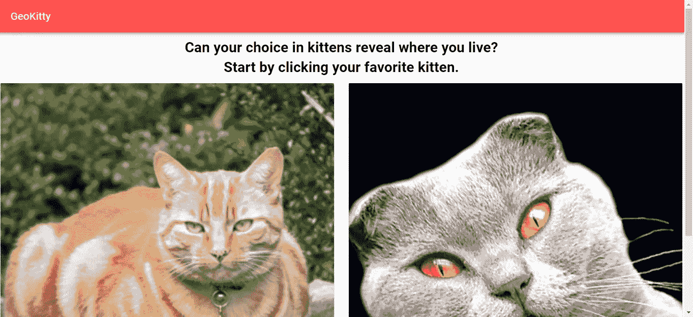
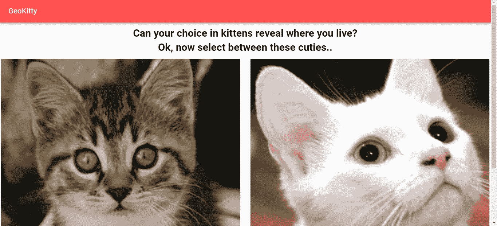
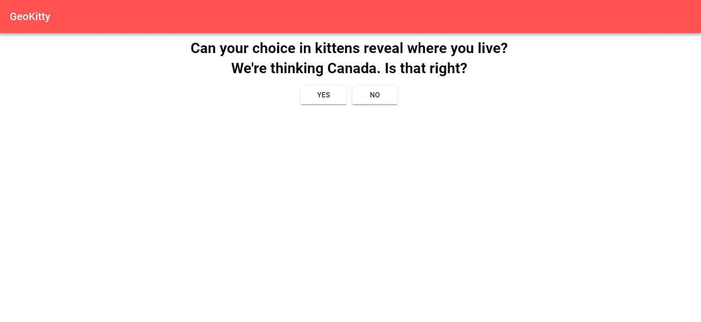
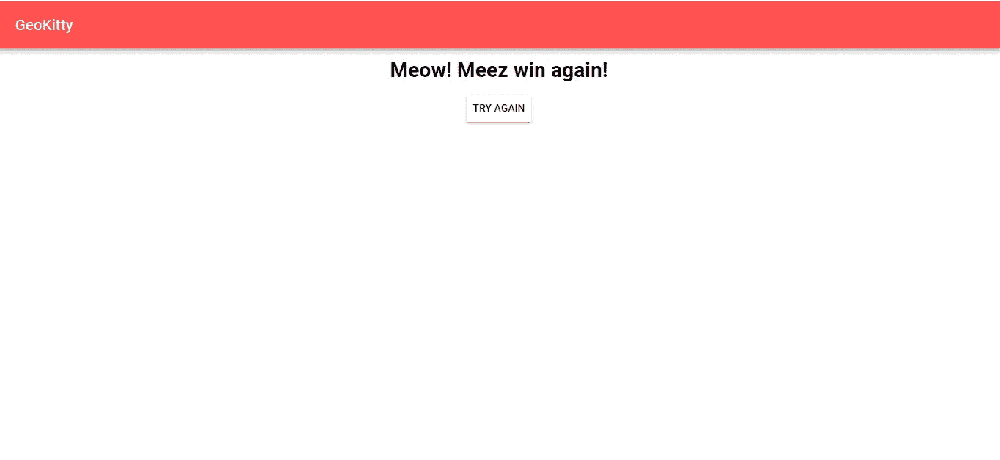

# 如何在 JavaScript 中使用 Vuex 存储状态

> 原文：<https://betterprogramming.pub/how-to-use-vuex-to-store-state-490fabf4f6d7>

## 你对小猫的选择能透露你住在哪里吗？



将数据存储在中央位置对于复杂的前端应用程序至关重要。否则，数据会分散到各处，并且必须在组件之间传递。

如果您使用像 [React](https://reactjs.org/) 、 [Angular](https://angular.io/) 或 [Vue.js](https://vuejs.org/) 这样的框架，这一点尤其重要。这三个框架将应用程序分成组件，如果你想以一种特别的方式共享数据，你必须在它们之间传递数据。

React 在组件之间只有单向绑定，所以只能沿着组件树向下传递数据。在任何情况下，如果你有大量的数据要传递，很快就会变得混乱。

在这一部分，我们将编写一个小游戏，应用程序获取您的当前位置，并向您显示猫的图片。该应用程序会问你问题，你可以通过点击是和否按钮来来回回。

数据存储将跟踪您正在哪个页面，以便您可以向前和向后移动。

我们将使用 [Vuex](https://vuex.vuejs.org/) 来存储应用程序的中央状态。它是 Vue.js 应用程序最流行的状态管理库，由 Vue.js 开发人员自己提供支持。

# 入门指南

首先，我们需要安装 Vue CLI 来简化应用程序的构建。它包含一个开发服务器和生成样板代码的脚本。

运行`npm install -g @vue/cli`进行全局安装。

然后，我们运行`vue create geokittyjs`来搭建我们的应用程序。

之后，我们可以运行开发服务器，通过运行`npm run serve`来显示我们的应用程序。当我们更新代码时，它会自动刷新浏览器。

我们通过运行`npm i yuex vue-material vue-router superagent`来安装我们的支持库。

*   [Vue Material](https://vuematerial.io/) 让我们的 app 看起来很好看。
*   Vuex 是状态管理库。
*   [Vue Router](https://router.vuejs.org/) 是路由库，用于将 URL 路由到我们的页面组件。
*   [SuperAgent](https://visionmedia.github.io/superagent/) 是我们将使用的 HTTP 客户端。

# 编码

现在我们准备编码。

首先，我们给`index.html`添加[材质图标](https://material.io/resources/icons/)得到漂亮的图标，就像这样:

```
<link rel="stylesheet" href="//fonts.googleapis.com/css?family=Roboto:400,500,700,400italic|Material+Icons">
```

然后，我们编写应用程序的逻辑部分。我们从一些基本常数开始。我们把它们都放在`src/constants.js`里以便于存取。

在那里，添加:

稍后我们的 API 调用需要它们。

然后，我们创建数据存储来存储我们在`src/store/store.js`中的数据:

这将存储我们所处的应用程序阶段，以便我们知道去哪个页面。上面的代码是状态管理魔法发生的地方。

现在，我们可以创建组件了。我们将创建您将看到的页面。

在`src/components`中，添加一个名为`City.vue`的文件，并放入以下代码:

然后，创建一个名为`Continent.vue`的文件，并添加:

接下来，创建一个名为`Country.vue`的文件并添加:

创建一个名为`Disappoint.vue`的文件，并添加:

然后，创建一个名为`Home.vue`的文件，并:

代码的逻辑如下——我们从第一个 API 调用中获取您的公共 IP 地址，然后，它可以从中获取您的位置数据。

在模板中，我们检查在下面的逻辑中返回的状态，在`computed`属性中:

```
count() {
  return store.state.count;
}
```

每当状态更新时，`count`函数将返回最新值。无论什么是自动更新的，你都可以把它放在`computed`属性中。

在我们创建的`Region.vue`中，添加:

其余部分以类似的方式创建。

我们创建了`WhereCity.vue`、`WhereContinent.vue`、`WhereCountry.vue`、`WhereRegion.vue`和`Win.vue`。

在`WhereCIty.vue`中，我们添加:

在`WhereContinent.vue`中，我们添加:

在`WhereCountry.vue`中，我们添加:

在`WhereRegion.vue`中，我们添加:

最后，在`Win.vue`中，我们加上:

注意，在每个文件中，我们都有一个对`store.commit`的调用。这是状态更新的地方。

在所有文件中，如果模板中引用了图像，您可以将同名的猫图片添加到模板中引用的文件夹中。

然后，在`src/router/index.js`中，我们注册我们的组件和库，这样我们就可以在应用的其他部分使用它们，就像这样:

最后，我们得到这样的东西:

