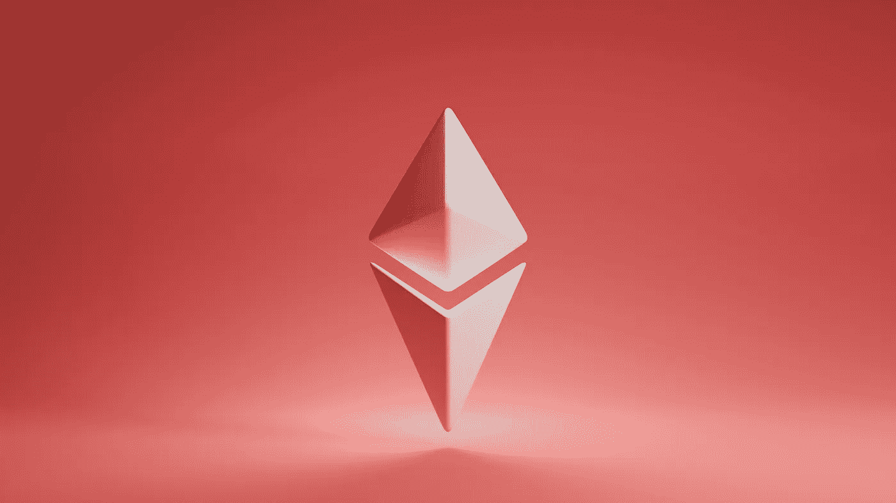
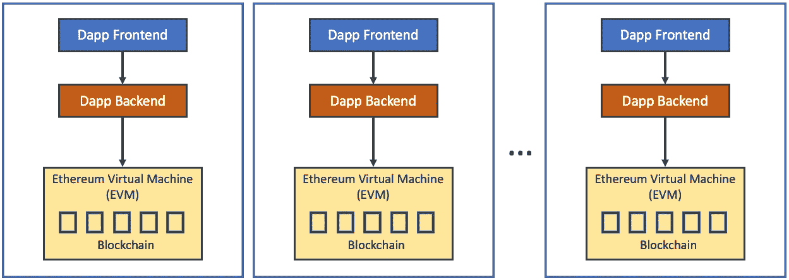
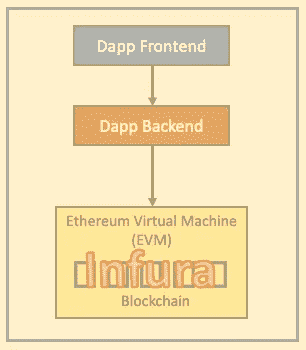
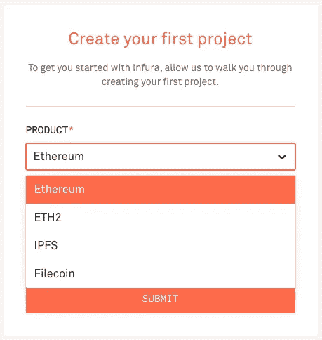
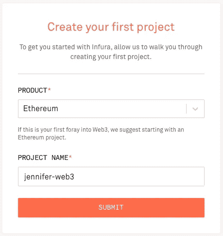
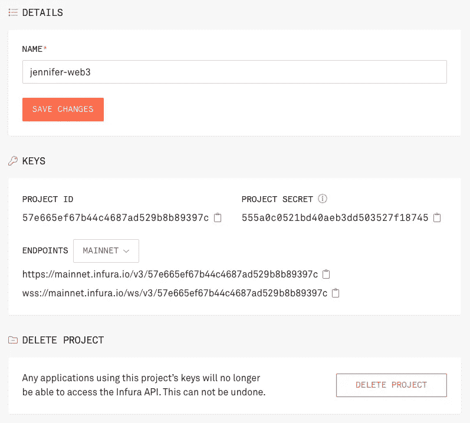
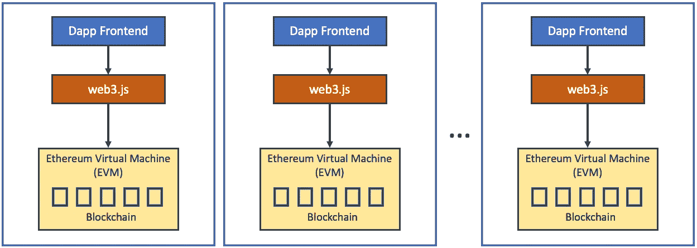
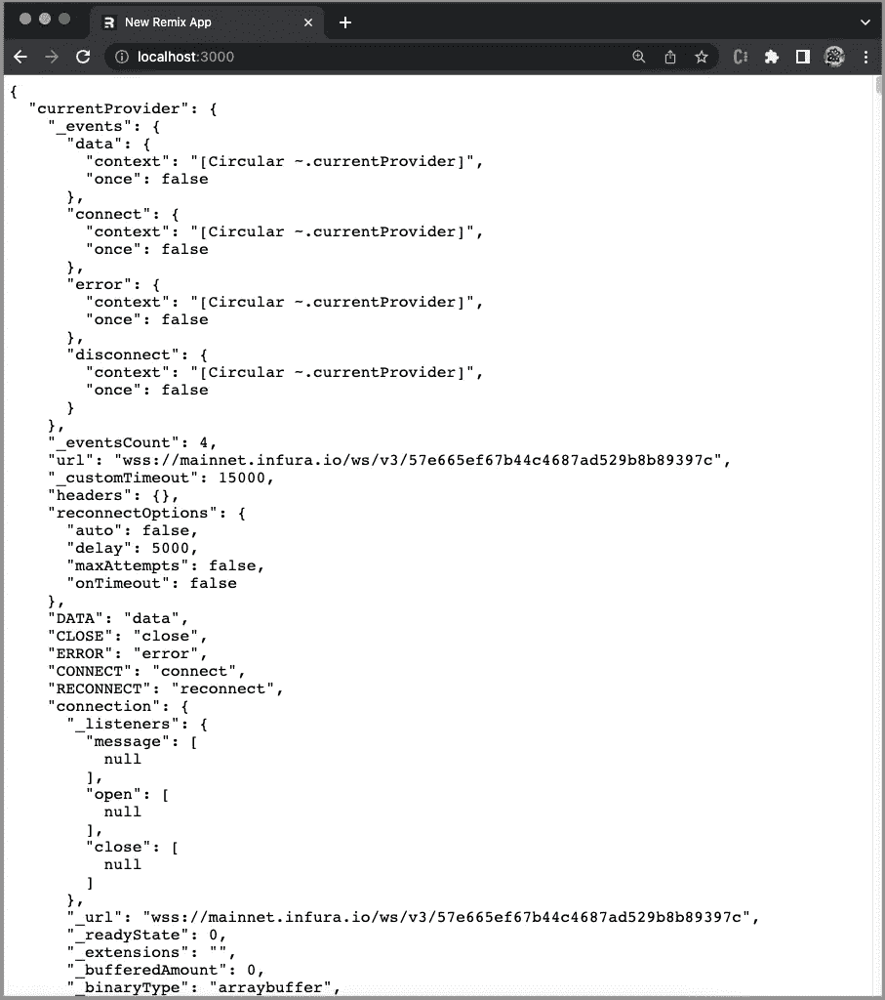
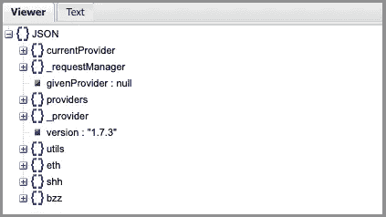

# 如何使用 Web3.js 与 Remix 中的以太坊虚拟机进行交互

> 原文：<https://betterprogramming.pub/how-to-use-web3-js-to-interact-with-the-ethereum-virtual-machine-in-remix-f4923b18e707>

## 浏览 Web 1.0、Web 2.0、Web 3.0、Web 3 的演变，并使用 Web 3 . js。JavaScript 为区块链做好准备了吗？



由 [Unsplash](https://unsplash.com/@theshubhamdhage?utm_source=unsplash&utm_medium=referral&utm_content=creditCopyText) 上的 [Shubham Dhage](https://unsplash.com/@theshubhamdhage?utm_source=unsplash&utm_medium=referral&utm_content=creditCopyText) 拍摄的照片

# Web 1.0

这个术语， *Web 1.0* ，是蒂姆·伯纳斯·李在 1989 年创造的。它被视为第一代万维网，存在于 1991-2004 年期间。

在这个时间段，大部分网站都是静态网页，绝大多数用户都是内容的消费者，而不是生产者。页面是用服务器端包含或公共网关接口(CGI)构建的。框架和表格用于在页面上定位和对齐元素。

# Web 2.0

Darcy DiNucci 在 1999 年创造了 Web 2.0 这个术语，后来 Tim O'Reilly 和 Dale Dougherty 在 2004 年 10 月的第一届 O'Reilly Media Web 2.0 会议上推广了这个术语。

Web 2.0 是指强调用户生成内容、可用性和最终用户互操作性的全球网站。它以上传到论坛、社交媒体和网络服务、博客和维基的用户创建的内容为中心。Web 2.0 始于 2004 年，延续至今。web 浏览器技术被广泛采用，包括 AJAX 和 JavaScript 框架。数据通常采用 XML 或 JSON 格式。

# Web 3.0

在 2006 年，*语义网*被描述为 *Web 3.0* 的一个组件。这个术语是蒂姆·伯纳斯·李创造的。这是一种有效的方式来表示 web 上的数据，或者以机器可理解的方式表示与 Web 上的文档内容全局链接的数据库。

# Web3

*Web3* ，也被称为 Web3.0，或 Web 3，通常指的是基于区块链技术的万维网的新版本，涵盖了比特币和以太坊等加密货币使用的共享账本系统。

Web3 这个术语是由 Polkadot 创始人兼以太坊联合创始人 Gavin Wood 在 2014 年创造的。它是一种新的互联网服务，融合了去中心化和基于令牌的经济学等概念。这个想法在 2021 年引起了加密货币爱好者、大型科技公司和风险投资公司的兴趣。

Chris Dixon 定义说，Web3 是由建设者和用户拥有的互联网，用令牌编排。

Web 1.0 和 Web 2.0 建立在集中式平台之上。Web3 实现了数字资产的点对点传输，无需任何中介，预计将与互联网一样具有影响力。

# 区块链

一个*区块链*是一个公共数据库，它在网络中的许多计算机之间被更新和共享。*块*是指存储在连续组中的数据和状态。*链*指的是每个块加密引用其父块的事实。即块被链接在一起。

在以太坊宇宙中，有一台单一的、规范的计算机(即*以太坊虚拟机*，或 EVM)，它的状态是以太坊网络上每个人都同意的。 *Mainnet* 是区块链生产的初级公共以太坊。

*节点*是存储 EVM 状态的真实机器。它们确保与区块链交互的每个人都拥有相同的数据。为了完成这个分布式协议，区块链需要一个共识机制。

任何人想要在链条上添加一个新的区块，都必须解决一个需要大量计算能力的难题，这就是所谓的*挖掘*。挖掘是典型的暴力试错法，但成功添加一个块会在以太坊的本地加密货币 ETH 中获得奖励。

*智能合同*是一个在 EVM 州发布的程序，由网络用户在向网络付费的情况下执行。智能合约是应用程序和服务，如市场、金融工具、游戏等。它们通常被称为去中心化应用(dapps)。

dapp 的后端代码运行在一个分散的对等网络上。它可以用任何语言编写前端代码/用户界面来调用后端。



作者图片

# Infura

Infura 提供了工具和基础设施，允许开发者轻松地将他们的区块链应用从测试阶段部署到大规模部署阶段。它的 EVM 对等物现在在乐观的以太坊主网上运行。



作者图片

Infura 提供对以太坊 API 的免费访问，并允许多达 3 个项目。我们用`Ethereum`、`ETH2`、`IPFS`和`Filecoin`中的`Ethereum`创建我们的第一个项目。



作者图片

命名项目，`jennifer-web3`。



作者图片

提交之后，我们得到项目 ID。基于项目 ID，我们有两个 mainnet 端点，一个用于`HTTPS`(超文本传输协议安全)，一个用于`WSS` ( [WebSocket](/managing-and-analyzing-websockets-c0a051a3dec1#853e-79eeec6509f2) 安全)。这两个地址以`<network>.infura.io/v3/<PROJECT-ID>`的格式命名。



作者图片

Infura 是一个构建分散应用程序的服务提供商。它不需要同步，这对于分散的对等网络来说通常需要很长时间。以太坊节点的设置也很简单。因此，它是开发 dapps 的一个很好的基础设施。

# web3.js

[*web3.js*](https://github.com/ChainSafe/web3.js) 是一个 JavaScript 库的集合，使用 HTTP、IPC 或 WebSocket 与本地或远程以太坊节点进行交互。它是由以太坊基金会开发和维护的，它很好地服务于 dapp 后端。



作者图片

Remix 是一个全栈 React 框架，拥有前端用户界面和后端服务器。我们已经写了一篇关于[Remix 如何工作以及客户端/服务器文件夹和文件如何构建的文章](/end-to-end-guide-to-remix-a-full-stack-web-framework-8dc56eb6a9c7)。在这里，我们使用 Remix 作为工作环境来探索 web3.js。

创建一个混音项目:

```
% npx create-remix my-remix-app
% cd my-remix-app
```

设置`web3`，以及两个 JSON 包:

```
npm i web3 json-stringify-safe react-json-pretty
```

这些包成为`package.json`中`[dependencies](/package-jsons-dependencies-in-depth-a1f0637a3129)`的一部分:

在 Remix 中，`app/entry.server.jsx`是请求到达服务器时运行的第一个 JavaScript。Remix 只加载必要的数据，但是开发人员需要处理响应。该文件将 React 应用程序呈现为一个字符串/流，作为响应发送给客户端。

下面是改装过的`app/entry.server.jsx`:

在第 3 行，`web3`被导入为`Web3`，用于构造第 5 行的`web3`实例。这个实例使用 WebSocket 端点连接到 Infura。

`app/routes/index.jsx`是默认调用的索引路由。这个文件被修改以显示`web3`实例的内容和一些有用的方法:

在第 2 行，从`json-stringify-safe`导入`stringify`方法，[解决了循环引用问题](/exploring-json-json5-and-circular-references-2b5b0c5de532)。该方法用于第 32 行。

在第 3 行，`react-json-pretty`被导入为`JSONPretty`，美化了 JSON 数据。该组件用于第 37 行。

在第 4 行，`web3`实例是从`app/entry.server.jsx`导入的。

`loader`函数(第 6–33 行)是一个特殊的 API。它被导出以便在渲染之前在服务器上调用。它从`web3`实例中获取数据。在第 8–31 行，调用了许多`web3.eth`的 get 方法来查询实例状态，这些方法显示在执行控制台上。

在第 32 行，用序列化的`web3`对象解析`loader`函数。

在第 36 行，调用`useLoaderData`来检索加载的数据`result`。

在第 37 行，`JSONPretty`在浏览器上显示`result`。

通过`npm run dev`执行 Remix app，进入浏览器窗口。我们看到一长串的`web3`对象。



作者图片

通过`[http://jsonviewer.stack.hu/](http://jsonviewer.stack.hu/)`折叠`web3`对象:



作者图片

它显示了第一级模块:

*   `web3.eth`:用于与以太坊网络交互。
*   `web3.shh`:用于与耳语协议交互。
*   `web3.bzz`:用于与 swarm 网络交互。

`web3.eth`包括以下 get 方法来检索以太坊状态/数据:

*   `getAccounts`
*   `getBalance`
*   `getBlock`
*   `getBlockNumber`
*   `getBlockTransactionCount`
*   `getBlockUncleCount`
*   `getChainId`
*   `getCode`
*   `getCoinBase`
*   `getFeeHistory`
*   `getGasPrice`
*   `getHashrate`
*   `getNodeInfo`
*   `getPastLogs`
*   `getPendingTransactions`
*   `getProof`
*   `getProtocolVersion`
*   `getStorageAt`
*   `getTransaction`
*   `getTransactionCount`
*   `getTransactionFromBlock`
*   `getTransactionReceipt`
*   `getUncle`
*   `getWork`

通过 API 名称，我们可以猜测其功能。但是，`Uncle`是什么意思呢？

在区块链，当两个区块差不多同时开采并送到分类账时，工作证明份额较高的区块被接受并进入分类账。另一个被拒绝了，成了大叔的拦路虎。

还有操纵状态/数据的方法:

*   `estimateGas`
*   `isMining`
*   `isSyncing`
*   `requestAccounts`
*   `sendSignedTransaction`
*   `sendTransaction`
*   `setProvider`
*   `sign`
*   `signTransaction`
*   `submitWork`
*   `subscribe`

令人惊讶的是，我们可以使用 web3.js 在本地或远程以太坊节点上进行操作。

# 结论

我们已经走过了 Web 1.0、Web 2.0、Web 3.0 和 Web 3 的发展历程。在 Remix 工作环境中，我们已经展示了如何使用 web3.js 通过 Infura 与以太坊虚拟机进行交互。

事实上，我们可以使用 JavaScript 来操纵区块链。随着 Web3 呈指数级增长，我们迫不及待地想看到 JavaScript 将如何继续塑造互联网的未来。

感谢阅读。我希望这有所帮助。如果你有兴趣，可以看看[我的其他媒体文章](https://jenniferfubook.medium.com/jennifer-fus-web-development-publications-1a887e4454af)。