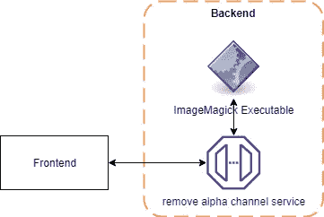

# 如何使用 WebAssembly 在没有服务器的情况下转换图像

> 原文：<https://betterprogramming.pub/how-to-use-webassembly-to-transform-images-without-a-server-39db1a6e8c5>

## 一个实用而现实的 WebAssembly 用例


照片由 [Unsplash](https://unsplash.com/s/photos/image?utm_source=unsplash&utm_medium=referral&utm_content=creditCopyText) 上的 [Jatniel Tunon](https://unsplash.com/@tosshio?utm_source=unsplash&utm_medium=referral&utm_content=creditCopyText) 拍摄

如果你经常阅读科技博客，你可能已经接触过[网络组装](https://webassembly.org/) (Wasm)以及围绕它的大肆宣传。

简而言之，WebAssembly 是一个可以由 web 浏览器执行的字节代码，这意味着用任何语言编写的应用程序都可以编译成 WebAssembly，然后在您的浏览器中执行。

大肆宣传带来了许多高质量的文章和演讲，展示了用例及优势，比如用 C++完全编码你的 GUI 。

让你的应用程序进入 Google Play 是一件容易的事情，但是苹果的应用程序商店让事情变得有点困难。在许多要求中，你的应用程序图标图像不能有 alpha 通道。即使所述阿尔法通道未被使用。

现在，删除 alpha 通道不是火箭科学，只需几分钟，使用 [ImageMagick](https://www.imagemagick.org/) (用 C++编写)可以通过一个简单的命令行程序实现:

```
magick convert icon.png -background white -alpha off new-icon.png
```

那么，如果我们想创建一个网站，我们可以提供我们的图像，并自动删除所有阿尔法通道？典型的架构可能是这样的:



这里的一个问题是，一旦用户离线，我们的 web 应用程序将不再有用。此外，ImageMagick 必须安装在后端服务器上，客户端需要使用一个端点，因此需要将所有图像上传到服务器。

虽然这不是一个大问题，并且对于处理图像操作的 web 应用程序来说是典型的，但是使用 Wasm，我们可以做得更好！

我们的目标是创建一个[渐进式网络应用](https://developer.mozilla.org/en-US/docs/Web/Progressive_web_apps)，它在没有活跃的互联网连接的情况下也是有用的(当然是在加载网站至少一次之后)。如果我们的图像操作发生在服务器上，这是不可能的，所以让我们来看看我们简化的架构:


对，就是这样。我们将所有的逻辑放在前端(人们可能会倾向于使用术语“无服务器”，遗憾的是，这个词是为完全不同的东西保留的)，没有图像被上传到任何服务器。

但是我们不会使用任何 JavaScript 图像操作库，相反，我们希望使用 ImageMagick，这是我们已经知道并喜欢的。但是有一个问题，它是一个可执行文件，我们如何将它放入我们的代码库中，以便我们可以从我们的 JS 中执行它？

幸运的是，已经有人[为我们](https://github.com/KnicKnic/WASM-ImageMagick)完成了大部分工作，并将 ImageMagick 代码库重新编译成 WebAssembly，准备在浏览器中使用。通过简单地使用高级 Javascript API，我们现在可以在前端使用 ImageMagick 的全部功能(几乎是)。

为了简单起见，让我们从使用脚本标记导入 ES 模块开始。该封装也可在 [npm](https://www.npmjs.com/package/wasm-imagemagick) 上获得。

我们现在可以在应用程序中使用`window.magick`对象对我们的图像执行 ImageMagick 命令。

我们剩下要做的就是构建我们的 UI，并使用 [WASM-ImageMagick](https://github.com/KnicKnic/WASM-ImageMagick) API 来转换我们的图像，使用的调用本质上与我们在命令行中所做的相同，代码可能看起来像这样:

我们只需将文件名、内容和所需的 ImageMagick 命令传递给导入的`window.magick` 对象，并接收一个没有 alpha 通道的图像。

`ReadFile`方法利用 WASM-ImageMagick 库提供的帮助函数，以合适的结构获取文件名和内容。我们现在在浏览器中有了 ImageMagick 的功能，可能性是无限的。

对于完整的工作示例，包括将处理后的图像作为“下载”发送回用户，请查看[移除 Alpha 通道](https://removealphachannel.com/)。

您可以在您选择的开发工具中访问完整的源代码，毕竟不涉及服务器端代码！

我希望这些简单的用例能让您更好地感受到 WebAssembly 所涵盖的功能和日常用例。感谢阅读。