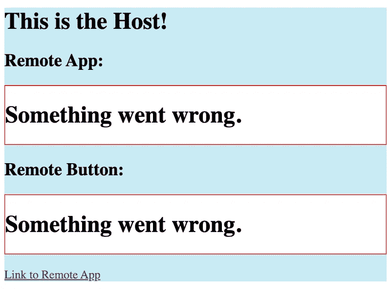
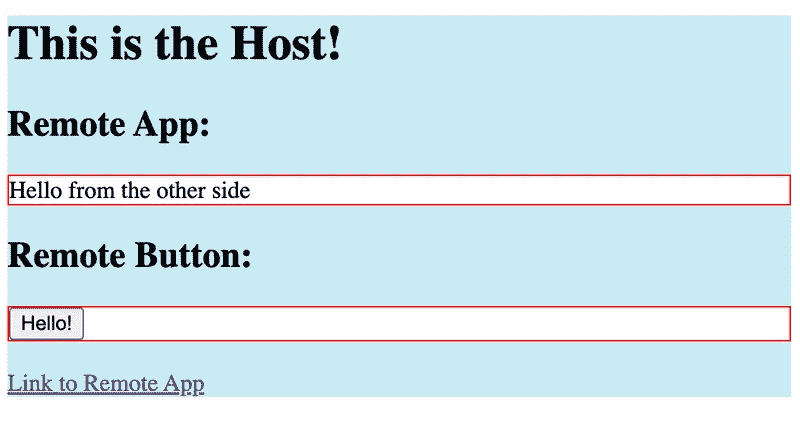

# 如何在 React 中使用 Webpack 模块联邦

> 原文：<https://betterprogramming.pub/how-to-use-webpack-module-federation-in-react-70455086b2b0>

## 轻松构建微前端架构


[Valery Fedotov](https://unsplash.com/@imlst?utm_source=medium&utm_medium=referral) 在 [Unsplash](https://unsplash.com?utm_source=medium&utm_medium=referral) 上拍摄的照片

模块联合是在 React 应用程序中构建微前端架构的优秀工具。我将在一个分步指南中向您展示如何在 React 中构建主机-远程模式微前端。

# 为什么是微前端？

微前端帮助我们将大型前端应用程序分解成更小的独立应用程序或模块，可以按照它们的节奏进行构建和部署。

使用模块联合实现这一点允许我们在运行时在客户端的浏览器中组合应用程序，并消除构建时的依赖性和协调，从而允许构建这些应用程序的团队进行大规模开发。

# 入门指南

你可以在这里找到最终的代码:[https://github.com/rautio/react-micro-frontend-example](https://github.com/rautio/react-micro-frontend-example)

我们正在构建两个应用程序:`host`和`remote`。

`host`应用是“主”应用，`remote`是插入其中的子应用。

模块联合确实支持将`host`视为远程，并且如果适合您的用例，还支持对等架构。稍后将详细介绍。

我们将使用`create-react-app`来简化初始步骤。

在您的根目录中:

```
npx create-react-app hostnpx create-react-app remote
```

这将为您创建两个应用程序:

```
host/remote/
```

# 属国

在每次`host/`和`remote/`运行中:

```
npm install --save-dev webpack webpack-cli html-webpack-plugin webpack-dev-server babel-loader
```

这将安装我们的 webpack 配置所需的 wepback 和依赖项。

Webpack 模块联合仅在 webpack 版本 5 及更高版本中可用。

# 主机应用程序

我们将从我们的 webpack 配置开始

在`host/`的根目录下创建一个新的`webpack.config.js`文件:

这是一个基本的 webpack 示例，使用`babel-loader`传输我们的`js`和`jsx`代码，并将其注入到`html`模板中。

# 更新 package.json 脚本

接下来，我们需要一个新的`start`脚本来利用我们的 webpack 配置:

现在我们可以进入主机应用程序的核心部分了。

# 索引. js

首先，我们需要应用程序的`index.js`入口。我们正在导入另一个呈现 React 应用程序的文件`bootstrap.js`。

我们需要这个额外的间接层，因为它给了 Webpack 一个机会来加载渲染远程应用程序所需的所有导入。

否则，您会看到类似以下内容的错误:

`Shared module is not available for eager consumption`

# 引导程序. js

接下来，我们定义呈现 React 应用程序的`bootstrap.js`文件。

# App.js

现在我们准备在应用程序的主要逻辑发生的地方编写我们的`App.js`文件。这里我们将从`remote`加载两个组件，我们将在后面定义。

`import("Remote/App")`将动态获取远程应用的`App.js` React 组件。

我们需要使用一个惰性加载器和一个 [ErrorBoundary](https://reactjs.org/docs/error-boundaries.html) 组件来为用户创建一个流畅的体验，以防抓取花费很长时间或在我们的主机应用程序中引入错误。

# 添加模块联盟

我们还没有准备好运行应用程序。接下来，我们需要添加模块联合来告诉我们的`host`从哪里获得`Remote/App`和`Remote/Button`组件。

在我们的`webpack.config.js`中我们介绍了`ModuleFederationPlugin`:

需要注意的重要事项:

*   `name`用于区分模块。它在这里并不重要，因为我们没有暴露任何东西，但它在`Remote`应用中至关重要。
*   `remotes`是我们定义希望在该应用中使用的联合模块的地方。你会注意到我们将`Remote`指定为内部名称，所以我们可以使用`import("Remote/<component>")`加载组件。但是我们也定义了存放遥控器模块定义的位置:`Remote@http://localhost:4000/moduleEntry.js`。这个 URL 告诉我们三件重要的事情。模块名为`Remote`，托管在`localhost:4000`，其模块定义为`moduleEntry.js`。
*   我们如何在模块之间共享依赖关系。这对 React 非常重要，因为它有一个全局状态，这意味着在任何给定的应用程序中，您应该只运行 React 和 ReactDOM 的一个实例。为了在我们的架构中实现这一点，我们告诉 webpack 将 React 和 ReactDOM 视为单例，因此从任何模块加载的第一个版本将用于整个应用程序。只要满足我们定义的`requiredVersion`即可。我们还从`package.json`导入了我们所有的其他依赖项，并将它们包含在这里，因此我们最小化了模块间重复依赖项的数量。

现在，如果我们在主机应用程序中运行`npm start`，我们应该会看到类似这样的内容:



这意味着我们的`host`应用已经配置好了，但是我们的`remote`应用还没有暴露任何东西。所以我们接下来需要配置它。

# 远程应用

让我们从`webpack`配置开始。既然我们现在对模块联合有了一些了解，让我们从一开始就使用它:

需要注意的重要事项是:

*   我们的 webpack 开发服务器在`localhost:4000`运行
*   远程模块的名称是`Remote`
*   `filename`是`moduleEntry.js`

结合这些将允许我们的主机在`Remote@http://localhost:4000/moduleEntry.js`找到远程代码

`exposes`是我们定义想要在`moduleEntry.js`文件中共享的代码的地方。这里我们曝光两个:`<App />`和`<Button />`。

现在让我们设置这些组件和我们的远程应用程序，以便它可以独立运行。

# 索引. js

与主机应用程序类似，我们需要在 webpack 条目中进行动态导入。

# 引导程序. js

# App.js

远程应用程序比主机简单得多:

# Button.js

而且我们还想曝光一个`<Button /> component`

现在远程应用程序已经完全配置好了，如果你运行`npm start`，你会看到一个空白页，上面写着“你好，来自另一边”

# 把所有的放在一起

现在，如果我们在`host/`和`remote/`目录中运行`npm start`，我们应该看到主机应用程序在`localhost:3000`上运行，远程应用程序在`localhost:4000`上运行。

主机应用程序看起来会像这样:



恭喜你！现在，您已经使用 React 配置了一个微前端应用程序。

# 发展

您可以通过在根级别配置 yarn 工作区来简化开发流程:[https://classic.yarnpkg.com/lang/en/docs/workspaces/](https://classic.yarnpkg.com/lang/en/docs/workspaces/)

# 部署

我们只讨论了在本地运行微前端。如果您想要部署它们，您可以将每个应用程序分别部署到它们的 CDN 或托管服务，并配置 webpack 定义以使用环境变量或其他方式来更新`ModuleFederationPlugin`定义中的 URL。

你可以在我更高级的示例应用中找到这样的例子:[https://github.com/rautio/micro-frontend-demo](https://github.com/rautio/micro-frontend-demo)

如果你喜欢这篇文章，请在 Medium 上关注我，了解更多关于微前端和 Webpack 模块联盟的故事。

# 资源

此示例的代码:

[](https://github.com/rautio/react-micro-frontend-example) [## 示例:在微前端中使用 react 的简单示例…

### 在主机-远程微前端模式中使用 React 与 Webpack 模块联合的示例运行以下命令…

github.com](https://github.com/rautio/react-micro-frontend-example) 

一个更高级的例子:

[](https://github.com/rautio/micro-frontend-demo) [## GitHub-RAU TiO/micro-frontend-Demo:展示微前端架构的演示报告

### 演示微前端架构设置的示例报告。主主机 App:http://localhost:9001/Products Remote…

github.com](https://github.com/rautio/micro-frontend-demo)