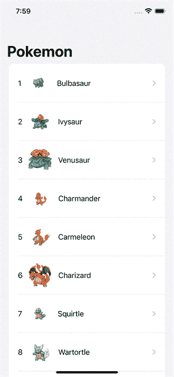
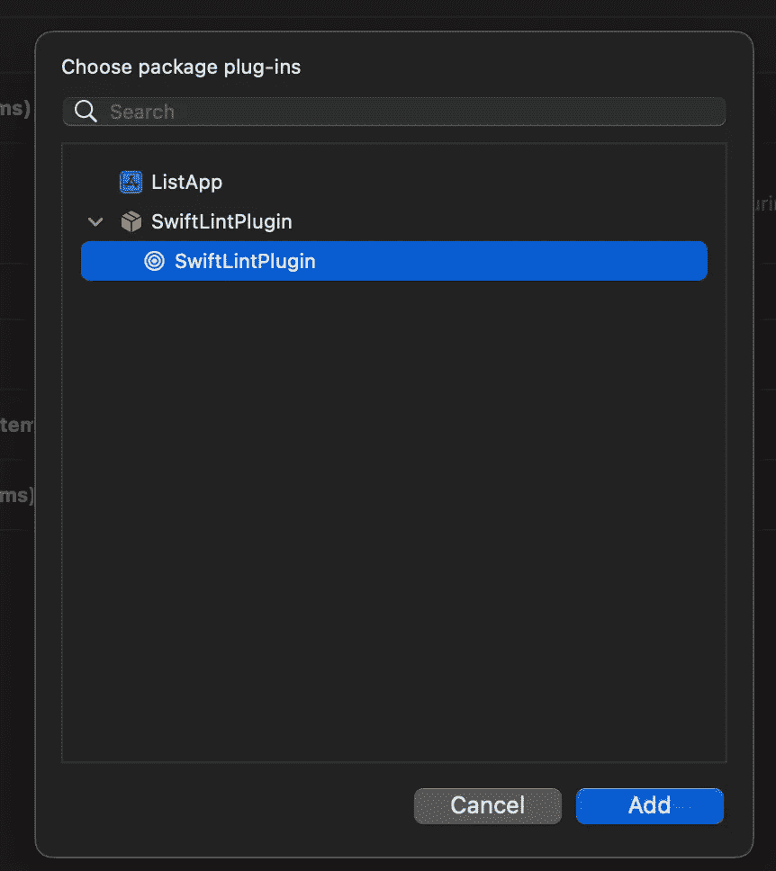
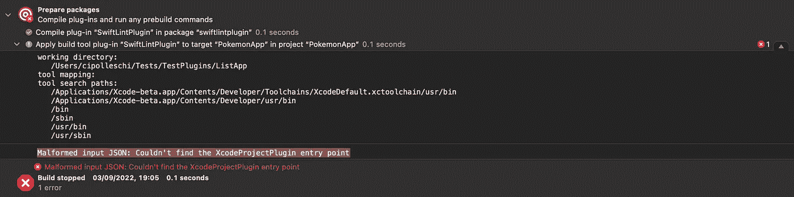
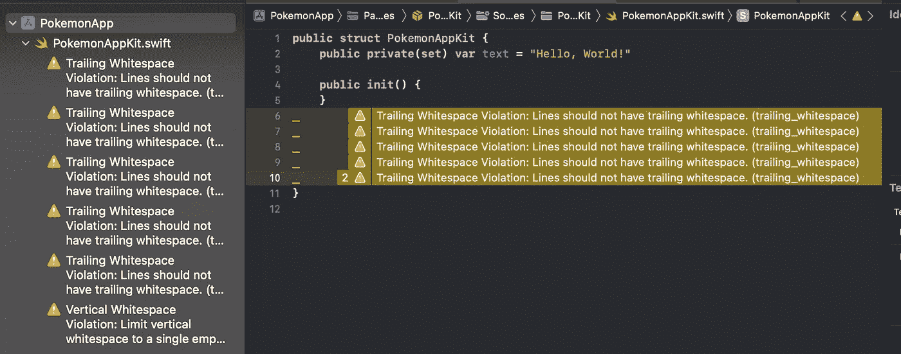
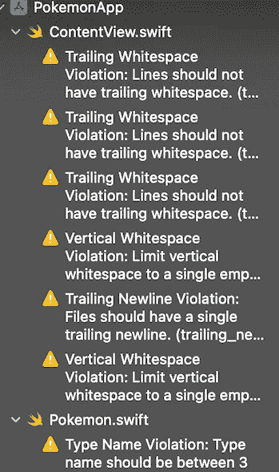

# 如何在您的 iOS 应用程序中使用 Xcode 插件

> 原文：<https://betterprogramming.pub/how-to-use-xcode-plugins-in-your-ios-app-13574261f210>

## **将 Xcode 构建插件应用到您的 iOS 应用程序开发流程中**


汉斯·维维克在 [Unsplash](https://unsplash.com?utm_source=medium&utm_medium=referral) 上拍摄的照片

作为一名 iOS 工程师，你工作的最终目标是开发 iOS 应用。今年 6 月，苹果为 Swift Package Manager 提供了一个与 Xcode 集成的新功能:Swift Package plugins。

有关 Swift 软件包插件的更多信息可在以下 WWDC 视频中找到:

*   [认识 Swift 包插件](https://developer.apple.com/videos/play/wwdc2022/110359/)
*   [创建 Swift 包插件](https://developer.apple.com/videos/play/wwdc2022/110401/)

在这些视频中，苹果向我们展示了如何在 Xcode 内外的其他包中使用插件。然而，在你的应用中使用这个插件并不像预期的那样简单。

今天，我想和你分享如何在你的应用中实际使用构建插件，用一个简单的技巧，也可以提高模块化和代码重用。

# **应用程序**

如果你想在一个 app 上应用 Swift 插件，首先，你需要一个 app。

出于本文的考虑，您可以在 Xcode 中创建一个简单的 SwiftUI 应用程序。该应用程序包括一个口袋妖怪列表和一些口袋妖怪细节的导航。代码可能如下所示:

这是应用程序的入口点，标有`@main`注释。您定义数据模型(示例中的`Pokemon`)和`DataLoader`依赖项来返回口袋妖怪列表。

> **注意**:为了举例，您可以使用静态数据列表，如在`App`类型的末尾所定义的。

`ContentView`可以根据需要变得复杂。在本例中，这是一个简单的列表:

代码只包含一个带有一个显示所有口袋妖怪的`List`的`NavigationStack`。当点击口袋妖怪的名字时，应用程序会导航到一个更大的图像和有味道的文本的详细屏幕。



# **外挂**

然后，你需要 Swift 插件。为了简洁起见，你可以重用我上一篇文章中的插件，或者你可以自己创建一个新的插件。

回想一下，编写构建插件的基本步骤是:

1.  创建一个导出`.plugin`产品的`Package.swift`文件。
2.  添加一个具有`.buildTool`能力的`.plugin`类型的目标。
3.  创建一个`@main`结构，为选择的插件实现合适的协议。
4.  实现插件。

`Package.swift`的代码如下:

注意`swift-tools-version`(第一行)需要是`5.7` : Swift 包插件是一个新特性，仅从该版本开始支持。

相反，插件的代码如下:

这里，您导入了 Apple 提供的新的`PluginPackage`框架来实现一个`BuildToolPlugin`协议。该协议要求您实现一个`createBuildCommand(context:target:)`函数，该函数返回一个要在构建过程中执行的`Command`列表。

您返回的命令是一个`prebuildCommand`插件，它在您代码的文件夹中执行`swiftlint`程序。

# **将插件连接到应用程序**

不幸的是，将插件连接到应用程序并不简单。首先，您可能想通过以下方式将 Swift 包作为项目的依赖项添加进来:

1.右键单击项目，

1.选择**添加包…** ，

1.点击**添加本地…** ，

1.选择上一步创建的`SwiftLintPlugin`。

几秒钟后，Xcode 会向您显示项目中的插件，也会构建它，但它不会在您的项目上运行可执行文件。此时，您可以尝试将它作为依赖项添加到**框架、库和嵌入内容**中，但是插件不会出现。

经过一些挖掘和 Xcode 探索，您还可以发现在各个构建阶段中有一个新的**运行构建工具插件**步骤。您可以尝试在这一步添加插件，点击 **+** 按钮并选择插件:



但是，如果您这样做，然后尝试构建应用程序，Xcode 将会导致构建失败，并显示一个错误:

```
Malformed input JSON: Couldn’t find the XcodeProjectPlugin entry point
```



我很确定应该有一个地方可以配置这个 JSON，这样你就可以把 Xcode 引向正确的方向。我尝试在项目和目标级别查看各种构建设置。我试着看了一下`Info.plist`键，但是找不到有用的东西。

如果你能找到我们可以配置插件的地方，请告诉我。

## 变通办法:把你的应用程序打包

我最喜欢的一句话是*需要是发明之母。所以，我发现，如果插件可以在一个包中运行，你也可以把你所有的应用程序放在一个包中，让插件在这个包中运行。*

一旦有了想法，这个过程就是线性的:

*   从你的应用程序中删除`SwiftLintPlugin`。
*   创建一个新包`PokemonAppKit`。您可以使用以下命令来完成:

```
mkdir PokemonAppKit && cd PokemonAppKit 
swift package init --name PokemonAppKit --type library
```

*   按照上一节中的步骤，将新的空包添加到您的`PokemonApp`中。
*   将`PokemonAppKit`库添加到应用程序的**框架、库和嵌入内容**部分。
*   打开`PokemonAppKit`的`Package.swift`文件，添加`SwiftLintPlugin`依赖关系:

这些片段突出显示了您需要应用的更改:

1.  指定包是 iOS 16 的(插件只能应用到那个版本)。
2.  将带有插件的`package`添加到依赖项中。
3.  将`plugin`添加到必须执行它的目标上。

插件现在被配置为在`PokemonAppKit`目标上运行。要验证是否正在运行，请打开`PokemonAppKit.swift`文件，并在文件末尾添加一些新行，然后进行编译。您应该会看到类似这样的内容:



您已经配置了插件，但是新的包是空的。目标是在应用程序代码上运行插件，所以是时候将代码从应用程序移到包中了。在这一步要小心:你需要添加适当的可见性修饰符,因为现在这个应用程序与代码的其余部分在不同的模块中。

移动代码的具体步骤是:

1.  创建一个`Pokemon.swift`文件。代码将类似于:

2.用下面的代码创建一个`DataLoader.swift`文件

3.将`ContentView.swift`从应用程序移动到包中。您需要创建`ContentView`结构`public`，以及`var body: some View`属性和`init`。

4.更新`PokemonApp.swift`文件，添加`import PokemonAppKit`语句。`PokemonApp.swift`文件的最终外观是这样的:

这个文件很薄，逻辑很少。这是应用程序中唯一保留的文件。

如果您现在构建，您应该已经从包中的 Swift 文件看到一些警告。恭喜:你成功地将插件连接到你的应用程序上了！



# 结论

在今天的文章中，您学习了如何将 Swift 软件包插件连接到 iOS 应用程序。没有明确的方法可以直接做到这一点:希望苹果会在 Xcode 14 发布之前发布一些关于它的文档。

你学习如何去做，绕过这个限制。为了实现您的目标，您将应用程序的代码提取到一个单独的包中，并将插件连接到它。

这种方法不仅简化了应用程序的代码:它还推动了更好的模块化和代码重用。一旦你将你的应用打包到 Swift 包中，使用 Vapor 为 macOS 应用、CLI 应用甚至[服务器应用重用相同的代码将会更加容易。](/share-swift-code-between-client-and-vapor-server-94df9cc42543)