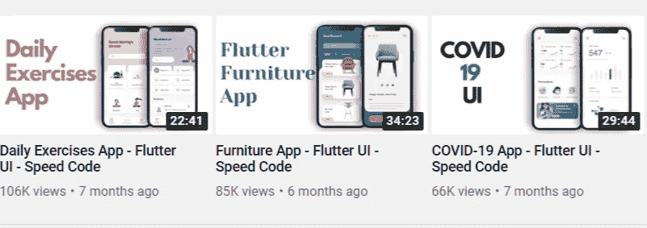
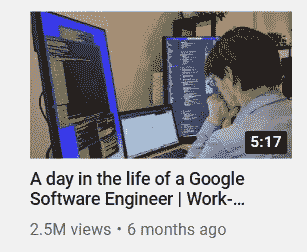
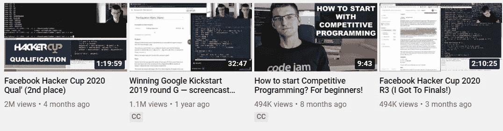

# 如何利用 YouTube 成为更好的程序员

> 原文：<https://betterprogramming.pub/how-to-use-youtube-to-be-a-better-programmer-cadcbc989edb>

## YouTube 上有一整个世界的编程内容等着你

克里斯蒂安·威迪格在 [Unsplash](https://unsplash.com?utm_source=medium&utm_medium=referral) 上拍摄的照片。

今天，YouTube 是一个学习任何东西的好地方，因为它的环境鼓励每个人分享更多。我开始相信，我可能搜索的任何内容都已经被某个人记录在 YouTube 上了。一开始，我只有一个 YouTube 账户。我用它在空闲时间观看我喜欢的一切。对我来说，编码并不是那么有益，一个改变，一切都改变了。

几个月前，我决定做一点改变。我创建了一个新的 YouTube 账户。该帐户仅用于与编码相关的时间。我很快注意到一些变化。我的旧账户上满是我的兴趣爱好推荐，从育儿到宗教和我在空闲时间看的东西。他们通常来自我已经看了很多年的 YouTubers。新账户是一个完全不同的世界。里面全是我从来不知道的新视频推荐。

随着每一个新的推荐，我发现了 YouTube 可以帮助我更好地编程的新方法。程序员需要永不停止学习和实践。我使用 Medium 的目的是阅读更多的编程文章，但是有了这个新帐户，我发现 Youtube 提供了更多！

# 1.现场编码视频

我最近在学习 Flutter，所以在搜索了几次 Flutter 视频后，我开始在我的推荐部分获得这些视频:

来自 YouTube 的截图

这个频道向你展示如何在不到 30 分钟的时间内详细编写一个 Flutter UI 应用程序！这实质上是编码过程的屏幕共享。这是一种所有初学者都需要的结对编程。

我点击这些视频的次数越多，就有越多这种类型的视频被推荐给我。

# 2.软件工程师的真实生活

另一天，我在我的推荐中看到了这个视频:谷歌软件工程师的一天。

那不是很有趣吗？通过点击这个，我得到了越来越多工程师的真实视频。我找到了很多热门公司的视频。如果我想进入其中一家公司，这些视频将帮助我了解这是否是我想要的生活，以及在那里工作能给我带来什么。这些视频还分享了他们在公司使用的黑客技术。

# 3.免费课程

我发现 YouTube 上有很多免费的高质量播放列表，几乎可以学到任何东西。而且推荐系统鼓励你开始学习。我只搜索了一次 HackerOne，在那之后，我收到了许多教我如何进行道德黑客行为的视频推荐。不出所料，我产生了兴趣，开始学习。

# 4.面谈

我得到了许多播客的推荐，热门和不知名的程序员都分享了他们的生活经历。在做其他事情的时候听他们说话会很有趣，也很有益。

# 5.编码挑战

你有没有参加过一个编码挑战，然后想，“获胜者是做什么的？他们怎么能这么快地编码或思考？”我发现，甚至这种问题在 YouTube 上也有答案。

我得到了一个非常有趣的建议:

我收到了关于 Facebook Hacker Cup、Google Kickstart 和许多其他比赛的推荐。这难道不是激励和向专业人士学习的好方法吗？

# 结论

我相信还有更多类型的视频可以提供帮助，比如新闻、趋势、一般视频和我想象不到的东西。我喜欢 YouTube 让你有机会观看世界各地的专业人士分享他们的秘密和知识。

总结一下，你需要做的是:

1.  为编码相关时间创建一个新的 YouTube 频道。
2.  搜索并点击该领域感兴趣的视频和话题。
3.  享受推荐！
4.  当任何不相关的视频通过推荐系统出现在你面前时，记得选择“不感兴趣”。

随着时间的推移，尝试使这个新帐户成为您的默认帐户。只要记住使它只与编码相关。所以下次你有空闲时间想看什么的时候，就会被推送去看编码相关的视频。

这将是一个探索新话题的完美方式，鼓励你做更多的事情，并在每天的基础上了解更多。