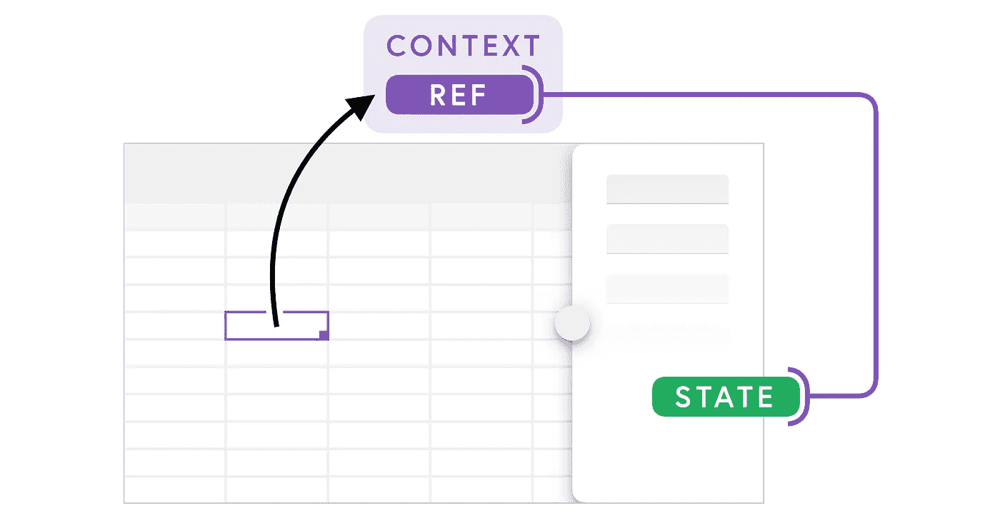
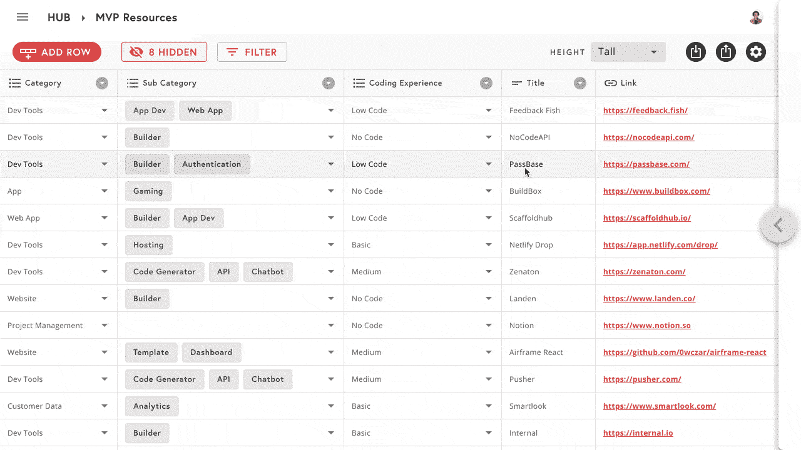
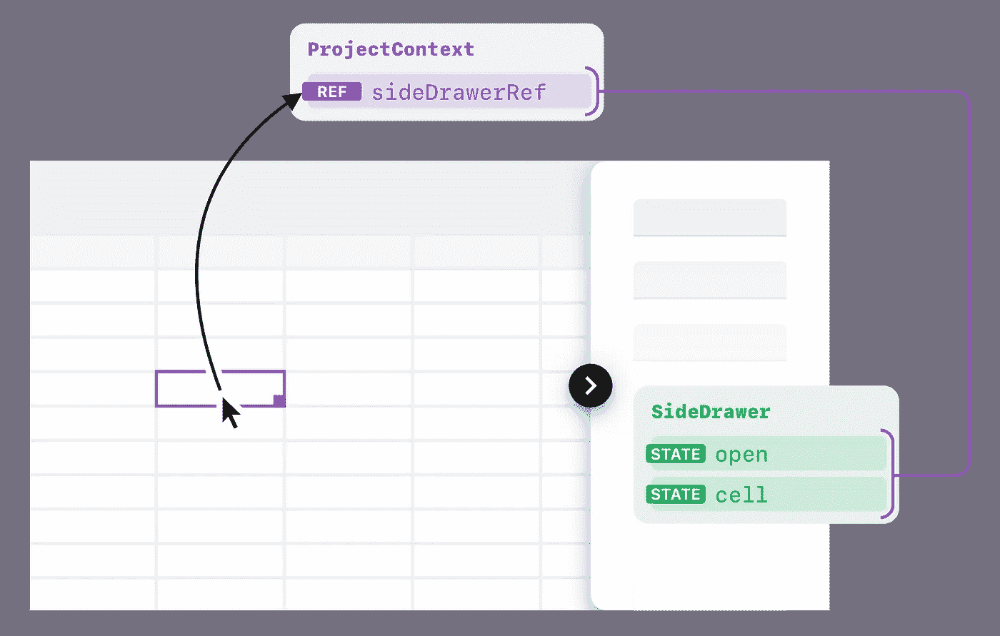

# 如何使用 Ref 来修复 React 性能问题

> 原文：<https://betterprogramming.pub/how-to-useref-to-fix-react-performance-issues-4d92a8120c09>

## 以及我们如何阻止 React 上下文重新渲染所有内容

作者照片。

Refs 是 React 中很少使用的功能。如果你读过[官方 React 指南](https://reactjs.org/docs/refs-and-the-dom.html)，它们被作为典型 React 数据流的“逃生出口”介绍，并警告要谨慎使用它们。它们主要被宣传为访问组件底层 DOM 元素的正确方法。

但是除了钩子的概念，React 团队还引入了`[useRef](https://reactjs.org/docs/hooks-reference.html#useref)`钩子，它扩展了这个功能:

> "`useRef()`比`ref`属性更有用。用它来保存任何围绕着的可变值[很方便，就像在类中使用实例字段一样。”—](https://reactjs.org/docs/hooks-faq.html#is-there-something-like-instance-variables) [React 的文档](https://reactjs.org/docs/hooks-reference.html)

虽然我在新的 Hook APIs 发布时忽略了这一点，但事实证明它非常有用。

👉[点击此处跳到解决方案和代码片段](#f356)。

# 问题是

我是一名软件工程师，正在开发一款开源的 React 应用程序，它将电子表格用户界面与 Firestore 和 Firebase 的全部功能结合在一起。它的一个关键特性是侧边抽屉，这是一个类似表单的 UI，用于编辑滑过主表的单行。

当用户单击表格中的一个单元格时，可以打开侧边的抽屉来编辑该单元格对应的行。换句话说，我们在侧边抽屉中呈现的内容取决于当前选择的行——这应该存储在 state 中。

将该状态放入侧抽屉组件本身是最合理的位置，因为当用户选择不同的单元格时，应该只有*影响侧抽屉。然而:*

*   我们需要从 table 组件中*设置*这个状态。我们使用`[react-data-grid](https://github.com/adazzle/react-data-grid)`来呈现表格本身，它接受一个回调属性，每当用户选择一个单元格时就会调用这个属性。目前，这是应对这一事件的唯一方法。
*   但是侧抽屉和桌子组件是兄弟组件，所以它们不能直接访问彼此的状态。

React 的建议是[将这个状态](https://reactjs.org/docs/lifting-state-up.html)提升到组件最接近的共同祖先(在本例中是`TablePage`)。但是我们决定不把州搬到这里，因为:

1.  `TablePage`不包含任何状态，主要是桌子和侧抽屉组件的容器，它们都没有任何道具。我们宁愿保持这种方式。
2.  我们已经通过一个位于组件树根附近的[上下文](https://reactjs.org/docs/context.html)共享了许多“全局”数据，我们认为将这个状态添加到中央数据存储是有意义的。

*注意:即使我们把状态放在* `*TablePage*` *中，我们还是会遇到下面同样的问题。*

问题是每当用户选择一个单元格或打开侧抽屉时，对这个全局上下文的更新会导致整个应用程序重新呈现。这包括主表组件，它可以一次显示几十个单元格，每个单元格都有自己的编辑器组件。这将导致大约 650 毫秒的渲染时间，这足以在侧抽屉的打开动画中看到明显的延迟。

请注意点击“打开”按钮和侧面抽屉动画打开之间的延迟。

这背后的原因是上下文的一个关键特性，也是为什么在 React 中使用比在全局 JavaScript 变量中使用更好的原因:

> “每当提供者的`value`属性发生变化时，作为提供者后代的所有消费者都将重新呈现。”— [React 的文档](https://reactjs.org/docs/context.html)

虽然这种对 React 的状态和生命周期的挂钩到目前为止为我们提供了很好的服务，但我们现在似乎搬起石头砸了自己的脚。

# 啊哈时刻

在选定`useRef`之前，我们首先探索了几种不同的解决方案(来自[丹·阿布拉莫夫关于这个问题的帖子](https://github.com/facebook/react/issues/15156#issuecomment-474590693)):

1.  拆分上下文(即创建一个新的`SideDrawerContext` ) —表格仍然需要使用新的上下文，当侧面抽屉打开时，新的上下文仍然会更新，[导致表格不必要地重新呈现](https://reactjs.org/docs/hooks-reference.html#usecontext)。
2.  将表格组件包装在`React.memo`或`useMemo`中——表格仍然需要调用`useContext`来访问侧面抽屉的状态，并且[两个 API 都不会阻止它导致重新呈现](https://reactjs.org/docs/react-api.html#reactmemo)。
3.  记住用于呈现表格的`react-data-grid`组件——这会给我们的代码带来更多的冗长。我们还发现它阻止了*必要的*重新渲染，要求我们花费更多的时间来修复或重新构建我们的代码，仅仅是为了实现侧抽屉。

在通读 Hook APIs 和`useMemo`的时候，我终于发现了关于`useRef`的那一点:

> "`useRef()`比`ref`属性更有用。用它来保存任何围绕的可变值[很方便，就像在类中使用实例字段一样。”—](https://reactjs.org/docs/hooks-faq.html#is-there-something-like-instance-variables) [React 的文档](https://reactjs.org/docs/hooks-reference.html)

更重要的是:

> "`useRef` *在其内容发生变化时*不会通知您。改变`.current`属性**不会导致重新渲染**。”— [React 的文档](https://reactjs.org/docs/hooks-reference.html)

这时我突然想到:我们不需要存储侧抽屉的状态。我们只需要引用设置该状态的函数。

# 解决方案

1.  将打开和单元状态保存在侧抽屉中。
2.  创建对这些状态的引用，并将其存储在上下文中。
3.  当用户单击一个单元格时，使用表中的 ref 调用 set state 函数(在侧抽屉内)。

下面的代码是 Rowy 上使用的代码的缩写版本，包括 ref:

*注意:由于函数组件在重新渲染时运行整个函数体，每当* `*cell*` *或* `*open*` *状态更新(并导致重新渲染)，* `*sideDrawerRef*` *在* `*.current*` *中总是有最新的值。*

这种解决方案被证明是最好的，因为:

1.  当前单元格和打开状态存储在侧边抽屉组件本身中，这是放置它的最合理的位置。
2.  当需要时，表格组件可以访问其兄弟的状态*。*
3.  当当前单元格或打开状态被更新时，它只会触发侧面抽屉组件的重新呈现，而不会触发整个应用程序中的任何其他组件。

你可以在 GitHub 上的 Rowy [中看到这是如何使用的。](https://github.com/rowyio/rowy/blob/6e81191fc26714c4c212bae19cfc4c16440c322f/src/components/SideDrawer/index.tsx#L37)

# 何时使用 Ref

但是，这并不意味着您应该继续将这种模式用于您构建的所有东西。当您需要在特定时间访问或更新另一个组件的状态，但您的组件不依赖于该状态或基于该状态进行渲染时，最好使用它。React 的提升状态和单向数据流的核心概念，无论如何都足以覆盖大部分 app 架构。

感谢阅读！