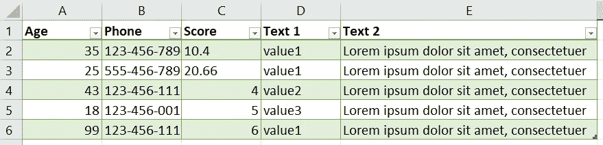
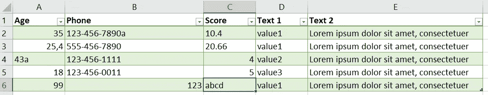
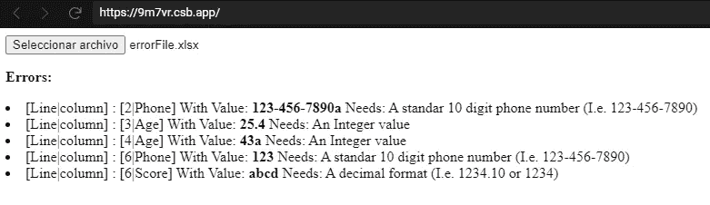
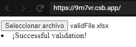
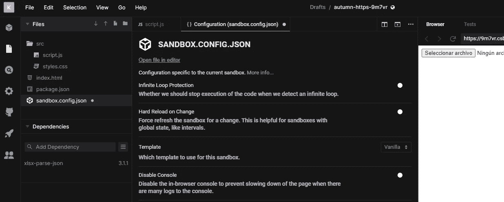

# 如何用 JavaScript 验证 Excel 文件

> 原文：<https://betterprogramming.pub/how-to-validate-an-excel-file-in-javascript-a10fa12c171c>

## 验证。xlsx 和。xls 文件只需几个简单的步骤

在[上的电子表格未绘制](https://undraw.co/)。

您有一个包含许多列和行的 Excel 文件，您需要验证它。你会怎么做？下面的文章将描述一个简单的方法来做这件事，这个方法对大文件和小文件都适用。

首先，我们需要知道我们想要验证哪些 Excel 列，以及要应用哪种验证。在这个例子中，我将使用一个具有五行和五列的文件，但是如果它具有 30，000 行和 100 列，这个方法也同样适用。

为了简单起见，我将只使用几个文件来构建它:`index.html`和`script.js`。显然，这可以通过将不同的部分分成不同的类和文件来改进。

# Index.html

让我们首先创建一个名为`index.html`的文件，它将成为我们应用程序的接口。它有一个按钮，按下后，我们可以选择一个文件。

index.html

*   在第 10 行，我们定义了一个按钮，单击它将打开一个浏览器窗口，并允许我们选择一个. xls 或. xlsx 文件。
*   Excel 验证的结果将显示在 div 的第 18 行。
*   在第 20 行，我们导入了包含所有应用程序逻辑的脚本。

# 剧本

创建一个名为`script.js`的文件。它将包含我们应用程序的所有逻辑。

## 一些掩码的定义

我们将使用正则表达式用普通的 JS 定义一些掩码，我们将在后面的步骤中使用它们来创建我们的验证。

如您所见，这很简单:

script.js 1/1

*   `_isInteger`对象定义了一个掩码，我们稍后将使用它来验证整数。
*   `_isDecimal`对象定义了一个掩码，我们稍后将使用它来验证十进制和整数。
*   `_isPhone`对象定义了一个掩码，我们稍后将使用它来验证国际电话号码。

现在让我们定义一些验证。

## 确认

script.js 1/2

*   第 3 行的`validAge`验证年龄列的类型是`Integer`。
*   第 17 行的`validPhone`验证年龄列的类型是`Phone`。
*   第 31 行的`validScore`验证年龄列的类型是`Decimal`。

## 验证 JSON 内容的方法的定义

script.js 1/3

一旦我们将 Excel 转换成 JSON 对象，我们将遍历它的所有元素并应用相应的验证。

发现错误的结果将存储在另一个名为`Errors`的数组中。

## 加载文件、将其转换为 JSON 对象并验证它的方法的定义

这是应用程序负责读取文件并使用 xlsx-parse-json 库将其转换为 JSON 对象的主要方法。然后它调用负责验证其内容的`validateExcel`方法。如果有错误或没有错误，将会显示一条带有验证结果的消息。

script.js 1/4

## 一起

script.js 文件

# Excel 文件

为了测试对文件应用验证的结果，我们创建了两个。包含以下内容的 xlsx 文件。

第一个文件号包含验证错误:

correctFile.xlsx

第二个文件包含几个验证错误，如下所示:

errorsFile.xlsx

# 测试应用程序

## 将验证应用到 Excel 的结果

这里，Excel 文件包含几个验证错误:

处理带有验证错误的 Excel 的结果。

此 Excel 文件不包含任何验证错误:

没有验证错误的 Excel 处理结果。

# 结论

通常，我们不需要将事情复杂化来执行任务。在这个例子中，我展示了如何在？xlsx 格式的简单方法。这是一个可以改进的解决方案，但是我们的目标是展示验证一个 Excel 格式的文件是多么容易。

你可以尝试从 [CodeSandbox](https://codesandbox.io/s/autumn-https-9m7vr) 下载代码。

*注意:要在沙箱中尝试应用程序，您必须禁用无限循环保护。*

