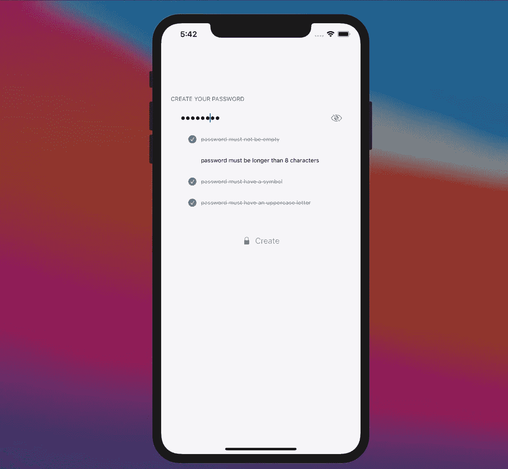

# 如何在 SwiftUI 中验证复杂密码

> 原文：<https://betterprogramming.pub/how-to-validate-complex-passwords-in-swiftui-b982cd326912>

## 联合起来救援

马库斯·斯皮斯克在 [Unsplash](https://unsplash.com?utm_source=medium&utm_medium=referral) 上的照片。

我们仍然需要密码。强密码。

强密码意味着复杂的验证。

银行信息、家庭照片、电子邮件等。当敏感数据在墙后时，未经授权的访问是一个主要问题。因此，您比以往任何时候都更需要创建强而复杂的密码，并且还需要对它们进行验证。

在本文中，您将学习如何使用 SwiftUI 和 Combine 创建一个优秀的验证系统，以及其构建背后的主要原则。

# 什么是验证系统？

验证系统允许应用程序评估用户输入流，并根据一些规则决定该数据是否有效。

Face ID、触控 ID 等。这些令人印象深刻的技术改善了我们保护数据的方式。但是，即使在使用它们时，有时我们的业务逻辑也要求用户输入手动密码。而且密码必须很强。而强通常意味着复杂。

如果用户不清楚如何使用复杂的密码，创建复杂的密码可能会很棘手。

出于这个原因，需要一个复杂的验证系统——它必须满足一些要求，使其安全并易于管理。

记住这一点，让我们定义验证系统背后的主要原则。

## 真理的单一来源

验证必须依赖于单个位置。*为什么？*如果在不止一个地方定义了验证，那么当你在几个屏幕上验证字段时，可能会在应用程序中产生错误和差异。

*注意:虽然服务器端的验证是必须的，但是客户端的双重检查验证也很好，因为它可以更快、更好地响应内联验证。*

## 动态且可扩展

验证规则的定义可能会随着应用程序版本的变化而变化，因此在使验证适应任何新的业务需求时，一个灵活的系统可能会有所不同。

## 连续输入验证

验证必须对用户输入的每个输入做出反应。反应性对于让用户理解输入内容的对错很重要。

## 有用的输出

一个没有明确结果的验证是*无用的*。该系统必须提供一个结果显示给用户，它必须适应用户界面，以提供有用的信息。一些例子如下:

*   总体进度:进度表示，让用户知道完成任务的剩余工作量。
*   验证状态:*验证成功还是失败？表格有效吗？*状态输出允许界面适当更新，给用户提供清晰的反馈。
*   详细信息:当处理复杂的数据或具体的业务需求时，显示详细的中间信息来指导用户完成整个过程可能会很有趣。
*   错误消息或指导:如果出现错误，用户需要知道下一步做什么以及如何解决问题。

# 密码验证

一旦我们清楚地定义了我们的价值观，就该建立我们的密码验证系统了。

如前所述，与验证相关的代码必须封装在一个外包装中。这个包将从一个`ViewModel`调用，它处理视图的业务逻辑，并与视图严格分离。

## 视图模型

在本例中，您创建了一个包含密码输入值的视图模型。`password`作为来自视图的输入。它在一个`ObservableObject`中被声明为`@Published`，所以这个变量的每一个变化都会触发验证流:

# 验证规则

对于此示例，要创建有效的密码，字符串必须满足以下要求:

*   密码不得为空。
*   密码必须超过三个字符。
*   密码必须至少有一个符号。
*   密码必须至少有一个大写字母。

在您的代码中，验证由三个相互关联的结构进行:

*   `Field`:需要验证的字段。根据评估的领域，要求可能会有所不同。
*   `ValidationState` : 验证的结果状态。当验证被处理时，它返回一个结果，表明它是如何进行的。
*   `ValidationType`:定义显式案例的验证需求类型。

## 验证检查

一旦定义了需求，下一步就是实现一个解决方案来检查需求的实现。在这种情况下，名为`fulfills(string)`的方法使用不同的验证规则来评估输入字符串(取决于类型)。

*注意:在* `*init*` *方法中可以看到，* `*state*` *是使用* `*fulfills*` *方法的结果设置的。这样，实现在结构之外是隐藏的。*

对于`hasSymbols`和`hasUppercasedLetters`评估，需要两个正则表达式(RegEx) `String`扩展:

# 输入流

SwiftUI 的很大一部分依赖于 Combine。正如[苹果的文档所述](https://developer.apple.com/documentation/combine):

> “Combine 框架提供了一个声明性的 Swift API，用于随时处理值。这些值可以表示多种异步事件。

有关联合收割机的更多信息，请遵循官方的[文档指南](https://developer.apple.com/documentation/combine/receiving-and-handling-events-with-combine)。

Combine 允许您接收连续的输入流(用户输入)，映射这个流，并生成一个结果。在这种情况下，`ViewModel`中涉及的过程如下:

1. `@Published var password`将接收用户在视图中输入的连续流。

2.这个密码输入将与`passwordPublisher`发布者相关联。该发布者将流式传输要处理的内容。

3.在这种情况下，密码字符串将用于根据需要创建尽可能多的验证。这些验证包含评估给定字符串所需的所有信息。

4.对于这种特殊情况，我们提供两种不同的输出:

*   原始`validations`值将用于显示中间进度反馈。在这种情况下，将显示验证列表及其更新状态。
*   一个`isValid`布尔值:`validations`数组被组合产生一个布尔值，该值指示该值是否有效。

5.该值将被设置为`isValid`，这将触发视图的更新。

# 验证输出

既然字符串已经过验证，就该向视图返回一些有用的输出了。

您已经向`isValid`返回了一个布尔值，但是关于验证失败时会发生什么的更多细节可能会对用户理解下一步该键入什么有用。

作为`ValidationType`的一部分，一个`message(fieldName: String)`返回一个适当的错误信息:

# 用户界面和最终结果

最终用户界面 Pablo Blanco

一旦验证系统完成，我们可以在 SwiftUI 视图中使用它。可以通过访问`userViewModel`属性来使用它。

在这种情况下，我们显示一个包含三个主要元素的视图:

*   密码输入文本字段可以在位于右侧的眼睛按钮上的安全/标准点击之间切换。
*   验证列表，指示每个验证的当前状态，以便向用户提供即时反馈。
*   验证完成后，将启用提交按钮。

# 结论

Combine 和 SwiftUI 是以简单的方式创建类似这些评估的复杂操作的优秀工具。

通过遵循一些关于如何构建系统的基本原则，并注意所提供的输入和输出，评估复杂的密码变得简单明了！

# 从这里去哪里

您已经创建了一个基本的(但是强大的)验证系统。重大改进可能包括:

*   异步评估(即将输入发送到服务器进行检查)。
*   意味着两次或更多次输入的验证(例如，两次要求输入密码)。