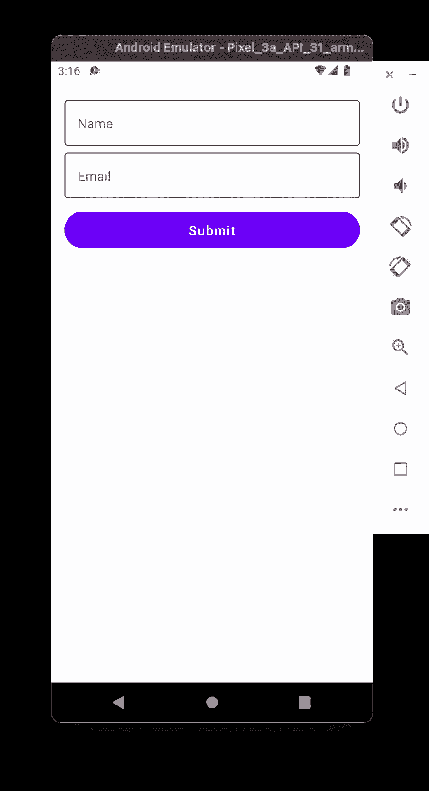
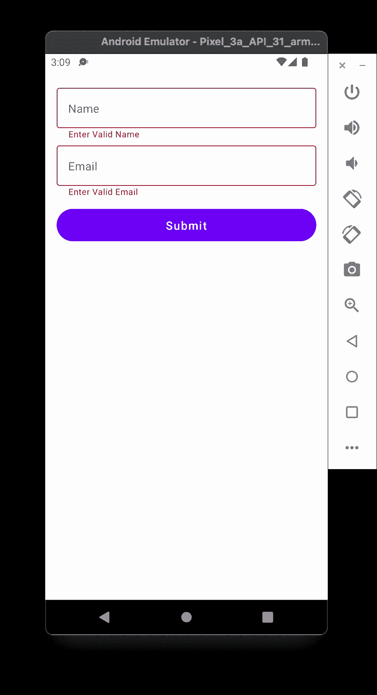
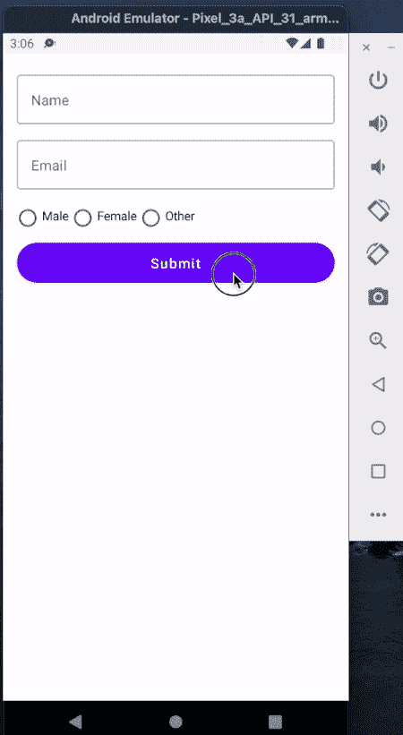

# 如何在 Android 中使用 Jetpack Compose 验证字段

> 原文：<https://betterprogramming.pub/how-to-validate-fields-using-jetpack-compose-in-android-5ea1522331c7>

## 检查电子邮件和密码字段是否正确，并相应地显示消息


[真实社](https://unsplash.com/@trueagency?utm_source=medium&utm_medium=referral)在 [Unsplash](https://unsplash.com?utm_source=medium&utm_medium=referral) 上拍摄的照片

在本文中，我们将学习当用户提交表单并显示自定义错误消息时如何验证输入数据。本文中的验证包括:空提交、有效电子邮件检查、字符长度检查、单选按钮组选择检查等。

# 介绍

Jetpack Compose 是谷歌最近试图让 Android 开发者轻松构建 UI 的尝试之一。

> *“Jetpack Compose 是一款用于构建原生 Android UI 的现代工具包。Jetpack Compose 以更少的代码、强大的工具和直观的 Kotlin APIs 简化并加速了 Android 上的 UI 开发。”—* [*安卓开发者*](https://developer.android.com/jetpack/compose/tutorial)

Jetpack Compose 的稳定版本 1.0 最近发布，这意味着它的生产就绪。因此，这将是学习如何使用下一代 UI 套件进行 Android 开发的大好时机。

您需要安装 Android Studio —北极狐(2020.3.1) 版本才能使用 Jetpack Compose。

# 先决条件

在进一步学习之前，您必须具备如何使用 Jetpack Compose 的基本知识。如果你是作曲新手，我强烈推荐阅读以下文章:

*   "[在 JetPack Compose 中构建 Android 布局](/build-android-layouts-in-jetpack-compose-bda2e0837f5e)"
*   [“使用 Jetpack Compose 处理 Android 键盘”](/android-keyboard-handling-using-jetpack-compose-c478f7afaae0)

# 空的和无效的电子邮件验证

## 空验证

让我们从一个简单的空字段检查开始。首先，我们需要创建一个输入文本字段，在用户输入时更新值。我们知道 jetpack compose 是一个基于状态的 UI，所以我们需要创建一个`mutableStateOf`字符串和一个更新该字符串的 lambda。看一看:

```
@Composable
fun ValidationsComposble(){

var name by remember **{ *mutableStateOf***("") **}** val nameTextUpdate = **{** data : String **->
        name = data**
    **}** }
```

接下来，我们需要创建另一个可组合函数来构建 UI，它将`mutableStateOf` 字符串和更新函数作为输入。我们使用字符串输入来显示文本，并更新函数来捕获用户键入的文本。看一看:

```
@Composable
fun ValidationsUI(
    **name : String,
    nameUpdate : (String) -> Unit**
){

    *Column*(
        modifier = Modifier
            .*fillMaxSize*()
            .*padding*(start = 16.*dp*, end = 16.*dp*, top = 16.*dp*)
            .*verticalScroll*(rememberScrollState())
    )**{

        *OutlinedTextField***(
            value **= name,** onValueChange **= nameUpdate,**
            label = **{** *Text*("Name") **}**,
            modifier = Modifier
                .*fillMaxWidth*(),
        **)

    }** }
```

让我们添加一个提交按钮，当用户点击它时，我们必须验证文本输入，如果字段为空，则显示错误。验证逻辑应该在父函数中完成，因为它会影响状态和 UI。看一看:

下一步是在输入文本无效时更新 UI。为此，我们需要 ValidationsUI 函数的另一个布尔输入。布尔变量也应该是`mutableStateOf` *，*，这样用户界面就可以相应地更新。看看最终的实现:

## 电子邮件验证

不管验证的类型是什么，实现都是一样的。在电子邮件验证的情况下，我们验证电子邮件而不是使用`isEmpty`，其余的事情都是一样的。



# 带有错误消息的验证

在上面的输出中，它清楚地显示了错误字段，并且它将为空字段完成工作。但是当涉及到特定的验证时，比如电子邮件、数字验证等，用户需要知道消息哪里出错了，而不仅仅是突出显示字段。

开箱即用，jetpack compose 没有任何特定的东西来处理它。因此，我们需要使用现有的`OutlinedTextField`创建一个显示错误消息的输入字段。

实现很简单，我们只需要创建一个新的 compose 函数，并添加`OutlinedTextField`接受的所有输入。然后根据`Column`中的错误标志执行显示错误的`OutlinedTextField`和`Text`字段。`errorMsg`是我们添加的额外输入，用于显示基于上下文的错误消息。看一看:

现在，在您的 composable 中，我们没有使用`*OutlinedTextField*` ，而是使用了`OutlineTextFieldWithErrorView`，它显示了一条没有多余代码的错误消息。看一下输出:



# 单选按钮组验证

> 它不会偏离上述实现太多

让我们从创建一个广播组开始。为了简单起见，让我们考虑一个性别选择特性。这里我们有三个单选按钮:男性、女性和其他。默认情况下，应该取消选择所有按钮。看一看:

```
@Composable
fun ShowRadioGroup(

) {
    Column**{** Row **{***RadioButton*(
                selected = false,
                onClick = **{ }**)
            Text(
                text = "Male",
                modifier = Modifier
                    .*clickable* **{ }** .*padding*(start = 4.*dp*)
            ) *Spacer*(modifier = Modifier.*size*(4.*dp*)) RadioButton(
                selected = false,
                onClick = **{ }** )
            *Text*(
                text = "Female",
                modifier = Modifier
                    .*clickable*(onClick = **{ ** **}**
                    .*padding*(start = 4.*dp*)
            ) **}** 
    **}** }
```

现在我们需要更新选择的状态，我们需要选择的标签作为状态，还需要一个函数来更新选择的状态，就像我们以前做的那样。除此之外，我们还需要一个布尔值来维护错误状态。看一看:

# 表单验证

让我们将所有代码放在一起实现表单验证。该表单包括姓名、电子邮件和单选按钮组验证。看一看:

# 输出



目前就这些。希望你学到了有用的东西。感谢阅读。