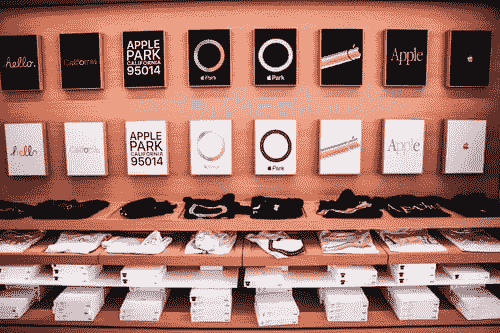
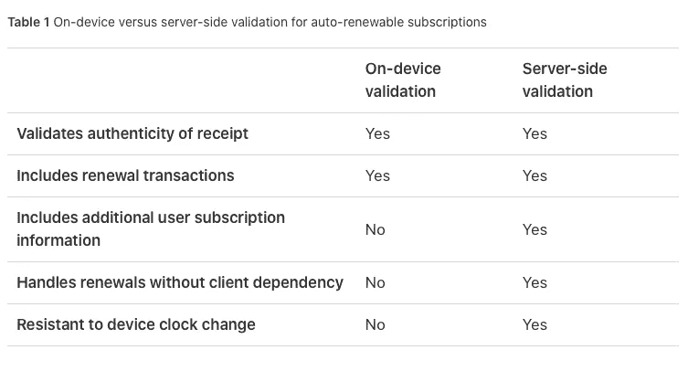
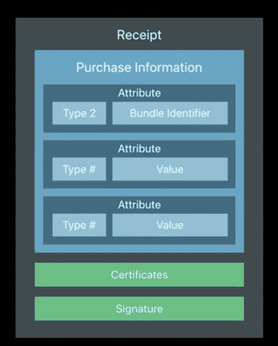
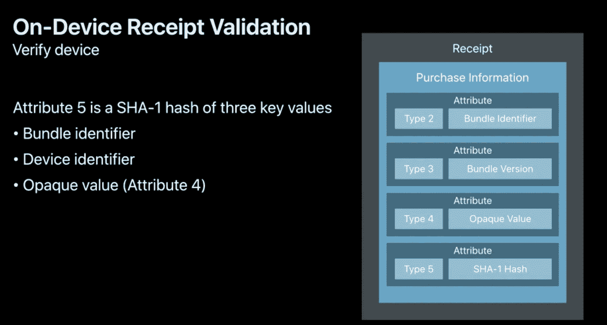
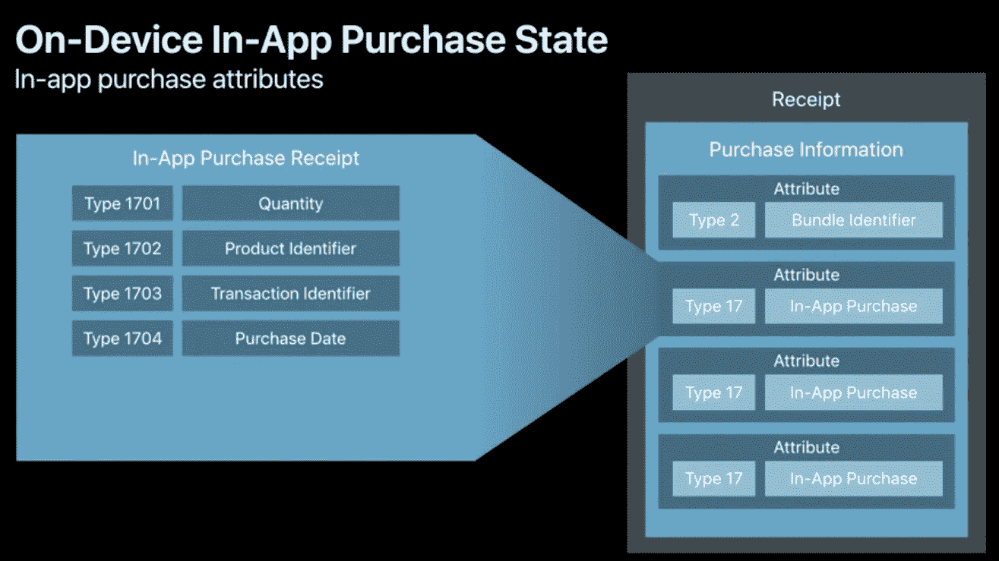

# 如何在本地验证 iOS 应用内购买收据

> 原文：<https://betterprogramming.pub/how-to-validate-ios-in-app-purchase-receipts-locally-ce57ba752cae>

## 使用命令行进行本地验证的演练



乔希·威瑟斯在 [Unsplash](https://unsplash.com/) 上的照片

前几周我写了一篇关于 iOS14 中的订阅、收据和 StoreKit 的文章(你可以在这里找到[)。在文章的结尾，我展示了一个我通过苹果服务器 API 调用验证的收据的例子。](https://medium.com/better-programming/subscriptions-receipts-and-storekit-in-ios-14-16194eb93963)

现在我顺便提一下，但是如果你检查苹果的文档，你肯定会不由自主地注意到红框中的这条消息。


从苹果开发者网页上剪切粘贴的警告

是的，这正是我在上一篇文章中所做的，向您展示收据是什么样的——以及我如何开始验证它。那么苹果为什么这么说，那个流程有什么问题？这里有一个简单的表格来解释这种差异。



让我们看一看收据的验证，学习如何在本地验证它，并在这样做的过程中，理解什么可能出错。现在，我假设你已经阅读了另一篇文章，并且有一些收据可以使用。我一个人玩没有意义，你也需要参加。

在本文中，我还假设您对 UNIX shell 也相当熟悉。计划是使用一些工具——比如 OpenSSL 和其他工具——尽可能地解析收据。我这样做的目的是为了专注于过程，而不是太多的代码。

# 拿收据

现在我们从哪里开始？打开 demo app(完整代码[此处](https://medium.com/better-programming/subscriptions-receipts-and-storekit-in-ios-14-16194eb93963)，改`IAPManager`类。在其中，查找`verifyReceipt()`函数，并确保这里显示的两行未被注释。

```
guard let receiptURL = Bundle.main.appStoreReceiptURL, let   receiptString = try? Data(contentsOf: receiptURL).base64EncodedString() , let url = URL(string: verifyURL) else {
return
}
print("receiptURL ",Bundle.main.appStoreReceiptURL, verifyURL, receiptString)
```

这将把您生成的收据的位置和一份 Base64 编码的副本打印到屏幕上。运行应用程序，并检查它。

现在，如果您使用本地配置/Xcode 来完成这个任务，并且您需要在这里生成的名为`receipt`的文件，您可以在`Developer`目录中找到它，路径很像这样。

```
file:///Users/mark/Library/Developer/CoreSimulator/Devices/90CA4A17-7846-4970-BA5F-924E5355B594/data/Containers/Data/Application/ADBDFC64-A4DB-45AB-B3C6-1F9871695209/StoreKit/**receipt**)
```

如果您在远程 scheme/本地设备上运行，那么您需要将 Base64 编码的字符串复制并粘贴到 Mac 上的一个文件中，比如说，将其命名为`receipt.b64`。如果你正在使用你的 iOS 设备，你需要跳 Base64 舞，因为你不能直接访问它。

**注意:**在本练习中，我们需要使用远程收据，因为 Apple 不会在本地收据上签名。如果你从未设置过应用内购买，我在这里描述了 iTunes 的工作结束[。](https://medium.com/better-programming/in-app-purchases-and-storekit-in-ios-14-aed2c3e58966)

从真实设备获得 Base64 编码的副本后，可以使用这个命令将其解码为二进制文件。显然我调用了我的输入文件`receipt.b64`和我的输出文件`receipt`。

```
base64 -d receipt.b64 > receipt
```

# 验证检查

计划是做一些本地检查，以确保收据是好的。

*   验证用于签署收据的证书是 Apple
*   验证收据是由检查它的应用程序发出的
*   验证收据是由检查它的应用程序的相同版本发出的
*   验证收据是由检查它的设备发出的

现在，在我们开始之前，有一句关于这个主题的至理名言:安全从来不是非黑即白的，它总是灰色的。

因此，您在这个过程中投入的精力、使用的库以及进行的检查在某种程度上几乎既是商业决策，也是技术决策。

理论上，100%手工制作的解决方案是最好的，但也是最贵的。你/你的企业需要权衡成本和潜在损失。

# 获取苹果根证书，并验证收据

好吧，那么——继续。现在我们有了一些收据，让我们回顾一下 Apple 文档中关于验证这些东西的内容。我们可能需要一些 UNIX 工具。如果你卡住了，一个伟大的来源总是酿造。

```
brew install openssl
```

完成后，你可以开始查看我们收到的收据。现在通读 Apple 的相关文档，它告诉我们收据是 PKCS #7 格式的，这是一家名为 RSA 的公司推出的格式，并记录在 RFC2315 中，这是一个被 IETF 采用并替换为 RFC5652 的标准，也是一个现在称为加密消息语法的全球标准。我们最终要解析的是 RFC5652 中指定的 CMS 语法。

好了，接下来:这张来自 WWDC2016 演示的幻灯片让我们了解了苹果收据里面的内容。



来自苹果 WWDC2016 的幻灯片

因此，首先，我们要检查收据是否确实是由苹果公司生成的。我们正在检查绿色方框中的数据。我们将使用 OpenSSL 来完成这项工作。第一步是获得苹果根证书的副本。

自己去拿谷歌苹果根证书，或者相信我点这个[链接](https://www.apple.com/certificateauthority/)。您将需要不同格式的证书，以便在本文中进行比较。下载完成后，您可以使用这个命令来检查它的有效性并打印出它所说的内容。

```
openssl x509 -inform der -in AppleIncRootCertificate.cer -out certificate.crt
openssl x509 -in certificate.crt -text -noout
```

后者将生成如下所示的文本文件:

```
Certificate:
    Data:
        Version: 3 (0x2)
        Serial Number: 2 (0x2)
    Signature Algorithm: sha1WithRSAEncryption
        Issuer: C=US, O=Apple Inc., OU=Apple Certification Authority, CN=Apple Root CA
        Validity
            Not Before: Apr 25 21:40:36 2006 GMT
            Not After : Feb  9 21:40:36 2035 GMT
        Subject: C=US, O=Apple Inc., OU=Apple Certification Authority, CN=Apple Root CA
        Subject Public Key Info:
            Public Key Algorithm: rsaEncryption
                Public-Key: (2048 bit)
                Modulus:
                    00:e4:91:a9:09:1f:91:db:1e:47:50:eb:05:ed:5e:
                    79:84:2d:eb:36:a2:57:4c:55:ec:8b:19:89:de:f9:
                    4b:6c:f5:07:ab:22:30:02:e8:18:3e:f8:50:09:d3:
                    7f:41:a8:98:f9:d1:ca:66:9c:24:6b:11:d0:a3:bb:
                    e4:1b:2a:c3:1f:95:9e:7a:0c:a4:47:8b:5b:d4:16:
                    37:33:cb:c4:0f:4d:ce:14:69:d1:c9:19:72:f5:5d:
                    0e:d5:7f:5f:9b:f2:25:03:ba:55:8f:4d:5d:0d:f1:
                    64:35:23:15:4b:15:59:1d:b3:94:f7:f6:9c:9e:cf:
                    50:ba:c1:58:50:67:8f:08:b4:20:f7:cb:ac:2c:20:
                    6f:70:b6:3f:01:30:8c:b7:43:cf:0f:9d:3d:f3:2b:
                    49:28:1a:c8:fe:ce:b5:b9:0e:d9:5e:1c:d6:cb:3d:
                    b5:3a:ad:f4:0f:0e:00:92:0b:b1:21:16:2e:74:d5:
                    3c:0d:db:62:16:ab:a3:71:92:47:53:55:c1:af:2f:
                    41:b3:f8:fb:e3:70:cd:e6:a3:4c:45:7e:1f:4c:6b:
                    50:96:41:89:c4:74:62:0b:10:83:41:87:33:8a:81:
                    b1:30:58:ec:5a:04:32:8c:68:b3:8f:1d:de:65:73:
                    ff:67:5e:65:bc:49:d8:76:9f:33:14:65:a1:77:94:
                    c9:2d
                Exponent: 65537 (0x10001)
        X509v3 extensions:
            X509v3 Key Usage: critical
                Certificate Sign, CRL Sign
            X509v3 Basic Constraints: critical
                CA:TRUE
            X509v3 Subject Key Identifier: 
                2B:D0:69:47:94:76:09:FE:F4:6B:8D:2E:40:A6:F7:47:4D:7F:08:5E
            X509v3 Authority Key Identifier: 
                keyid:2B:D0:69:47:94:76:09:FE:F4:6B:8D:2E:40:A6:F7:47:4D:7F:08:5EX509v3 Certificate Policies: 
                Policy: 1.2.840.113635.100.5.1
                  CPS: [https://www.apple.com/appleca/](https://www.apple.com/appleca/)
                  User Notice:
                    Explicit Text: Reliance on this certificate by any party assumes acceptance of the then applicable standard terms and conditions of use, certificate policy and certification practice statements.Signature Algorithm: sha1WithRSAEncryption
         5c:36:99:4c:2d:78:b7:ed:8c:9b:dc:f3:77:9b:f2:76:d2:77:
         30:4f:c1:1f:85:83:85:1b:99:3d:47:37:f2:a9:9b:40:8e:2c:
         d4:b1:90:12:d8:be:f4:73:9b:ee:d2:64:0f:cb:79:4f:34:d8:
         a2:3e:f9:78:ff:6b:c8:07:ec:7d:39:83:8b:53:20:d3:38:c4:
         b1:bf:9a:4f:0a:6b:ff:2b:fc:59:a7:05:09:7c:17:40:56:11:
         1e:74:d3:b7:8b:23:3b:47:a3:d5:6f:24:e2:eb:d1:b7:70:df:
         0f:45:e1:27:ca:f1:6d:78:ed:e7:b5:17:17:a8:dc:7e:22:35:
         ca:25:d5:d9:0f:d6:6b:d4:a2:24:23:11:f7:a1:ac:8f:73:81:
         60:c6:1b:5b:09:2f:92:b2:f8:44:48:f0:60:38:9e:15:f5:3d:
         26:67:20:8a:33:6a:f7:0d:82:cf:de:eb:a3:2f:f9:53:6a:5b:
         64:c0:63:33:77:f7:3a:07:2c:56:eb:da:0f:21:0e:da:ba:73:
         19:4f:b5:d9:36:7f:c1:87:55:d9:a7:99:b9:32:42:fb:d8:d5:
         71:9e:7e:a1:52:b7:1b:bd:93:42:24:12:2a:c7:0f:1d:b6:4d:
         9c:5e:63:c8:4b:80:17:50:aa:8a:d5:da:e4:fc:d0:09:07:37:
         b0:75:75:21
```

现在，使用这个 OpenSSL 命令将其转换成一个`*.pem`文件。

```
openssl x509 -inform der -in  AppleIncRootCertificate.cer -out AppleIncRootCertificate.pem
```

获得证书后，您可以使用以下命令提取用于签署收据的证书:

```
openssl pkcs7 -inform DER -in receipt > receipt.pkcs7
openssl pkcs7 -print_certs -in receipt.pkcs7 > receipt.pkcs7.certs
```

现在我们有了作为`*.pem`的`AppleIncRootCertificate`，并且我们在`receipt.pkcs7.certs`的收据中有了证书链。现在，我们可以使用以下命令来验证这两者是否匹配:

```
openssl verify -CAfile receipt.pkcs7.certs AppleIncRootCertificate.pem
```

**注意:**这将返回一个`OK`的状态。这是我们第一次检查收据确实是由苹果公司发出的。

# 解析 ASN.1 有效负载，并验证是谁发布了它

现在我们确信我们有一张有效的 PKCS #7 收据，是时候看看里面做一些进一步的检查了。为此，我们可以使用这个命令显示`pkcs7`格式的收据。

```
openssl asn1parse -in receipt2.pkcs7 -i
```

幸运的是，现在我们只需要关注文件顶部的乱码。我们对标题为`pkcs7-signedData` 的部分感兴趣，您在这里看到的部分:

```
 0:d=0  hl=4 l=8164 cons: SEQUENCE          
 4:d=1  hl=2 l=   9 prim:  OBJECT            :pkcs7-signedData
15:d=1  hl=4 l=8149 cons:  cont [ 0 ]        
19:d=2  hl=4 l=8145 cons:   SEQUENCE          
23:d=3  hl=2 l=   1 prim:    INTEGER           :01
26:d=3  hl=2 l=  11 cons:    SET               
28:d=4  hl=2 l=   9 cons:     SEQUENCE          
30:d=5  hl=2 l=   5 prim:      OBJECT            :sha1
37:d=5  hl=2 l=   0 prim:      NULL              
39:d=3  hl=4 l=3973 cons:    SEQUENCE          
43:d=4  hl=2 l=   9 prim:     OBJECT            :pkcs7-data
54:d=4  hl=4 l=3958 cons:     cont [ 0 ]        
58:d=5  hl=4 l=3954 prim:      OCTET STRING      [HEX DUMP]:31820
.continued

 4016:d=3  hl=4 l=3685 cons:    cont [ 0 ]
```

十六进制转储，顾名思义，是已签名收据的有效载荷，它包含我们要找的货物，并以一种称为`ASN.1`的格式存储。我们使用这个 OpenSSL 命令来提取我们想要的部分。回头看看垃圾场就明白数字了。我想从 58 + 4 开始，继续到 4016 - 62。

```
openssl asn1parse -length 3954 -offset 62 -in receipt2.pkcs7 -i
```

这将再次输出一堆我们需要解析的乱码。现在在一个`ASN.1`格式的数据块中，我们有三个变量。

*   `ASN.1`对象类型
*   `ASN.1`标签
*   `ASN1`值

我们示例中的数据是这样开始的(忽略第一行):

```
 179:d=1  hl=2 l=  24 cons:  SEQUENCE          
  181:d=2  hl=2 l=   1 prim:   INTEGER           :02
  184:d=2  hl=2 l=   1 prim:   INTEGER           :01
  187:d=2  hl=2 l=  16 prim:   OCTET STRING      [HEX DUMP]:0C0E63682E6371642E5469636B657473
```

我们得到了一个标签值为`1`的类型`2`和一个由`HEX`字符串表示的值。现在我知道类型`2`是我的包标识符。我可以使用这个命令将`HEX`字符串转换成 ASCII 码进行检查。

```
echo "0C0E63682E6371642E5469636B657473" | xxd -r -p
```

**注意:**这给了我这个值——在我们的例子中是包标识符。这是我们的第二张支票。您在这里看到的包标识符需要与执行检查的应用程序相匹配。同时，你还可以检查收据所指的应用版本，这是我们的第三次检查。这将是您在 ASN.1 type-3 数据包中找到的值。

现在，PCKS #7 数据包中的 ASN.1 类型比我们关心的还要多，下面列出了最重要的类型:

```
**switch** attributeType {
  **case** 0x2: // The bundle identifier
  **case** 0x3: // Bundle version
  **case** 0x4: // Opaque value
  **case** 0x5: // Computed GUID (SHA-1 Hash)
  **case** 0x0C: // Receipt Creation Date
  **case** 0x11: // IAP Receipt
  **case** 0x13: // Original App Version  
  **case** 0x15: // Expiration Date  
  **default**: // Ignore other attributes in receipt
}
```

# ASN.1 有效负载验证的更多信息

现在，如果我们回到文档，我发现收据有效载荷也应该包含这个。如这张取自 WWDC2016 专题会议的幻灯片所示，我们还需要检查和比较几个领域。



来自苹果 WWDC2016 的幻灯片

在我的例子中，第三类和第四类是这样说的:

```
41:d=1  hl=2 l=  11 cons:  SEQUENCE          
   43:d=2  hl=2 l=   1 prim:   INTEGER           :03
   46:d=2  hl=2 l=   1 prim:   INTEGER           :01
   49:d=2  hl=2 l=   3 prim:   OCTET STRING      [HEX DUMP]:0C0131205:d=1  hl=2 l=  24 cons:  SEQUENCE
207:d=2  hl=2 l=   1 prim:   INTEGER           :04
  210:d=2  hl=2 l=   1 prim:   INTEGER           :02
  213:d=2  hl=2 l=  16 prim:   OCTET STRING      [HEX DUMP]:53547B14B435DDCBE06ED2BFC86F4F5B
```

为了验证此收据属于此应用程序，并且确实是由该设备发出的，我使用了上面幻灯片中指定的字段，并比较了我得到的 SHA-1 哈希，将其与我在 ASN.1 type-5 数据包中找到的哈希相结合。

创建收据的设备标识符，我知道在我的例子中是`39981eb548364360a94903b0f786776c`。现在我陷入了一个明显的陷阱，但你不会。为了验证这一点，您需要将这个字符串和其他字符串一起转换成二进制。

```
echo "39981eb548364360a94903b0f786776c53547B14B435DDCBE06ED2BFC86F4F5B0C0E63682E6371642E5469636B657473" |  xxd -r -p | openssl dgst -sha1 -hex
```

正如您所看到的，这将产生这个值，它与类型 5 中的值相匹配，正如您在这里可以清楚地看到的:

`70c6c99d96bfed70fb7eec91e6e935806ffc3cb1`

使用我在类型 5 下的收据中找到的值:

```
262:d=2  hl=2 l=   1 prim:   INTEGER           :05
  265:d=2  hl=2 l=   1 prim:   INTEGER           :01
  268:d=2  hl=2 l=  20 prim:   OCTET STRING      [HEX DUMP]:70C6C99D96BFED70FB7EEC91E6E935806FFC3CB1
```

注意:这是匹配的，所以这是最后的检查。我们现在确定收据来自苹果，是这个应用发出的，在这个设备上有 X 版本。

接下来，在收据中，您会看到更多 ASN.1 数据包。这些看起来像这样。当我浏览我的数据时，我看到这些是因为值包很长。



来自苹果 WWDC2016 的幻灯片

例如，在我的输出中，我看到了这个。它们是 ASN.1 对象类型 11(此处以粗体显示)。

**注:**幻灯片来自 WWDC2016。我认为这里有一个错误——他们把它描述为`17`型，而它应该是`11`。

```
3566:d=1  hl=4 l= 384 cons:  SEQUENCE          
3570:d=2  hl=2 l=   1 prim:   INTEGER           :**11**
3573:d=2  hl=2 l=   1 prim:   INTEGER           :01
3576:d=2  hl=4 l= 374 prim:   OCTET STRING      [HEX DUMP]:31820172300B020206AD02010104020C00300B020206B002010104021600300B020206B202010104020C00300B020206B302010104020C00300B020206B402010104020C00300B020206B502010104020C00300B020206B602010104020C00300C020206A50201010403020101300C020206AB0201010403020103300C020206AE0201010403020100300C020206B10201010403020100300C020206B702010104030201003012020206AF02010104090207038D7EA8148117301B020206A702010104120C1031303030303030373138323935333739301B020206A902010104120C1031303030303030373135333338313833301E020206A602010104150C137469636B65742E737562736372697074696F6E301F020206A802010104161614323032302D30392D31345431333A31363A30315A301F020206AA02010104161614323032302D30392D30365430383A30373A33375A301F020206AC02010104161614323032302D30392D31345431333A32313A30315A
```

这是我在这台设备上购买的最后一张收据的摘录。和以前一样，我使用这个命令来解析它。注意:它告诉我们它从 3576 开始，但是这不包括四字节的头[hl=4]，因此有了`3572`。

```
openssl asn1parse -offset **3572** -in receipt2.pkcs7 -i
```

这包括证书数据以及我们的收据，你需要看看里面得到实际购买的产品。为此，我们重复整个过程。

# 结论

这使我结束了这篇文章。我希望你学到的和我写的一样多。这是一个挑战，但值得。我要用代码写下来。在我离开之前，这里有一个额外的好处:这是一些代码来做和我之前做的一样的事情，但是是在代码验证方面。(您需要导入 Apple 原生 CryptoKit 来获得 SHA1 哈希方法。)

我希望在接下来的一两周内发表一篇关于这个主题的完整文章。

保持冷静，继续编码。