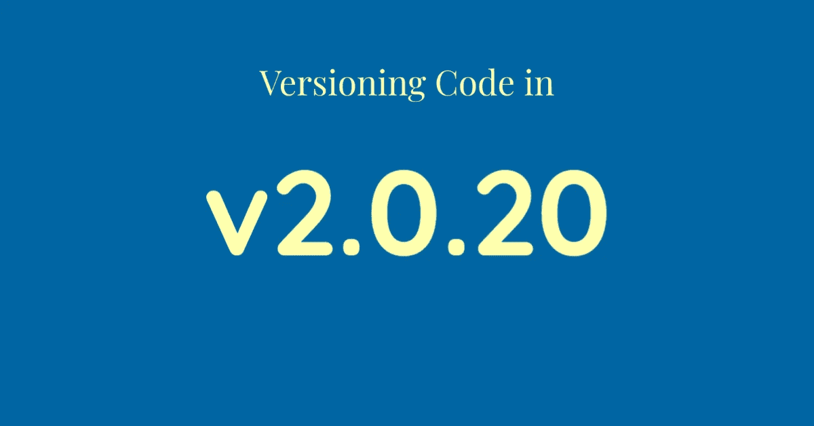

# 如何在 2020 年发布您的代码

> 原文：<https://betterprogramming.pub/how-to-version-your-code-in-2020-60bdd221278b>

## 碰撞版本合并和更多



作者照片。

我在过去写过关于如何版本化的文章，但是事情发生了变化。这是 2020 年最新最棒的一次代码版本化。

我将假设您在本文中使用的是 CI 工具，示例将基于 GitHub 操作。但是，您应该能够轻松地将它们应用于任何 CI 工具。我还假设您正在使用类似 git 的服务，如 GitHub，用于拉取请求或某种代码审查。

许多现代工具现在使用 git 标签作为版本化代码的实际位置。版本标签的格式使用[语义版本](https://semver.org/)，遵循此方案:

```
v1.2.3
```

本文将向您展示如何轻松地自动对您的代码进行版本控制。

# 第 1 步:合并时提升版本

一个开发人员提交一个拉请求(PR)，其他人审查 PR，然后它被合并到您的主分支(通常是 master)。在合并到主分支时，这将启动一些操作，比如修改版本号和部署代码。

下面是一个 GitHub 动作，它可以自动获取您的最新版本，添加补丁号，标记补丁，然后推送标签:

只要把它扔进去`.github/workflows/bump.yml`就大功告成了！如果你想知道它到底在做什么，请阅读 gitbump.sh 文件。

# 步骤 2:如果需要，在代码中使用新的版本号

如果您想要使用您在步骤 1 中创建的版本标记(例如，在您的 UI 中打印版本号或者当有人键入`yourapp --version`时)，那么您需要在一些代码中替换版本号。

您可以通过以下方式从您的 GitHub 标签获取最新版本:

```
$(git tag --sort=-v:refname --list "v[0-9]*" | head -n 1 | cut -c 2-)
```

要在 GitHub 动作中做到这一点，使用下面的代码来设置一个可以在整个过程中使用的`VERSION` env 变量:

```
echo "VERSION=$(git tag --sort=-v:refname --list "v[0-9]*" | head -n 1 | cut -c 2-)" >> $GITHUB_ENV
```

## 更新任何文件中的版本

如果您想自动更新文件中的某个版本，您可以使用:

```
docker run --rm -i -v $PWD:/app -w /app treeder/bump --filename index.html --replace $VERSION
```

这将找到一个 X.Y.Z 格式的版本，并用新版本替换它。如果文件中有多个版本，您可以向 treeder/bump 传递额外的标志，使其按照您的要求工作。[参见自述文件](https://github.com/treeder/bump)。

## 在 Go 程序中更新版本

对于 Go (golang)程序，您可以像这样使用构建标志(在您的主包中必须有一个`var Version string`):

```
go build -ldflags "-X main.Version=$VERSION"
```

## 更新 Docker 映像的版本

要使用此新版本对 Docker 映像进行版本控制和推送，请执行以下操作:

```
docker build -t treeder/myimage:latest .
docker tag treeder/myimage:latest treeder/myimage:$VERSION
docker push treeder/myimage:$VERSION
docker push treeder/myimage:latest
```

# 结论

现在你有了它:完全自动化的版本控制，与你在 git 中的代码相匹配。小菜一碟，对吧？

如果你有任何问题，请在下面的评论中告诉我。