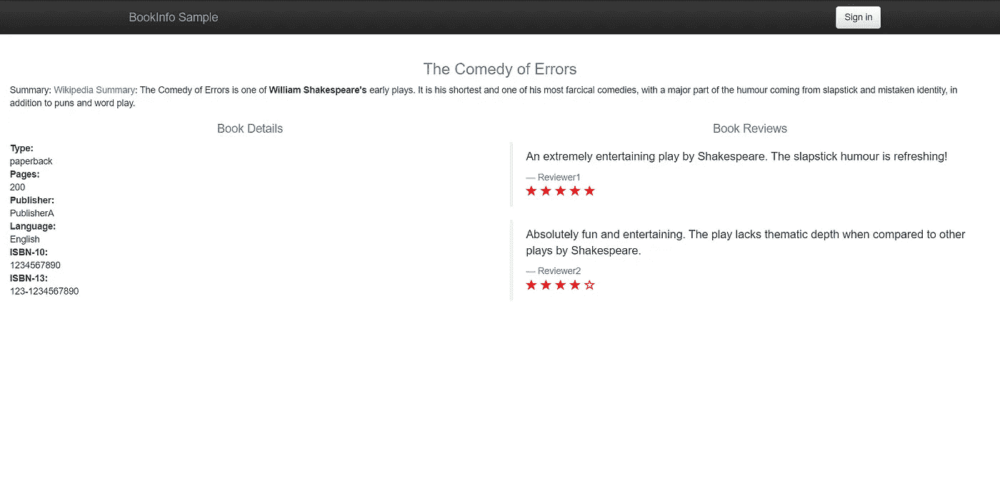
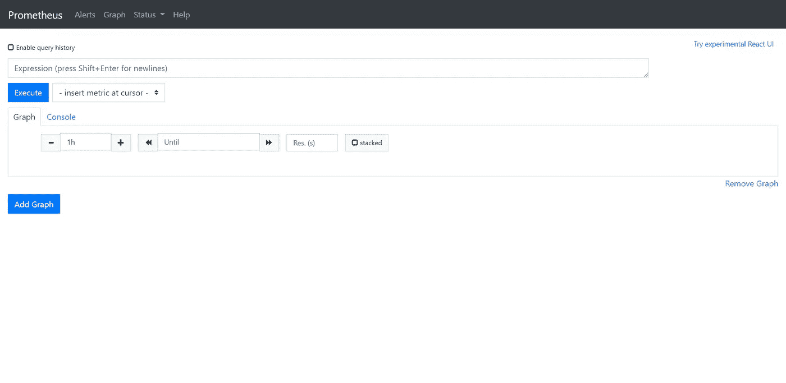
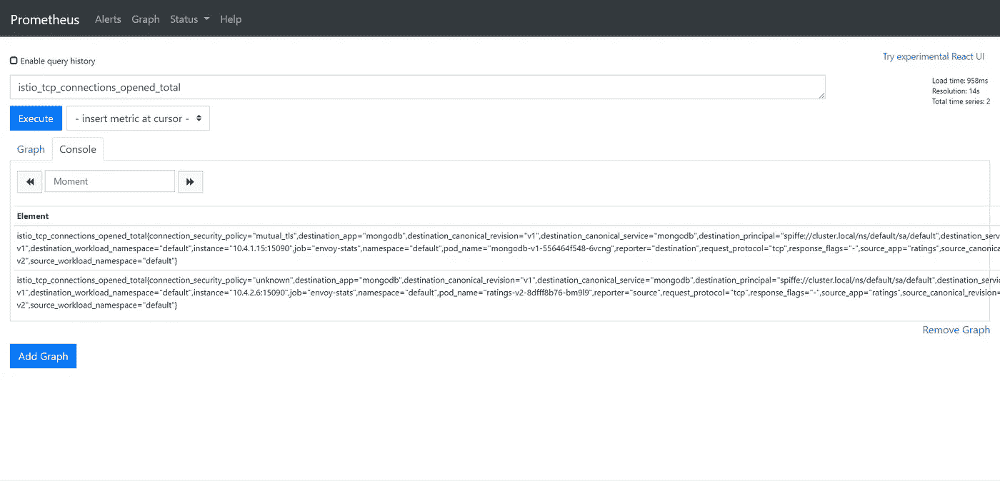
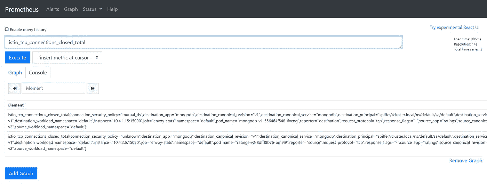
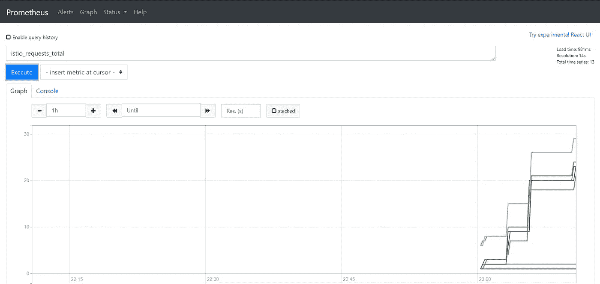
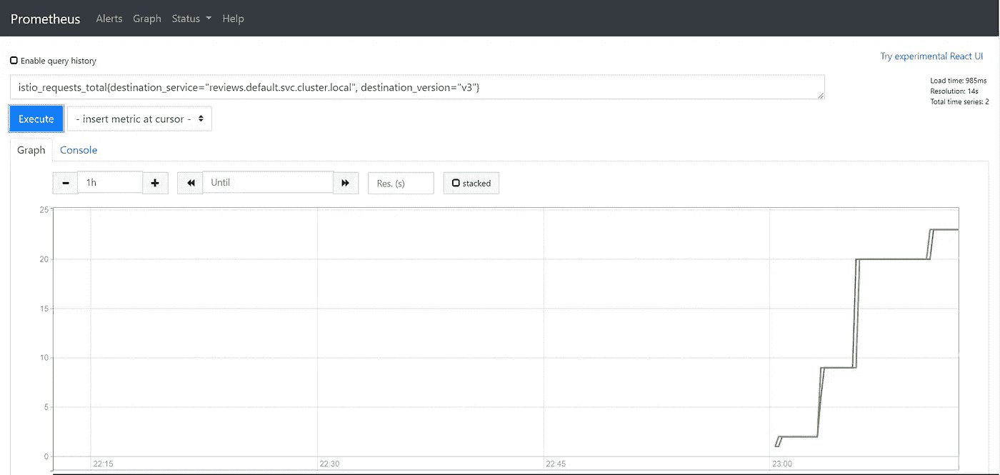
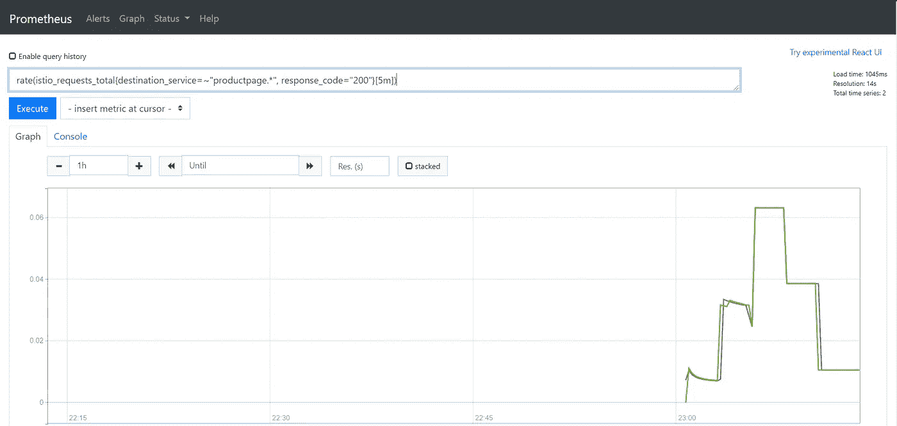
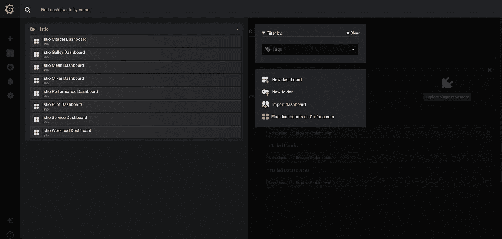
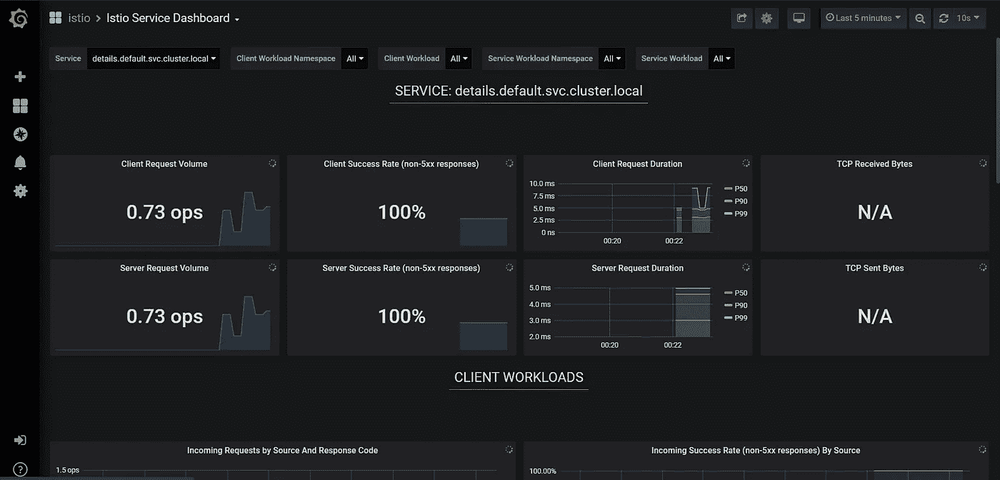
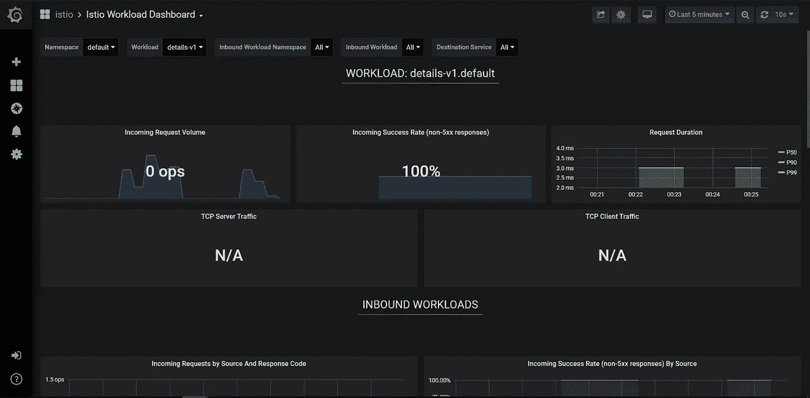

# 如何在 Kubernetes 上可视化您的 Istio 服务网格

> 原文：<https://betterprogramming.pub/how-to-visualise-your-istio-service-mesh-on-kubernetes-209c7b439a41>

## 使用 Prometheus 和 Grafana 可视化您的微服务指标


布鲁克·卡吉尔在 [Unsplash](https://unsplash.com/collections/353844/work?utm_source=unsplash&utm_medium=referral&utm_content=creditCopyText) 上的照片

如果你在 Kubernetes 中运行 [Istio](https://istio.io/) 来管理你的微服务，收集和可视化你的指标是它提供的关键特性之一。它为您提供了对网格的大量控制和权力，并允许您更好地了解您的微服务。

它不仅为您的运营团队提供了解决问题的有用见解，还为您的安全团队提供了有价值的数据。这有助于他们做一些事情，比如用入侵检测软件连接你的网格，进一步保护你的应用程序。

这个故事是对“[如何使用 Istio 注入故障来排除 Kubernetes](https://medium.com/better-programming/how-to-use-istio-to-inject-faults-to-troubleshoot-microservices-in-kubernetes-108250a85abc) 中的微服务故障”的后续。今天，让我们讨论使用 [Prometheus](https://prometheus.io/) 和 [Grafana](https://grafana.com/) 收集和可视化 Istio 服务网格。

# Istio 如何收集指标？

如果您正在阅读本系列，您应该知道 Istio 使用 Envoy 代理作为微服务容器的辅助工具。

由于所有的流量都流经这些代理，它们向 Prometheus 发送遥测数据，这些数据可以使用 Grafana 等工具进行存储和可视化。

您还可以将您的指标导出到工具，如 [ELK stack](https://www.elastic.co/what-is/elk-stack) 或安全扫描仪，以从数据中获得进一步的见解，并将其用于未来的分析和机器学习。

# 先决条件

我们将在这个任务中使用 Bookinfo 应用程序，并生成一些流量。然后，我们将使用 Prometheus 查询度量，并使用 Grafana 可视化遥测数据。

确保您运行的是 Kubernetes 集群，并在其上安装了 Istio。遵循“[Kubernetes 上的 Istio 入门](https://medium.com/better-programming/getting-started-with-istio-on-kubernetes-e582800121ea)”指南，确保您已经完成了该指南中的所有任务，并且已经部署了 Bookinfo 应用程序。

# 收集遥测数据

`ratings-v2`服务可以连接一个后端 MongoDB 数据库服务器。让我们利用这一点来模拟真实的前端-后端情况。

安装`ratings-v2`服务:

```
$ kubectl apply -f samples/bookinfo/platform/kube/bookinfo-ratings-v2.yaml
serviceaccount/bookinfo-ratings-v2 created
deployment.apps/ratings-v2 created
```

现在安装`mongodb`服务:

```
$ kubectl apply -f samples/bookinfo/platform/kube/bookinfo-db.yaml
service/mongodb created
deployment.apps/mongodb-v1 created
```

现在，让我们定义目的地规则，以便我们可以根据选定的标签路由流量。这与我们在以前的文章中应用的目的地规则相同。

```
$ kubectl apply -f samples/bookinfo/networking/destination-rule-all.yaml
destinationrule.networking.istio.io/productpage created
destinationrule.networking.istio.io/reviews created
destinationrule.networking.istio.io/ratings created
destinationrule.networking.istio.io/details created
```

下一步是使用虚拟服务公开微服务。让我们先看看 YAML 的档案

虚拟服务评级

正如您在 YAML 中看到的，所有的`reviews`流量都应该流向`reviews-v3`，所有的`ratings`流量都应该流向`ratings-v2`。

通过运行以下命令来应用虚拟服务:

```
$ kubectl apply -f samples/bookinfo/networking/virtual-service-ratings-db.yaml
virtualservice.networking.istio.io/reviews created
virtualservice.networking.istio.io/ratings created
```

# 发送流量

下一步是通过服务发送一些流量，这样我们可以检查 Istio 是否正在收集下一部分的指标。

访问产品页面，并多次刷新您的浏览器以产生一些流量。



产品页面

# 使用 Prometheus 查询指标

通过端口转发代理暴露普罗米修斯。

```
$ kubectl -n istio-system port-forward $(kubectl -n istio-system get pod -l app=prometheus -o jsonpath='{.items[0].metadata.name}') 9090:9090 &
[1] 910
$ Forwarding from 127.0.0.1:9090 -> 9090
```

现在，通过你的浏览器打开链接`http://127.0.0.1:9090`。



普罗米修斯仪表板

如果您理解 Prometheus 查询语言，我们可以通过键入参数名来搜索特定的指标。

先打`istio_tcp_connections_opened_total`开始吧。



istio _ TCP _ connections _ open _ total

那`istio_tcp_connections_closed_total`呢？



`istio_tcp_connections_closed_total`

让我们看看使用`istio_requests_total`的总请求，但是这一次，我们将看看图形视图。单击图形选项卡，在搜索框中键入指标，然后单击执行



`istio_requests_total`

现在让我们尝试一些高级查询。对`reviews-v3`微服务的所有请求呢？

```
istio_requests_total{destination_service="reviews.default.svc.cluster.local", destination_version="v3"}
```



istio _ requests _ total for reviews-v3

以及对`productpage`微服务的请求率？

```
rate(istio_requests_total{destination_service=~"productpage.*", response_code="200"}[5m])
```



产品页面的 istio_requests_total 比率

如你所见，我们成功地使用 Prometheus 收集和查询了遥测数据。

# 使用 Grafana 可视化指标

对于一个技术人员来说，通过 Prometheus 查询指标可能就足够了。不过，如果你希望有人直观地可视化数据，特别是运营团队和想要分析数据的人，我们可以使用 Grafana 等数据可视化工具。

通过端口转发代理暴露 Grafana。

```
kubectl -n istio-system port-forward $(kubectl -n istio-system get pod -l app=grafana -o jsonpath='{.items[0].metadata.name}') 3000:3000 &
```

从浏览器中打开 URL。



Grafana 仪表板

选择 Istio 文件夹，如您所见，当您安装 Istio 时，您已经获得了许多预配置的 Grafana 仪表板。您可以使用仪表板来监控每个 Istio 组件和您的微服务。

您还可以根据自己的需求定制和创建新的仪表盘。

如果您打开 Grafana service dashboard，您可以看到与您的所有服务相关的指标。您还可以过滤特定的服务以查看它们的指标。

现在，通过多次刷新产品页面来生成一些流量，您应该会看到 Grafana 仪表板开始显示指标。



Istio 服务仪表板

如果您想了解工作负载，Grafana 中有一个内置的工作负载仪表板—打开仪表板查看工作负载图表。



Istio 工作量仪表板

探索其他仪表板，查看您可以使用 Istio 收集和监控的多个可视化和指标。

恭喜你！您已经完成了使用 Prometheus 和 Grafana 可视化您的微服务指标的活动。

# 结论

感谢您通读！我希望你喜欢这篇文章。在下一部分中，我们将讨论"[如何使用 Istio](https://medium.com/better-programming/how-to-harden-your-microservices-on-kubernetes-using-istio-29c23dd90670) 强化您在 Kubernetes 上的微服务"，下一篇文章再见！