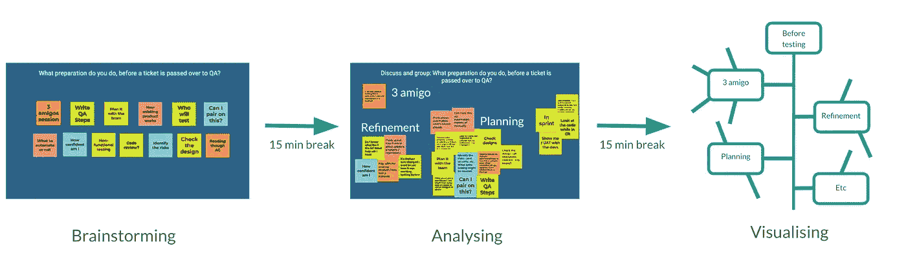
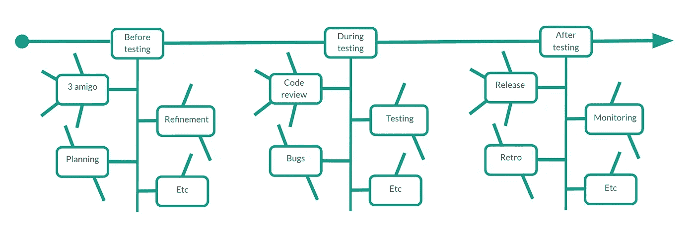
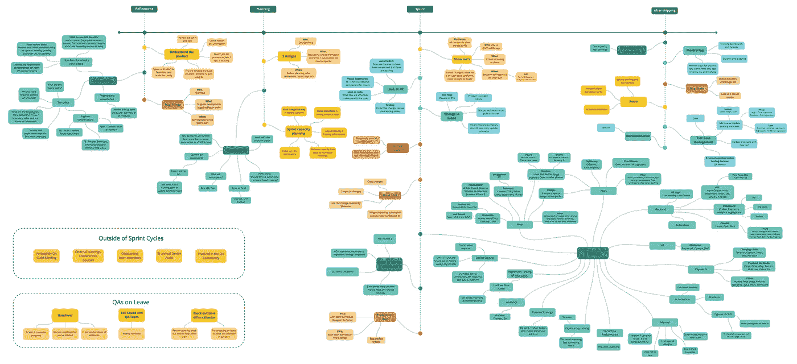

# 如何想象你的工作方式

> 原文：<https://betterprogramming.pub/how-to-visualise-your-ways-of-working-cbb892b24acc>

## 扔掉大量文本的战略文档，建立一个团队如何工作的可视化表示

杰森·古德曼在 [Unsplash](https://unsplash.com?utm_source=medium&utm_medium=referral) 上的照片

我相信你们都记得有一次，一位经理传递了一份战略文件，其中包含一整面墙的文字，描述如何做好你的工作。你可能读了一遍，几年后偶然发现了它，却发现它根本就没用！

当我在 2021 年初成为 QA 主管时，我的目标就是避免这种情况。我想找到一种可视化工作方式的方法(哇),并带领我的整个团队踏上实现这一目标的旅程。

再往下一点，我们不仅创建了我们 WoW 的可视化表示，而且它非常成功，我带领多个团队完成了这个旅程，并在今年早些时候在 TestBash UK 与更广泛的测试社区分享了它。我们是这样到达那里的。

> 我和我的 QA 团队这样做了，但这可以很容易地复制到产品、设计或开发团队。

# 成为领导后的经验教训

2021 年初，我进入了领导岗位，我的首要任务之一就是制定战略。我阅读的所有资料都建议创建一个战略文档，但这并不适合我。在与我的团队交谈并查看维基页面中丢失的旧战略文件后，我意识到:

> 没有人想看一份关于如何做好自己工作的文件！

无论如何，我想避免创建一个文本过多的战略文档，并尝试创建一些可视化的东西。

此后不久，一位敏捷教练加入了我们公司，整个开发团队接受了广泛的敏捷培训。我们深入探讨了沟通与协作、心理安全和团队健康的敏捷基础，但最让我难忘的是:

> 当解决一个问题时——把 80%的注意力放在人身上，10%放在过程上，10%放在工具上。

我认为人们经常误解这一点——他们试图用新的工具或流程来解决问题，而不是关注团队本身。所以我改变了我的策略，我没有让*我*创造一个视觉战略，而是找到了一种方式*我们*可以作为一个团队取得更大的成就。

在 QA 团队招聘了一些新员工后，我开始观察人们是如何工作的。当涉及到基本的 QA 职责时，很快就发现每个人的工作方式都不一样。我希望我们走到一起，统一我们的 WoW，所以我采取了以下方法:

> 让团队发现他们合作的方式。

快进几个星期，我们有一个充分计划的团队日，充满了实践研讨会，以帮助我们创建我们的视觉 QA 哇。最重要的是，我利用上面学到的经验，使它成为一个以人为本的、实用的、可视化的工作坊。

# WoW 工作室

当我想出举办 WoW 研讨会的想法时，我心中有 3 个主要目标:

1.  让我们了解我们作为 QAs 是如何工作的
2.  让每个人都做出贡献并互相学习
3.  有一个视觉效果代表我们的哇

为了实现这一目标并使流程更易于管理，我将研讨会分成了 3 个关键区域:

*   **测试前**——产品改进和计划阶段的所有质量保证责任。
*   **测试期间—** 正常测试生命周期中的所有 QA 职责。
*   **测试后** —产品发布后的所有 QA 职责。

这种划分有助于突出会议重点，并使范围更容易理解。接下来，我将参加研讨会的人分成 3 个小组，以促进协作，并允许每个小组一次处理一个关键领域。

研讨会随后分三场进行，每场约一小时:

1.  **头脑风暴会议—** 确定测试前、测试期间和测试后&QA 负责的关键活动
2.  **分析会议—** 分析&将活动分组，互相讨论和学习，以及我们如何以不同的方式做事。
3.  **可视化会议** —创建团队 WoW 的有序可视化表示。

结果是——在 3 次会议之后，每个人都贡献了自己的想法，每个人都讨论、分析并就团队的惊喜达成一致，每个人都开始设想最终产品。

# 想象你的惊喜

可视化一个 WoW 的困难部分是弄清楚如何到达那里。如上所述，我们通过 3 次研讨会完成了这项工作。这里有一个实际的例子来帮助理解这个过程:

在测试之前关注**。**

**集思广益** —在集思广益阶段，团队在一块板上贡献卡片，详细说明测试前 QA 负责的所有活动，例如:与团队一起制定计划、编写 QA 步骤、3 次朋友会议以及识别风险。

**分析** —然后团队将这些卡片分成不同的类别，例如:3 个朋友、精致、计划。没有规定一个类别应该是什么——它可以是一次会议，一个发展阶段，或者只是一个总结类似任务的词。

**可视化** —团队然后根据开发生命周期对类别进行排序。例如，3 个朋友首先发生，然后细化，然后规划。为了形象化这一点，团队在垂直时间线上绘制了有序的类别和其中的任务。

研讨会

在 **测试期间**和测试后**对**重复该过程。**一旦组合起来，就形成了顶级的*水平时间轴*。因此，这代表了开发生命周期的完整旅程，以及您的团队如何从左上到右下完成他们的 WoW，并在您构建的每个新产品中重复:**

可视化 WoW 模板

一个月后，我们的团队完成了我们在研讨会上构建的第一个草稿，并将其扩展为我们 QA WoW 的完整深入版本。

它看起来是这样的:

视觉效果——可下载链接[此处](https://drive.google.com/file/d/1OX16Jx54kHP7CZX5sFLVDCFLCFo2HbcK/view?usp=sharing)

我们为测试活动(绿色)、会议相关活动(黄色)、bug 相关活动(红色)等添加了粗略的颜色编码。

# 好处和收获

经历这段旅程让我受益匪浅，学到了很多东西。一些亮点包括:

## 好处:

*   **挂在墙上** —可视化你的 WoW 最好的部分是你可以打印出来，挂在墙上让每个人都可以看到。从来没有战略文件被贴在墙上。
*   **团队买入** —带领整个团队踏上旅程，让人们拥有并推动 WoW 向前发展。
*   **更广泛的公司影响**—WoW 是分享和帮助他人了解你的工作和影响的好方法。这帮助我证明了 QA 是一个关键的业务功能。
*   **需要改进的地方** —一旦这些都以可视的形式写在纸上，就很容易发现需要改进的地方，这些地方可以成为你下一个季度目标的一部分。
*   **入职** —这是一个很好的工具，可以帮助新成员加入你的团队，并向他们展示你是如何做事的。

## 学习内容:

*   需要时间——你可以在一个 WoW 研讨会上有一个很好的开始，但是要完成一个最终产品需要时间和协作。考虑把它作为一个季度目标。
*   **它并不完美**——你的团队不会一直完美地遵循视觉效果，但你可以分析它并进行改进以达到目的。
*   它应该是前瞻性思维——一个惊喜不应该只是你现在做的事情，它应该是你的愿景的一部分，是你想去的地方。确保你添加了你将来想要完成的类别和任务。

# 向前冲，让你的团队惊叹不已

现在剩下的就是你自己去尝试了。如果有，请告诉我进展如何！

> 想听更多:这里有一个链接，链接到我在 2022 年英国测试大会上的演讲，题目是“扔掉质量保证战略文件，建立一种工作方式”