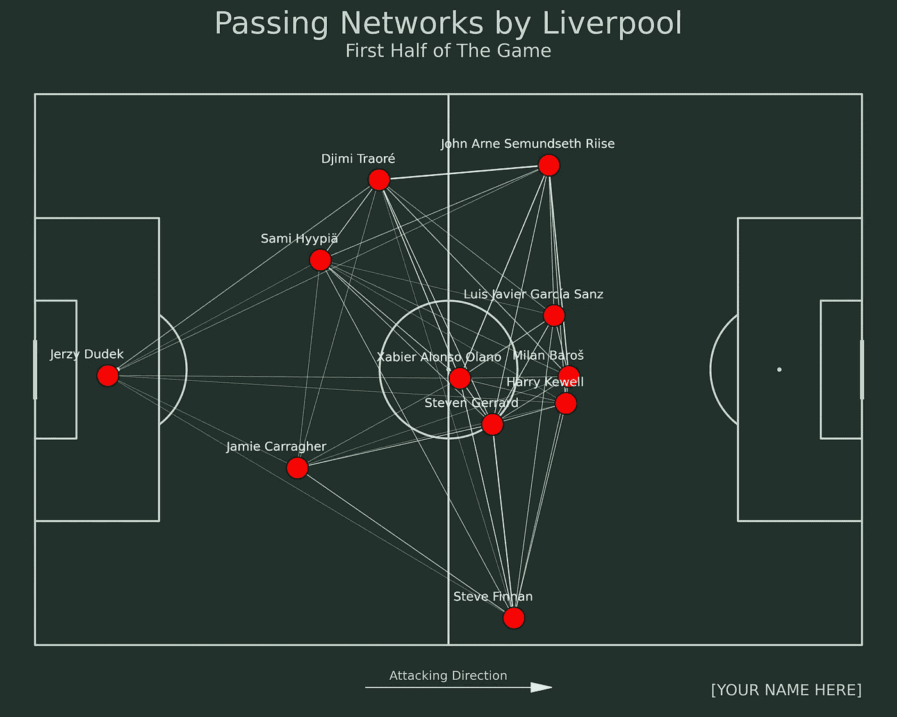

# 如何使用 Python 可视化足球传球网络

> 原文：<https://betterprogramming.pub/how-to-visualize-football-passing-networks-using-python-6f6582aa8005>

## 从团队的比赛模式中获得洞察力

本斯·巴拉-肖特纳在 [Unsplash](https://unsplash.com/s/photos/football?utm_source=unsplash&utm_medium=referral&utm_content=creditCopyText) 拍摄的照片

在本文中，我将向您展示如何使用 Python 可视化经过的网络。如果您对可视化还不熟悉，结果将如下所示:

那么什么是传球网呢？传球网络是一种形象化的方式，用传球来表现一个球队的比赛模式。

从那里，我们可以看到每个球员是如何通过传球次数和谁的接球手来相互影响的。还有，我们可以看到球员在那场比赛中的平均位置如何。

事不宜迟，我们开始吧！

# 履行

## 数据源

我们将使用来自 StatsBomb 开放数据的数据源。该数据包含欧洲冠军联赛决赛、2018 年世界杯、2020 年欧洲杯、西甲联赛等比赛的足球赛事数据。

要访问数据，可以通过 GitHub 库[这里的](https://github.com/statsbomb/open-data)**来访问。现在让我们访问数据。**

**在这篇文章中，我们将在上半年创建利物浦的传球网络。我们将使用“伊斯坦布尔奇迹”比赛作为源数据。**

**因为数据是分文件夹的，所以我们要找到对应的标识匹配的 id。**

**检索数据有几个步骤。首先，我们需要查看 competitions.json 文件，并过滤包含欧洲冠军联赛比赛的数据。下面是实现这一点的代码:**

**比赛在 2004/2005 赛季举行。从上面可以看到，对应的比赛和赛季 id 分别是 16 和 37。让我们使用这些 id 来检索那个赛季的所有比赛。下面是实现这一点的代码:**

**从上面可以看到，匹配对应的 id 是 2302764。该 id 也用作包含匹配事件数据的文件名。**

**虽然数据是 JSON 格式的，但是我们可以使用 pandas 和 json_normalize 函数打开数据。让我们通过使用这些代码行来打开数据:**

**因为我们希望将数据分成两半，所以我们将首先过滤数据。下面是实现这一点的代码:**

## **行动（或活动、袭击）计划**

**现在我们有了数据。为了生成传递网络，我们需要执行几个步骤。这些步骤如下:**

*   **过滤包含有关通行证信息的数据，**
*   **得到两个不同球员之间传球次数的数据，**
*   **获取玩家的平均位置数据，**
*   **结合这些数据，**
*   **根据上场时间检索前 11 名球员，**
*   **最后，生成传递网络。**

## **过滤数据**

**我们需要做的第一步是过滤数据。我们过滤包含通行证信息的数据。我们可以用熊猫来过滤数据。下面是实现这一点的代码:**

## **检索球员之间的传球次数**

**在我们得到数据后，我们需要计算球员之间的传球次数。为此，我们需要检索像传递者姓名、接收者姓名和时间戳这样的列作为诱饵。下面是实现这一点的代码:**

**为了计算特定对之间的传递次数，我们需要首先创建一个标识符。下面是实现这一点的代码:**

**之后，我们可以通过使用计数基于标识符聚合它们来计算传递的数量。让我们使用这几行代码:**

## **计算玩家的平均位置**

**下一步我们需要做的是计算玩家的平均位置。为此，我们需要检索像玩家姓名和位置这样的列。下面是实现这一点的代码:**

**在我们检索列之后，我们通过根据玩家的名字聚集数据来计算玩家的平均位置。**

**因为 location 列是列表格式的，所以我们需要创建两个列，分别表示 x 和 y 坐标。下面是实现这一点的代码:**

## **合并两种数据**

**在我们得到我们需要的数据后，下一步是合并数据。我们将合并包含不同对之间的传球次数以及球员平均位置的数据。**

**因为我们已经创建了标识符，所以我们可以更容易地连接数据。以下是合并包含通道数的数据的代码:**

**要合并球员的平均位置数据，我们可以使用 merge 函数，并使用球员的名字作为标识符。下面是实现这一点的代码:**

## **检索出场时间最多的 11 名球员**

**因为我们想要创建传球网络，所以一个球队有可能在一场比赛中有超过 11 名球员。**

**因此，我们需要过滤数据，检索利物浦的前 11 名球员。下面是实现这一点的代码:**

**获得前 11 名玩家后，我们可以使用以下代码行过滤数据:**

## **建立传递网络**

**但是等等，在我们这样做之前，我们需要再创建一个列来表示我们的传球网络的宽度，其中宽度将被用作决定传球频率的标记。下面是实现这一点的代码:**

**现在我们已经到了最后一步，那就是建立传球网络。为了生成可视化效果，下面是实现这一点的代码:**

**我知道这是一长串代码。如果您想了解关于该代码的更多细节，可以通过这里的链接阅读 mplsoccer 库中的文档。此外，您可以通过下面的链接阅读我关于 mplsoccer 库的文章:**

** [## 如何在 Python 中使用 Mplsoccer 可视化足球数据

### 每个人的足球分析。

better 编程. pub](/how-to-visualize-soccer-data-using-mplsoccer-in-python-39e2eddfb7d9)** 

# **结束语**

**干得好！现在，您已经了解了如何使用 Python 生成传递网络。我希望你能学到很多东西，比如聚合数据、过滤数据、创建可视化等等。**