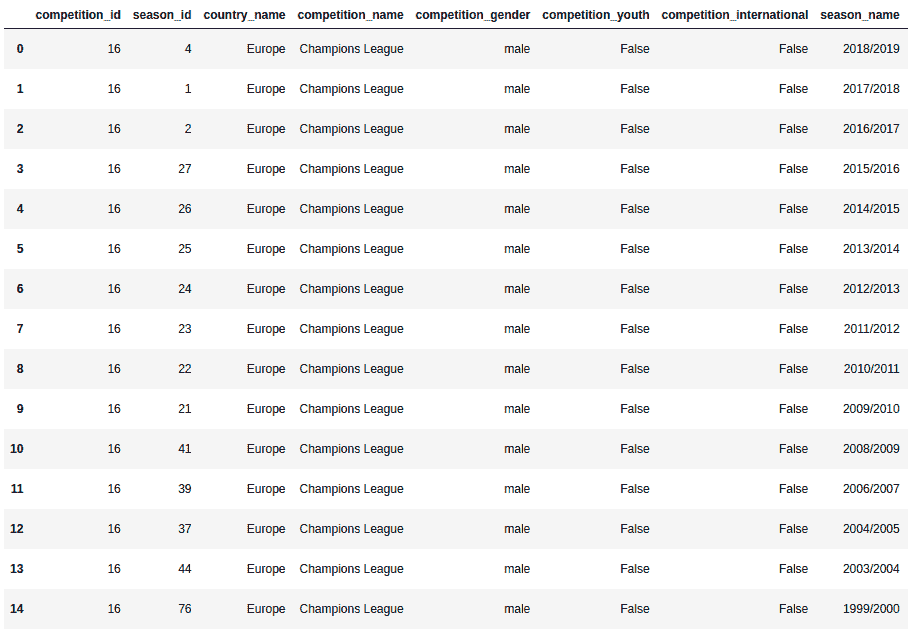
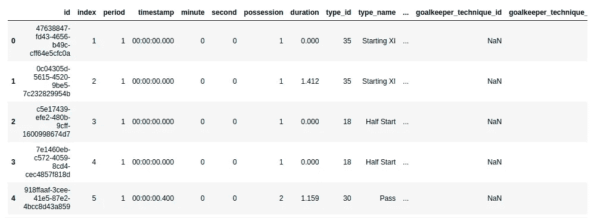
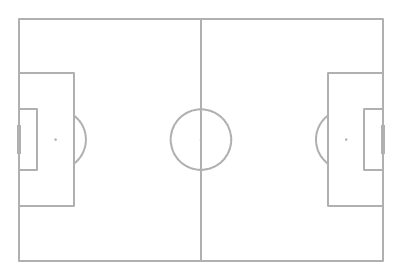
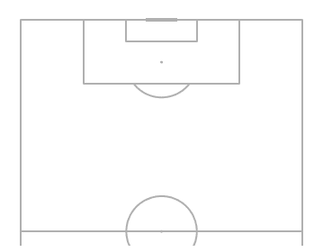
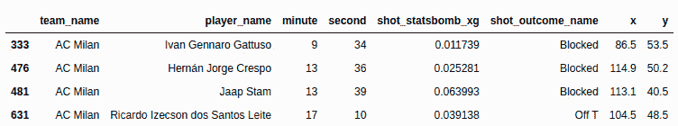
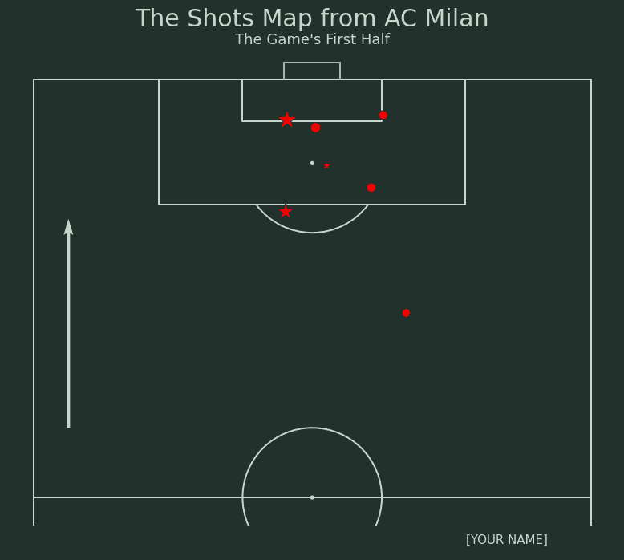
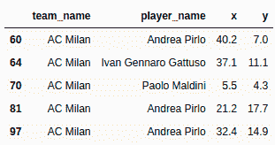
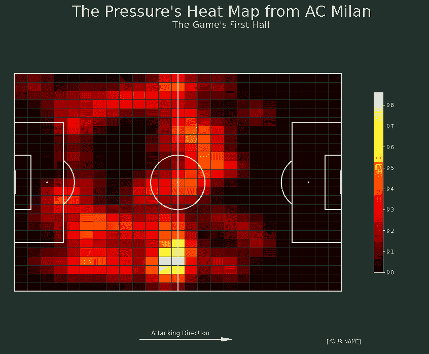

# 如何在 Python 中使用 Mplsoccer 可视化足球数据

> 原文：<https://betterprogramming.pub/how-to-visualize-soccer-data-using-mplsoccer-in-python-39e2eddfb7d9>

## 每个人的足球分析。


由[托马斯·塞勒](https://unsplash.com/@jesusance?utm_source=unsplash&utm_medium=referral&utm_content=creditCopyText)在 [Unsplash](https://unsplash.com/s/photos/football?utm_source=unsplash&utm_medium=referral&utm_content=creditCopyText) 上拍摄的照片

# 介绍

近年来，足球分析已经成为一种趋势。许多足球俱乐部开始招募数据科学家加入他们的团队。甚至 BBC 还创造了一个标题，数据专家是足球界最好的引援[1]。

由于高需求和曝光率，人们开始进入足球分析。有很多开源工具和数据可以用来开始这个领域的工作。Mplsoccer 是创建足球数据可视化的工具之一[2]。

在本文中，我将向您展示如何通过使用像`mplsoccer`和`matplotlib`这样的库来实现这些可视化。事不宜迟，我们开始吧！

# 履行

## 关于图书馆

Mplsoccer 是一个基于 Python 的可视化足球图表库。在 Python 中可视化足球数据并不像可视化散点图或直方图那样简单。

多亏了这个库，我们可以根据现有数据展示任何足球图表。我们可以使用 mplsoccer 创建一些可视化效果，如雷达图、热图、射击图等等，这个库可以帮助你直接生成可视化效果。

此外，这个库可以帮助加载 StatsBomb 数据。对于本文，我们将不使用加载 StatsBomb 数据的函数，我们将尝试从头开始加载数据。

要安装库，很简单。您所需要的只是一个如下所示的 pip 命令:

```
! pip install mplsoccer
```

运行该命令后，您可以使用该库来可视化足球数据。

## 加载数据

但是在我们能够可视化数据之前，我们需要首先访问我们的数据。在本文中，我们将使用来自 StatsBomb 的数据，您可以通过 StatsBomb 的 GitHub 存储库[访问这些数据。](https://github.com/statsbomb/open-data)

与其他数据集不同，使用和访问足球数据，尤其是 StatsBomb，是一项具有挑战性的工作。

我们需要采取三个步骤。这些步骤是查看比赛 ID、比赛 ID，最后加载混乱的 JSON 文件。所以让我们开始吧。

我们需要获得 2005 年利物浦和 AC 米兰之间的欧洲冠军联赛决赛的赛事数据。

但是因为 events 文件夹包含许多文件，并且他们使用 ID 来命名它，所以我们需要首先打开 competitions.json 文件。

我们将数据作为数据框打开，并过滤包含冠军联赛作为其比赛名称的数据。下面是实现这一点的代码:

```
import pandas as pdcompetitions = pd.read_json('open-data/data/competitions.json')
competitions[competitions.competition_name == 'Champions League']
```

以下是数据框的预览:



正如您从数据框中看到的，有比赛何时举行以及赛季和比赛的相应 ID 等信息。利物浦和 AC 米兰的比赛发生在 2005 年。所以我们取比赛 ID 16，赛季 ID 37。

因为比赛包含大量的比赛，我们需要查看相应比赛的比赛 ID。为此，您可以运行以下代码行:

```
import jsonwith open('open-data/data/matches/16/37.json') as f:
   data = json.load(f)
   for i in data:
      print(i['match_id'], i['home_team']['home_team_name'],     
      i['home_score'], "-", i['away_score'], i['away_team'] 
      ['away_team_name'])
```

从该代码中，我们只检索到 StatsBomb 提供的一个匹配，这是最终的匹配。匹配的对应 ID 是 23202764。有了这个 ID，我们就可以访问事件数据来分析游戏。

如您所知，像 competition.json 文件一样，事件数据也使用 json 格式，并且它包含一个嵌套表单。

起初，加载像 dataframe 这样的文件似乎很有挑战性。但是我们不用担心，因为熊猫图书馆提供了一个名为`json_normalize`的函数。

下面是实现这一点的代码:

```
with open('open-data/data/events/2302764.json') as f:
   data = json.load(f)
   df = pd.json_normalize(data, sep="_")
   df.head()
```



从这个数据框架，现在我们可以创建任何我们喜欢的可视化。为了方便起见，我们把数据分成前半部分和后半部分。让我们开始吧。下面是实现这一点的代码:

```
first_half = df.loc[:1808, :]
second_half = df.loc[1809:3551, :]
```

# 拍摄地图

获得数据后，让我们从中创建一些可视化。我想给你们看的第一个可视化图像是拍摄地图。但在此之前，让我们先看看如何创造音高。

可视化球场是可视化足球数据的重要步骤。在`mplsoccer`出现之前，人们创建了他们的足球图表，我知道这很有挑战性，因为我们必须自己绘制线条。

因此，在`mplsoccer`库出现之前，可视化足球数据并不适合所有人。为了直观地展示这一点，我们只需添加以下几行代码:

```
from mplsoccer import Pitchpitch = Pitch(pitch_type='statsbomb')
pitch.draw()
```

以下是结果预览:



我们不必添加线条或指定间距的长度。你所需要的只是一个物体，然后嘣，你就有了它。

因为我们想要可视化射门图，所以我们需要一个半垂直的足球场。要创建它，您需要做的就是像这样修改前面的代码:

```
from mplsoccer import VerticalPitchpitch = VerticalPitch(pitch_type='statsbomb', half=True)
```

以下是结果预览:



这不是很简单吗？！现在让我们创建拍摄地图。

在创建可视化之前，我们需要准备包含射门本身信息的数据，包括射门位置、哪个队射门、谁射门以及进球的可能性。

让我们准备一个包含 AC 米兰上半场镜头的数据框架。下面是实现这一点的代码:

```
**# Retrieve rows that record shots**
shots = first_half[first_half.type_name == 'Shot']**# Filter the data that record AC Milan**
shots = shots[shots.team_name == 'AC Milan']**# Select the columns**
shots = shots[['team_name', 'player_name', 'minute', 'second', 'location', 'shot_statsbomb_xg', 'shot_outcome_name']]**# Because the location data is on list format (ex: [100, 80]), we extract the x and y coordinate using apply method.**
shots['x'] = shots.location.apply(lambda x: x[0])
shots['y'] = shots.location.apply(lambda x: x[1])
shots = shots.drop('location', axis=1)**# Divide the dataset based on the outcome**
goals = shots[shots.shot_outcome_name == 'Goal']
shots = shots[shots.shot_outcome_name != 'Goal']shots.head()
```

以下是数据预览:



有了数据之后，下一步是创建可视化。让我们先建一个摊位。下面是实现这一点的代码:

```
from mplsoccer import VerticalPitchpitch = VerticalPitch(pitch_type='statsbomb', half=True, goal_type='box', goal_alpha=0.8, pitch_color='#22312b', line_color='#c7d5cc')fig, axs = pitch.grid(figheight=10, title_height=0.08, endnote_space=0, axis=False,title_space=0, grid_height=0.82, endnote_height=0.05)fig.set_facecolor("#22312b")
```

之后，我们来添加拍摄点。在下面添加这些代码行:

```
scatter_shots = pitch.scatter(shots.x, shots.y, s=(shots.shot_statsbomb_xg * 900) + 100, c='red', edgecolors='black', marker='o', ax=axs['pitch'])scatter_goals = pitch.scatter(goals.x, goals.y, s=(goals.shot_statsbomb_xg * 900) + 100, c='red', edgecolors='black', marker='*', ax=axs['pitch'])
```

添加完这些点之后，让我们添加描述可视化本身的文本。在下面添加这些代码行:

```
axs['endnote'].text(0.85, 0.5, '[YOUR NAME]', color='#c7d5cc', va='center', ha='center', fontsize=15)axs['title'].text(0.5, 0.7, 'The Shots Map from AC Milan', color='#c7d5cc', va='center', ha='center', fontsize=30)axs['title'].text(0.5, 0.25, 'The Game\'s First Half', color='#c7d5cc', va='center', ha='center', fontsize=18)
```

最后，我们需要添加一个箭头来清除正在发生的比赛的攻击方向。在下面添加这些代码行:

```
pitch.arrows(70, 5, 100, 5, ax=axs['pitch'], color='#c7d5cc')
```

完整的代码如下所示:

```
from mplsoccer import VerticalPitchpitch = VerticalPitch(pitch_type='statsbomb', half=True, goal_type='box', goal_alpha=0.8, pitch_color='#22312b', line_color='#c7d5cc')fig, axs = pitch.grid(figheight=10, title_height=0.08, endnote_space=0, axis=False, title_space=0, grid_height=0.82, endnote_height=0.05)fig.set_facecolor("#22312b")scatter_shots = pitch.scatter(shots.x, shots.y, s=(shots.shot_statsbomb_xg * 900) + 100, c='red', edgecolors='black', marker='o', ax=axs['pitch'])scatter_goals = pitch.scatter(goals.x, goals.y, s=(goals.shot_statsbomb_xg * 900) + 100, c='red', edgecolors='black', marker='*', ax=axs['pitch'])pitch.arrows(70, 5, 100, 5, ax=axs['pitch'], color='#c7d5cc')axs['endnote'].text(0.85, 0.5, '[YOUR NAME]', color='#c7d5cc', va='center', ha='center', fontsize=15)axs['title'].text(0.5, 0.7, 'The Shots Map from AC Milan', color='#c7d5cc', va='center', ha='center', fontsize=30)axs['title'].text(0.5, 0.25, 'The Game\'s First Half', color='#c7d5cc', va='center', ha='center', fontsize=18)plt.show()
```

最终，照片的可视化效果将会是这样的:



## 压力热图

我想给你们看的第二个图像是压力热图。该热图表示一个位置的压力频率。压力越大，该位置的颜色越亮。

生成热图与创建前一张拍摄图是一样的。唯一的不同是我们在球场上想象一个统计总结。但在此之前，我们首先准备数据。下面是实现这一点的代码:

```
pressure = first_half[df.type_name == 'Pressure']
pressure = pressure[['team_name', 'player_name', 'location']]
pressure = pressure[pressure.team_name == 'AC Milan']pressure['x'] = pressure.location.apply(lambda x: x[0])
pressure['y'] = pressure.location.apply(lambda x: x[1])
pressure = pressure.drop('location', axis=1)pressure.head()
```

以下是数据预览:



现在让我们创建图表。代码如下所示:

```
from scipy.ndimage import gaussian_filter
import matplotlib.pyplot as pltpitch = Pitch(pitch_type='statsbomb', line_zorder=2, pitch_color='#22312b', line_color='#efefef')fig, axs = pitch.grid(figheight=10, title_height=0.08, endnote_space=0, axis=False, title_space=0, grid_height=0.82, endnote_height=0.05)fig.set_facecolor('#22312b')bin_statistic = pitch.bin_statistic(pressure.x, pressure.y, statistic='count', bins=(25, 25)) bin_statistic['statistic'] = gaussian_filter(bin_statistic['statistic'], 1)pcm = pitch.heatmap(bin_statistic, ax=axs['pitch'], cmap='hot', edgecolors='#22312b')cbar = fig.colorbar(pcm, ax=axs['pitch'], shrink=0.6)cbar.outline.set_edgecolor('#efefef')cbar.ax.yaxis.set_tick_params(color='#efefef')plt.setp(plt.getp(cbar.ax.axes, 'yticklabels'), color='#efefef')axs['endnote'].text(0.8, 0.5, '[YOUR NAME]', color='#c7d5cc', va='center', ha='center', fontsize=10)axs['endnote'].text(0.4, 0.95, 'Attacking Direction', va='center', ha='center', color='#c7d5cc', fontsize=12)axs['endnote'].arrow(0.3, 0.6, 0.2, 0, head_width=0.2, head_length=0.025, ec='w', fc='w')axs['endnote'].set_xlim(0, 1)
axs['endnote'].set_ylim(0, 1)axs['title'].text(0.5, 0.7, 'The Pressure\'s Heat Map from AC Milan', color='#c7d5cc', va='center', ha='center', fontsize=30)axs['title'].text(0.5, 0.25, 'The Game\'s First Half', color='#c7d5cc', va='center', ha='center', fontsize=18)
```

你能看出这段代码和前一段代码的区别吗？几乎没有！

除此之外，我们在前半部分增加了 gaussian_filter 函数来生成 AC Milan 的压力分布。根据结果，我们使用它创建热图。

这是可视化的最终结果:



# 结束语

干得好！您已经学习了如何使用 Python 中的`mplsoccer`创建足球数据的可视化。

我希望你能从这里学到新的东西，并指导你分析比赛，尤其是在 StatsBomb 数据上。你可以通过这个网站[这里](https://mplsoccer.readthedocs.io/en/latest/index.html)了解`mplsoccer`图书馆。

谢谢你看我的文章！

## 参考

[1]英国广播公司。数据专家正在成为足球界最好的签约。https://www.bbc.com/news/business-56164159
【2】mpl soccer 文档。[https://mplsoccer.readthedocs.io/en/latest/index.html](https://mplsoccer.readthedocs.io/en/latest/index.html)