# 如何用 Chart.js 和 InfluxDB 在 JavaScript 中可视化时间序列数据

> 原文：<https://betterprogramming.pub/how-to-visualize-time-series-data-in-javascript-with-chart-js-and-influxdb-7e0a9496d77e>

## 在本文中，您将学习如何从 InfluxDB 导入数据，并使用 Chart.js 将其可视化


克里斯·利维拉尼在 [Unsplash](https://unsplash.com/s/photos/data?utm_source=unsplash&utm_medium=referral&utm_content=creditCopyText) 上的照片

时间序列数据是指在特定时间段内重复收集的数据，如一秒钟、一分钟甚至一天。例如，比特币等加密货币的价格就是时间序列数据的一个很好的例子。它每分钟都在波动，如果你试图每 60 秒保存一次价格，你就会遇到可伸缩性问题。您的数据库将会不断增长，超过某一点后，使用将会变得低效。

要处理时序数据，您需要一个名为时序数据库(TSDB)的数据库。临时数据库针对存储时间序列数据进行了优化，使其更易于使用。 [InfluxDB](https://www.influxdata.com/) 提供了一个开源的 TSDB 来高效地处理时间序列数据。

在本教程中，您将学习如何结合使用 [Chart.js](https://www.chartjs.org/) 和 [InfluxDB'a JavaScript 客户端](https://docs.influxdata.com/influxdb/cloud/api-guide/client-libraries/nodejs/)进行可视化。

> 如果你想克隆这个项目并在你自己的编辑器中跟随，这里有到 [GitHub repo](https://github.com/rahulbanerjee26/InfluxDB_Charts_js) 的链接。

# 什么是 InfluxDB？

[InfluxDB](https://www.influxdata.com/) 为开发者提供存储时序数据并高效查询的解决方案。它支持包括 C++、Python、Rust 和 Java 在内的主要语言。此外，它有自己的查询语言，称为 [Flux](https://docs.influxdata.com/influxdb/cloud/query-data/get-started/) ，类似于 SQL，但特定于 InfluxDB。

InfluxDB 可用于执行以下操作:

*   存储 web 服务、机器学习模型或 API 的日志
*   金融预测和股票分析
*   处理从物联网设备接收的数据或来自车辆的传感器数据

如果您正在处理任何带有时间戳的数据，InfluxDB 可能是一个不错的解决方案。

# 什么是 Chart.js？

Chart.js 是一个开源的 JavaScript 库，可以让你轻松地为你的网站创建图表。它带有内置图表，但您可以自定义它们，并创建自己独特的视觉效果。

首先，让我们设置一下`Chart.js`。

# 设置 Chart.js

在本教程中，您将使用普通的 JavaScript。然而，如果您正在使用 JavaScript 框架，请查看`Chart.js`的[入门](https://www.chartjs.org/docs/latest/)页面了解更多信息。

要开始设置`Chart.js`，用一些标准代码创建一个 HTML 文件，如下所示:

接下来，您需要添加一个脚本标记来加载 Chart.js:

在`title`标签正上方的`head`标签内添加脚本标签。

在`body`标签内部，需要添加一个`canvas`元素。此元素将包含图表:

> 保存`ID`，因为在本教程稍后创建图表时会用到它。

对于 JavaScript 部分，您可以创建一个`script`标签并将其指向一个单独的文件，或者您可以直接在其中编写您的 JavaScript 代码。确保在 canvas 元素之后有您的 script 标记(不管您在哪里编写 JavaScript)。在本教程中，您将在一个单独的文件中编写 JavaScript，因此需要在 canvas 元素下添加以下脚本标记:

# 创建折线图

现在你已经设置了`Chart.js`，让我们创建一个[折线图](https://www.chartjs.org/docs/latest/charts/line.html)，这是一种在一条线上绘制数据点的方法。

您可以使用以下数据:

该数据包含 2021 年 3 月 7 日至 3 月 18 日苹果(AAPL)和 Spotify(现货)股票的高价格。

为了创建一个数据集，`Chart.js`将使用上面的数据绘制一个折线图。下面是创建数据集的代码:

`labels`中的值(即日期)和`datasets`数组中的对象是您试图绘制的线。你可以随意调整线条的颜色。

现在您需要为您的图表创建一个配置对象。config 对象将告诉`Chart.js`你想要什么类型的图表以及你想要绘制的数据集。它还可以让你定制你的图表。下面是配置对象:

在这里，将`type`指定为`'line'`，并将`options`的值留空。与`options`相关联的对象允许您定制您的图形并覆盖一些默认的图表配置。

在`options`中，你会注意到`responsive`被设置为假。然而，默认情况下，它将被设置为`true`。当设置为`true`时，如果您改变画布的大小，图形将不会放大或缩小。如果你想了解更多关于定制的信息，你可以访问 Chart.js 的网站。

现在您已经创建了 config 对象，您最终可以使用以下代码创建折线图:

您需要引用之前在 HTML 文件中创建的 canvas 元素的 ID。使用浏览器打开 HTML 文件，您应该会看到下图:

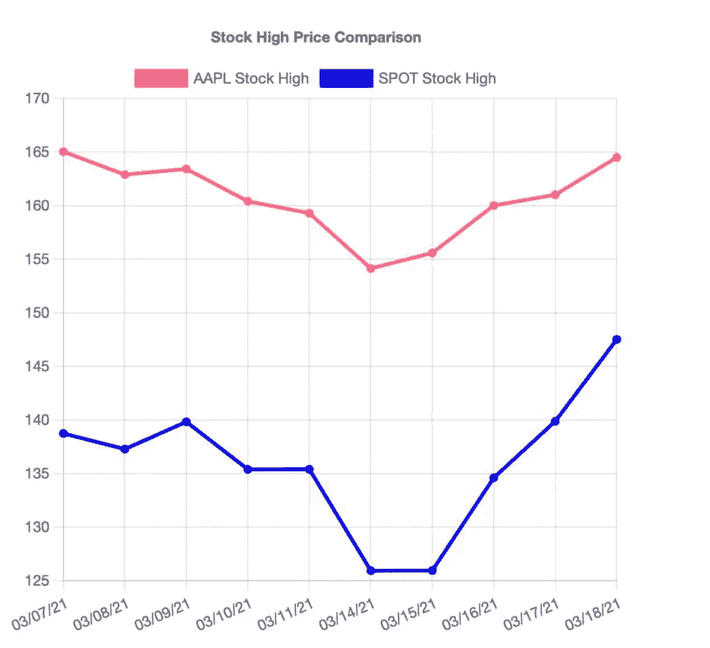

示例折线图

# 创建条形图

您可以使用在上一节中创建的相同 dataset 对象来创建一个条形图，该条形图以竖条的形式显示数据值。

首先，在包含条形图的 HTML 主体中创建一个新的`canvas`元素。确保它位于包含`Chart.js` JavaScript 代码的脚本标签之上:

接下来，创建一个`config`对象和`Chart`的实例:

因为您正在创建条形图，所以`type`的值需要设置为`'bar'`。使用浏览器打开 HTML 文件，您应该会看到下面的条形图:

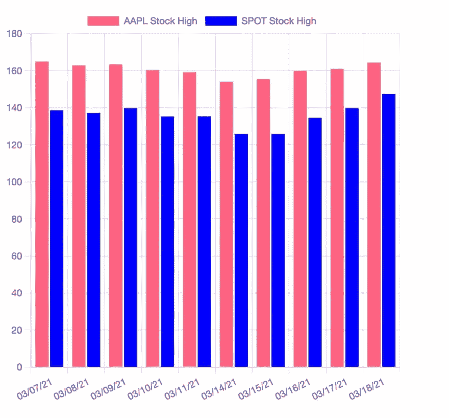

条形图样本

# 创建散点图

一个[散点图](https://www.chartjs.org/docs/latest/charts/scatter.html)是基于一个折线图，但是 x 轴变成了线性。对于前两个图表，您将 x 轴标签作为一个列表传递，将 y 值作为一个单独的列表传递。但是，对于散点图，您的数据必须是一个对象列表，其中每个对象代表一个 x-y 坐标。

首先，像前面一样为散点图创建一个画布元素:

然后创建您的数据:

`points_1`和`points_2`是两个独立的列表，包含代表 x-y 坐标的对象集合。接下来，您需要使用数据来创建数据集:

然后，创建一个`config`对象和一个`Chart`实例:

在浏览器中打开您的 HTML 文件，您应该会看到如下所示的图形:

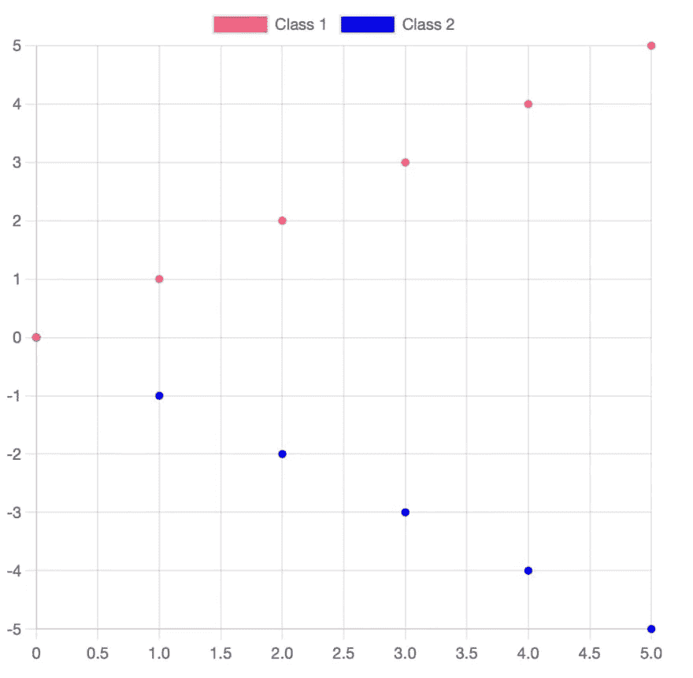

散点图示例

# 设置 InfluxDB

在你开始设置 InfluxDB 之前，你需要[下载](https://docs.influxdata.com/influxdb/v2.1/install/)你的操作系统的软件包。或者，如果您有 [Docker](https://www.docker.com/) ，您可以使用下面的命令下载并运行 InfluxDB 的 Docker:

```
docker run --name influxdb -p 8086:8086 influxdb:2.1.0
```

如果你在 Mac 上，你可以使用[自制软件](https://brew.sh/)进行安装:

```
brew install influxdb
```

安装 InfluxDB 后，使用以下命令设置 InfluxDB 的实例:

```
influxd
```

转到`[http://localhost:8086/](http://localhost:8086/)`，您应该会看到开始屏幕:

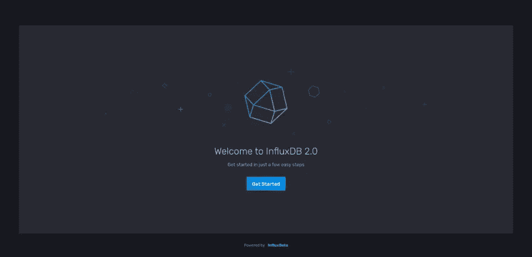

InfluxDB 欢迎屏幕

单击入门>快速入门，您应该会看到以下新用户屏幕:

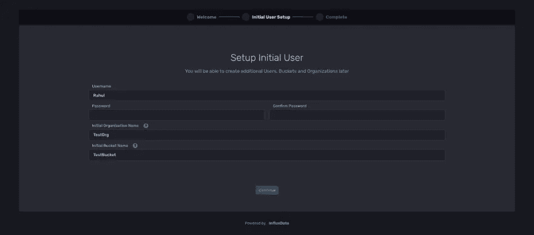

InfluxDB 设置初始用户页面

您可以为您的组织和存储桶选择任何您想要的名称，只需做好记录，因为您将在本教程的后面需要这些名称。创建帐户后，您将被带回到您的仪表板。单击 Load your data，您应该会看到以下内容:

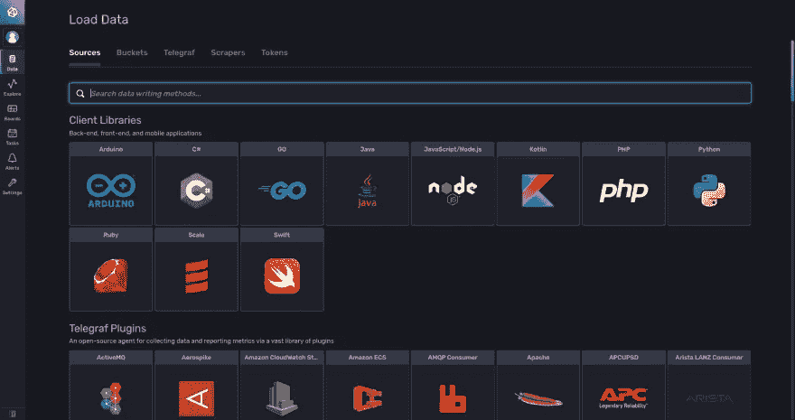

InfluxDB 加载数据页面

选择`JavaScript/Node.js`选项，您将被重定向到 Node.js 页面:

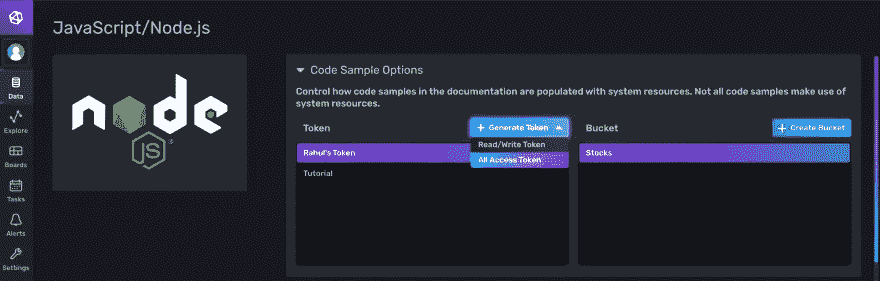

使用 NodeJS 页面加载数据

点击生成令牌>所有访问令牌。

按照本教程，您可以使用一个全访问令牌，但是出于安全原因，您可能希望限制访问。获得令牌 ID 后，将其复制到安全的地方，因为在连接 InfluxDB 时会用到它。

现在您已经准备好开始编码了。用标准样板文件创建新的 HTML 文件:

> 不要忘记包含加载`Chart.js`的脚本，因为您将使用它来可视化时间序列数据。

为了使本教程易于理解，您将在 HTML 主体的脚本标记中编写所有的 JavaScript。理想情况下，你可以使用像 [webpack](https://webpack.js.org/) 这样的工具，或者创建一个服务器来呈现你的前端。

将以下内容添加到您的`script`标签中:

确保您有一个 InfluxDB 实例在`[http://localhost:8086/](http://localhost:8086/)`上运行。然后，在浏览器中打开您的 HTML 文件，您应该看到客户机对象在控制台中被打印出来。

# 将数据导入 InfluxDB

我们将处理更多的股票数据。在这一部分，我们将使用 APPL 股票和 MSFT 股票。你可以从[这里](https://github.com/rahulbanerjee26/InfluxDB_Charts_js)下载 AAPL 股票数据和 MSFT 股票数据。

数据写入[线路协议](https://docs.influxdata.com/influxdb/v2.1/reference/syntax/line-protocol/)。这是一个样本数据点:

```
AAPL_2021-01-04,stock=AAPL Open=133.52000427246094,High=133.61000061035156,Low=126.76000213623047 1609718400
```

它遵循以下格式:

```
myMeasurement,tag1=value1 fieldKey="fieldValue" Unix Timestamp
```

*   `AAPL_2021–01–04` 用于唯一标识数据点。
*   `stock=AAPL`将数据点分组为 APPL 股票。对于 MSFT 股票，价值将是 MSFT
*   `Open=133.52000427246094`、`High=133.61000061035156`、`Low=126.76000213623047`是我们将要存储的字段值。它包括 2021 年 1 月 4 日 APPL 股票的开盘价、最高价和最低价
*   `1609718400`2021–01–04 是否在 UNIX 时间戳中转换

转到`localhost:8086`，点击左栏中的数据。点击桶>创建一个桶。


InfluxDB 创建存储桶页

将存储桶命名为“Stocks ”,保留默认选项。创建存储桶后，您需要添加数据。

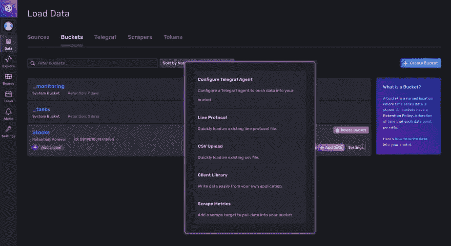

InfluxDB 加载数据页面

点击“线路协议”虽然我们的数据存储在 CSV 文件中，但它是以 line 协议格式编写的。

您应该会看到一个上传数据的选项。默认情况下，精度设置为纳秒，将其更改为秒。如果你不这样做，你的数据的时间戳会被弄乱。

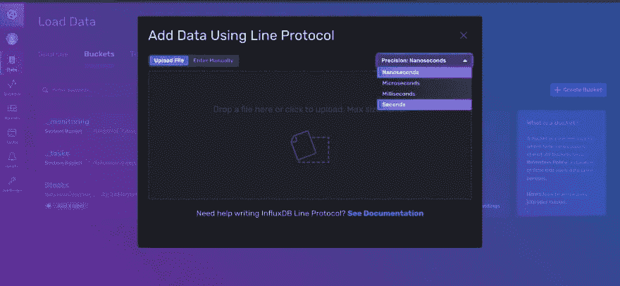

使用线路协议添加数据页面

上传 APPL 股票数据和 MSFT 股票数据。

上传数据后，选择您的存储桶，您将被重定向到以下页面:

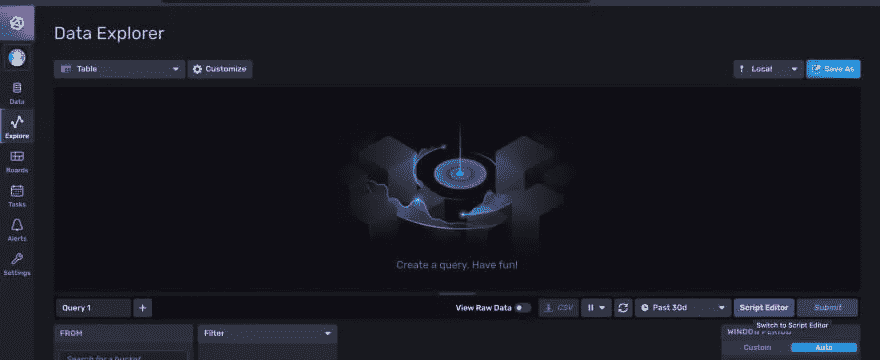

InfluxDB 数据浏览器页面

点击脚本编辑器。你可以在编辑器中使用 Flux 来查询你的数据。

下面是一个示例查询，它返回 2021 年 1 月的所有数据:

```
from(bucket:"Stocks")
    |> range(start: 2021-01-01, stop: 2021-01-31)
```

在数据资源管理器下，您可以选择查看数据的方式。选择“表格”。您应该会看到如下所示的内容:

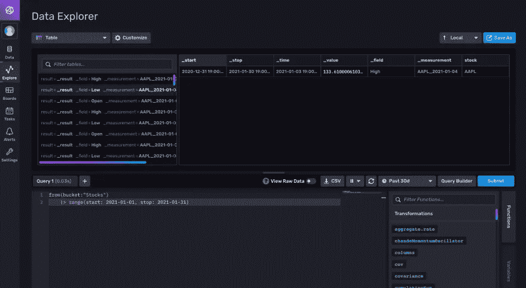

InfluxDB 数据浏览器页面

让我们尝试检索 2021 年 1 月 APPL 股票的开盘价和最高价:

```
from(bucket:"Stocks")
    |> range(start: 2021-01-01, stop: 2021-01-31)
    |> filter(fn: (r) => r._field == "Open" or r._field == "High")
    |> filter(fn: (r) => r.stock == "AAPL")
```

# 使用 InfluxDB 和 Chart.js

让我们创建一个简单的折线图，代表 APPL 股票在不同日期的高价值。

你可以在[本报告](https://github.com/rahulbanerjee26/InfluxDB_Charts_js)中找到本节所写的 HTML 和 JavaScript

转到您为此部分创建的 HTML 文件。在您的主体中，在脚本标记(导入 InfluxDB 客户端并使用您的令牌创建客户端实例的脚本标记)上方添加一个 canvas 元素。

在`script`标签内，添加以下内容:

这将让我们使用 flux 在 InfluxDB 中查询我们的 bucket。

要执行查询，您需要两件事情。flux 查询本身和一个 observer 对象。观察者对象允许您执行以下操作

*   如果 flux 查询返回多行，那么 observer 对象允许您对返回的每一行执行操作
*   它允许您处理错误
*   它允许您在成功返回所有行后执行操作。

下面是一个观察者对象示例:

您的`Chart.js`代码将进入完整的函数。

首先，创建一个变量来存储 flux 查询，并创建两个变量来存储数据:

`Query`将返回作为数据库中存储的所有日期的参数传入的`stock`的高值。

现在，创建观察者对象，如下所示:

暂时将完整的函数留空。在下一个函数中，我们从对象中读取数据，并将其存储在之前创建的变量中。不要忘记在存储之前将 Unix 时间戳转换成可读的日期时间格式。

如上所述，完整的函数将包含创建折线图的代码。

下面是完整的函数:

这与我们在本教程前面部分创建的折线图非常相似。下面是从 InfluxDB 查询日期并创建折线图的完整代码:

最后一行执行查询。在浏览器中打开您的 HTML 文件，您应该会看到下图:

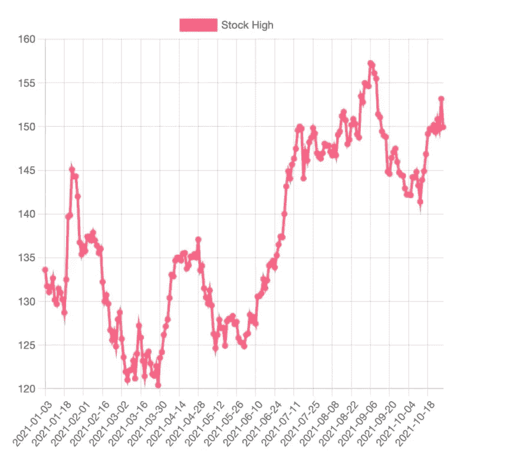

线形图

# 创建一个条形图来比较 APPL 和 MSFT 的开盘价

让我们创建一个条形图来比较 AAPL 和 MSFT 在 2021 年 1 月的开盘价。

在继续之前，不要忘记创建`canvas`元素:

让我们用以下代码创建一个变量来存储我们的 flux 查询和一些其他变量，我们将需要这些变量来存储条形图的数据:

`dates_open`将存储 2021 年 1 月的日期，`aapl_open`和`msft_open`将分别存储 APPL 和 MSFT 的未结值。

以上是我们的观察者对象的下一个函数。我们有一个检查来避免存储重复的日期，并根据股票类型将数据存储在`aapl_open`或`msft_open`数组中。

与上一节一样，您可以在`observer`对象的完整函数中包含绘制条形图的代码。下面是完整的代码:

您应该会看到下图:

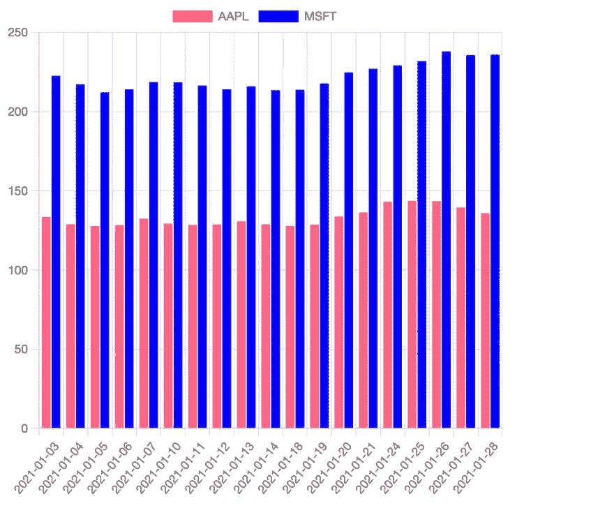

条形图

# 创建一个气泡图来显示高价格的变化

一个 b [ubble 图](https://www.chartjs.org/docs/latest/charts/bubble.html)类似于散点图。散点图可以绘制 x 和 y 坐标。另一方面，气泡图可以用不同的半径大小绘制 x 和 y 坐标。这里有一个来自`Chart.js`的气泡图示例:

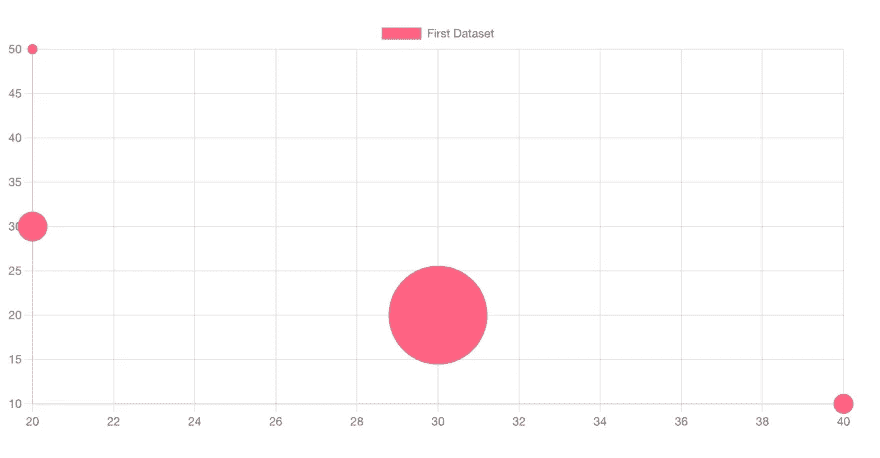

泡泡图

气泡图的数据必须是对象数组的形式。该对象必须包含一个`x`、`y`和`r`值。

`r`值将决定绘图的大小。

在我们的例子中，我们将绘制以下内容:

*   `x`是一个整数，代表一月中的某一天
*   `y`将是股票在`x`日的最高价格
*   `r`将高开之间的相对百分比差值，即`(High-Open)/Open*100`

下面是返回上述数据的 flux 查询:

```
from(bucket: "Stocks") 
    |> range(start: 2021-01-03, stop:2021-01-31)
    |> filter(fn: (r) => r._field == "High" or r._field == "Open")
    |> pivot(rowKey: ["_time"], columnKey: ["_field"], valueColumn: "_value") 
    |> map(fn: (r) => ({ r with "percentage": 100.0*(r.High- r.Open)/r.Open }))
```

您可以通过[这里的](https://docs.influxdata.com/influxdb/cloud/query-data/common-queries/multiple-fields-in-calculations/)了解更多关于上述查询中使用的各种 flux 命令的信息。

这是我们的下一个函数:

我们根据该行是 APPL 股票还是 MSFT 股票来增加变量`appl_count`和`msft_count`。该计数是气泡图的`x`值。存储百分比时，我们将其乘以`2`，因为百分比值非常小。气泡图将`r`值视为以像素为单位的半径。

因此，为了使气泡更大，我们将百分比放大`2`。因为我们对每个数据点进行缩放，所以不会影响气泡的相对大小。

代码的其余部分与前面几节非常相似，主要区别在于 config 对象中图表的类型。代码如下:

该图表应该如下所示:

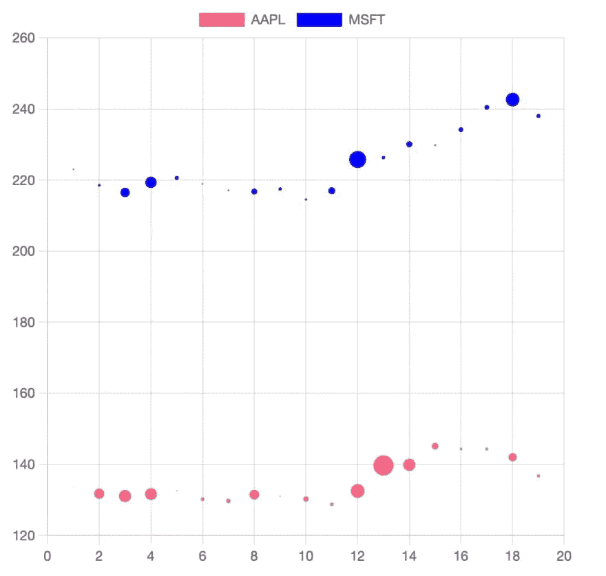

泡泡图

# 结论

在本教程中，您使用了 [Chart.js](https://www.chartjs.org/) 和 [InfluxDB 的](https://www.influxdata.com/) JavaScript 客户端来可视化股票数据。您使用 Flux 从 InfluxDB 查询数据。您能够绘制各种图表，如折线图、条形图、散点图和气泡图。您还获得了使用 InfluxDB 的 JavaScript 客户端库的经验。

如果你感兴趣，你也可以看看[如何使用 Python](https://www.realpythonproject.com/getting-started-with-python-and-influxdb/) 的 InfluxDB。

```
**Want to connect?**LinkedIn: [https://www.linkedin.com/in/rahulbanerjee2699/](https://www.linkedin.com/in/rahulbanerjee2699/)The article was originally posted on [realpythonproject.com](https://www.realpythonproject.com/how-to-visualize-time-series-data-in-javascript-with-chart-js-and-influxdb/)
```