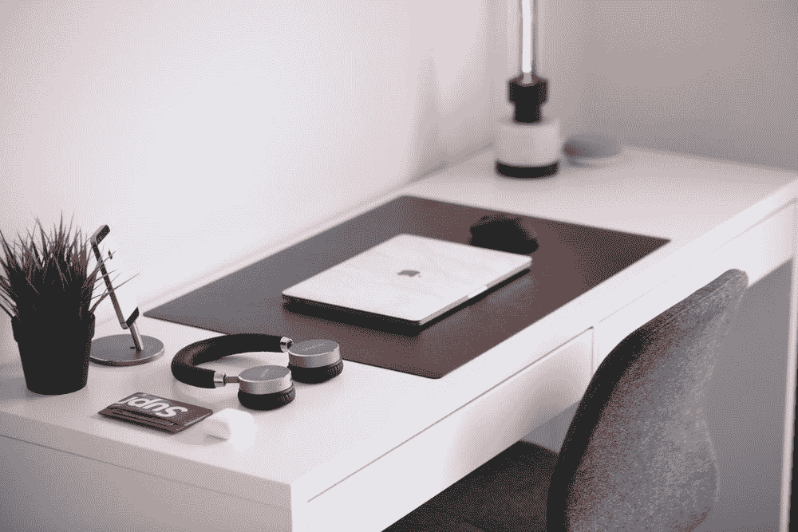
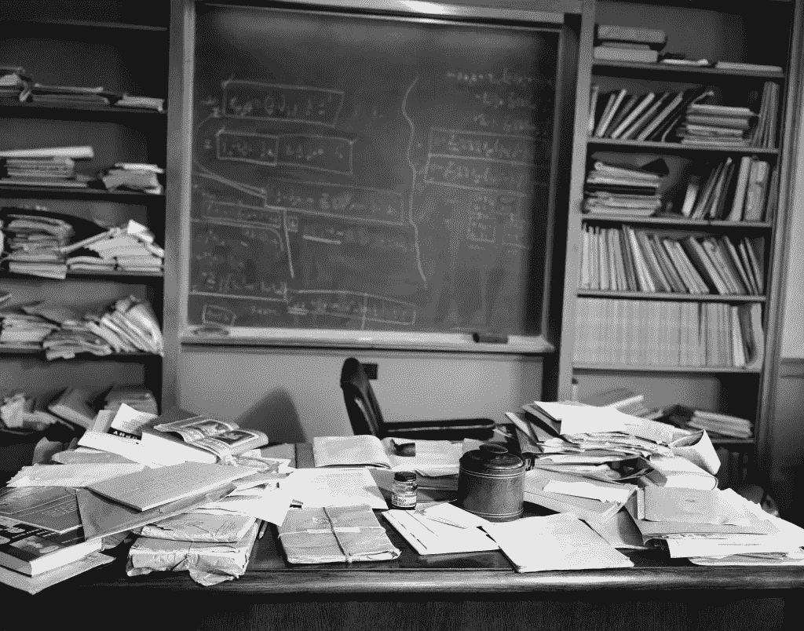
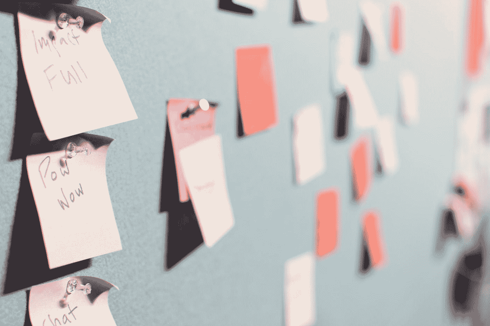
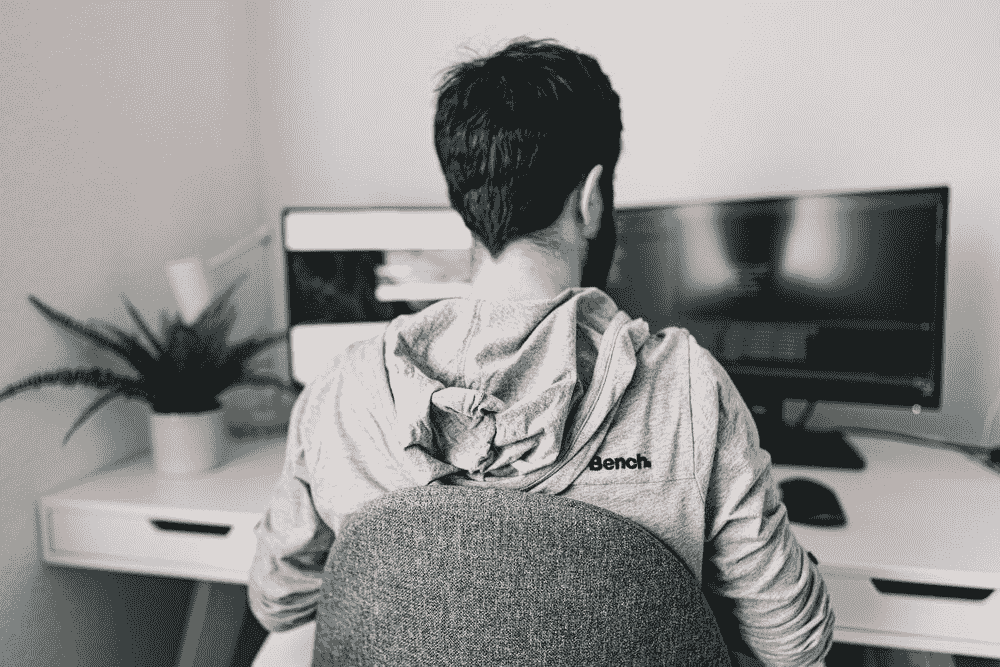
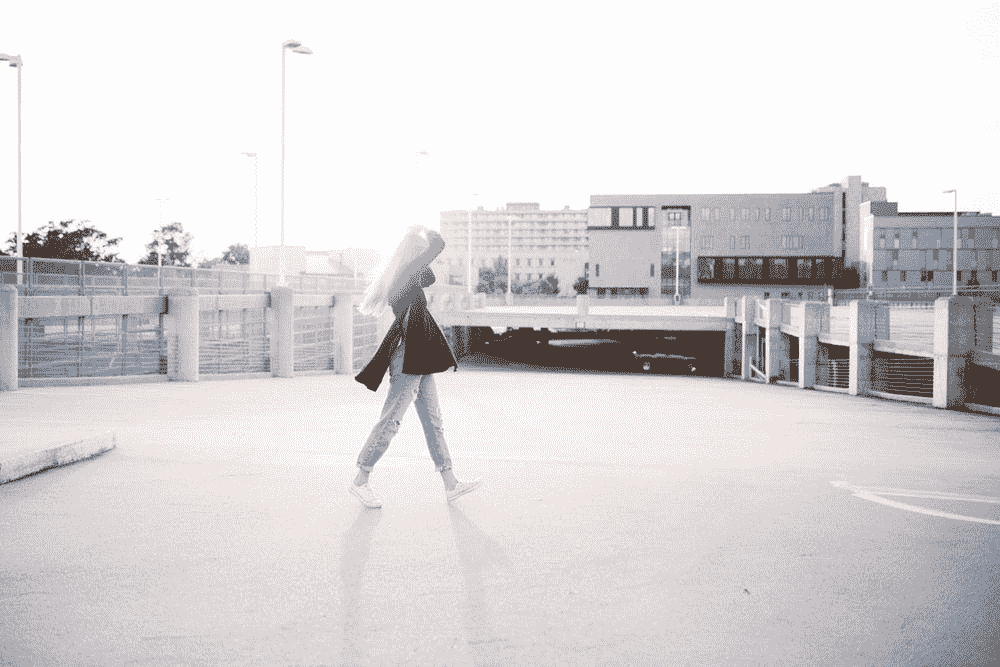
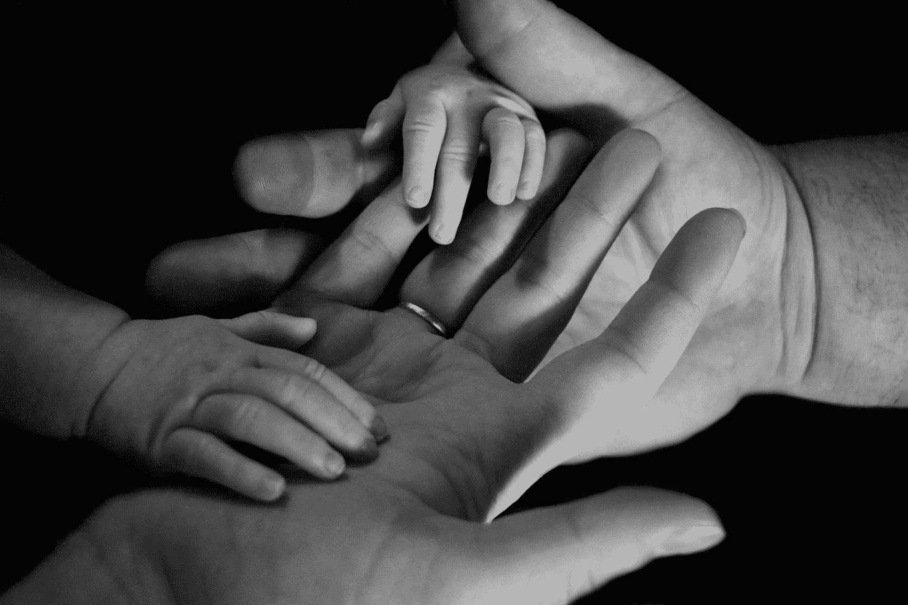

# 如何在新冠肺炎时代有效地在家工作

> 原文：<https://betterprogramming.pub/how-to-work-from-home-effectively-during-this-turbulent-time-c349ca1367bc>

## 在家工作已经成为新的规范

照片来自 [Unsplash](https://images.unsplash.com/photo-1525824617522-ca036119a052?ixlib=rb-1.2.1&ixid=eyJhcHBfaWQiOjEyMDd9&auto=format&fit=crop&w=1950&q=80) 。

T2:在家工作是我们时常想要的。床、冰箱、沙发和我们想要的任何东西都在几步之遥。在你的家庭办公室呆几天是没问题的，但是当政府建议你在家工作几周或几个月时，事情开始发生变化——无论是身体上还是精神上。

我们大多数人都习惯在办公室工作，因为这样更容易区分工作和个人生活。但是最近情况发生了变化，并不是每个人都习惯在家工作。那些有孩子的人可能特别困难，因为一些地区的学校和幼儿园都关闭了。这意味着他们需要平衡新的工作方式和照顾孩子，这可能是压倒性的。

在进一步阅读之前，应该注意的是，这篇文章主要是写给那些从事可以在家工作的职业的人的。

那么，在混合工作和个人生活时，我们如何才能有效地完成工作呢？

# 1.找到一个好地方

照片由 [NeONBRAND](https://unsplash.com/@neonbrand?utm_source=medium&utm_medium=referral) 在 [Unsplash](https://unsplash.com?utm_source=medium&utm_medium=referral) 上拍摄。

我见过很多人拍自己在床上、厨房或沙发上工作的照片。这可能会持续几天，但很快你会发现背痛和其他身体问题增加了。相反，找一个你可以适当坐着的地方(背部挺直)。如果你什么都没有，那么也许是时候投资一把像样的椅子和工作台了。

如果钱是一个问题，那么你可以问你的老板或者在网上找一些便宜的东西——有时甚至是免费的。这是值得的，因为你不想在床上或沙发上坐太久。这可能会导致严重的背部/颈部问题。

如果你和我一样是不安分的类型，尝试不同的工作环境。你可以先在沙发上或阳台上休息 30 分钟。但是请注意，大脑需要时间来集中注意力，如果你在太多的点之间切换，你将不得不重新设置你的焦点，这可能会很快降低你的生产力。

# 2.干净的桌子

图片来自 [Imgur](https://imgur.com/gallery/eoZjB) 。

一位出生于德国的理论物理学家[曾经问](https://quoteinvestigator.com/2017/09/02/clutter/)，“如果一张凌乱的桌子是一个混乱的头脑的标志，那么，一张空桌子是什么的标志？”说到这个，凌乱的桌子是天才头脑的标志。这是阿尔伯特·爱因斯坦的名言，上图是他的桌子的样子。

当然，我们可以告诉自己，凌乱的桌子是聪明的标志，或者我们可以停止为不打扫找借口。此外，有许多研究指出，凌乱的桌子是一个有创造力的人的标志。好吧，我们可以讨论这可能是真的还是假的，但从我的个人经验来看，很明显的是一张凌乱的桌子会对压力产生很大的影响。

我对清洁大脑的建议是，开始清理你的桌子、你的公寓或你周围任何可能干扰你集中注意力的东西。我的思维方式是这样的:干净的桌子是干净头脑的标志，干净的头脑是可以集中注意力的头脑。

# 3.计划你的一天

由 [Patrick Perkins](https://unsplash.com/@pperkins?utm_source=medium&utm_medium=referral) 在 [Unsplash](https://unsplash.com?utm_source=medium&utm_medium=referral) 上拍摄的照片。

对于那些喜欢写任务的人来说，这可能会触及一些敏感的部分，但是你不需要一个好的待办事项列表来完成事情。你不需要提前计划几天、几周或几个月就能感到富有成效。对我们中的一些人来说，大脑一次只能做一件事。我用过很多待办应用程序，提前几天甚至几周就计划好了，但这只是一种填补空白的错觉。

你唯一需要的就是一支笔，一张纸，和一些时间来理清哪些事情是紧急的，哪些事情不是。从做最紧急的事情开始。这会让你感觉更有效率。

# 4.沟通

照片来自 [Unsplash](https://images.unsplash.com/photo-1584722065001-ee7f49d903b1?ixlib=rb-1.2.1&ixid=eyJhcHBfaWQiOjEyMDd9&auto=format&fit=crop&w=1350&q=80) 。

无论你是否是团队的一员，沟通都是至关重要的。不要想当然地认为每个人都知道你在做什么。保持透明，让他们知道你的工作进展，比如你目前在做什么，你遇到的挑战，以及即将要解决的任务等等。让你的队友知道是有帮助的——尤其是在这种时候。

向你自己和你的工作证明在家工作和在办公室工作一样有效率。这就是为什么大多数企业更喜欢员工在工作中而不是在家。更容易看到他们在做什么，以及他们的表现如何。当然这个真的要看你是什么类型的职业了。

除此之外，交流也有助于获得解决问题的新见解和想法。所以，尽可能多地在办公室交流。

就我个人而言，我建议进行视频聊天、屏幕共享或直接打电话，而不是发送短信和电子邮件。这些事情需要时间，并为误解创造空间。

# 5.短暂休息

照片来自 [Unsplash](https://images.unsplash.com/photo-1444401139483-fe811f3f57d4?ixlib=rb-1.2.1&ixid=eyJhcHBfaWQiOjEyMDd9&auto=format&fit=crop&w=1350&q=80) 。

为了保持创造力和敏锐，短暂休息是至关重要的。我们都遇到过这样的情况:我们花了几个小时试图解决某件事，但第二天只需要几秒钟就能解决。休息的艺术是我们认为理所当然的事情。我们睡觉是因为没有睡眠我们无法正常工作。所以，短暂的休息和睡觉一样重要。

出去散步，洗个澡，喝茶，或者做任何有助于让你的注意力转移到其他事情上的事情。这也是和你的伴侣、朋友或室友一起散步的好时机。这些活动应该被安排好以避免被打断，所以，比如，在中午设定一个闹钟去散步 15 分钟。

小睡一会儿也有帮助，在家工作的好处是你的床离你只有几步之遥。为什么不用呢？

# 6.保持水分

由[约翰尼·麦克朗](https://unsplash.com/@johnnymcclung?utm_source=medium&utm_medium=referral)在 [Unsplash](https://unsplash.com?utm_source=medium&utm_medium=referral) 上拍摄。

就像汽车需要燃料才能运转一样，你的身体也需要水。水存在于所有细胞、器官和组织中，帮助调节身体的温度以正常发挥作用。我们大多数人忙于工作，以至于忘记了吃喝。

我发现做这些事情很有挑战性，因为不幸的是，自我占据了主导地位。这有点违反直觉，因为如果我们想最大化我们的表现并获得好的结果，我们就要负责照顾我们的身体和精神。如果你觉得喝水很困难，试试这个:在你身边放一杯水或一瓶水，这样每当你休息或看其他地方时，你就会被提醒喝水。

# 7.体育运动

托马什·woźniak 在 [Unsplash](https://unsplash.com?utm_source=medium&utm_medium=referral) 上拍照。

当坐着工作几个小时时，做一些运动(如拉伸、跑步、骑自行车或俯卧撑)有助于你感觉更好、更有活力，并且总的来说有耐力做更多事情。你不必全身心投入 1-2 小时的训练。你可以做 15-30 分钟的短时间运动来让血液循环。你不需要健身房来做这件事。你的客厅地板可以做到这一点。户外也是锻炼的好地方。

这也是一个很好的时间，带着你的家人或朋友一起度过一些美好的时光，同时享受乐趣和参加活动。

# 8.与爱人保持联系

丽芙·布鲁斯在 [Unsplash](https://unsplash.com?utm_source=medium&utm_medium=referral) 上的照片。

我们大多数人都忙于工作和生活中的其他事情，以至于忘记了与所爱的人保持联系。现在是时候拿起电话，打给你的妈妈或爸爸，或者任何你已经有一段时间没有联系的人。在这些时候，我们都意识到我们是多么需要彼此，帮助每个人保持动力是很重要的。

你可以像在办公室工作一样继续工作，或者你可以利用这段时间。所有这些都不是你应该临时做的事情。你应该把这些建议运用到你的余生中。选择如何明智地度过你的时间。

# 遗言

在家工作可能是一个挑战，因为家通常是我们用来脱离工作的地方。有明确的界限。但是，在政府建议我们在家工作以减少新冠肺炎病毒传播的时代，我们必须认真对待这些预防措施，并想办法重新调整我们习惯的工作方式。

## 总结一下:

1.  记得找一个好的工作点——不要在床上或沙发上，因为当你工作很长时间时，这对你的背部不好。
2.  有一张干净的桌子。这对你的健康和精神有好处。它能减轻压力，增加你的整体幸福感。
3.  通过关注紧急任务来计划你的一天。你只需要一支笔和纸来写你的待办事项。
4.  与你的团队沟通。让他们知道你在做什么，以及你面临的挑战。给他们看他们看不到的东西。
5.  休息片刻，保持敏锐和创造力。出去散散步，小睡一会儿，喝喝茶或咖啡，或者任何可以休息的事情，把注意力放在别的事情上。
6.  保持水分。身边放一瓶水，记得经常喝。
7.  做体育锻炼。这对你的健康和精神有好处。
8.  与家人和朋友联系。爱会帮助我们度过这些时光。这也有助于我们做得更好。

感谢阅读！保持健康。