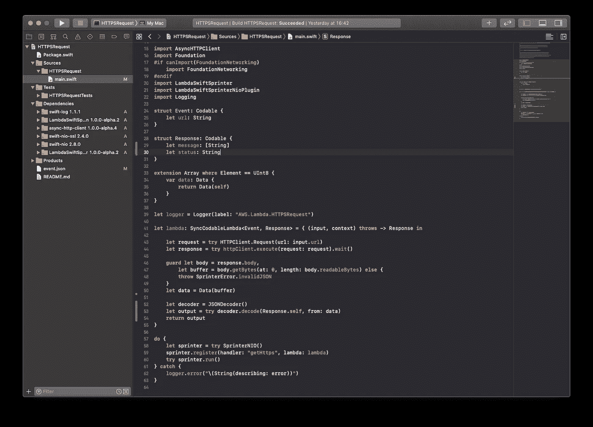
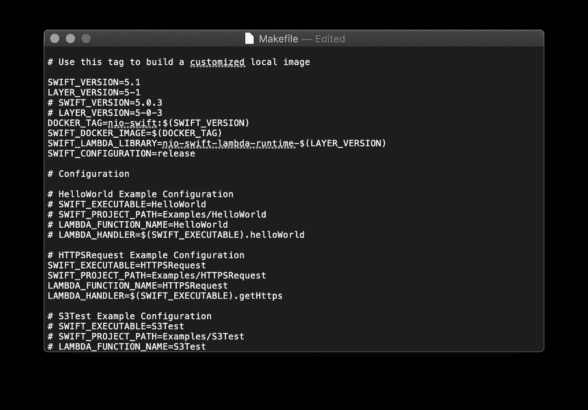
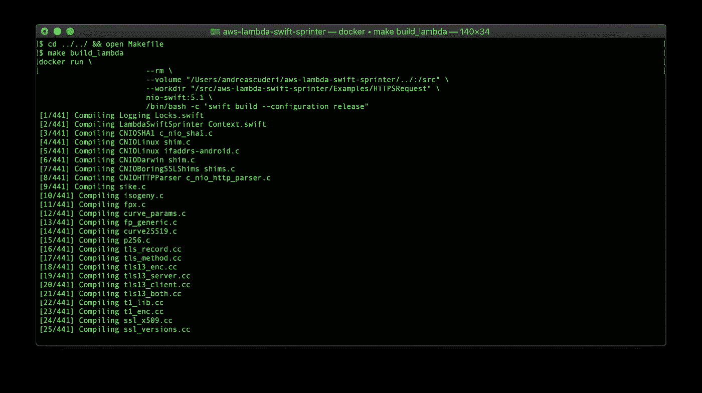
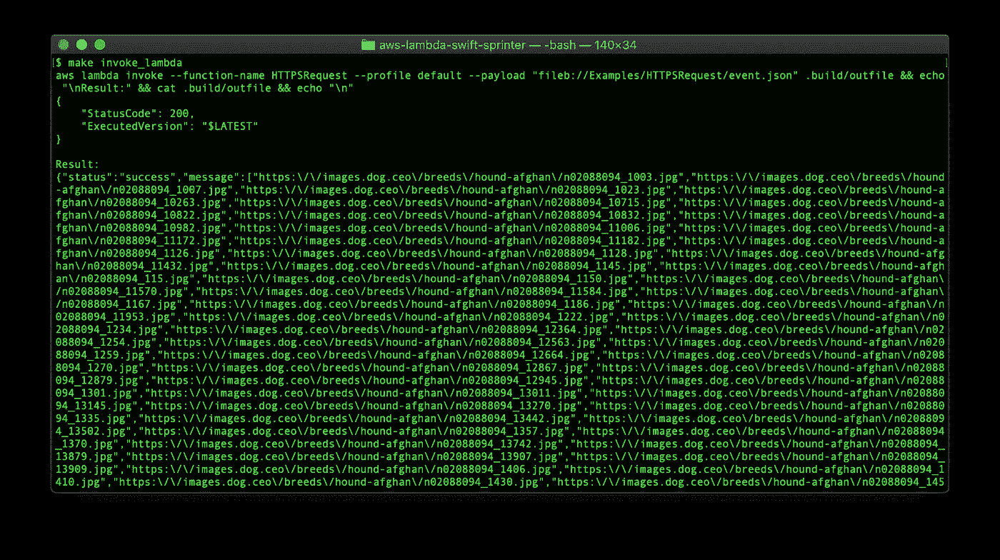

# 如何在 Swift 中使用 AWS Lambda

> 原文：<https://betterprogramming.pub/how-to-work-with-aws-lambda-in-swift-28326c5cc765>

## 介绍 Swift-Sprinter，这是一个用于 Swift 的开源库，支持 AWS 无服务器


Swift 对 AWS Lambda 的强大功能

# 介绍

这个故事开始于几年前，当时我是 BJSS 的一名 iOS 开发人员，我参与了为英国的一个政府机构提供一个 iOS 移动应用程序，这个应用程序有一个 AWS 无服务器后端。我非常兴奋地了解了 Lambda、S3、DynamoDB、SNS、Cognito、API Gateway、IAM 和 friends。最后，我的 AWS 无服务器后端和移动版 iOS Swift 原生应用的概念验证进入了 alpha、beta 和现在的生产阶段。

我意识到，从第一天开始，为一个无服务器的移动应用程序构建这个后端是*廉价且可扩展的*，并且与容器化的解决方案或虚拟机相比，只需要很少的维护。当后端负载无法预测时，无服务器方法非常有效。

无服务器引入的*按使用付费*模式可能有助于验证一个创业想法或一个小项目。

只有一件事让我失望——作为一名 iOS 开发者，我本来会用我钟爱的语言 Swift 来编写它，但当时它不被 AWS 支持。因此，我将后端的概念验证交给了精通其他语言的开发人员，我开发了 iOS 应用程序。

所以我在业余时间开始研究，让我的梦想变成现实…

一个月前，我遇到了一些半有效的解决方案，它们都有一个大问题:HTTPS 呼叫不起作用。

之后，我和 HTTPS 一起开发了一个可行的解决方案，并开发了一个叫做 [swift-sprinter](https://github.com/swift-sprinter/aws-lambda-swift-sprinter) 的开源框架。

有了这个框架，就有可能从用 Swift 5.0 和 5.1 编写的 Lambda 中消费 AWS 服务。如果你对如何使用 swift-sprinter 从 S3 桶中获取物体感到好奇，请阅读[这篇](https://github.com/swift-sprinter/aws-lambda-swift-sprinter/blob/master/Examples/S3Test/README.md)。

# Swift Lambda 的演示 HTTPS API 请求

为了简单起见，在本文中，我将展示如何编写一个 AWS Lambda 来查询 [dog-api](https://dog.ceo/dog-api/) 。

目标是通过传递我们最喜欢的品种，从这个 API 中检索一个带有图像 URL 列表的 JSON:

```
https://dog.ceo/api/breed/hound/afghan/images
```

然后像这样检索一个 JSON:

```
{
    "message": [
        "https://images.dog.ceo/breeds/hound-afghan/n02088094_1003.jpg",
        "https://images.dog.ceo/breeds/hound-afghan/n02088094_1007.jpg"
    ],
    "status": "success"
}
```

您需要:

*   [AWS 账户](https://aws.amazon.com/premiumsupport/knowledge-center/create-and-activate-aws-account/)
*   部署 Lambda 所需的 AWS 或策略的管理权限
*   [码头工人](https://www.docker.com/products/docker-desktop)
*   [AWS 命令行界面](https://docs.aws.amazon.com/cli/latest/userguide/cli-chap-install.html)

我建议在你继续阅读之前，先看看 GitHub 上的 README。

# 开发工作流程

从命令行:

```
git clone [https://github.com/swift-sprinter/aws-lambda-swift-sprinter.git](https://github.com/swift-sprinter/aws-lambda-swift-sprinter.git)cd aws-lambda-swift-sprinter/Examples/HTTPSRequest
```

生成 Xcode 项目并用 Xcode 打开它:

```
swift package generate-xcodeproj
```

打开 XCode，导航到文件`main.swift`并检查它。

`Event`是正确的——我们想要发送一个 URL 作为输入事件。

```
**struct** Event: Codable {
    **let** url: String
}
```

当执行完成时，`HTTPSRequest` lambda 示例将给出一个带有`url`和`content`的`Response`——这对我们的目的不利:

```
**struct** Response: Codable {
   **let** url: String
   **let** content: String
}
```

我们更改响应以反映我们想要接收的 JSON:

```
**struct** Response: Codable {
   **let** message: [String]
   **let** status: String
}
```

我们现在用数组`String`接收`message`，用数组`String`接收`status`。

现在要返回`Response`，我们需要用新的返回类型来修正 lambda 代码的返回类型:

```
... **let** decoder = JSONDecoder()
  **let** output = **try** decoder.decode(Response.**self**, from: data)
  **return** output
}
```

前面的代码将接收到的数据编码到`Response`，并将其作为 Lambda 输出返回。

这是最终输出:



现在打开`aws-lambda-swift-sprinter/Makefile`

```
cd ../../ && open Makefile
```

注释以下行:

```
# HelloWorld Example Configuration
# SWIFT_EXECUTABLE=HelloWorld
# SWIFT_PROJECT_PATH=Examples/HelloWorld
# LAMBDA_FUNCTION_NAME=HelloWorld
# LAMBDA_HANDLER=$(SWIFT_EXECUTABLE).helloWorld
```

然后取消注释以下行:

```
# HTTPSRequest Example Configuration
SWIFT_EXECUTABLE=HTTPSRequest
SWIFT_PROJECT_PATH=Examples/HTTPSRequest
LAMBDA_FUNCTION_NAME=HTTPSRequest
LAMBDA_HANDLER=$(SWIFT_EXECUTABLE).getHttps
```



保存并关闭文件。

# 拉姆达大厦

Lambda 运行在亚马逊 Linux 的定制版本上。要建立 Lambdayou，你需要一个快捷的自定义 docker 图像。

要构建映像，请使用以下命令:

```
make docker_build
```

现在从命令行测试构建:

```
make build_lambda
```

这需要几分钟时间。



太好了！代码也可以在 Swift docker 上运行，这意味着它已经可以部署了。

# AWS 部署

要完成这一步，您必须安装 [AWS 命令行界面](https://docs.aws.amazon.com/cli/latest/userguide/cli-chap-install.html)，并注册您的[配置和凭证](https://docs.aws.amazon.com/cli/latest/userguide/cli-configure-files.html)。

现在我们需要构建自定义运行时:

```
make package_layer
```

我们必须上传λ层:

```
make upload_lambda_layer
```

在`.build`文件夹下，列出一个名为`swift-lambda-runtime-5.1.zip`的 zip 文件和一个名为`nio-swift-lambda-runtime-5-1-arn.txt`的文件。

```
make create_lambda
```

该命令将在重新构建代码后在 AWS 上创建 Lambda。

命令完成后，转到 AWS 控制台并检查`HTTPSRequest`λ。

# λ调用

要调用 Lambda，我们需要设置事件:

```
open Examples/HTTPSRequest/event.json
```

①用这个更新它:

```
{"url": "https://dog.ceo/api/breed/hound/afghan/images"}
```

现在运行 Lambda 调用:

```
make invoke_lambda
```



# 结论

与 Swift 在 AWS 上的合作正在成为现实，尽管在这一早期阶段，该解决方案似乎很有希望。如果您有兴趣参与 Swift Sprinter 的开源开发，该项目欢迎投稿。

我希望你喜欢它！感谢阅读。

# 参考

[](https://github.com/swift-sprinter/aws-lambda-swift-sprinter) [## 雨燕-短跑运动员/AWS-lambda-雨燕-短跑运动员

### 这个项目的目标是为 Swift 编程提供一个构建 AWS Lambda 自定义运行时的环境…

github.com](https://github.com/swift-sprinter/aws-lambda-swift-sprinter)  [## 无服务器平台的敏捷开发

### 我仍然惊讶于使用 AWS 等技术创建一个新的无服务器应用程序所需的代码如此之少…

medium.com](https://medium.com/@danilop/agile-development-for-serverless-platforms-978bf38e82b7) [](https://aws.amazon.com/serverless/) [## 无服务器计算-亚马逊网络服务

### 构建和运行应用程序时无需考虑服务器无服务器是云的固有体系结构，它…

aws.amazon.com](https://aws.amazon.com/serverless/) [](https://medium.com/capital-one-tech/serverless-computing-with-swift-f515ff052919) [## 使用 Swift 进行无服务器计算

### 第 1 部分:Swift 和 AWS Lambda

medium.com](https://medium.com/capital-one-tech/serverless-computing-with-swift-f515ff052919)