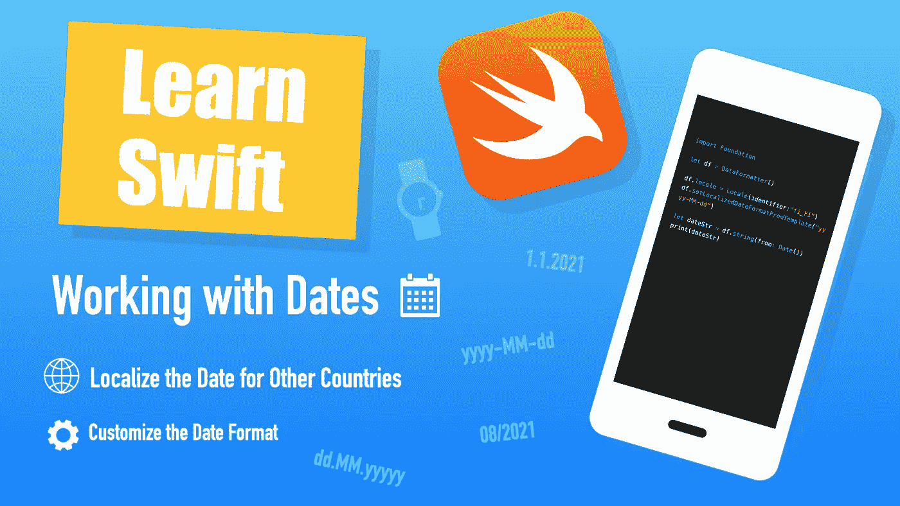

# 如何在 Swift 中处理日期

> 原文：<https://betterprogramming.pub/how-to-work-with-dates-in-swift-99f445a6179d>

## 关于在 Swift 中处理日期，您需要了解的一切



作者照片。

[根据苹果](https://developer.apple.com/documentation/foundation/date)显示，一个日期是:

> 独立于任何日历或时区的特定时间点

您只需使用以下命令即可获得当前日期:

```
**let** date = Date()
print(date)
```

输出:

```
2021-04-21 9:23:19 +0000
```

一个`Date`对象支持:

*   比较
*   时间间隔计算
*   根据另一个日期创建新日期。

例如:

输出:

```
3600.0
2021-04-20 05:18:45 +0000
2021-04-20 04:18:45 +0000
```

这已经很了不起了。但是如果你需要对日期有更多的控制，你应该使用 Swift 的内置`DateFormatter`。

# 日期格式化程序—自定义和本地化日期

如果您需要对显示日期进行更多控制(例如，您想要以其他国家的风格以其他格式显示日期)，那么您可以使用 Swift 的`DateFormatter`来完成这项工作。

## 使用样式预设设置日期格式

您可以使用内置的日期和时间样式预设来自定义您的日期格式。

一个`DateFormatter`具有有用的样式属性`dateStyle`和`timeStyle`。这两个可以用来改变日期显示的格式。

例如:

输出:

```
Tuesday, April 20, 2021 at 5:18:18 AM Greenwich Mean Time
```

在上面的代码中，我使用了`full` `dateStyle`和`timeStyle`来显示关于日期的所有信息。但是，这里列出了您可以使用的所有其他预置:

*   `none`
*   `short`
*   `medium`
*   `long`
*   `full`

## 自定义日期格式

为了进一步定制日期格式，您可以使用`DateFormatter`实例的`dateFormat`属性。

例如，要像`20.04.2021`一样显示当前时间，只需将格式`"dd.MM.YYYY"`分配给`DateFormatter`实例，如下所示:

输出:

```
20.4.2021
```

## 为其他国家本地化日期对象

您知道吗，您还可以本地化特定国家的日期，而无需了解该国家的日期格式指南。

为此，您可以使用`DateFormatter`的`setLocalizedDateFormatFromTemplate`方法。

例如，让我们以芬兰的方式显示当前日期。在芬兰，日期格式是`"dd.MM.yyyy"`。但是你不需要知道这些。您真正需要的是*地区标识符*，这是芬兰的`fi_FI`(参见 GitHub 上的本地化[的完整列表):](https://gist.github.com/jacobbubu/1836273)

输出:

```
20.04.2021
```

*注意:在定义了* `*locale*` *之后，调用* `*setLocalizedDateFormatFromTemplate*` *，以便正确格式化特定区域的日期！*

# 使用时间单位

您还可以分别处理不同的时间组件。例如，当你想打电话给`date.minutes`时，这很有用。为此，您需要利用`DateComponents`。

`DateComponents`以时间单位表示日期(如小时、分钟、秒等)。).

举个例子，让我们在`Calendar`和`DateComponents`的帮助下将日期的日期部分分开:

# 结论

在 Swift 中，处理日期非常简单。

除了比较日期和计算时间间隔之外，您还可以完全自定义日期格式。更好的是，您可以使用特定国家的时间格式，而无需自己了解该格式。

您还可以选择使用单独的日期组件，如年、月、日、小时等。

就是这样！

感谢阅读。我希望你觉得这有用！

# 你可能会感兴趣

[](https://medium.com/swlh/a-clock-using-swift-and-sprite-kit-27f3fffc878a) [## 使用 Swift 和 Sprite 套件的时钟

### 使用 Swift 和 SpriteKit 创建一个令人惊叹的时钟。

medium.com](https://medium.com/swlh/a-clock-using-swift-and-sprite-kit-27f3fffc878a) 

# 资源

 [## Apple 开发者文档

### 编辑描述

developer.apple.com](https://developer.apple.com/documentation/foundation/dateformatter)