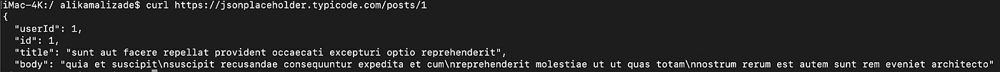
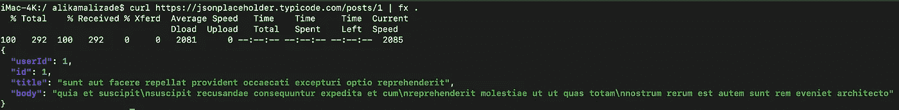
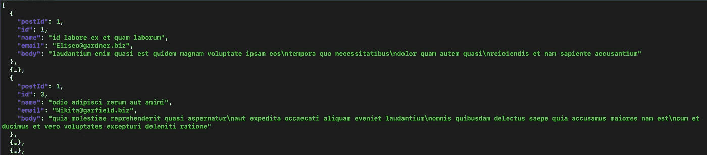
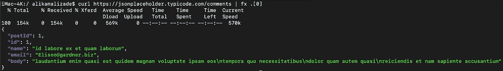

# 如何使用 FX 在命令行和终端中使用 JSON

> 原文：<https://betterprogramming.pub/how-to-work-with-json-in-the-command-line-and-terminal-with-fx-58ac3cef8e04>

## 轻松处理 pipe curl 请求，并在您的终端中处理 JSON


图片由 [Flickr](https://www.flickr.com/photos/imageme/4462907734) 上的 [imageme](https://www.flickr.com/photos/imageme/) 提供

如果你使用的是 Linux 或 macOS，那么你可能听说过 [*curl*](https://curl.haxx.se/docs/manpage.html) *。使用 curl，您可以从终端内部轻松发送不同类型的请求(例如 HTTP)。许多开发人员使用 curl 是因为它功能广泛。*

下面是一个从 REST 端点获取一些 JSON 数据的简单 curl 请求:

```
curl https://jsonplaceholder.typicode.com/posts/1
```

对上述请求的响应如下所示:



这已经很好了，因为您不需要 web 浏览器向返回 JSON 数据的 API 发出请求。然而，如果你花很多时间在你的终端上，那么你可能会喜欢一个更强大的工具来完成事情。

有一些开源解决方案可用，在这一类中， [fx](https://github.com/antonmedv/fx) 是我个人最喜欢的工具。fx 完全用 JavaScript 编写，既可以通过 [npm](https://www.npmjs.com/) (要求你的机器上安装 Node.js)安装，也可以通过 [Homebrew](https://brew.sh/) 安装。

在这篇文章中，我将向您展示 fx 如何使在您的终端中使用 JSON 变得更加容易。出于演示目的，我将使用 [JSONPlaceholder](https://jsonplaceholder.typicode.com/) ，这是一个免费的假 REST API，非常适合测试和试用。

# 如何在 fx 终端中使用 JSON

以下是在您的机器上安装安装 fx 的方法:

```
npm install -g fx # Use NPM to install the fx package globally
brew install fx # Or use Homebrew to install the fx package
```

现在我们已经安装了 fx，我们可以使用 fx 重试上面的请求，看看 fx 能做什么。

```
curl https://jsonplaceholder.typicode.com/posts/1 | fx .
```

使用 fx，响应如下所示:



fx 很好地打印了用 curl 发送的 HTTP 请求的输出

如您所见，我们仍然使用 curl 从 REST API 获取数据。但是，我们使用 fx 来打印数据。JSON response fx 输出更容易阅读——如果您正在处理更大、更复杂的数据，您会喜欢这一点。

如果我们省略上面例子中使用的点，我们将进入交互模式。这允许您使用鼠标和键盘检查和编辑 JSON(这是我第一次看到有鼠标支持的命令行工具)。交互模式允许您搜索 JSON，这在处理大型 JSON 数据时非常有用。



对话方式

只需要 JSON 数据的一部分(例如，第一个元素)？fx 可以帮助您过滤 JSON:

```
curl https://jsonplaceholder.typicode.com/comments | fx .[0]
```



获取 JSON 数组中的第一个元素

你有想要阅读和编辑的本地 JSON 文件吗？外汇也可以处理这些问题:

```
fx data.json
```

如果你正在寻找更多的例子，我可以推荐 fx 作者的这篇文章，展示了 fx 的一些更高级的用法。

[](https://medium.com/@antonmedv/discover-how-to-use-fx-effectively-668845d2a4ea) [## 了解如何有效地使用 fx，这是一个 JSON 操作命令行工具

### fx 是一个流行的 JSON 操作命令行工具。它可以通过 npm、brew、snapcraft 安装，也可以下载为…

medium.com](https://medium.com/@antonmedv/discover-how-to-use-fx-effectively-668845d2a4ea) 

# 结论

感谢您阅读这篇关于在终端中使用 fx 处理 JSON 数据的短文。如您所见，我喜欢 fx 的简单性——这使它成为开发人员在终端中大量使用 JSON 的一个很好的工具。