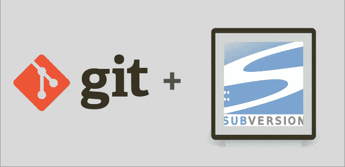

# 如何使用 Git 与 SVN 一起工作

> 原文：<https://betterprogramming.pub/how-to-work-with-svn-using-git-34f1d7a5152c>

## 一种集成 Git 和 SVN 库的新方法



在知识共享许可下使用的徽标。作者照片。

自 2005 年首次推出以来，Git 获得了巨大的人气。事实上，Git 现在占到了 VCS 使用量的 70%左右(T3)。在这篇文章中，我将描述作为一个 Git 用户与一个 [SVN](https://subversion.apache.org/) 库交互的一些选项，以及每种选项的优缺点。

# 1.git-svn

git-svn 是 git 用户与 Git 仓库交互的专用工具。它通过向 SVN 后端提供 Git 前端来工作。使用 git-svn，您可以在本地存储库上使用 git 命令，所以就像使用普通的 Git 一样。然而，在后台，相关的 SVN 命令被发送到服务器。

## 设置

一旦安装了 git-svn，您就可以使用以下命令来检查 svn 存储库:

```
git svn clone <remote URL for SVN repo>
```

从现在开始，您可以通过普通的 Git 命令与存储库进行交互:

```
git add foo
git push
etc
```

这对于小的存储库来说工作得很好，但是对于更大的存储库来说，可能会非常慢。如果不是[个月](https://stackoverflow.com/questions/3919962/speeding-up-the-initial-git-svn-fetch)的话，初次结账可能需要几天！加快速度的一个方法是只获取最新的修订版，而不是所有的历史。

这可以通过以下方式实现:

```
git svn init
git svn fetch -r<revision> <remote URL for SVN repo>
```

这样会快很多。但是如果存储库很复杂，可能还是会有问题。如果对你有用，那太好了！然而，我在一个非常复杂的回购中遇到了目录丢失的问题，所以我必须找到另一个解决方案。

# 2.SVN 在饭桶里

如前所述，git-svn 并不适合我，所以我需要另一个解决方案。完全切换到 SVN 不是一个选项，因为我发现我可以更有效地使用 Git。

*注意:我也是 Tower Git 客户端的忠实粉丝。要了解更多信息，你可以阅读我关于* [*如何用塔*](https://codeburst.io/supercharge-your-git-flow-with-tower-c5dc22494eba) *增强你的工作流程的评论。*

最后，我决定简单地将 SVN 存储库嵌入 Git 存储库中。我与远程存储库的所有交互都是通过 SVN 命令完成的，我所有的本地开发工作都是使用 Git 和 Tower 完成的。

## 设置

要在 Git repo 中设置 SVN repo，请执行以下操作:

```
mkdir <git dir> && cd <git dir>
git init                         
svn co <remote URL for SVN repo> <svn dir>
```

这将创建一个名为`<git dir>`的 Git 存储库，其中包含一个名为`<git dir>/<svn dir>`的 SVN 存储库。

接下来，我们创建一个`.gitignore`文件来忽略这个目录。这是一个隐藏的目录，SVN 用它来做内务。

```
cd <git dir>
echo ".svn" > .gitignore
```

最后，我们向 Git 存储库添加并提交我们的更改。我分两步做到这一点:

```
git add .gitignore
git commit -m "Ignore .svn folder"
git add .
git commit -m "SVN initial commit"
```

从现在开始，我使用 Git 在本地完成所有的开发工作，这给了我 Git 提供的所有优势。我定期从 SVN 更新信息，了解同事们的变化:

```
cd <svn dir>
svn up
git add .
git commit -m "Update to SVN revision 1234"
```

同样，当我准备将我的本地更改发送到 SVN 时:

```
cd <svn dir>
svn add <some file I added>
svn commit -m "Fixed bug blah"
```

这将我所有的本地更改提交到远程 SVN 服务器。

# 结论

这可能听起来像一个笨重的工作流程，但它工作得出奇的好！我的大部分工作都是在 Git 中完成的，必须切换到 SVN 来发送对共享存储库的更改，这迫使我对自己的行为格外小心。另一个优势是工作流或客户端-服务器通信不会变慢。

如果有人经历过类似的问题，并有解决方案的想法，我很乐意在评论中阅读它们。