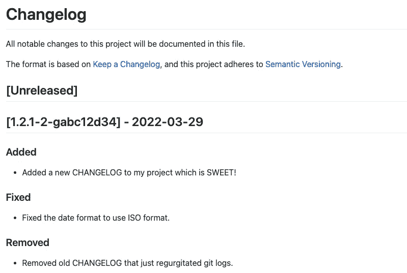

# 如何编写 Bash 脚本来创建和更新 Changelog

> 原文：<https://betterprogramming.pub/how-to-write-a-bash-script-to-create-and-update-a-changelog-de4df98985ab>

## 不再有生成器、日志或依赖项


克里斯托夫·高尔在 [Unsplash](https://unsplash.com/s/photos/notebook-ledger?utm_source=unsplash&utm_medium=referral&utm_content=creditCopyText) 上拍摄的照片

一个[变更日志](https://keepachangelog.com/en/1.0.0/#:~:text=Why%20keep%20a%20changelog%3F,or%20version)%20of%20the%20project.)是一个有用的工具，向其他贡献者和用户展示你的项目做了什么更新，什么时候，以及那些更新需要什么。虽然你可能认为保持一个变更日志是乏味的或费时的，但从长远来看，它可以提供更多的信息并提高责任感。

也就是说，如果可以的话，减少一些花在你的变更日志上的时间是很好的。这就是我创建自己的 bash 脚本来创建和更新自己的 changelog 时想要做的事情。

有一些预先存在的生成变更日志的方法，但是它们要么在清晰度方面不太符合我的要求(例如包括 git 标签提供的版本号)，要么包含了太多的信息。我所说的太多信息是指这些其他生成方法从您的 git 日志中获取您的所有提交，并以一种更有组织的方式列出它们。

这是一个很好的技巧，但我想创建一个更谨慎的变更日志，而不是简单地重新组织我的各种提交。

> 更改日志条目的目的是记录值得注意的差异，通常是在多次提交之间，以便向终端用户清楚地传达这些差异
> 
> —保留变更日志

## 我们的变更日志

使用我们自己的脚本来生成 changelog 允许灵活地决定包含什么信息以及它应该是什么样子。在本帖中，我们将生成一个基本结构如下的 changelog。



你的项目的变更日志不需要看起来像这样，但是我喜欢它，因为它遵循了[保持变更日志](https://keepachangelog.com/en/1.0.0/#:~:text=Why%20keep%20a%20changelog%3F,or%20version)%20of%20the%20project.)的惯例，并且提供了大量的信息而不会让人不知所措。变更日志的每个点都包含版本号，后跟 ISO 格式的日期。在每一个下面都有一个与所做的更改相关的部分，比如添加、修复和删除(这些是我个人最常用的更改类型)。有关这些约定的更多信息，请参见“保持常日志”倡议。

现在，让我们开始用 bash 生成我们的第一个 Changelog。

在项目目录的根目录下，为 changelog 逻辑创建一个 bash shell 脚本文件。

```
root:~ > touch changelog.sh
```

现在您已经有了您的 shell 脚本文件，我们只需在我们的终端中运行这个命令就可以使它可执行。

```
root:changelog-script > chmod u+x changelog.sh
```

这一行的作用是让我们只需在命令行中键入文件名，按 enter 键，然后执行它包含的脚本。现在我们可以开始研究我们的逻辑了。我们将编写三个函数:`new_changelog`、`new_changelog_item`和`init`。

```
new_changelog()
{
  echo 'new changelog'
}new_changelog_item()
{
  echo 'adding changelog item'
}init()
{
  echo 'initiate script'
}
```

我们脚本的目标是，当我们执行 shell 脚本(用户键入`./changelog.sh`并点击 enter)时，脚本将确定我们是否需要在添加项目之前创建一个 changelog。如果 changelog 不存在，创建它，然后添加第一项。如果确实存在，只需添加一个新的 changelog 项目—仅当当前版本不存在 changelog 项目时。

稍后会详细介绍。

首先，让我们初始化一个重要的变量:`changelog`。这个变量将位于我们脚本的顶部，顾名思义，它将引用我们的 changelog 文件。将`changelog=CHANGELOG.md`添加到文件的顶部。一旦在脚本文件中，我们可以更新我们的`init`函数来检查文件是否存在。如果是，那么简单地添加一个新项目。如果没有，我们需要先创建它，然后添加一个新项目。如果一个文件存在于我们的项目中，我们如何告诉*？*

[我们可以在我们的](https://linuxize.com/post/bash-check-if-file-exists/) `[init](https://linuxize.com/post/bash-check-if-file-exists/)` [函数中实现一个](https://linuxize.com/post/bash-check-if-file-exists/) `[if](https://linuxize.com/post/bash-check-if-file-exists/)` [语句。](https://linuxize.com/post/bash-check-if-file-exists/)

我们要检查的条件是`if test -f "$changelog"`。这一行使用内置的`test`命令，该命令用于测试文件的属性并执行其他操作。`-f`操作符只是告诉条件寻找一个文件，并检查它是否是一个正常的文件(不是一个目录或外部设备)。现在让我们看看更新后的`init`函数，我们已经知道如何检查文件是否存在。

```
init()
{
  if test -f "$changelog" ; then
    echo "$changelog exists."
  else
    echo "$changelog does not exist."
  fi
}
```

太棒了，第一部分完成了。现在，我们需要工作在我们的其他功能，将取代这些`echo`行。第一个是`new_changelog`。这一个将需要最少的努力，因为所有我们需要做的是使文件。如何在 bash 中制作一个文件？我们所要做的就是使用`echo`，然后指示这个回显输出应该被定向到一个新文件中。我们通过使用`>`来做到这一点，它是一个[文件描述符重定向](https://unix.stackexchange.com/questions/122977/what-is-the-correct-name-for-the-command)。让我们来看看实际情况。

```
new_changelog()
{
  echo "here is my changelog" > CHANGELOG.md
}
```

这将在您的项目目录中创建一个 changelog 文件。我个人喜欢在我的 Changelog 文件中包含 Keep A Changelog 标题。所以我们可以用下面的代码替换`'here is my changelog'`。

```
"# ChangelogAll notable changes to this project will be documented in this file.The format is based on [Keep a Changelog](https://keepachangelog.com/en/1.0.0/),
and this project adheres to [Semantic Versioning](https://semver.org/spec/v2.0.0.html).## [Unreleased]"
```

完美。如果我们的`init`条件发现一个 changelog 不存在，我们的`new_changelog`函数将创建一个。我们差不多完成了，但是我认为我们应该为开发者节省一个额外的步骤。我的意思是，不是在这里结束脚本，让开发者再运行一次*来添加新的 changelog 项，我们只是在`new_changelog`的末尾调用`new_changelog_item`。这意味着我们需要开始`new_changelog_item`的工作。*

*在这个函数中，我们需要做的第一件事是找到我们项目的当前版本。为此，您可以在您的`changelog`变量下添加以下代码行。*

```
*version="$(git describe --long)"*
```

*这将打印您的标记版本，如下所示:*

```
*1.2.1-2-gabc12d34*
```

*这里我们有项目版本(`1.2.1`)，接着是这个版本的提交数量(`-2`)，最后是提交本身的缩写名称(`-gfa17e39`)。有很多方法可以将整个版本压缩成可读性更好的版本(比如将上面的版本表示为 1.2.3 ),但我不会在这里深入讨论。*

*关于 git 标签的更多信息，请查看本文。*

*现在我们有了版本，我们需要得到日期。这是我们可以添加到`version`下的另一个变量。在 Bash 中，只需使用`date`就可以获得日期。但是这会给我们以下的结果。*

```
*Tue Mar 29 13:10:19 EDT 2022*
```

*在这个变更日志中，我们将遵循 [ISO 格式](https://www.progress.com/blogs/understanding-iso-8601-date-and-time-format)，基本上是年，然后是月，然后是日。您可以包含时间，但是在这个脚本中，我们将只使用年-月-日格式。为了使我们的日期符合 ISO 格式，我们可以使用下面的代码。*

```
*today="$(date '+%Y-%m-%d')"*
```

*现在我们已经正确格式化了日期，我们可以开始脚本中最难的部分了:实际上在 changelog 文件的特定行添加一行。为了做到这一点，我们需要阅读变更日志。*

```
*while read line; do
  echo $line
done < CHANGELOG.md*
```

*上面的代码遍历 changelog 的每一行(用`$line`表示),并在命令行中使用`echo`。现在我们可以阅读每一行了，我们只需要找到哪一行是我们想要在后面添加新闻变更日志项目的行。鉴于`## [Unreleased]`是我们的 changelog 的一个常见附件，在它下面是我们发布的变更，当添加一个新的 changelog 项目时，这是一个很好的线索。*

> *由于`## [Unreleased]`变更(与当前日期或版本无关)在发布时已经被删除，所以添加对检查未发布变更的支持并不是当前的首要任务。*

*下面是一个 if 语句，用于检查行`## [Unreleased]` *。**

```
*if [[ $line == "## [Unreleased]"* ]]; then
  echo "LINE FOUND"
fi*
```

*完美。我们现在可以知道在哪一行插入新的 changelog 项目。这就引出了下一个问题，我们如何实际插入 changelog 项？为此，我们将使用`[sed](https://www.geeksforgeeks.org/sed-command-in-linux-unix-with-examples/)`。*

*`sed`是一个文本流编辑器，有很多很好的用途，但是现在，我们只使用它来查找和改变文件中的文本。我们可以使用带有`-i`标志的`sed`命令来编辑文件。这很好，因为我们想要实际编辑现有文件，而不是简单地打印到标准输出。*

*为了使用`sed`来插入文本，我们需要遵循下面的格式。*

```
*sed -i "" "s/old_line/new_line" FILE.ext*
```

*为了分解它，首先你需要在`-i`后面加上`""`，因为这一行是如何被解析的(*至少在 Mac OS X 上是需要的。其他操作系统可能不需要它*。然后，您可以提供旧行，接着是它的替换行，接着是文件本身。该字符串开头的`s`代表“替换”，因此该命令知道用`new_line`替换`old_line`。*

*对于我们的例子，上面的内容可以改写成这样:*

```
*sed -i "" "s/$newvar/## [Unreleased]\n\n## [$version] - $date\n### Added\n - ADD CHANGE HERE!/" CHANGELOG.md*
```

*现在，你可能已经注意到`$newvar`代替了`$line`。这是因为我们的原始行包含括号(`[]`)。这些是为括号表达式保留的，因此与普通文本的计算方式不同。所以为了[解析这个](https://stackoverflow.com/questions/71861374/why-cant-sed-find-line-in-changelog)，我们必须创建一个新的变量，用*转义的*括号来替换括号。我们可以找到带有普通括号的行，但是我们需要对这些括号进行转义，以便让`sed`命令正确地替换它。参见下面的`$newvar`。*

```
*newvar=$(<<<"$line" sed 's/[].*[]/\\&/g')*
```

*为了这篇文章和简洁起见，我不会太深入地讨论这个语法的结构。只需知道这一行用转义括号替换了`$line`中的括号，因此它们被视为文本的一部分，而*不是*被视为括号表达式。*

*以下是我们更新的`new_changelog_item`功能:*

*太好了！我们快完成了。*

*我们已经准备好了大部分代码。我们现在需要做的就是检查是否已经有一行与我们当前的版本一致。要做到这一点，我们可以简单地看看在 changelog 中的任何地方是否有这样一行:*

```
*## [$version] - $date*
```

*为此，我们可以将下面的条件添加到我们的`new_changelog_item`中。*

```
*item="## [$version] - $date"
if grep -Fxq "$item" CHANGELOG.md; then
  echo "Changelog item already exists for $item."
else
# rest of function*
```

*`-[Fxq](https://www.codegrepper.com/code-examples/shell/grep+fxq)`是一个标志，它允许我们检查所提供的模式(在我们的例子中是 changelog 项目头)是固定字符串、精确匹配还是安静输出。本质上，它是一个非常全面的标志，可以帮助我们捕捉任何类型的模式。一旦我们有了这个，我们就可以把之前的函数放到`else`语句中。这是因为如果此版本/日期组合的变更日志项目不存在，我们应该添加一个新的项目。*

*现在你知道了！一个*纯粹的* bash 脚本整合到您的应用程序中以生成变更日志，添加变更日志项目，*和*在格式和变更日志内容方面为您提供灵活性*，而*不需要生成器、日志或其他依赖项。完整代码在 [GitHub](https://github.com/macro6461/changelog-bash) 上。*

*[***升级您的免费 Medium 会员资格***](https://matt-croak.medium.com/membership) *并接收各种出版物上数千名作家的无限量、无广告的故事。这是一个附属链接，你的会员资格的一部分帮助我为我创造的内容获得奖励。**

**你也可以通过电子邮件* [***订阅，当我发布新内容时，你会收到通知！***](https://matt-croak.medium.com/subscribe)*

*谢谢你！*

# *参考*

*[](https://github.com/macro6461/changelog-bash) [## GitHub-macro 6461/changelog-bash:生成和添加 changelog 项目的纯 bash 脚本

### 这是用于创建和更新 changelog 的纯 bash 脚本的代码。不需要发电机。不需要…

github.com](https://github.com/macro6461/changelog-bash) [](https://keepachangelog.com/en/1.0.0/#:~:text=Why%20keep%20a%20changelog%3F,or%20version%29%20of%20the%20project) [## 保留变更日志

### changelog 是一个文件，它包含一个按时间顺序排列的列表，列出了每个版本的显著变化…

keepachangelog.com](https://keepachangelog.com/en/1.0.0/#:~:text=Why%20keep%20a%20changelog%3F,or%20version%29%20of%20the%20project) 

[https://linuxize.com/post/bash-check-if-file-exists](https://linuxize.com/post/bash-check-if-file-exists/)

[](https://unix.stackexchange.com/questions/122977/what-is-the-correct-name-for-the-command) [## “>”命令的正确名称是什么

### 正如其他人回答的那样，>不是一个命令，而是一个重定向操作符。然而，术语“重定向…

unix.stackexchange.com](https://unix.stackexchange.com/questions/122977/what-is-the-correct-name-for-the-command) [](https://git-scm.com/docs/git-describe) [## 描述文档

### 使用类似 git.git 的当前树，我得到:[Torvalds @ G5 git]$ git describe parent v 1 . 0 . 4-14-g 2414721，即…

git-scm.com](https://git-scm.com/docs/git-describe) [](https://www.geeksforgeeks.org/sed-command-in-linux-unix-with-examples/) [## Linux/Unix 中的 Sed 命令及示例

### UNIX 中的 SED 命令代表流编辑器，它可以对文件执行许多功能，如搜索、查找和…

www.geeksforgeeks.org](https://www.geeksforgeeks.org/sed-command-in-linux-unix-with-examples/) [](https://stackoverflow.com/questions/71861374/why-cant-sed-find-line-in-changelog) [## 为什么 sed 在 changelog 中找不到行

### 感谢贡献一个堆栈溢出的答案！请务必回答问题。提供详细信息并分享…

stackoverflow.com](https://stackoverflow.com/questions/71861374/why-cant-sed-find-line-in-changelog) [](https://www.codegrepper.com/code-examples/shell/grep+fxq) [## grep fxq 代码示例

### 只需使用带有标志‘F’(固定字符串)、‘x’(精确匹配)和‘q’(安静输出)的 grep 来检查一个单词是否…

www.codegrepper.com](https://www.codegrepper.com/code-examples/shell/grep+fxq)*