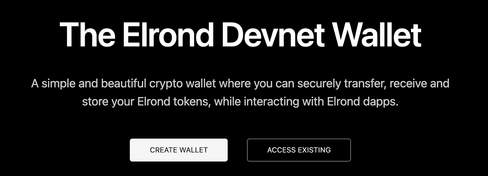
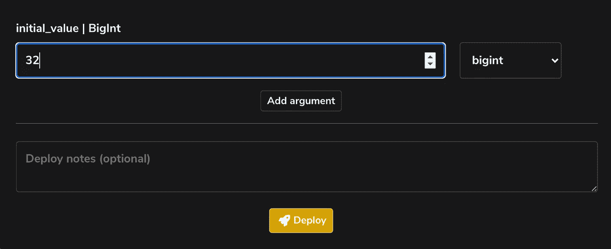
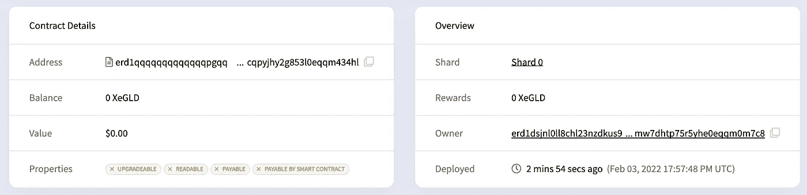
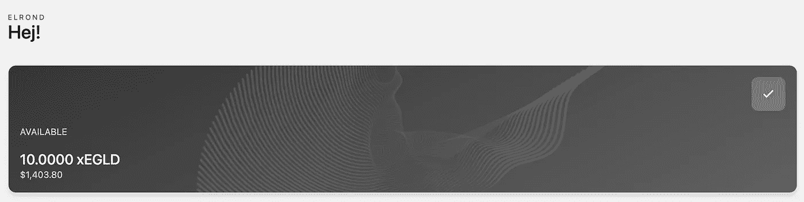
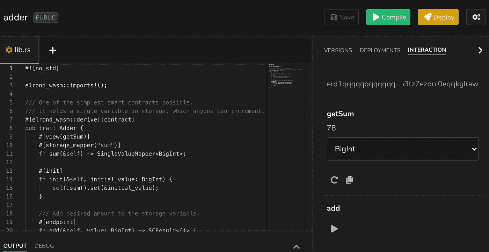
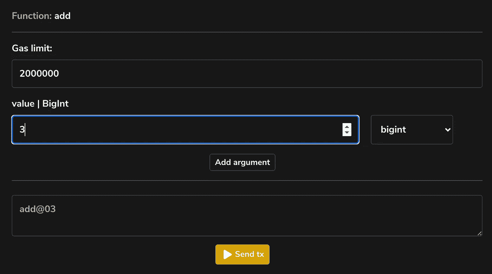
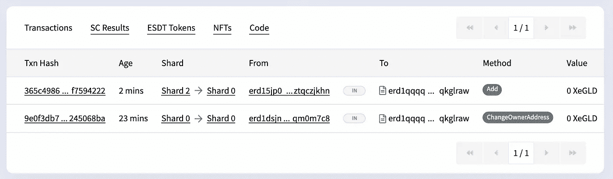

# 如何在 5 分钟内写好一份区块链智能合约

> 原文：<https://betterprogramming.pub/how-to-write-a-blockchain-smart-contract-in-5-minutes-a6bda5e9c1b1>

## 撰写智能合同变得更加容易

智能契约握手([来源](https://developer.algorand.org/tutorials/writing-simple-smart-contract/))

在这篇文章中，我将解释如何使用[埃尔隆德](https://elrond.com/)区块链在 5 分钟内编写、部署和测试一个简单的智能合同。

# 什么是智能合同？

智能合同是存储在[区块链](https://www.investopedia.com/terms/b/blockchain.asp)上的一段代码，在满足特定条件时执行。

智能合同的应用包括:

*   转移资金
*   [记载财产所有权](https://deloitte.wsj.com/articles/blockchain-and-smart-contracts-could-transform-property-transactions-1514955733)
*   [投票](https://www.investopedia.com/news/how-blockchain-technology-can-prevent-voter-fraud/)
*   仓库盘点

与传统数据库相比，使用区块链的优势在于区块链是无权限的，并且不需要中央可信机构来验证交易。

相反，合同可以在两个人之间直接签订，不需要中间人。

可以将区块链想象成一个点对点的分类账，将智能合约想象成一组可以应用于分类账状态的规则。

# 准备

在编写智能合同之前，我们将在埃尔隆德区块链上创建一个帐户。这一步不是绝对必要的，但是没有它，我们将无法测试我们的代码。

要创建钱包，请访问[devnet-wallet.elrond.com](https://devnet-wallet.elrond.com/)并选择“创建钱包”。

然后你会看到一个秘密短语，你需要记录下来。最后，您需要设置一个密码并下载一个密钥库文件。

> 请注意，这是在 devnet 上，你不需要转移任何资金。相反，假的测试基金可以通过一个水龙头获得。

# 创建智能合同

接下来，我们需要使用新创建的帐户登录埃尔隆德游乐场。

为此，请访问[play.elrond.com/unlock](https://play.elrond.com/unlock)，拖动上一步中的密钥库文件，并输入您的密码。

一旦成功认证，你将被引导到埃尔隆德游乐场，在那里你可以选择一个模板。选择“加法器”。

这为用 [Rust](https://www.rust-lang.org/) 编写的智能契约创建了一个模板。完整代码如下:

该合同有三种方法:

*   `init()`初始化加法器的存储值
*   `getSum()`返回加法器的当前值
*   `add()`将提供的整数加到当前值上

当契约第一次部署在区块链上并设置初始状态时，调用`init()`方法。`getSum()`和`add()`将通过与合同本身的交易来调用。

# 编译和部署

接下来，我们将部署和测试智能合约。

要编译，只需单击 UI 中绿色的“编译”按钮，然后单击“部署”。系统将提示您输入加法器的初始值。现在再次点击“部署”。

祝贺您，您现在已经在埃尔隆德发展网区块链上部署了智能合同！

要确认这一点，你可以在埃尔隆德连锁浏览器中查看合同。要做到这一点，点击“部署”在操场侧面板，并点击放大镜旁边的“地址”字段。

这将显示如下所示的合同细节。

埃尔隆德智能合同详细信息

# 测试

为了测试智能合约，我们需要在我们的埃尔隆德钱包中添加一些假的 EGLD 令牌。为此，请再次访问[devnet-wallet.elrond.com](https://devnet-wallet.elrond.com/)，登录并从左侧面板中选择“水龙头”。

填写验证码，然后选择“请求令牌”。这会在你的钱包里放 10 xEGLD。

现在，返回到[play.elrond.com](https://play.elrond.com/)并选择右侧面板中的“部署”选项卡，然后单击“交互”字段旁边的三角形。这将打开交互面板。

这里我们看到了`getSum()`方法的当前结果，以及一个执行`add()`方法的三角形。点击这个将允许我们设置一个值添加到我们的加法器。

现在点击“发送”。这将向区块链上的智能合约发送一个事务，触发使用提供的值调用`add()`方法。

因为`add()`修改了合同的状态，并且不仅仅是只读的，我们将被提示从我们的埃尔隆德开发者钱包中支付费用。

一旦事务被执行，我们可以重新访问“交互”面板，看到契约的状态已经被更新，并且`getSum()`返回加法器的新值。

也可以在区块链上通过重新访问“部署”面板并单击“地址”字段旁边的放大镜来确认这些交易。

# 结论

埃尔隆德游乐场使创建、修改、部署和测试智能合同变得容易。我们在这里探索的简单加法器只是一个起点。作为下一步，鼓励读者探索一些其他的示例操场。

关于埃尔隆德平台的完整文档可以在这里找到:[https://docs.elrond.com/](https://docs.elrond.com/)