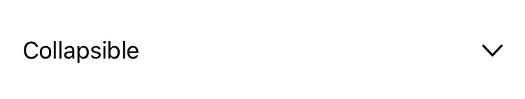
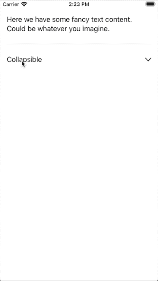

# 如何为您的 SwiftUI 应用编写可折叠/可展开的视图

> 原文：<https://betterprogramming.pub/how-to-write-a-collapsible-expandable-view-for-your-swiftui-app-d4a47fe8cb52>

## 手风琴式视图变得简单

照片由[阿迪蒂亚·维亚斯](https://unsplash.com/@aditya1702?utm_source=medium&utm_medium=referral)在 [Unsplash](https://unsplash.com?utm_source=medium&utm_medium=referral) 拍摄。

在应用程序开发中，您经常需要某种可折叠的视图。随着 iOS 14 和 Xcode 12 的发布，我们将拥有 [DisclosureGroup](https://developer.apple.com/documentation/swiftui/disclosuregroup) 视图元素来实现这一点。但是在它发布之前——对于需要一些向后兼容性的应用程序——你必须提供你自己的定制解决方案。

在本文中，我想向您展示一种在 SwiftUI 中创建您自己的自定义可折叠视图的简单方法。我们开始吧！

*注意:需要 XCode 11.x，Swift 5.x，iOS 13.x。假设您已经掌握了一些 Swift 和 SwiftUI 编程知识，知道如何构建应用程序，并在其中实现您自己的视图。这不是一个教你基础知识的教程。*

# 目标

最终结果是，我们希望有一个简单的文本视图，带有一个表示折叠状态的 v 形图标，下面还有一些内容——最初处于折叠状态。

初始视图应该是这样的:

当点击带有文本和图标的行时，折叠的内容应该向下滑动并可见。当然，我们希望视图接受折叠容器的任何类型的内容，而不仅仅是文本、按钮或其他特定类型。

我们想要的观点和行为。

# 可折叠视图

我们需要一个简单的视图，将我们的标签和内容作为参数，并在最后一行折叠的`VStack`中显示它。我们创建了一个简单样式的按钮元素来处理点击事件，并将折叠状态的参数保持为私有，以避免数据损坏。

为了使从折叠到展开的转变对用户来说更好，我们还向保存折叠内容的`VStack`添加了一些动画和过渡。在这种情况下，我们使用带有渐出动画的幻灯片过渡。您可能想要更改它以适合您的动画/过渡方案，或者根本不使用动画。

这是最后的观点:

# 主视图中的用法

下面的例子展示了一个基本视图，它将我们之前创建的可折叠视图嵌入到了一个`VStack`中的文本下面:

代码应该非常简单。为了简单起见，我们只有一个带有填充和背景颜色的基本文本视图作为我们的内容。当然，这可以是你想要的任何视图。甚至滚动和导航视图也应该工作，尽管后者在这种环境下可能毫无意义。

# 结论

这个例子非常简单并且是静态的——这也是我们想要的。如果您想要一些高级功能(例如，根据可折叠内容中设置的一些值动态更改标签)，您需要扩展可折叠视图，但这可能是另一篇文章的内容…