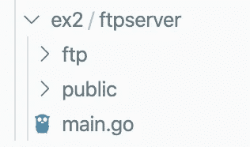
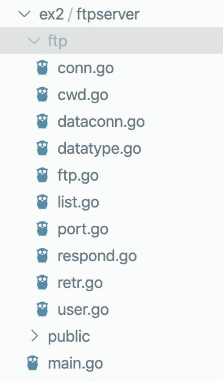

# 如何在 Go 中编写并发 FTP 服务器(第 1 部分)

> 原文：<https://betterprogramming.pub/how-to-write-a-concurrent-ftp-server-in-go-part-1-3904f2e3a9e5>

## 为多个客户服务，了解 FTP 规范

照片由[亚当·伯基特](https://unsplash.com/@abrkett?utm_source=unsplash&utm_medium=referral&utm_content=creditCopyText)在 [Unsplash](https://unsplash.com/s/photos/files?utm_source=unsplash&utm_medium=referral&utm_content=creditCopyText) 上拍摄

在研究 Go 圣经——多诺万和克尼根的“Go 编程语言”*——时，我遇到了一个让我既受启发又感到沮丧的问题。*

> ***练习 8.2** :实现一个并发文件传输协议(FTP)服务器。服务器应该解释来自每个客户端的命令，例如 **cd** 改变目录， **ls** 列出目录， **get** 发送文件内容， **close** 关闭连接。*

*这是让我兴奋的大型自由项目。做这件事没有“正确的方法”,你只是面临着用你所拥有的知识来构建最佳解决方案的挑战。*

*然而，这里的复杂性与你知道多少 Go 无关——它来自 FTP 本身。它非常规范(毕竟这是一个网络协议)。除非你已经知道 FTP 的来龙去脉——它的标准响应代码和何时使用它们，如何配置数据连接，甚至如何终止文本行——这个挑战会让你血压升高。*

*遵循这个一步一步的指南来构建一个简单的 FTP 服务器，避免给自己造成动脉瘤。感谢 Github 用户 Kdama 给我指明了正确的方向。*

*我假设对 Go 的`net`包和 goroutines 有基本的了解，但是没有比这更难的了。*

# *倾听并服务*

*FTP 服务器的本质很简单:监听传入的连接，解析它们的请求，并做出适当的响应。*

*监听部分与您可能编写的其他 web 服务器没有什么不同，除了我们将使用更简单的`net`包来代替`net/http`。这是 FTP 服务器，不是 HTTP 服务器。*

*让我们从`main.go`开始，从那里开始构建。我会把我们工作中最重要的代码片段包括进来，但是对于完整的代码，包括导入，你可以访问这个回购。*

**

*我们的项目结构*

*首先，让服务器管理员使用命令行标志指定一个可选的监听端口和服务器公共文件的根文件夹。*

*然后，我们的`main`函数将监听我们选择的端口(或者默认的 8080)并接受所有传入的连接。*

*`net.Listen`对你来说可能是新的，但它和`Accept`一起，扮演着与`http.ListenAndServe`相似的角色。您指定要使用的协议(TCP)和地址，在我们的例子中是`localhost:port`，可以简化为`:port`。*

*对于每个传入的连接，我们用`Accept`生成一个指向`net.TCPConn`(满足`net.Conn`接口)的指针。由于所有的`net.Conn`也满足`io.ReadWriteCloser`接口，我们可以从一个方便的对象中读取请求，编写响应，并在完成后自然地关闭连接。*

*随着`go handleConn(conn)`的出现，事情开始变得有趣起来。关键字`go`使我们的 FTP 服务器成为了*并发* FTP 服务器。每一个连接都将在它自己的 goroutine 中被处理，因此客户不必排队等候使用服务器。*

*在`handleConn`中，我们使用`defer`确保连接在`ftp.Serve`返回时关闭，更重要的是，使用`ftp.NewConn`从原来的`net.Conn`生成一个新的结构。`ftp`是我们将要编写的包，而`ftp.Conn`是一个优雅的对象，它使得许多可能的 FTP 操作可以从一个接触点实现。*

# *ftp。指挥操舵*

*在`./ftp`中发生了很多事情，但是这些都是具有不同角色的小文件，我们将一个一个地介绍它们。*

**

*在里面。/ftp*

*先说`conn.go`:*

*`ftp.Conn`是我们专门构建的 FTP 服务器连接表示。请注意，它包装了原始的`net.Conn`，它将为我们完成与客户端的所有直接通信。*

*它还包含我们为服务器指定的`rootDir`(公共文件将存放的地方)，以及连接的当前工作目录`workDir`。举例来说，这不能在服务器级别使用像`os.Chdir`这样的功能来控制。如果是这样的话，每当任何一个 goroutine 更改目录时，每个客户端连接都会受到影响。相反，我们手动跟踪每个连接的工作目录。*

*`NewConn`简单地返回一个指向新的`ftp.Conn`的指针，初始化为默认状态。神秘的`dataType`和`dataPort`字段被自动设置为零值，分别为`0`和`nil`，但是当需要传输数据时，我们会回到它们。*

# *ftp。服务*

*在`main.go`中，我们调用了`ftp.Serve`，将我们的新`ftp.Conn`作为参数传入。`ftp.Serve`是我们应用程序的路由器。它负责检查传入的命令，并将它们与服务器实现的 FTP 例程进行匹配。*

*进入`Serve`后，我们做的第一件事是向客户机发出 220 响应，让它知道连接已经成功建立，服务器已经准备好接受用户。稍后将详细介绍`respond`和 FTP 状态代码。*

*为了监听传入的命令，我们针对`ftp.Conn`的底层`net.Conn`创建了一个新的`bufio.Scanner`。该循环是无限的，因此`Serve`将继续检查命令，直到某个事件(如`QUIT`命令)导致其返回，这又导致`main.handleConn`返回，关闭我们`defer` ed 的`net.Conn`。一旦`handleConn`返回，goroutine 就结束了。*

*其余的`ftp.Serve`并不比客户端请求的第一个单词`command`上的`switch`更复杂。然而，令人困惑的是，FTP 要求的命令名并不总是与您在客户端输入的触发命令相匹配。`cd`在客户端被作为`CWD`发送到服务器。`ls`是`LIST` , `close`是`QUIT`,`get`翻译成`RETR`。*

*此外，客户端在没有用户直接干预的情况下发送某些命令。例如，在每个`get/RETR`请求之前，秘密发送一个`PORT`命令。*

*调试 FTP 服务器时保持理智的诀窍是正确的日志记录。您希望您的服务器尽可能地表达它所接收的请求以及它如何响应。这样，您可以确切地看到客户端发送的内容，如果它与您的预期不符，就相应地调整您的代码。*

*对于传入的请求，请看上面的第 11–12 行:*

*这个简单的加法将每个请求格式化成这样，清楚地显示接收到的命令及其参数:*

*`2020/05/28 08:13:58 << PORT [127,0,0,1,245,1]`*

*记录响应同样简单明了，所以让我们借此机会把`respond`作为一个整体来看。*

# *作出反应*

*准确的状态代码对 FTP 服务器至关重要。客户端检查每个响应中的三位数状态代码，并根据所发现的内容进行操作。代码后面的可读解释是可选的，但是为了清晰起见，使用标准描述是一个好习惯。将您使用的每个状态放入一个`const`中，以尽量减少重复。*

*接下来，我们用方法`respond`扩展`ftp.Conn`。`respond`获取一个字符串，记录下来，然后复制到它的底层`net.Conn`，后者负责将数据发送到客户端。这里唯一需要注意的是对`c.EOL`的调用，它解决了 FTP 标准的一个问题。*

*根据传输的数据类型，FTP 要求不同的线路终止符。ASCII 数据必须以回车符`\r`和换行符`\n`结束。二进制数据，被 FTP 规范称为“图像”，但实际上并不局限于图像，只以`\n`结尾。*

*如果您不遵守这个约定，您将会看到来自 FTP 客户端的警告、编码不正确的文件，或者两者都有。*

*`ftp.EOL`是`ftp.Conn`的`dataType`上的一个简单开关。但是`dataType`从何而来？*

*`dataType`只是一个整数的包装器，我们使用 Go 的`iota`关键字来设置`dataType`常量`ascii = 0`、`binary = 1`。*

*因为 Go 变量总是被初始化为它们的零值，所以我们创建的每一个新的`ftp.Conn`都以`dataType = 0`、`ascii`开始，如果需要，我们为客户端提供一个函数来改变它。*

*FTP 客户端各不相同，但是包含在 [GNU Inetutils](https://www.gnu.org/software/inetutils/) 中的典型示例通过向服务器发送`TYPE A`或`TYPE I`来响应命令`ascii`和`image`，通知服务器它期望接收的数据类型。在`ftp.Serve`中，当`TYPE`命令被识别时，其参数被传递给上面的`setDataType`，并且连接的`dataType`被更新。*

*在某些场景中，或者根据您使用的客户端，您可能会看到不止一个参数作为`TYPE`命令的一部分被发送到服务器，但是对于这个基本实现，`A`和`I`将完成这项工作。*

*在第 1 部分中，我们看到了如何并发地为多个客户机服务，如何构建一个能够表示 FTP 连接的结构，如何将命令从客户机路由到正确的处理程序，以及如何发送带有正确的数据类型行终止符的简单响应。*

*在第 2 部分中，您将学习如何注册用户、在文件服务器上的目录间导航、列出目录中的文件，当然还有下载它们。*