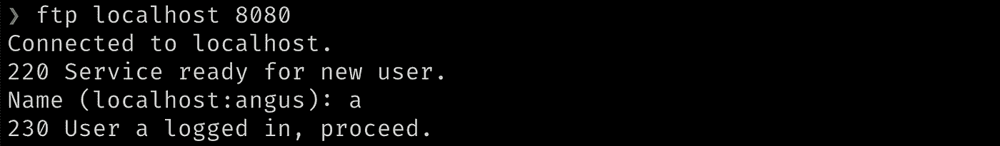
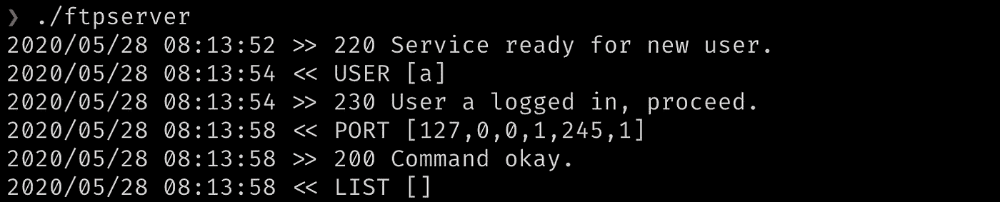
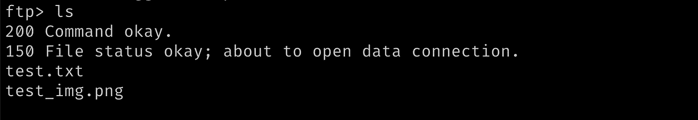
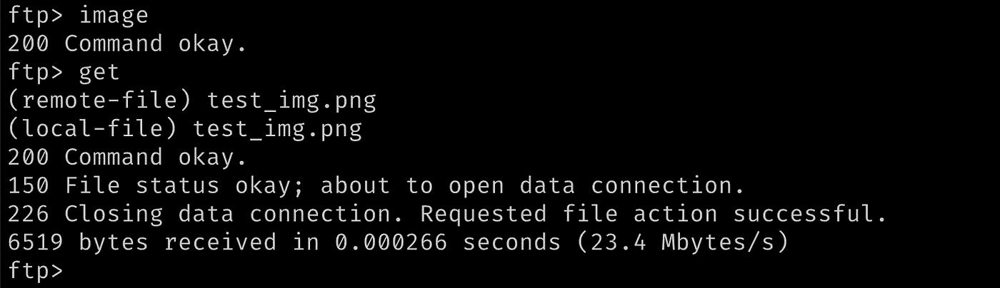

# 如何在 Go 中编写并发 FTP 服务器(第 2 部分)

> 原文：<https://betterprogramming.pub/how-to-write-a-concurrent-ftp-server-in-go-part-2-4a59f4216639>

## 更改目录、列出目录内容和下载文件

照片由 [Adam Birkett](https://unsplash.com/@abrkett?utm_source=unsplash&utm_medium=referral&utm_content=creditCopyText) 在 [Unsplash](https://unsplash.com/s/photos/files?utm_source=unsplash&utm_medium=referral&utm_content=creditCopyText) 上拍摄

在 [**第 1 部分**](https://medium.com/@angusmorrison/how-to-write-a-concurrent-ftp-server-in-go-part-1-3904f2e3a9e5) 中，我们学习了如何并发地服务多个客户端，设计了一个结构来表示 FTP 连接，将客户端命令路由到它们的服务器端处理程序，并讲述了发送响应的基本知识。现在我们已经准备好 FTP 的主要部分:操作目录和下载文件。

提醒一下，这里有`ftp.Serve`，路由器将命令从客户端发送到它们的处理函数。我们今天要研究的就是这些处理函数。

# 用户

当 FTP 客户端建立到服务器的连接时，它做的第一件事就是提供关于用户的信息。与 SFTP(安全 FTP)不同，Bog 标准 FTP 依赖于基本的、未加密的用户名和密码传输，容易受到密码嗅探和中间人攻击。

您将在本地运行您的服务器和客户端，所以我们会以简单的名义忍受那些明显的漏洞——但是请不要尝试运行任何重要的东西。

事实上，我们甚至允许匿名访问我们的 FTP 服务器，盲目地相信任何连接的人不会去他们不应该去的地方，窃取敏感文件。一个可怕的政策，但它将允许我们快速地为整个服务器建立框架，并根据您的选择进行改进。

当`ftp.Serve`遇到`USER`命令时，它将参数传递给`ftp.Conn` : `(c *Conn) user`的处理程序方法。由此，很容易想象如何对照已知用户及其访问权限的数据库来检查细节。一旦通过身份验证，用户名和特权可以作为附加字段存储在`ftp.Conn`实例中。

在我们的例子中，我们对网络安全如此漠不关心，以至于我们简单地用适当的成功代码将用户名回显给客户机:`230 User %s logged in, proceed.`

在客户端，它看起来类似于这样:

# cd/CWD

切换目录既简单又重要。当您向 FTP 客户端提交一个命令(如`cd ../parent_folder`)时，它会将该消息作为`CWD ../parent_folder`发送给服务器。`ftp.Serve`将文件路径传递给`cwd`，这是我们专有的`ftp.Conn`的一种方法。

在检查了参数的数量之后，我们构建了一个“绝对”路径，使用服务器的根目录作为它的根。最简单的形式是将 path arg 连接到当前工作目录的末尾，然后将结果连接到`rootDir`的末尾。

但是，在响应更改成功之前，我们需要验证目录是否存在并且可以访问。有可能这个程序，或者如果你已经扩展了`USER`处理程序，这个`Conn`的用户，没有权限读取目标目录。

Go 的`os.Stat`返回关于目标文件的信息和一个错误，如果文件不能被访问，这个错误是非零的。如果是这种情况，我们记录它并响应`550 Requested action not taken. File unavailable.`否则，我们更新`ftp.Conn`的`workDir`并响应一个`200`成功消息。

如果您想通过改进这个天真的实现来挑战自己，请考虑如何阻止用户访问服务器根目录下的文件。目前，没有什么可以阻止他们进入`cd ../../../../../../..`并接触到各种他们不应该接触的东西。

此外，不断向不断增长的`workDir`追加新的路径参数是可怕的内存管理，也会降低文件查找的速度。探索标准库的`filepath.Clean`如何帮助解决这个问题。

# ls/列表

既然用户可以改变目录，他们会想知道里面有什么。客户端的`ls path/to/file`命令以`LIST path/to/file`的形式到达服务器，我们有一个`(c *Conn) list`处理函数与之匹配也就不足为奇了。

首先，我们从服务器`rootDir`、连接的`workDir`和提供给`ls`的可选文件路径 arg 中构建一个绝对路径。如果用户没有提供路径参数，我们列出当前`workDir`的内容。

`ioutil.ReadDir`是一个非常有用的函数，它返回一段`os.FileInfo`，描述一个目录中的每个文件，如果目标文件夹不可访问，则返回一个错误。这样，我们可以在一次操作中验证路径并检索`FileInfo`。如果路径是好的，我们发出一个初始响应:`150 File status okay; about to open data connection.`

这是一个比我们迄今为止所见过的更复杂的操作。当发送除状态之外的任何信息时，服务器必须建立到客户机的第二个临时连接，称为数据连接，或`dataConn`。此外，必须连接到 FTP 客户端预先选择的特定端口。

这是如何实现的？在向服务器发送`LIST`指令之前，客户端在后台发送另一个命令:`PORT`。`PORT`有一个六字节的参数，对应于 IP 地址的四个部分，加上两个字节来表示最长五位数的端口号，例如`PORT [127,0,0,1,245,1]`。请注意，您的客户端可能会使用稍微不同的格式，但是，如果您的服务器有适当的日志记录，您很快就会发现差异。

`ftp.Serve`有一个`case`用于`PORT`命令，将 IP 地址参数路由到下面的`(c *Conn) port`。

这是我们在`ftp.Conn`、`dataPort`上设置最终缺失字段的机制。`dataPortFromHostPort`将六字节的 IP 地址格式解析成它的部分的结构，我们存储在`ftp.Conn`实例中。`toAddress`将这个结构转换成传统格式的 IP 地址加端口，服务器可以用`net.Dial`连接到这个端口。

如何从两个独立的字节创建一个长达五位数的端口号？`p1<<8 + p2`。从将 p1 左移八位开始。如果`p1 = 00011011`，`p1<<8 = 0001101100000000`。当您添加 p2 时，它会填充因移位而空出的八位。`p2 = 11111111`；`p1 + p2 = 0001101111111111 = 7167`。

一旦我们获得了客户端提供的 IP 地址，就可以通过调用`(c *Conn) dataConnect`(一个简单的`net.Dial`包装器)来建立数据连接。注意`dataConnect`返回一个满足`net.Conn`接口(`net.TCPConn`)的 struct，而不是我们自定义的`ftp.Conn`。

与我们的主客户端连接一样，我们必须记住一旦完成就关闭它，这需要一个`defer dataConn.Close()`。从那时起，列出目录内容就是遍历`os.FileInfo`的切片，将每个文件名写入`dataConn`，并使用`EOL`应用正确的行终止符。下面是`list`的第二部分:

下面是对包含文件`test.txt`和`test_img.png`的目录运行`ls`的输出:

# 获取/RETR

我们一直在等待的部分:从服务器下载文件。现在您已经看到了如何从服务器根构建文件路径并打开数据连接，没有什么让您感到惊讶的了，除了您在客户端输入的`get`命令作为`RETR`被发送到服务器。

这一次，我们没有使用`ioutil.ReadDir`获取目录的`FileInfo`，而是尝试使用`os.Open`打开指定的文件进行读取。如果文件无法访问，使用主连接发送`550 Requested action not taken. File unavailable.`

如果文件确实存在，我们用`(c *Conn) dataConnect`打开一个新的数据连接。与`list`一样，客户端在每个`RETR`请求之前都有一个`PORT`命令，因此`ftp.Conn`的`dataPort`字段已经被填充。

这个基本实现使用`io.Copy`将整个文件加载到内存中，并将其直接复制到数据连接。这对于小文件来说很好，但是千兆字节级的文件可能会杀死服务器，尤其是当您考虑到我们正在同时服务多个客户端时。考虑如何通过逐行或以固定字节数读取文件来减少服务器的内存压力。

和往常一样，我们使用适合数据类型的 FTP 行结尾来终止传输，并通过主连接发出成功信号。

试一试；您的输出应该如下所示:

这就是你要的——一个精简的、超轻量级的 FTP 服务器在 Go 中的实现，有很大的发展空间。在`ftp.Serve`中有一些我们没有讨论的命令，比如`QUIT`，以及 FTP 规范中描述的更多命令，但是我希望这篇温和的介绍已经揭开了文件传输协议的神秘面纱，并为您提供了足够的起点来扩展您的服务器。