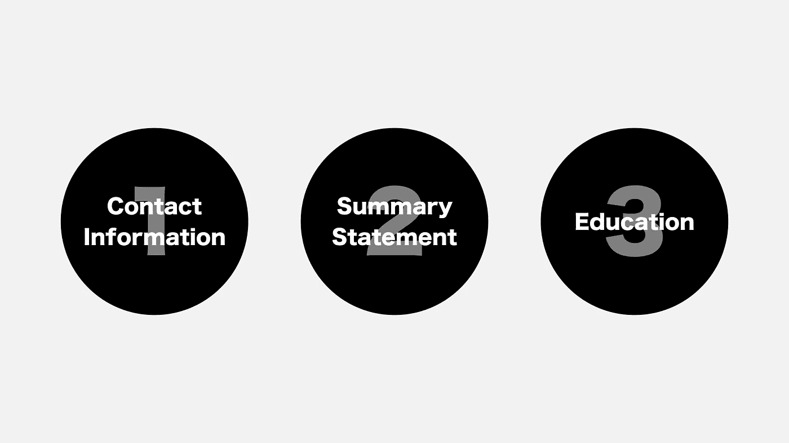
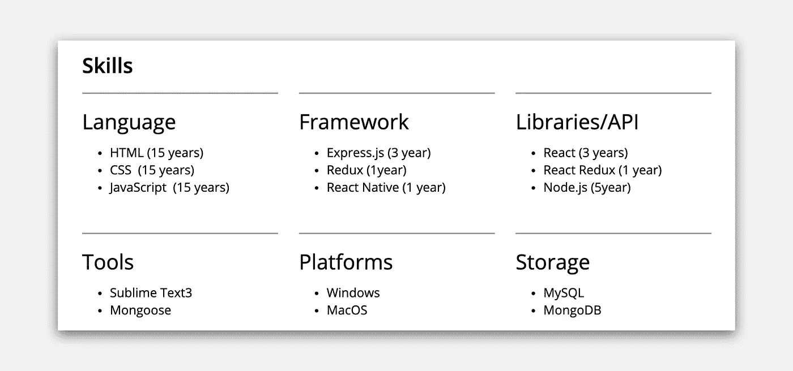
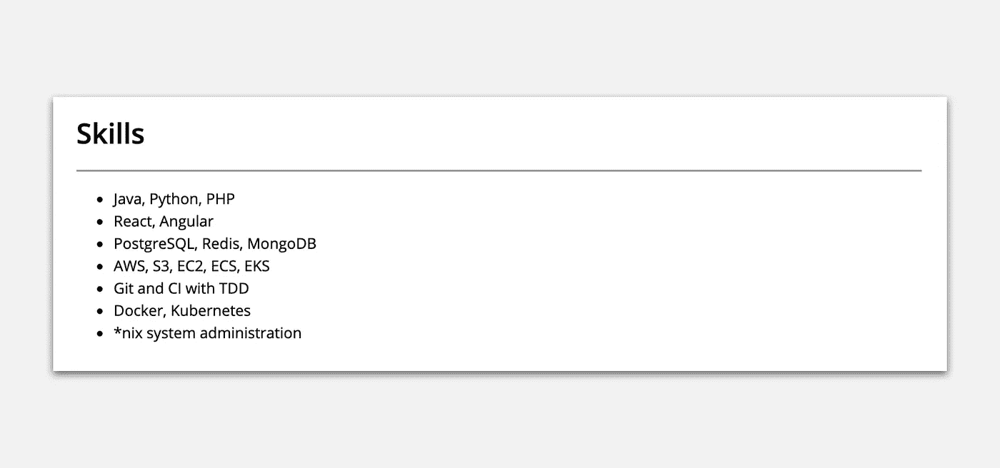
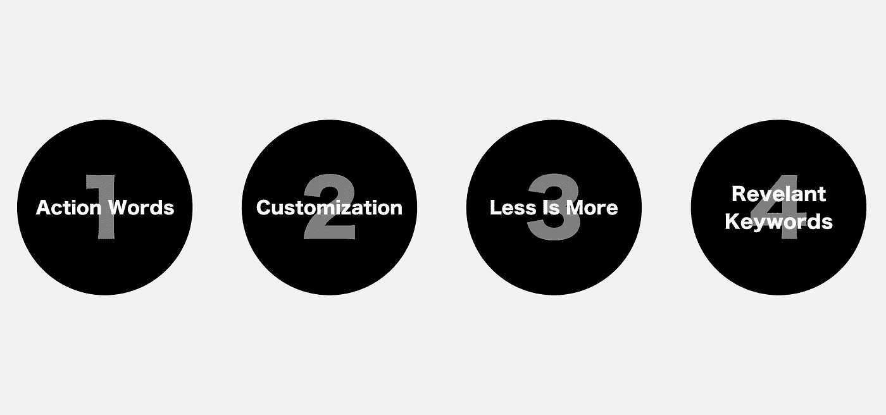
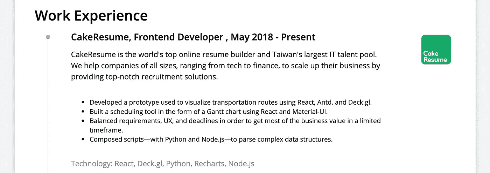
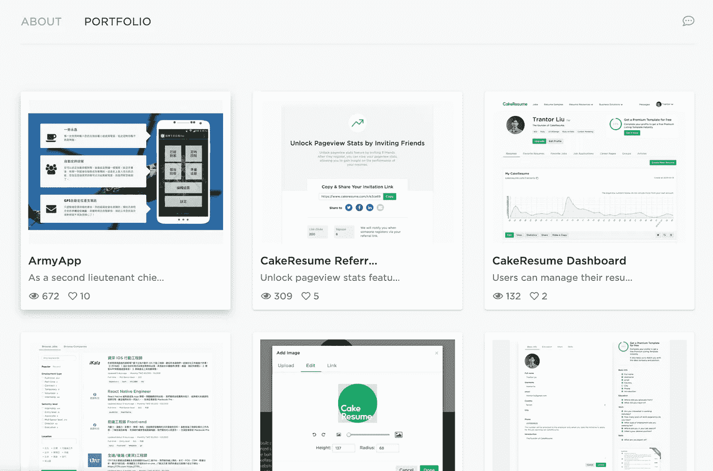

# 如何写一份能让你获得面试机会的前端开发人员简历

> 原文：<https://betterprogramming.pub/how-to-write-a-front-end-developer-resume-that-will-land-you-an-interview-f188ba4fe68b>

## 一篇初级到中级前端开发人员的文章，从面试官的角度


作为一名前端开发人员，你构建可见的东西，希望你能让它看起来不错。这种同样的心态应该在你的简历中有所体现。间距适中，可读性强，透气性好。

## 你将从这篇文章中学到什么

1.  软件开发人员的基本简历写作技巧。
2.  如何把 IT 技能和技术能力写进简历？
3.  如何展示你过去经历的逐步指南。
4.  如何建立你的前端投资组合？
5.  使用[简历生成器](https://www.cakeresume.com)来写简历。

# 1.从基础开始



## 您的联系信息

联系信息应该放在简历的顶部。包括尽可能多的你愿意分享的细节。

## 总结陈述

你的总结陈述应该包含一个简短的、令人信服的职业成就和未来目标的概要。

当你写它的时候，记住一些事情:

*   除非职位明确要求，否则不要自称为 Angular[JS]/React 开发人员。给自己贴上 X 开发者的标签告诉人们，你只想做 X，你可能是一个刻板的人，或者不适应。
*   问问你自己，我应该包括哪些关键词，以确保目标受众继续阅读我简历的其余部分？
*   阅读职位描述，记住关键词和关键短语。他们在找什么？是什么使你与其他申请人不同？

## 教育

除非你是刚毕业的大学生，否则没必要列出你的平均成绩。你的成绩比你的 GPA 更重要。

# 2.技术


由[菲利贝托·桑蒂兰](https://unsplash.com/@filijs?utm_source=unsplash&utm_medium=referral&utm_content=creditCopyText)在 [Unsplash](https://unsplash.com/s/photos/react?utm_source=unsplash&utm_medium=referral&utm_content=creditCopyText) 上拍摄的照片

对于一个软件开发人员来说，这部分是让你脱颖而出的最重要的板块。当你列出你的技能时，你应该传达对每项技能的深刻理解，它在什么环境中使用，以及在什么水平上使用。在这里尽量做到诚实和清楚。

## 一些入门技巧

*   如果你列出 HTML5，就没有必要列出 HTML4。HTML5 暗示 HTML4 及以下。CSS3/CSS2 也是如此。
*   具体说明你的熟练程度，并且要诚实。通过陈述你的熟练程度，阅读你简历的人会很快对你有一个更清晰的了解，这将节省你们双方的时间。
*   如果一项技能与职位不直接相关，但可能与行业相关，那就包括在内。这给了你一个更好的机会被招聘者找到。



## 如何不展示你的技能



不要这样。这是一个完整的 IT 部门。

尽量不要像上面的例子那样展示你的技能。如果你刚刚开始学习一项新技能，不要把它放在简历上。这会阻止招聘人员推荐你去做你不胜任的工作。

# 3.工作经验



## **使用动作词**

在这一部分，你需要以简洁的方式展示细节。使用突出的行动词汇来打动目标受众，但避免夸张。

## 用户化

突出你所申请职位的相关信息，并保持简短。这将使你从那些写着样板文件到处发送的人中脱颖而出。

## 少即是多

然而，请不要夸大你的经历，因为面试官会问你简历上的所有内容。记住，少即是多。

## 包括相关关键词

这样做的目的是击败 AOS(申请人跟踪系统),制作一份能被猎头和招聘经理找到的简历。

你可以通过分析你想要的职位的招聘信息来做到这一点，找出最能描述它的特定单词和短语，然后将它们应用到你的简历中。

## **遵循一步一步的指导:**

```
// First things first, write down your company name, your title, and the time period you have been working here.
```

ABC 公司，前端开发者，2017 年至今

```
// a short intro if your company is not well known
```

ABC 公司是一家让世界变得更美好的公司，我们正在努力解决人们的问题。

```
// List a few major achievements and put in relevant key words
```

*   使用 React、Antd 和 Deck.gl 开发了一个用于可视化运输路线的原型。
*   使用 React 和 Material-UI 构建了一个甘特图形式的计划工具。
*   平衡需求、UX 和期限，以便在有限的时间内获得最大的商业价值。

```
// List the technology you used
```

技术:React，Deck.gl，Python，Recharts，Node.js

## 你的工作经历应该这样呈现:



# 4.作品集——让你与众不同



[刘老师在 CakeResume 上的作品集](https://www.cakeresume.com/trantorliu/portfolio?ref=resume-header-portfolio)

随着编码训练营增加了前端开发人员的供给，大量开发人员涌入开发人员就业市场。

加入一点你独特的经历或项目绝对会让你与众不同。此外，建立自己的投资组合至关重要，因为“经验”的定义因人而异。

展示你过去的作品和项目可以快速证明你的网络开发能力，增加你在竞争激烈的市场中获得面试的机会。你可以在 [CodePen](https://codepen.io/) 或 [CakeResume](https://www.cakeresume.com) 上上传你的作品。

## **描述你作品集里的作品**

但是请记住，给你的应用程序一个链接并不是建立你的文件夹。一个线框或你的应用程序的视觉效果，而不包括你的想法，也是一个糟糕的主意。

当你建立你的投资组合时，包括这些东西:

*   截图或现场演示链接。
*   你的工作是什么？
*   你贡献了什么？
*   您使用的语言、框架或模式。

几个例子:

[](https://www.cakeresume.com/portfolios/thisisme-web-app-information-architecture) [## 这是我的网络应用信息架构——杰德·吉本作品集

### ThisIsMe 的整个前端系统的 IA 图用 Lucidchart 来说明。我使用不同的组件来…

www.cakeresume.com](https://www.cakeresume.com/portfolios/thisisme-web-app-information-architecture) [](https://www.cakeresume.com/portfolios/seul) [## Seul Landing 第 1 部分- Stefan 作品集

### 设计灵感来自一款名为 monday.com(原名 dapulse)的项目管理应用。我在……

www.cakeresume.com](https://www.cakeresume.com/portfolios/seul) 

## **如果你是从零开始，给你一些建议**

*   模仿你经常使用的网站。
*   开始写科技博客。这也可能是你投资组合的一部分。
*   去参加你的第一次黑客马拉松，做点什么。
*   开始解决自己的问题。

# 5.在线简历生成器

在我们开始写一份出色的简历之前，试着想一想你想要的简历格式。我个人建议软件开发人员用在线简历生成器写简历，比如 [CakeResume](https://www.cakeresume.com/) (免费)。

[](https://www.cakeresume.com) [## 简历/工作/招聘-cake 简历综合人才服务

### CakeResume 提供全面的人才服务，无论你是想制作简历、找工作还是聘请人才…

www.cakeresume.com](https://www.cakeresume.com) 

以下是在线[简历创建者](https://www.cakeresume.com)的一些优势:

*   他们帮助你用最新的设计制作简历，给你未来的雇主留下好印象。
*   它们节省你的时间。尤其是对于那些不知道从哪里开始，又不想乱来调整列和边框的人。
*   它们有助于确保您不会遗漏任何重要信息。
*   他们使更新简历和交换信息变得容易。你可以稍微修改一下简历，为不同的雇主量身定制信息。

# 6.好好利用超链接

如果你决定用在线简历制作工具制作你的简历，你有使用超链接的优势。即使你把你的在线版本转换成 PDF，你的链接仍然有效。

## 何时使用超链接

*   你想展示你一直在做的网站——你只需提供网站的 URL。
*   你要提到你用过的第三方服务或者 SDK。
*   你想在你的个人博客或媒体上展示你之前试图解决的问题的解决方案。

# 了解更多信息:

*   [求职信(求职信样本、求职信模板、申请信)——一体化教程](https://www.cakeresume.com/resources/cover-letter-all-in-one-tutorial?locale=en)
*   [如何写一份能让你获得面试机会的 iOS 开发者简历](https://medium.com/better-programming/how-to-write-an-ios-developer-resume-that-will-land-you-an-interview-43cf66c6d4fa)