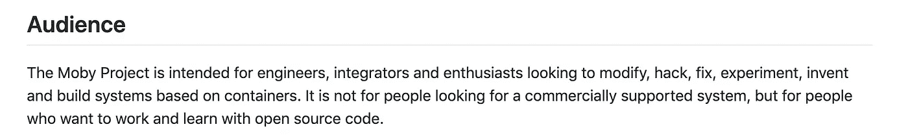
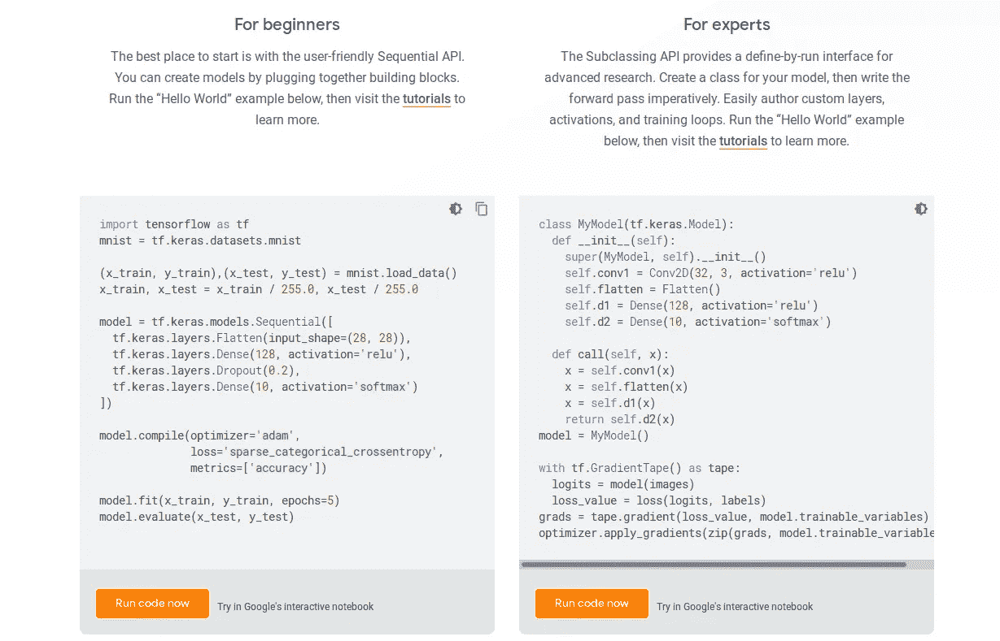
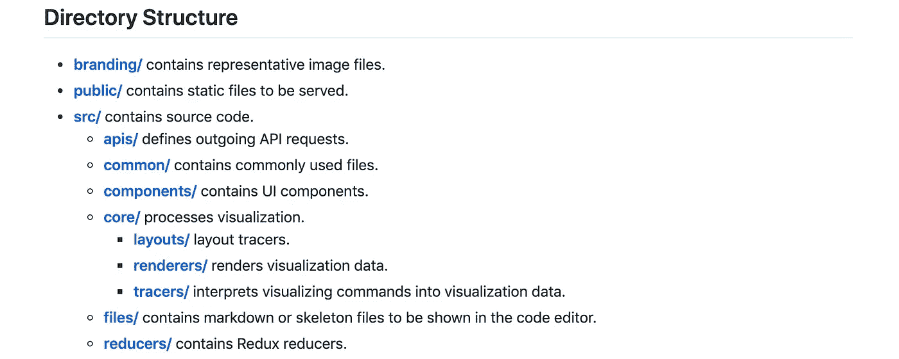
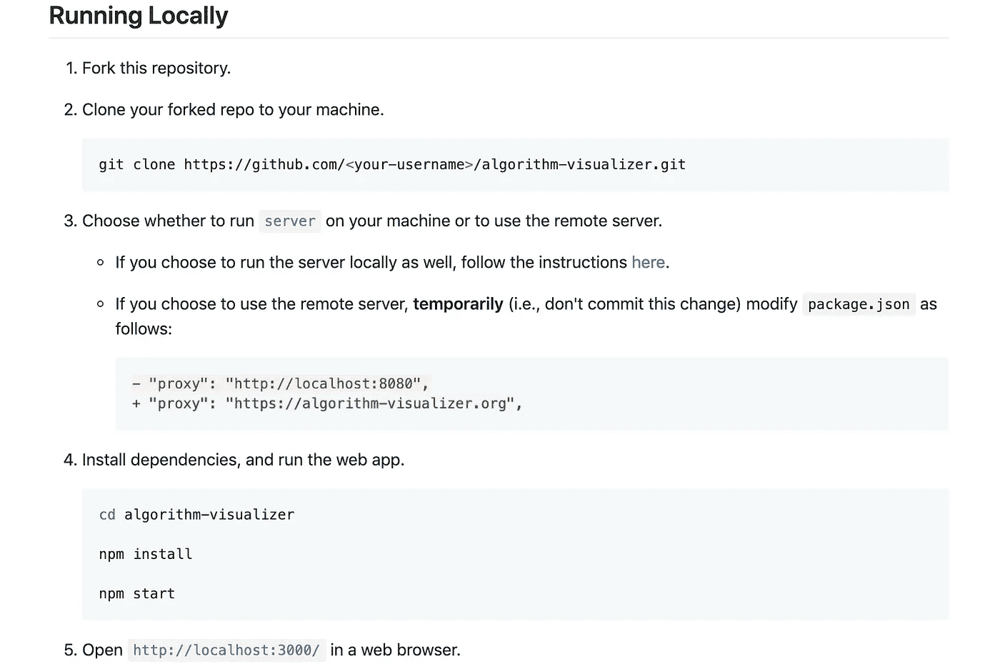
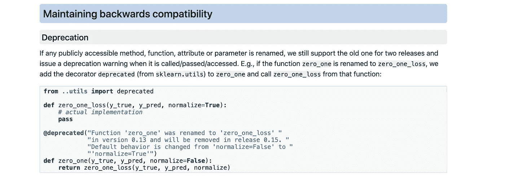
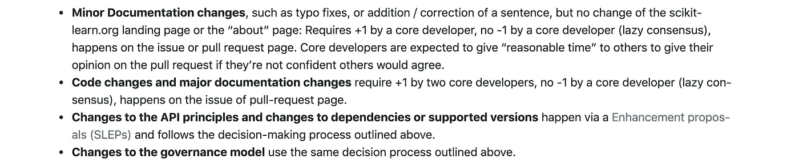

# 如何写一篇可读的自述

> 原文：<https://betterprogramming.pub/how-to-write-a-readable-readme-590ae6124f69>

## 不要用 READMEs 来混淆开发者

罗马卡夫在 [Unsplash](https://unsplash.com/s/photos/information?utm_source=unsplash&utm_medium=referral&utm_content=creditCopyText) 上拍摄的照片

自述文件是开发人员对项目的第一印象。

一个写得很好的自述文件可以为项目带来动力和支持，但是与代码相比，自述文件的质量不太重要。因此，开发人员通常在自述文件中投入最少的精力。

自述文件应该用尽可能少的文字实现四个目标:

1.  陈述目标:陈述项目试图解决的问题。
2.  定义受众:定义谁可以/应该参与项目。
3.  演示用法:演示如何开始使用该项目。
4.  阐明工作流程(可选):阐明如何协作和贡献。

# **第一步。陈述目标**

我建议使用以下形式的一个句子:

<*我的牛逼项目* >是一个< *实用程序/工具/框架/等等。* >帮助< *我的目标受众* >做< *一些任务* >。

以下是一些成功项目的例子:

*   [PyTorch](https://pytorch.org/) :开源机器学习框架，加速了从研究原型到生产部署的路径。(如果转换成我们的形式，会是:“PyTorch 是一个机器学习框架，帮助(每个人)加速从研究原型到生产部署的路径。”)
*   React: React 是一个用于构建用户界面的 JavaScript 库。(React 的客观陈述和我们的格式几乎一样，只是他们的受众是所有人)。

# **第二步。定义受众**

*   定义可以使用它的用户组:操作系统、编程语言和框架限制。
*   定义可以/不可以从项目中受益的用户组。

这里有一个来自莫比项目的例子:

鸣谢:示例目标受众来自[莫比](https://github.com/moby/moby)

# **第三步。演示用法**

1.  给用户关于项目如何工作的直觉。
2.  帮助用户开始使用项目。

为了实现这两个目标，我更喜欢使用接近真实世界用例的例子(有效的代码),只使用基本的(不要使用花哨的配置)。

用户可以从示例代码中理解项目，并且他们可以复制粘贴代码来开始使用项目。

这里有一个来自 [TensorFlow](https://www.tensorflow.org/) 的例子:

信用:[tensorflow.com](http://tensorflow.com)

# 第四步。阐明工作流程(可选，仅当项目接受贡献者时)

*   目录/项目结构:

credit:来自[算法可视化器](https://github.com/algorithm-visualizer/algorithm-visualizer)的示例目录结构

*   开发人员设置:

鸣谢:来自[算法可视化器](https://github.com/algorithm-visualizer/algorithm-visualizer)的示例开发人员设置

*   最佳实践:定义工作质量的标准。

鸣谢:来自 [scikit-learn](https://scikit-learn.org/dev/index.html) 的最佳实践范例

*   提交过程:定义提交代码/评审/文档的过程。

credit:来自 [scikit-learn](https://scikit-learn.org/dev/index.html) 的示例提交流程

# 额外收获:我构建的一个自动提高自述可读性的工具

README 是代码，所以它也值得 linter 和持续集成。

[readable-readme 项目](https://github.com/tianhaoz95/readable-readme)是一个基于 GitHub 动作的持续集成工具，用于控制 READMEs 的可读性/质量。

 [## 天昊 95/可读-自述

### 如果 README 不可读，那么其他任何东西都不可读。我们经常发现一个伟大的项目，但仅仅 5 分钟后就放弃了…

github.com](https://github.com/tianhaoz95/readable-readme) 

添加到工作流程后，`readable-readme`将根据推/拉请求为所有自述文件生成质量报告。

致谢:来自 [readable-readme](https://github.com/tianhaoz95/readable-readme/blob/master/.github/workflows/checkin.yml) 的用法示例

生成的报告如下所示:

信用:readme 质量报告来自 [readable-readme](https://github.com/tianhaoz95/readable-readme)

注意:readable-readme 项目还处于非常早期的阶段。欢迎各种投稿。让我们让 READMEs 再次变得伟大！

意见是我自己的，而不是我的雇主的观点。