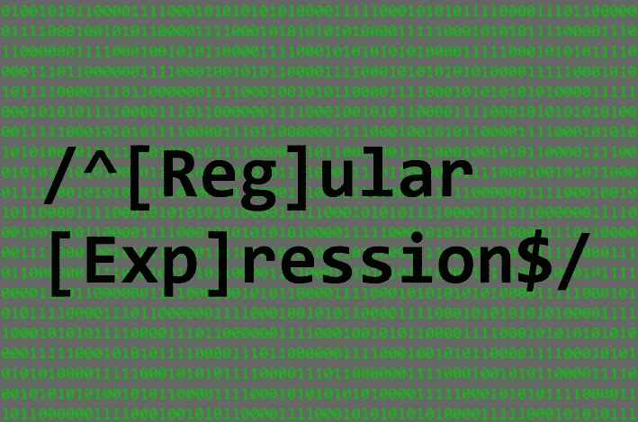

# 如何写一个值得通过代码评审的正则表达式

> 原文：<https://betterprogramming.pub/how-to-write-a-regex-worthy-of-passing-code-review-68b9a25c013a>

## 让我们再次让正则表达式变得酷起来



作者提供的图片

看到这样的正则表达式，您会作何反应:

```
/^([0-9]{5}([\s]+|,)+)*([0-9]{5})$/
```

在代码审查中？

是否清楚这个表达式试图做什么，不做什么，或者如何测试？可悲的是，一个典型的正则表达式要么太简单以至于毫无用处，要么太复杂以至于只有编写它的工程师才能理解。

不一定要这样！您可以仅用一些基本知识编写有效的正则表达式，并使它们对其他工程师来说是可读的，甚至是那些发誓永远不使用它们的固执己见的工程师。

让下面的内容成为理解、利用和维护正则表达式的实用指南。

# 快速背景

正则表达式(RegEx)为匹配和解析字符串提供了一种简洁的、与语言无关的格式。在理论计算机科学中，可以证明任何[有限状态机](https://en.wikipedia.org/wiki/Finite-state_machine)都有一个等价的正则表达式。实际上，这意味着一个正则表达式可以代表一个完整的数据处理算法，所有这些都在一个简单的字符串中。

因此，正则表达式应该像其他代码一样对待。它应该写得干净易读，这样任何人都可以轻松地回来维护它。请继续阅读，了解我们如何将编程最佳实践应用于正则表达式(附示例)。

# 示例 1:邮政编码

这里有一个正则表达式，它将匹配任何包含 5 个数字的字符串，除此之外没有其他内容，例如美国邮政编码:

`^[0-9]{5}$`

以下是所有这些符号的含义:

*   `^` —匹配字符串的开头
*   `[0-9]` —匹配任何数字(特别是集合`{0,1,2,3,4,5,6,7,8,9}`中的一个字符)
*   `{5}` —精确应用`[0-9]`5 次
*   `$` —匹配字符串的结尾

总之，我们的正则表达式将匹配任何只有 5 个数字的字符串，前面没有，后面没有。让我们运行它，并将其复杂性与自制的字符串解析解决方案进行比较:

似乎有用。这是我得到的输出:

# 示例 2:许多邮政编码

现在，让我们用一个更难的解析问题来使事情变得有趣。假设我们想要验证一个表示邮政编码列表的字符串，每个邮政编码由逗号或空格分隔。我们可以检查字符串是否匹配这个(丑陋的)正则表达式:

```
^([0-9]{5}([\s]+|,)+)*([0-9]{5})$
```

这一切意味着什么:

*   `([0–9]{5})`匹配一个邮政编码(如例 1 所示，括号处理分组)
*   `[\s]+`匹配一个或多个空格字符，如空格、制表符等。
*   `|`匹配前面的图案*或后面的图案*
*   `,`匹配一个逗号
*   `([\s]+|,)+`匹配一个或多个空格或逗号，一次或多次(这代表一个有效的分隔符或一系列分隔符)
*   `([0–9]{5}([\s]+|,)+)*`匹配邮政编码，后跟空格或逗号分隔符，零次或多次
*   `^([0–9]{5}([\s]+|,)+)*([0–9]{5})$`匹配前面有分隔符分隔的邮政编码序列的单个邮政编码，在整个序列之前或之后没有其他内容

让我们编写代码，通过一些测试来看看它是否有效(我们稍后将回到这些测试):

这是我们得到的结果:

酷，它的工作！这个正则表达式简洁高效，据我所知，它是正确的。但是，~唉~

这个表情——`^([0–9]{5}([\s]+|,)+)*([0–9]{5})$`就是 ***丑。***

乍一看，完全不清楚这是要做什么。在我看来，这不会通过严格的代码审查。所以，我们来清理一下吧！

# 例子 3:许多邮政编码，但可读

编写真正有效的正则表达式需要与编写任何有效代码相同的最佳实践。这里有一些你可能认识的规则，但是当涉及到正则表达式时，这些规则并不明显:

## 干(不重复)

如果相同的模式在正则表达式中出现多次，将其重构为自己的变量/常量:

## 为清晰起见，使用中间变量

使用中间变量在技术上是不必要的，并且不会使代码更具功能性或计算效率。然而，它可以通过提高代码的可读性来节省大量最昂贵的资源(时间)。我们的正则表达式如何与下面的改进一起工作已经变得很明显了:

这可能看起来没有必要，也很迂腐，但是请记住，许多人并不经常使用正则表达式，所以过分清晰也无妨。

## 写测试！！

所有代码都值得测试，正则表达式也不例外。对于常规代码来说，拥有接近 100%的分支覆盖率总是好的。简单来说，每个条件表达式( *if，else，while，for，…* ) 都应该有一个条件为真的测试，以及一个条件为假的测试。因此，每一个可能的代码“分支”都会被测试。

类似的原则也适用于正则表达式，因为它们只是有限状态机的紧凑表示(基本上，是有限的分支/循环算法)。一些将分支视为测试对象的令牌示例:

*   `{5}`(又名量词*)—编写一个测试用例，其中有 5 个前面的标记，以及除 5 个前面的标记之外的其他标记。例如，测试用例`“12345”`测试一个 5 位数的有效 zip，而`“123456”`测试一个 6 位数的无效 zip*
*   `|`(又名 an *或*表达式)—为 or 表达式左右两边的标记编写一个测试用例，如下所示。例如，在我们的`ZIP_CODE_LIST`表达式中，测试用例`“12345,67890”`测试`|`前的逗号标记，而`“12345 67890”`测试`|`前的空格标记
*   `+`和`*`(又名*一对多*o*r*z*ero-or-many*表达式)——编写测试用例，其中在这些表达式之一之前有零个、一个和多个标记。例如，`“1234567890”` `”12345 67890"`和`“12345(space)(space)67890”` and 都用零个、一个和两个分隔两个邮政编码的空格符来测试我们表达式的`[\s]+`部分。

希望这些例子和策略在您的正则表达式编程冒险中有用。我希望这能作为写作、阅读和复习正则表达式的有用参考！如果你曾经在代码审查中看到一个丑陋的正则表达式(没什么不好意思的，我已经写了很多了)，请随意留下这篇文章的链接。