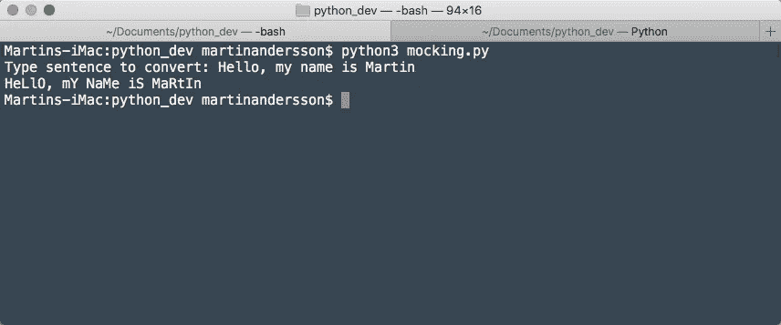

# “你能这样打字吗”？下面是如何用 Python 写一个海绵宝宝嘲讽转换器

> 原文：<https://betterprogramming.pub/how-to-write-a-spongebob-mocking-converter-in-python-cbccae720f8f>

## 你永远不知道什么时候你需要让别人明白你的意思


照片由 [Nikhil Mitra](https://unsplash.com/es/@nikhilmitra?utm_source=medium&utm_medium=referral) 在 [Unsplash](https://unsplash.com?utm_source=medium&utm_medium=referral) 上拍摄

好吧，所以你可能想知道什么是海绵宝宝模仿转换器。一个由字母系列组成的迷因，其中每一个字符都是小写/大写字母，将创建一个这样的句子:

```
WoW, yOu'Re ReAlLy SmArT!
```

也就是说“哇，你真笨。”

像这样写作需要一些认知负荷，老实说，这有点太麻烦了。因此，我决定创建一个 Python 工具来为我们做这件事是个好主意。

当然，像这样的工具在网上已经存在。如果你想试一试，可以试试[这个](https://www.cemerick.com/stopthatrightnow/)服务。

但是让我们假设你带着你的笔记本电脑在野外，出于某种原因，你真的需要离线做这件事。

# 它是如何工作的

很简单。你写下你的句子并按下回车键。就是这样。您的句子将以明文形式返回，供您复制并粘贴到您选择的聊天应用程序中。

这是它看起来的样子:



运行嘲讽程序的终端，作者截图

# 我们需要什么

很明显，我们将使用数据类型`string`。我们还需要找到一种将字母转换成大写和小写的方法。对我们来说幸运的是，这已经内置到 Python 中，并且使用起来非常简单。

## 线

`String`有许多我们可以利用的好方法。今天我们来看看`upper()`和`lower()`。

这两种方法有能力改变一个字母的大小写。

```
name = 'MaRtIn'
print(name.lower())>> martinprint(name.upper())>> MARTIN
```

它们将整个字符串转换为大写或小写。当我们为我们的程序写代码时，我们将处理单个的字母，仍然使用同样的方法。

# 破解密码

让我们一行一行地检查代码——或者一个功能一个功能地检查。这是它的全部内容:

## **def_mock(句子)**

该函数将使用参数“sentence ”,并将其转换为一个新的句子，其中的字母已被转换为大写字母和小写字母的混合。

```
def mocker(sentence):
    new_sentence = []
    for index,letter in enumerate(sentence):
        if index%2==0:
            new_sentence.append(letter.upper())
        else:
            new_sentence.append(letter.lower())
    return ''.join(new_sentence)
```

这里我们可以看到这个函数是如何立即创建一个空列表的(`new_sentence`)。我们这样做的原因是，我们希望在结尾处使用 join，根据我们的要求重新创建一个句子。

为了知道我们需要将哪个字母设置为大写或小写，我们将使用该字母的索引。如果你看到单词“Hello World ”,这是索引的样子:

```
H e l l o   W o r l d
0 1 2 3 4 5 6 7 8 9 10
```

我们想说“如果指数能被 2 整除，那么它应该是上指数。”这将为我们提供所有偶数索引及其配对字母。

为了能够遍历句子并处理索引，我们将使用`enumerate()`。`enumerate()`允许我们访问列表项的索引和值。

```
for index,letter in enumerate(sentence):
    if index%2 == 0:
        new_sentence.append(letter.upper())
```

当我们像这样使用 enumerate 时，我们可以使用索引来检查这个字母在句子中的位置，然后我们可以使用`append()`将这个字母作为上级变体添加到我们的新列表中。

我们使用模来确定索引号是奇数还是偶数。这是一个很好的技巧的原因是，你总是有偶数的`0`或奇数的`1`。这样，您可以决定如何处理返回`0`的索引上的字母，以及如何处理返回`1`的索引。

```
0%2 -> 0/2=0, R=0 (no remainder) 
1%2 -> 1/2=0, R=1 (one remainder as you can devide 1 by 2, 0 times. Then you are left with 1.
...
7%2 -> 7/2=3, R=1 
```

到目前为止，我们告诉脚本的是，所有索引为偶数的字母都是大写的。else 条件的作用正好相反。

```
 else:
        new_sentence.append(letter.lower())
```

如果您打印`new_sentence`列表，您将得到“Hello World”的这个列表:

```
['H', 'e', 'L', 'l', 'O', ' ', 'W', 'o', 'R', 'l', 'D']
```

## 。加入()

到目前为止，一切顺利。然而，一份清单很难读懂。因为这是一个由一堆字母组成的列表。

我们想使用`join()`将这个列表转换成可读性更好的字符串。join 的工作方式是，你可以告诉它连接列表中的所有项目，你也可以定制你想要连接的项目。为了告诉`join()`你想要在你的项目之间添加什么，你把它添加到引号内的方法的前面:

```
'_'.join(new_sentence)
H_e_L_l_O_ _W_o_R_l_D
```

显然，我们不想在我们的信件之间添加任何东西。我们只是想把它们连接起来。因此，我们在 join 方法前面传递一个空字符串。

```
return ''.join(new_sentence)
>> Hello World
```

## **def main()**

我们需要 main 做的唯一一件事就是请求一个句子，并通过 mocker 函数运行它。

```
def main():
    input_sentence = input('Type sentence to convert: ')
    print(mocker(input_sentence))
```

# 列表理解时间

现在我们有了一个函数脚本，我们可以开始考虑把它变得更短。你看，这个脚本可以是一行程序。

```
return(''.join([letter.lower() if index%2==0 else letter.upper() for index,letter in enumerate(sentence)]))
```

如果你看看这句话，你会发现这几乎是我们一直在做的事情。

*   我们用一个空字符串连接列表中的一系列字母。
*   我们使用 enumerate 创建这个列表来访问索引和值。
*   我们使用和以前一样的条件。`if index%2==0`表示小写(或大写，如果您喜欢)，使用`else`表示奇数索引的大写。

# 陷阱和最终想法

如果你在阅读这个故事时注意了，你会发现代码中有一个缺陷。它不占空间。如果你有这样一句话:

```
Hello World
```

应该是这样的

```
HeLlO WoRlD
```

Hello 结尾的“O”和 Worlds 的“W”都变成了大写，因为空格被当作一个字符来读。然后从大写空间转换成小写空间，反之亦然。试一试，看看你是否能找到一种解释空间的方法。

这听起来很奇怪，但实际上我在上个月已经使用过这个工具好几次了。一个愚蠢的工具，的确，但一个有趣的小练习。

谢谢你过来。

希望你喜欢写这个程序。