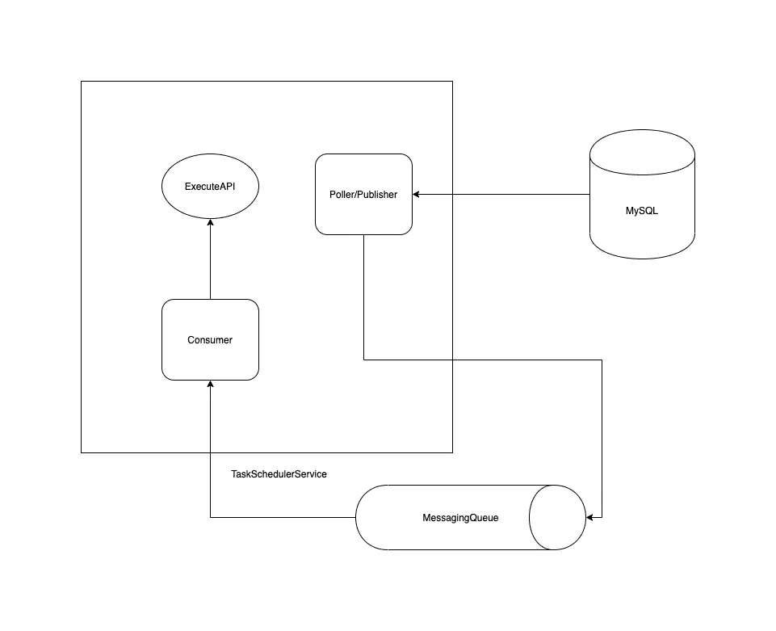

# 如何编写一个基于时间戳的任务调度程序

> 原文：<https://betterprogramming.pub/how-to-write-a-timestamp-based-task-scheduler-1312abe9e6d>

## 编写一个分布式、可水平扩展的任务调度程序，以接收任务并在预定义的时间运行


照片由[柯蒂斯·麦克牛顿](https://unsplash.com/@curtismacnewton?utm_source=unsplash&utm_medium=referral&utm_content=creditCopyText)在 [Unsplash](https://unsplash.com/s/photos/schedule?utm_source=unsplash&utm_medium=referral&utm_content=creditCopyText) 拍摄

我们有时会觉得在我们的设计架构中需要一个[服务](https://microservices.io/)，它可以为我们接收任务，并确保它们在首选的时间戳得到保证的执行。任务可以是任何事情，从向客户发送电子邮件通知和文本消息，到点击第三方 API，到安排另一个任务，或者可以简单到在终端上打印消息。

任务调度程序应该做什么:

*   接收带有预定义时间戳的任务
*   确保每个任务在给定的时间戳被触发
*   扩展大量摄取任务
*   避免[spof](https://en.wikipedia.org/wiki/Single_point_of_failure)，如果有的话
*   避免瓶颈

等等！我们真的需要它吗？

让我们看看 [Linux crons](https://www.howtogeek.com/101288/how-to-schedule-tasks-on-linux-an-introduction-to-crontab-files/) 能否解决这个问题。您所需要做的就是准备好您的`script.sh`，然后将这些代码粘贴到我们的 crontab ( `crontab -e`)上:

```
* * * * * ~/path/script.sh >> ~/path/script.log
```

`[* * * * *](https://crontab.guru/)` 帮助你决定脚本运行的时间戳(以及重复次数)。该脚本将在准确的时间戳重复执行。直到这里，一切都很好。

但是有一个问题。如果这台机器停机了，或者有太多的任务需要单个硬件来扩展，该怎么办？

Crontabs 与可执行脚本配合得非常好。但仅此而已。在分布式环境中，或者当您需要重试策略时，它们可能不起作用。它们可以充当整个系统的 SPOFs。假设我们需要在一个上午的时间段向客户发送数千条消息，不幸的是，硬件出现故障或者出现连接阻塞？任何一天只有一台机器都不是一个好主意。这个问题需要检查一下。

那么我们如何解决这个问题呢？

我们将设计自己的内部调度程序。它将是一个水平可扩展的独立微服务，能够大规模接收任务，暂时保存它们，并在给定的时间戳执行这些任务。让我们开始第一步。

# 1.将任务纳入系统

一项任务可以有多种类型，每一种都被指定根据类型做不同的事情。为了简单起见，假设任务结构只是一条消息以及使用该消息的时间戳。用户提交请求后:

```
curl --location --request POST '{url}/tasks/submit' \
--data-raw '{
 "message":"This is a demo task",
 "timestamp":"2020-03-10T00:42:30"
}'
```


将任务纳入系统

我们必须将唯一的`TaskId`返回给用户。其思想是[使用 UUIDs，而不是自动增量 id](https://blog.pythian.com/case-auto-increment-mysql/)。一旦请求被正确验证，我们必须通过发回 UUID 作为响应的一部分来满足它:

```
{
    "status": {
        "status": "SUCCEDED",
        "count": 1
    },
    "data": [
        {
            "id": "21021f23-8df7-4bbf-a169-1227d3e49c63",
            "message": "drredecff",
            "timestamp": "2020-03-10T00:42:30.000+0000",
            "version": 0,
            "status": "SUBMITTED"
        }
    ]
}
```

我们有持久的数据存储，在那里我们已经在`SUBMITTED`状态下完成了请求的任务。现在，一旦时机成熟，我们如何对任务进行投票？

# 2.在给定的时间戳轮询任务

这是练习中最棘手的部分。在一段时间间隔(可配置)后，我们将继续重复运行这个轮询器(一组线程)，以获取时间戳与当前时间戳相比已经过去的所有线程。这个轮询器将从一个负责获取预定义任务批的节点(所有节点都将这样做)产生多个线程。然后，它将在预定时间后重新运行。我们需要保持批量、线程数和间隔可配置。让我们看看我们的`application.properties`文件的一部分:

```
thread.count = 4
thread.interval = 20000
batch.size = 10000 
```

这仅仅意味着我们需要启动四个线程，每个线程将在 20，000 毫秒后运行，并获取一批 10，000 个任务。下面是我们在服务启动时如何生成这些线程的一个快速实现:

一`TaskProcessor`会是这样的:

`process()` 方法应标记为`Transactional`，因为多个线程(可从`*.*properties`文件配置)将从单个节点一次轮询数据库。

为了以防万一，我们将保留上升时间`ATOMIC`以避免脏读。一旦任务被线程获取，在同一事务中会被标记为`IN_PROGRESS`。

因为我们希望几个线程从数据库中提取任务，所以我们需要找到批处理。一个`Cursor` 类可以为单个节点服务，将任务分成多个批次:

```
Cursor => Query [Start Pointer, Batch Size]
```

我们将使用一个`Cursor`*(struct with[CAS](https://stackoverflow.com/questions/32634280/how-does-compare-and-set-in-atomicinteger-works)implementation*)*类来更新单个线程的查询限制，因为我们确实希望其他线程并行访问其他批处理。*

*当我们进行这种轮询时，日志看起来有点像这样:*

```
*2020-03-22 21:35:10.401  INFO 1378 --- [pool-3-thread-4] c.taskschedular.processor.TaskProcessor  : Thread pool-3-thread-4started/resumed ...
2020-03-22 21:35:10.401  INFO 1378 --- [pool-3-thread-1] c.taskschedular.processor.TaskProcessor  : Thread pool-3-thread-1started/resumed ...
2020-03-22 21:35:10.401  INFO 1378 --- [pool-3-thread-3] c.taskschedular.processor.TaskProcessor  : Thread pool-3-thread-3started/resumed ...
2020-03-22 21:35:10.402  INFO 1378 --- [pool-3-thread-1] com.taskschedular.dao.impl.TaskDaoImpl   : Querying Tasks from Limit : (0,20) Before Sun Mar 22 21:35:10 IST 2020
2020-03-22 21:35:10.402  INFO 1378 --- [pool-3-thread-4] com.taskschedular.dao.impl.TaskDaoImpl   : Querying Tasks from Limit : (40,20) Before Sun Mar 22 21:35:10 IST 2020*
```

*一旦我们扩展了线程的数量(对于单个节点)，我们也将能够扩展任务的轮询。但是，当 CPU 内核/虚拟机配置出现时，可能会有一些警告。*

*为了将任务委托给作为分布式系统一部分的其他节点，我们可以保留一个普通的(如 Redis 键)来不时地更新`Start Pointer`*(`REDIS_INTERVAL`)*。*此外，我们可以配置光标是否从 Redis 中获取初始值。`CursorConfig` 类的快照可能如下所示:**

**一旦我们有了记忆中的任务，我们如何大规模地处理它们？在给定的时间框架内可能有太多的任务，而在一天的其他时间内可能有太少的任务。**

# **3.执行任务**

**解决这个问题以及实现并行扩展的最简单方法是归结到发布-订阅模型。一旦我们获取了确保没有重复的消息，我们可以简单地放入一个消息队列(让我们使用 [RabbitMQ](https://www.rabbitmq.com/) )来确保:**

*   **一旦发布者线程将消息放入交换中，绑定队列将接收该消息。**
*   **一旦队列收到消息，它会尽快将消息传递给其中一个并发消费者。(消息不能发送两次，一旦发送，就应该有一个正确的 ACK。)**

****

**轮询/处理任务**

**我们正在使用这种模式来根据我们的偏好调整我们的消费者。此外，提取-执行 duo 可以分离出来。在消费者方面，当我们收到消息时，我们可以自由地执行它:**

**这种方法可以适应任务的重新运行(可重复的任务)。我们只需要调用刚刚执行的任务的`SubmitAPI`调用。任务的摄取是相当可伸缩的，因为一个任务独立于另一个任务。(这给我们留下了使用非关系数据库的选择，但那是以后的事了。)此外，poller 不是在一台机器上运行，因此不存在 SPOF 的可能性。**

**ORM ( `Hibernate`)维护了适当的原子性，以避免任何脏读(重复的消息被推到队列中)。我们还可以微调时间间隔(轮询器重新运行)和要获取的任务批次，因为唯一需要做的事情是配置`application.properties` 文件。此外，我们可以通过配置我们的消费者来扩展作业的消耗(在执行时)。**

# **资源**

**你可以在 GitHub 上找到[的完整实现。](https://github.com/xero812/TaskSchedulerService)**

**其他参考:**

**[https://en.wikipedia.org/wiki/Single_point_of_failure](https://en.wikipedia.org/wiki/Single_point_of_failure)**

**[https://www . how togeek . com/101288/how-to-schedule-tasks-on-Linux-an-introduction-to-crontab-files/](https://www.howtogeek.com/101288/how-to-schedule-tasks-on-linux-an-introduction-to-crontab-files/)**

**[https://blog.pythian.com/case-auto-increment-mysql/](https://blog.pythian.com/case-auto-increment-mysql/)**

**[https://stack overflow . com/questions/32634280/how-does-compare-and-set-in-atomic integer-works](https://stackoverflow.com/questions/32634280/how-does-compare-and-set-in-atomicinteger-works)**

**[https://www.rabbitmq.com/amqp-0-9-1-quickref.html](https://www.rabbitmq.com/amqp-0-9-1-quickref.html)**