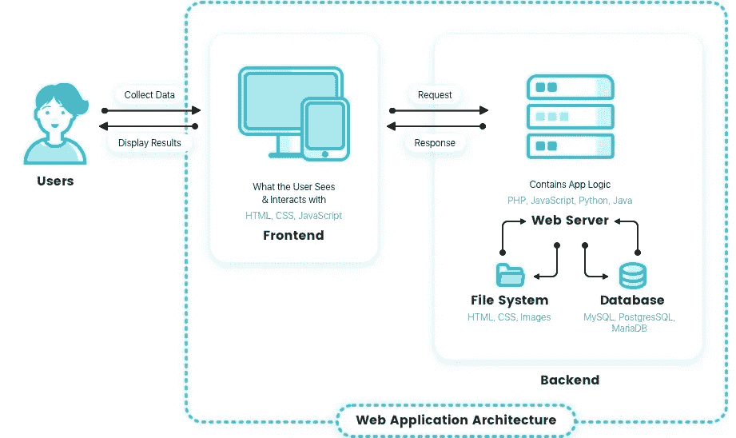
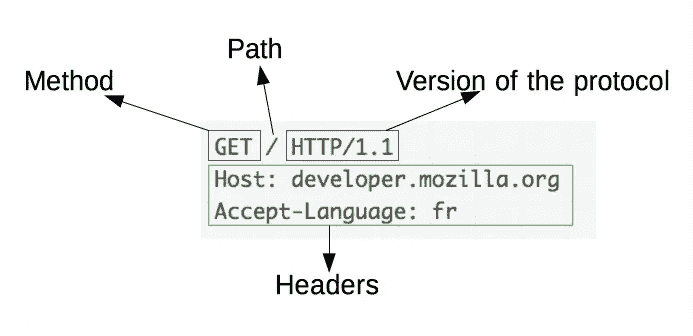
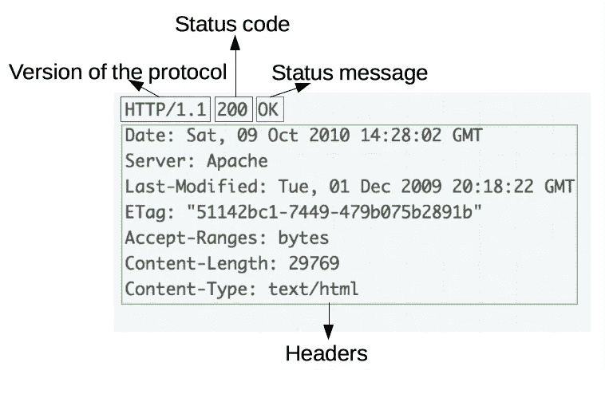
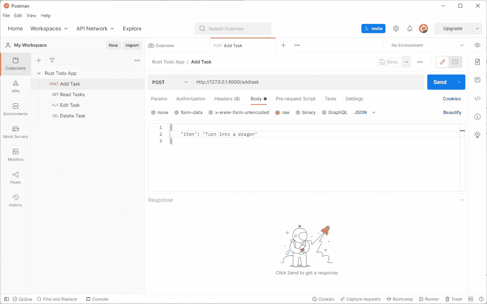

# 如何用 Rust 编写 Web 应用程序

> 原文：<https://betterprogramming.pub/how-to-write-a-web-app-in-rust-part-1-3047156660a7>

## 第一部分


科比·门德斯在 [Unsplash](https://unsplash.com?utm_source=medium&utm_medium=referral) 上的照片

这是关于编写 web 应用程序的系列文章的第一部分。对于这个系列，我们将在 [Rust](https://www.rust-lang.org/learn/get-started) 中编写 web 应用程序，我会向你解释如何自己编写。

但是，如果您不愿意自己编写代码，我已经创建了一个存储库，其中包含了本系列中编写的所有代码。在本系列的每一部分的结尾，我都提交了一个存储库。

# 本系列的目标

框架是强大而有用的工具。他们抽象出了创建 web 应用程序的许多令人痛苦的细节。理论上，这意味着新开发人员可以更快地帮助开发，老开发人员甚至可以更有效率，因为他们不必通过繁琐的、低级的细节来挖掘。

然而，一个框架最大的优点也是它最大的弱点。从长远来看，那些只知道如何使用框架，而不知道框架抽象出了什么的新开发人员可能效率更低。当使用这个框架时，他们可能并不完全知道他们在做什么。而且，在框架失败的情况下，开发人员可能不知道如何修复它，因为他们根本不知道框架在做什么。

因此，我希望通过写这篇文章来解决这个问题。通过使用一个示例项目，我想从头开始构建一个 web 应用程序，并慢慢将其升级为使用框架的更现代的应用程序。这样做，我们应该能够看到为什么某些设计选择和框架如此普遍，并且应该对我们所依赖的框架获得更大的赞赏。

# 什么是 web app？

当做任何大的或复杂的事情时，问几个问题是很重要的。前两个是*为什么*和*什么*。如果我们知道这些问题的答案，我们的目标和达到目标所需的步骤就会变得更加明显。一旦我们心中有了具体的目标，就很容易一步一步地达到你更大的目标。我们已经讨论了*为什么*我们要建立一个网络应用。我刚刚在目标部分提到了这一点，我相信你可以提出许多其他的理由来解释你为什么要建立一个目标。一般来说，是为了解决一些问题。

这里重要的问题是*什么是*网络应用。我们大多数人对其中一个都有相当直观的理解。它是一个网站。比如谷歌、YouTube 或网飞。你在浏览器中输入一个网址，它会把你带到一个页面，你可以点击按钮做一些事情。然而，我们希望有一个能帮助我们理解网站技术层面的定义，这个定义太模糊了，不能告诉我们更多关于网络开发的东西。所以，让我们深入研究一下。

# 基本的 Web 应用程序定义

通过在浏览器中输入 URL 来进入 web 应用。运行浏览器的计算机被称为*客户端*。这个 URL 将你连接到另一台名为*服务器*的计算机。该服务器向客户端提供内容。然后，客户端将服务器提供的内容显示给用户。通常，客户端还提供不同的表单来输入新数据。这些数据被发送到服务器，服务器向客户端提供新的内容。客户端向服务器发送数据称为*请求*，服务器向客户端发回数据称为*响应*。如下图所示。



照片来自 Reinvently 的[Web 应用如何工作——简化的 Web 应用架构](https://reinvently.com/blog/fundamentals-web-application-architecture/)

我们编写的 web 应用程序运行在服务器上。因此，web 应用程序的工作是接收传入的请求，处理它们，并发回包含客户端使用的内容的适当响应。这个“内容”当然是我们的前端。我们的用户在浏览器中看到并用来发送请求的 HTML、CSS 和 JavaScript。因此，当我们说我们要“用 Rust 编写一个 web 应用程序”时，我们实际上是在说我们要用 Rust 编写一个程序，处理传入的请求，并以 HTML、CSS 和 JavaScript 的形式发回适当的响应。

然而，并不是所有的响应都是 HTML、CSS 和 JavaScript 的形式。回应可以以各种形式出现。好多回复其实都是 JSON。最终，这个响应以某种方式变成了可以在浏览器中查看的 HTML，但是服务器并不总是直接发送 HTML。事实上，如果您在过去几年中编写过 web 应用程序，您可能已经熟悉 JSON 响应了。

# 更现代的 Web 应用程序定义

近年来，网络应用的定义已经发生了一些变化。像 React 这样的框架改变了 web 应用的结构。有了在`create-react-app`中创建的 React 应用程序，你就有了一个更像下面这样的结构。

用户不是直接连接到服务器，而是连接到一台计算机，该计算机提供使用 React 编译的前端。当用户发出请求时，这台计算机会将请求发送到包含该服务器的另一台计算机。服务器将数据和 React 代码一起发送回计算机，然后 React 代码使用该数据向用户发送响应。(不过，我要提一下，这种情况只有在开发期间使用`create-react-app`时才会发生。通常，当您部署 React 应用程序时，它会回到两台计算机的体系结构，只是将花哨的 React 编译的 JavaScript 发送到客户端)

在这种体系结构中，用户与两台计算机交互。一个持有 React 前端，另一个持有一些只传递数据的后端。具有前端的计算机使用来自后端的数据来创建发送给用户的响应。

这种架构为开发人员带来了一些优势，因为编写前端和后端可以变得容易得多。有时后端基本上只是保存和返回前端告诉它的数据，几乎不处理数据。这就是为什么有些人说现代网站只是数据库的花哨包装。后端基本上可以只是一个数据库，前端只是一个非常复杂的包装器。

请注意，这个定义对于我们将要编写的 web 应用程序并不是特别有用，但是由于许多 web 应用程序最终都是这样构造的，所以我认为它值得一提。

# 关于请求和响应的注释

遗憾的是，在我们深入研究这个例子之前，还有一些技术术语需要理解。正如我在上一节中介绍的，用户向服务器发送请求，服务器返回响应。然而，稍微了解一下这些请求和响应的样子是很重要的。

# HTTP 协议

服务器和客户端通过 HTTP 进行通信。它是一个协议，这意味着它是一组确定数据如何传输的规则。用更熟悉的术语来说，它是服务器和客户机同意相互通信的一种方式。

HTTP 中的请求如下所示:



图片来自 MDN 的文章:[HTTP 概述](https://developer.mozilla.org/en-US/docs/Web/HTTP/Overview)

正如您所看到的，我们发送一个方法、某个 URL(这就是“Path”的含义)、协议的版本、一些向服务器传递信息的头和一个主体(取决于方法。一个`GET`方法没有主体，这就是这里没有显示主体的原因。一些 API，比如 [Elasticsearch](https://www.elastic.co/elasticsearch/) ，违背了标准的指定定义，确实要求带有`GET`请求的主体，但是，同样，这不是标准的，通常应该避免。通常，用户输入的信息位于主体中，但是用户可能会添加服务器要在路径或头中使用的信息。身体本身可以有许多不同的形式。常见的两种是 JSON 和 x-www-form-urlencoded。无论如何，基于请求中给出的信息，服务器会确定一个合适的响应，如下所示。



图片来自 MDN 的文章:[HTTP 概述](https://developer.mozilla.org/en-US/docs/Web/HTTP/Overview)

代替方法和路径，我们有一个状态代码和消息，它告诉我们请求发生了什么。我们仍然有协议的版本、报头和主体。大多数时候，在像我们这样结构化的 web 应用程序中，响应的主体是 HTML，浏览器将显示该 HTML。

这是大多数(如果不是全部的话)浏览器发送和接收数据的方式，因此，我们的 web 应用程序需要适应这种方式。

# 查询语言

近年来，一种叫做 [GraphQL](https://graphql.org/) 的查询语言变得相当流行。如果您知道上面的部分，您可能会对 GraphQL 之类的东西是如何工作的感到困惑，因为您发出的请求和响应如下所示:

```
{
  me {
    name
  }
}
```

不知何故，浏览器和服务器仍然能够理解。这是如何工作的？嗯，查询语言基本上是进行 HTTP 请求和响应的奇特方式。您用类似 GraphQL 的东西写出一段代码，然后某个程序将它转换成一系列 HTTP 请求和响应。

如果您继续开发 web 应用程序，您可能会最终使用或看到查询语言，重要的是要记住，它们仍然在使用相同的技术，但是，就像框架一样，它是一个抽象层，有助于使 web 开发更容易。

# 关于行话的最后一点

最后，在我们继续之前，我只想推荐 MDN Web Docs 的这篇文章:[HTTP 的概述](https://developer.mozilla.org/en-US/docs/Web/HTTP/Overview)。它涵盖了我刚刚提到的所有内容:服务器、客户机、请求、响应和 HTTP。如果你想以稍微不同的方式听到所有这些解释，这可能会帮助你更好地理解它，这是一个伟大的资源。

# 放到应用程序上

最后，在 1400 字的内容之后，我们已经开始实际构建我们的应用程序了。该应用程序将很简单:这将是一个待办事项应用程序。换句话说，我们正在制作一个应用程序，允许用户创建一个待办事项列表，编辑待办事项列表中的任务，并完成待办事项列表中的任务。为什么我们要以 Todo app 为例？因为大多数 web 应用程序需要允许用户创建、读取、更新和删除他们有权访问的数据。这非常重要，甚至有了一个很酷的缩写:CRUD(创建、读取、更新、删除)操作。Todo 应用程序是一个非常简单的例子，我们可以轻松直观地看到所有的 CRUD 操作。

我们将使用 [Rust](https://www.rust-lang.org/) 来创建这个应用程序。所以，把它安装好，也许还可以看看[这本书](https://doc.rust-lang.org/book/)来熟悉这门语言。我会尽最大努力解释每一步发生了什么，但我不能保证我会解释我们编写的代码的每个小方面。

# 创建项目

我们的第一步是创建应用程序的框架，我们将使用 Rust 的包管理器`cargo`来完成这项工作。打开您的终端，转到您想要存储项目的目录，然后运行

```
cargo new todo-app
```

这将在名为`todo-app`的文件夹中创建一个 Rust 项目，并将该文件夹放在您的工作目录中。这样，您就可以打开这个项目，您会发现下面的文件。

```
todo-app
│   .gitignore
│   Cargo.toml
│
└───src
        main.rs
```

`.gitignore`对我们的目的并不重要。`Cargo.toml`是我们指定项目中要使用的所有库的地方，而`main.rs`是我们的 Rust 代码要去的地方。

# 使用 Rocket 制作 Web 应用程序

这样一来，我们将安装一个名为 [Rocket](https://rocket.rs/) 的 web 框架来创建我们的 web 应用程序。现在，它的整个目标是从头开始制作一个 web 应用程序，所以在“从头开始”构建它时使用一个框架似乎有点违背直觉。然而，Rocket 不会抽象出对学习更多 web 应用程序特别重要的任何细节。它基本上只是处理接收和发送我们前面讨论过的 HTTP 请求和响应。虽然我们可以自己尝试实现 HTTP 协议，但那会很麻烦，我们也不会学到很多东西。此外，实现协议既困难又乏味，所以我想不惜一切代价避免它。

既然我们都在同一页上，让我们建立一个基本的例子。首先在`Cargo.toml`中，添加 Rocket 作为依赖。一旦你这样做了，你的`Cargo.toml`应该看起来像这样

现在，转到`main.rs`，删除里面的所有内容，替换成下面的代码

这段代码是如何工作的？第一行导入我们从 Rocket 安装的所有东西，`#[macro_use]`意味着我们显式地导入 Rocket，所以它的宏(通过写出一个名字调用的代码片段)被全局安装。`#[get("/")]`是一个被应用到`index`函数的[函数属性](https://doc.rust-lang.org/reference/attributes.html)(如果你知道这个东西，很可能是一个[属性宏](https://doc.rust-lang.org/reference/procedural-macros.html#attribute-macros))。这个属性是从 Rocket 导入的，这意味着如果用路径“/”调用 HTTP `GET`请求，就会调用`index`。

`index`，函数，只是返回字符串“Hello，world！”。应用于`rocket`函数的`#[launch]`属性意味着，当代码运行时，它将通过运行`rocket`函数开始。

那个 launch 属性也做了一些代码魔术来设置我们的服务器，但是我们现在忽略它。最后，`rocket::build().mount("/", routes![index])`正在向服务器添加我们之前创建的`index`函数。仅仅将属性应用到`index`是不够的，我们还必须挂载`index`。

让我们来测试一下！在终端中导航到您的项目目录，并运行以下命令

```
cargo run
```

您应该会看到一堆正在编译的包，当编译完成时，您应该会得到一条类似如下的消息

```
Rocket has launched from [http://127.0.0.1:8000](http://127.0.0.1:8000)
```

转到那个链接，你会看到一页写着“你好，世界！”。因此，随着软件包的安装，我们已经创建了一个基本的 web 应用程序。如果你想知道那个链接是什么，`127.0.0.1`只是你所在的电脑的名称。因为您在计算机上运行服务器，所以您连接到计算机来查看 web 应用程序。

那串数字的另一个名字是`localhost`。将这个 web 应用程序部署到一台计算机并连接到那台计算机有点棘手，但是，基本上，另一台计算机会有一些号码，您可以像在这里一样连接到它。通常，我们给这些数字命名，这样用户就不必写出一长串数字。这些名称及其相关号码存储在[域名系统(DNS)](https://en.wikipedia.org/wiki/Domain_Name_System) 中。

不管怎样，如果您查看终端输出，您会注意到如下所示的内容

```
GET / text/html:
   >> Matched: (index) GET /
   >> Outcome: Success
   >> Response succeeded.
```

如您所见，我们的服务器收到了一个 HTTP `GET`请求(`GET`是 HTTP 方法之一)，并成功发回了一个响应。当我们在浏览器中输入网址时，我们向服务器发送一个`GET`请求，服务器调用`index`函数，它返回“你好，世界！”。

# 创建任务

现在，我们可以进入 CRUD 操作的 C:创建。我们想要做的是，当一个带有任务数据的`POST`请求在`/addtask`路径上完成时，应用程序将任务保存在它能记住的地方。

为什么使用`POST`而不是`GET`或者许多其他 HTTP 请求方法中的一种？因为`POST`应该专门用于在服务器端创建数据的请求。为什么路径`/addtask`？因为用于在 web 应用程序中执行某些操作的路径应该是不言自明的。当创建一个请求时，如果请求的路径是`/addtask`，您知道您可能正在创建一个任务。为什么数据在请求体中？

因为那通常是数据去的地方。请求中的头通常用于元数据。除非您输入小而简单的数据，否则通常不应该使用参数和其他通过路径本身输入数据的方式。

很明显，一旦任务被创建，我们将希望以某种方式存储它们，以便我们可以检索它们来读取、更新或删除它们。但是，我们不希望将数据存储在变量中，因为如果服务器关闭，无论是由于某种错误还是为了维护它，数据都会丢失。此外，随着时间的推移，程序的规模只会继续增长，速度会越来越慢。因此，我们需要使用不同的解决方案来长期存储这些任务。

现在，由于我们是从零开始构建的，就像我们是制作原始 web 应用程序的人，并且没有访问某些工具的权限，我们将选择一个在当时有意义的解决方案。那就是将数据存储在一个文件中。文件是一种即使程序停止运行或计算机关闭后仍存在于计算机中的东西，每种编程语言都可以对文件进行某种形式的创建、编辑和删除。

记住这一点，让我们编写添加任务函数。为添加任务而添加的代码如下所示。

`Task`的`struct`前面的属性基本上表示从 HTTP JSON 主体中提取的数据将被放入这个结构中。post 属性中的`data="<task>"`表示主体数据应该进入`task` 参数。`task`参数采用的`Json<Task<'_>>`类型告诉 Rocket 将主体解析为 JSON，并将数据保存到一个`Task`结构中。

`OpenOptions`行将打开或创建一个名为`tasks.txt`的文件，并对其进行设置，以便无论何时我们向其写入，我们都是在添加而不是覆盖。`task_item_string`和`task_item_bytes`从`Task`结构中获取数据，并将其转换成可以写入文件的内容。最后，我们将它写入文件，并返回一个字符串，表示我们已经成功完成了任务。

然而，在此工作之前，我们需要修改我们的`rocket`函数，如下所示:

```
#[launch]
fn rocket() -> _ {
    rocket::build().mount("/", routes![index, add_task])
}
```

# 测试我们的创建任务方法

有了这个方法，我们想测试这个，但是我们怎么做呢？在本教程中，我们将使用一个名为 [Postman](https://www.postman.com/) 的软件向我们的服务器发送 HTTP 请求，但是发送请求有多种选择(如 [curl](https://curl.se/) )。要使用 Postman，您需要从网站安装它，创建一个帐户并登录。之后，点击`File>New`，在出现的页面上选择 HTTP request。从那里，你想让你的请求看起来像这样。



您将方法设置为 POST，将 URL 设置为[http://127 . 0 . 0 . 1:8000/add task](http://127.0.0.1:8000/addtask)，将主体设置为类型为 JSON 的`raw`，并包含以下 JSON

```
{
    "item": "Turn into a dragon"
}
```

这样，回到你的终端，点击`Ctrl-C`结束你正在运行的服务器，再次运行`cargo run`启动服务器备份。一旦服务器恢复正常，点击“邮递员发送”。web 应用程序应该在终端中给出如下输出:

```
POST /addtask application/json:
   >> Matched: (add_task) POST /addtask
   >> Outcome: Success
   >> Response succeeded.
```

Postman 中的响应框应该显示“任务添加成功”。如果你回到你的项目目录，你会注意到一个名为`tasks.txt`的文件已经被创建，它包含以下内容:

```
Turn into a dragon
```

恭喜你！我们的 webapp 现在可以创建任务了。

# 阅读任务

如果我们不能从应用程序中获得任务，那么拥有任务还有什么意义？那个问题是反问句。没有意义。所以，让我们让我们的 web 应用程序更有用一些，让它返回我们所有的任务。我们将这样做，当一个`GET`请求通过路径`/readtasks`发送到服务器时，我们将发送回我们存储在`tasks.txt`中的所有任务。我们使用一个`GET`方法，因为这是从服务器读取数据时的预期方法。所以，让我们跳过所有无聊的东西，直接进入代码！

首先，我们需要修改我们的`task`结构，如下所示

```
#[derive(Deserialize, Serialize)]
#[serde(crate = "rocket::serde")]
struct Task<'r> {
    item: &'r str
}
```

现在，对于实际读取任务的代码。

接下来，我们可以使用 postman 向我们的服务器发送一个`GET`请求(在停止之后，将`read_tasks`添加到我们的路由并重新运行)，我们可以看到我们得到了一个返回的任务列表

# 更新任务

呼-男孩！既然我们已经完成了创建和读取任务的所有工作，现在我们有一个问题。像现在这样编辑它们，很难也不可能。有什么问题？我们如何告诉计算机我们想要编辑什么任务？到目前为止，唯一的方法是输入完整的原始消息，但是不能保证某人不会有两个完全相同的任务。因此，我们将不得不存储带有附加信息的任务，这些附加信息将用于识别某些任务。这将要求我们编辑我们的`add_task`函数和`read_tasks`函数，所以让我们进行编辑

# 编辑我们以前的功能

我们要添加哪些附加信息？我们会在每项任务旁边标上数字。我们称之为“id ”,因为它将标识我们的任务。我们如何知道 id 在哪里结束，任务在哪里开始？我们用逗号将两者分开。然后，稍后，我们可以将它保存为一个`csv`文件，并在像 Excel 这样的软件中非常容易地打开它。记住这一点，让我们为实现这一目标做出改变。首先，在`add_task`中，我们使用一个`BufReader`来计算文件中的行数。行数是新任务的`id`。看起来是这样的。

对于`read_tasks`，我们并不特别关心`id`，所以我们只是丢弃了它，如下面的代码所示。

现在，您可能会注意到，为了实现这一点，我在最后一行的`map`函数中做了很多工作。让我们快速讨论一下。

我们使用`split`方法将我们的原始线分成多个部分。然而，split 方法将一个`String`分割成一串字符串片`&str`。这意味着我们没有一个拥有一堆字符串的迭代器，而是有一个对原始字符串的引用的迭代器。当我们将迭代器收集到一个向量中时，我们有一个引用向量(`&str`)，而不是一个拥有字符串的向量(`String`)。因此，在最后一行中，当我们提取我们想要的片段时，我们使用`to_string()`方法创建一个拥有的字符串片段版本，我们可以自由地将它交给`map`正在创建的数组。我们不能放弃字符串片段，因为它是对一个变量的引用，一旦我们离开`map`，这个变量就会被删除。

无论如何，我们对创建和读取函数的所有编辑都完成了，现在我们可以创建一个编辑函数了。

# 编辑功能

这将是一个放在路径`/edittask`上的`PUT`请求。修改的代码很棒，但它就在这里

现在，将该函数添加到`rocket`函数的挂载中，删除`tasks.txt`重新运行程序，使用 Postman 发送请求，现在就可以编辑任务了！

看看这个函数，它的工作方式并不完全是最佳的，但是可以满足我们演示使用文件存储数据的目的。将数据存储在文件中的问题是很难就地编辑。你可以使用 seekers，然后在特定的位置写，并试图删除某些位，但这通常是一种痛苦。因此，我们取而代之的是，一行一行地把我们的文件写入一个临时文件`temp.txt`。当我们编写`temp.txt`时，我们进行了修改，正如我们在`for...in`循环中的`if`语句所示。

一旦我们写了`temp.txt`，我们就删除原来的`tasks.txt`，并将`temp.txt`重命名为`tasks.txt`。当然，随着我们的文件变大，这将花费更长的时间，而且总是担心要正确地复制所有的内容，但是我不知道有多少更好的解决方案。完成后，我们现在可以开始删除任务了。

# 删除任务

现在，我们基本上将使用与编辑任务完全相同的过程来执行删除任务。我们将把所有内容写入一个临时文件，删除旧文件，并重命名临时文件。就我们实际的 API 而言，这将利用一个`DELETE`方法，并将拥有`/deletetask`路径。一些代码！

将它添加到您的项目中，并使用 Postman 进行测试，您应该会注意到我们最终删除了我们的任务。万岁！这样，我们就创建了所有的 CRUD 操作。

这将结束这一系列的第一部分。在这一部分中，我们了解到，即使我们的应用程序还没有一个合适的前端，我们也可以通过读写文件来执行 CRUD 操作。[在下一部分](https://medium.com/@garrettudstrand/how-to-write-a-web-app-in-rust-part-2-2da195369fc1)，我们将看看数据库，以及我们如何使用它们来使我们的 CRUD 操作更容易实现。

感谢您阅读这篇文章。我希望它和它的下一期文章将有助于提高您的 web 开发技能。

# 资源

*   [入门— Rust 编程语言(rust-lang.org)](https://www.rust-lang.org/learn/get-started)
*   [本系列的 GitHub 库](https://github.com/garrettudstrand/rust-web-app/tree/main)
*   [网络应用如何工作——网络应用架构简化|彻底改造](https://reinvently.com/blog/fundamentals-web-application-architecture/)
*   【mozilla.org HTTP-HTTP | MDN 概述
*   [Elasticsearch:官方分布式搜索&分析引擎| Elastic](https://www.elastic.co/elasticsearch/)
*   [GraphQL |您的 API 的查询语言](https://graphql.org/)
*   [《Rust 编程语言手册》(rust-lang.org)](https://doc.rust-lang.org/book/)
*   [属性—铁锈参考(rust-lang.org)](https://doc.rust-lang.org/reference/attributes.html)
*   [程序宏-锈蚀参考(rust-lang.org)](https://doc.rust-lang.org/reference/procedural-macros.html#attribute-macros)
*   [域名系统—维基百科](https://en.wikipedia.org/wiki/Domain_Name_System)
*   [邮差 API 平台](https://www.postman.com/)