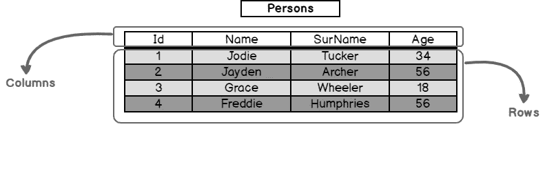
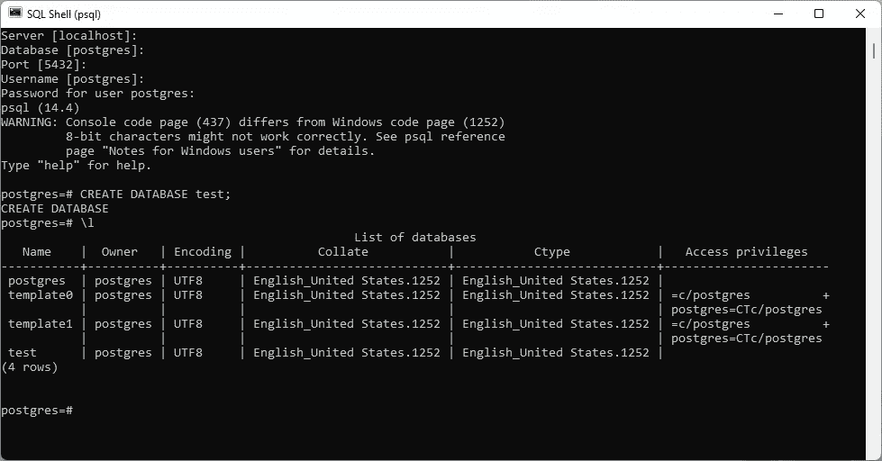

# 构建 Rust Web 应用程序——减少数据库中的 CRUD 样板代码

> 原文：<https://betterprogramming.pub/how-to-write-a-web-app-in-rust-part-2-2da195369fc1>

## 将我们基于文件的 CRUD 操作转化为基于数据库的 CRUD 操作


由[本杰明·沃罗斯](https://unsplash.com/@vorosbenisop)在 [Unsplash](https://unsplash.com/) 拍摄的照片

这是关于编写 web 应用程序的系列文章的第二部分。对于这个系列，我们将在 [Rust](https://www.rust-lang.org/learn/get-started) 中编写 web 应用程序，我将向您解释如何自己编写它。

但是，如果您不愿意自己编写代码，我已经创建了一个存储库，其中包含本系列中编写的所有代码[这里](https://github.com/garrettudstrand/rust-web-app/tree/main)。在本系列每一部分的结尾，我都提交了一个存储库。在上一部分中，我们介绍了如何通过文件进行 CRUD 操作。在这一部分中，我们将介绍如何利用数据库来减少样板代码。

# 向应用程序添加数据库

在这一部分中，我们将删除应用程序中基于文件的保存系统，代之以一个更强大的系统，它是专为我们这样的任务创建的:数据库。

大多数数据库都是存储表的程序(这个定义比数据库的[实际定义更为有限，但就我们的目的而言，假设这是真的)。这些表记录了某个类别中各种个人的信息。例如，您可能有一个名为`Persons`的表，其中存储了各种人的数据。在这个例子中，每一行都是一个人，每一列都存储这个人的不同信息。下图显示了这个例子。](https://en.wikipedia.org/wiki/Database)



图片来自 SQLShack 的文章:[SQL 表介绍](https://www.sqlshack.com/an-introduction-to-sql-tables/)

这张桌子可以容纳四个人。对于每个人，我们将他们的姓名和年龄存储在表的列中。第一列，id，与我们在定义任务时使用的 id 完全一样。id 是访问某个人的一种简单易行的方法。

现在，与我们的文件示例不同，数据库使得在这些表上执行 CRUD 操作变得非常容易。创建、读取、更新和删除表中的某些条目是通过简单的命令来处理的，因此我们不必担心写入、重命名和删除文件的开销。随着我们继续编写我们的 web 应用程序，它还带来了其他各种优势，这些优势会自然而然地显现出来。

但是现在我们知道了什么是数据库，让我们试着使用一个。

# 一种数据库系统

对于我们的目的来说， [PostgreSQL](https://www.postgresql.org/) 就足够了。有许多不同的数据库，都有各自的优缺点，所以如果您最终使用自己的软件，请记住这一点，并进行研究以确定最佳选择。无论如何，安装 Postgres。让它监听端口`5432`,当它询问你的数据库的密码时，现在就使用`password`。

如果你在 Windows 上安装或使用 postgres 有问题，可以查看 Amigoscode 的以下视频:[Windows PostgreSQL 入门| 2021](https://www.youtube.com/watch?v=BLH3s5eTL4Y) 。遗憾的是，我运行的是 Windows 机器，所以我不能保证任何 Mac 或 Linux 资源可以设置 postgres，但网上有几个。对于 Mac 来说，Codementor 的这篇[文章似乎不错。我假设如果你在 Linux 上，你知道你在做什么，但是如果你有困难，这篇微聚焦文章可能会有帮助。](https://www.codementor.io/@engineerapart/getting-started-with-postgresql-on-mac-osx-are8jcopb)

现在，让我们使用新安装的数据库！运行`psql`，这是您为了使用 postgres 而安装的 SQL Shell。使用以下信息登录到您的数据库:

*   服务器:`localhost`
*   数据库:`postgres`
*   端口:`5432`
*   用户名:`postgres`
*   密码:`password`

这将连接到 postgres 数据库。现在，我们将使用这个连接创建一个新的数据库来测试我们可用的 CRUD 操作。此时，您可能会问为什么我们必须创建数据库。我刚才不是把 Postgres 叫做数据库吗？嗯，Postgres 是一个存储多个数据库的应用程序。因此，在做任何事情之前，我们需要创建一个数据库来使用。现在，要做到这一点，只需在`psql`应用中运行以下命令:

```
CREATE DATABASE test;
```

注意，分号很重要，因为 postgres 不会将命令视为“可以使用”，直到找到分号。这样，如果您运行`\l`，您应该得到以下输出。



如你所见，postgres 预装了 3 个数据库:`postgres`、`template0`和`template1`。第四个数据库`test`，是我们创建的数据库。现在，运行`quit`离开外壳，重新进入外壳。以与上次相同的方式登录，但是将`test`列为您的数据库，而不是`postgres`。这样，您将登录到新创建的数据库。

现在，为了测试我们的 CRUD 操作，我们必须创建一个表，所以运行下面的命令(顺便说一下，因为 postgres 直到命令到达分号才处理它，所以您可以在多行中写出命令)。

```
CREATE TABLE person (
    id BIGSERIAL NOT NULL PRIMARY KEY,
    name VARCHAR(100) NOT NULL,
    country VARCHAR(50) NOT NULL
);
```

这样，您将创建一个表格。该表将列出有名称和国家的条目，id 是一个数字，每当我们创建一个新条目时，它将自动递增。如果您想查看数据库中的所有关系(包括您的表和自动递增 id)，您可以运行`\d`。如果您想查看数据库中的所有表(目前只有 person ),运行`\dt`。如果一切都正确，那么`\d`的输出应该是这样的:

```
List of relations
 Schema |     Name      |   Type   |  Owner
--------+---------------+----------+----------
 public | person        | table    | postgres
 public | person_id_seq | sequence | postgres
(2 rows)
```

现在，让我们做一些 CRUD 操作！首先，让我们做创建操作。运行以下命令，向 person 表中添加一些人。

```
INSERT INTO person (name, country) VALUES ('Torvald', 'Norway');
INSERT INTO person (name, country) VALUES ('Abelarda', 'Germany');
INSERT INTO person (name, country) VALUES ('Melete', 'Italy');
```

接下来，我们来做一个读操作。运行以下命令来查看表中的所有新条目。

```
SELECT * FROM person
```

输出应该如下所示

```
id  |   name   | country
----+----------+---------
  1 | Torvald  | Norway
  2 | Abelarda | Germany
  3 | Melete   | Italy
(3 rows)
```

现在，我们可以通过运行以下命令来执行更新操作。

```
UPDATE person SET country = 'USA' WHERE id = 3;
```

这将使梅莱特的国家成为美国。

最后，我们来做删除操作。只需运行下面的命令从我们的表中删除 Abelarda

```
DELETE FROM person WHERE id = 2;
```

如果您在这些操作之间退出并重新进入数据库，即使您关闭了计算机，您的数据库仍将保留这些值。因此，我们能够通过最少的努力实现持久的 CRUD 操作。我相信您可能会同意命令和数据库比文件更容易使用和管理，即使两者都试图解决相同的问题。

然而，如果我们不能在我们的应用程序中使用它，仅仅因为我们有这个数据库就没有任何意义。这就是数据库驱动发挥作用的地方。

# 数据库驱动程序

数据库驱动程序正好解决了我们的问题。它允许你通过程序连接和使用数据库。我们不像上一节那样手动登录并运行数据库上的操作，而是使用数据库驱动程序连接到数据库，然后在程序中写出我们的操作。这些数据库驱动通常是你为你的项目安装的库，就像我们安装 Rocket 一样。

然而，在我们的例子中，Rocket 要求我们为我们的应用程序使用他们支持的数据库驱动程序之一。但是，不管我们使用什么，让我们设置驱动程序。顺便说一下，这里的大部分代码都有点粗制滥造，因为我们最终会用稍微复杂一点的代码来替换它，这样会减少代码。

在任何情况下，修改您的`Cargo.toml`,以获得以下导入

接下来，进入`main.rs`并在所有其他结构旁边添加下面的代码。

然后，在与`Cargo.toml`相同的级别，创建一个名为`Rocket.toml`的文件，并输入以下代码

然后，转到`main.rs`中的`rocket`功能，修改成如下所示。这将初始化我们的数据库。

现在，当我们实现 CRUD 操作时，我们将假设我们的数据库中有一个名为`tasks`的表。下一步是在 postgres 中创建我们的数据库(根据我们的配置，我们将其命名为`todo`和`tasks`表)。只需转到`psql`并运行以下命令

```
CREATE DATABASE todo;
```

这将创建一个名为`todo`的数据库。现在，连接到`todo`并运行该命令

```
CREATE TABLE IF NOT EXISTS tasks (
    id   BIGSERIAL NOT NULL PRIMARY KEY,
    item TEXT NOT NULL
);
```

这将在我们的数据库中创建我们的`tasks`表。

# 数据库的 CRUD 操作

现在已经完成了，我们可以改变我们的 CRUD 操作来使用我们的数据库而不是一个文件。我们通过在方法中包含一个参数来访问数据库，然后我们可以使用这个变量和各种函数来运行我们之前运行的命令。所以，让我们开始修改我们的函数。我们要做的第一件事是添加创建操作，我们还添加了一点代码来使错误生效。我还对`Task`和`TaskId`结构做了一些小小的调整，使它们能很好地与数据库驱动程序配合。这些更改的代码如下

如果你想知道`DatabaseError`的代码，我只是使用了一个[元组结构](https://doc.rust-lang.org/1.9.0/book/structs.html#tuple-structs)来包装`rocket_db_pools::sqlx::Error`，所以我可以为它实现`[Responder](https://docs.rs/rocket/0.5.0-rc.2/rocket/response/trait.Responder.html)`特征。在 Rust 中，[特征](https://doc.rust-lang.org/book/ch10-02-traits.html)是一种确保在结构或枚举上实现某些功能的方式。使用 Rocket，我们必须为我们希望从请求中返回的任何结构、枚举或类型实现`Responder`特征。在`Responder`中实现的函数告诉 Rocket 如何将该结构、枚举或类型转换成可以在响应中发送的适当数据。

然而，Rust 的[孤儿规则](https://doc.rust-lang.org/book/ch10-02-traits.html#implementing-a-trait-on-a-type)规定不能在外部类型上实现外部特征，所以由于`rocket_db_pools::sqlx::Error`和`Responder`都没有在我们工作的文件中定义，我们不能为我们的错误实现`Responder`特征。因此，我们使用 [newtype 模式](https://www.lurklurk.org/effective-rust/newtype.html)，它让我们将外部结构包装在我们自己的结构中，这允许我们在其上实现我们想要的任何特征。

之后，我们还为`DatabaseError`实现了`[From](https://doc.rust-lang.org/std/convert/trait.From.html)`特征。我们特意这样做是为了让它与 Rust 的[问号操作符](https://doc.rust-lang.org/rust-by-example/std/result/question_mark.html)配合得更好。当你调用一个返回`[Result](https://doc.rust-lang.org/std/result/)`枚举的函数时，使用问号操作符。此枚举器存储值或错误。如果在`Result`上使用问号运算符，如果`Result`正在存储一个，它将立即返回一个错误。否则，如果`Result`保持一个值，它将像正常一样使用该值。例如，`add_task`在声明`added_task`时使用问号运算符。语句`added_task`被赋值给返回一个`Result`，它或者保存一个`Task`或者保存一个`rocket_db_pools::sqlx::Error`。在`Result`持有错误的情况下，问号运算符强制`add_task`返回持有`DatabaseError`的`Result`。否则，`added_task`将被赋予`Task`值，我们可以在下一行中很好地使用它。

现在，问号操作符隐式地使用了`From`特征。如果`Result`保存的错误不同于函数返回的错误，那么问号操作符使用`From`特征将错误从其当前类型转换为函数在返回错误之前可以返回的类型。在我们之前的例子中，`added_task`语句返回一个`rocket_db_pools::sqlx::Error`，然而函数返回一个`DatabaseError`。为了使一切变得简单，问号运算符在返回`Result`之前隐式地使用`From`特征将`rocket_db_pools::sqlx::Error`转换为`DatabaseError`。然而，这要求`DatabaseError`为`rocket_db_pools::sqlx::Error`实现`From`特征。

对于应用程序代码，很多人使用`[anyhow](https://crates.io/crates/anyhow)` crate 来实现错误([这个链接](https://www.lurklurk.org/effective-rust/errors.html#trait-objects)稍微讲了一下)。一般来说，这比我们在这里使用特定的枚举来处理我们的错误需要更少的代码。通常，如果你正在创建一个库，你只需要把错误放在枚举或元组结构中，你希望返回的错误是清晰的。然而，在这种情况下，我们仍然需要为`anyhow`错误类型实现`Responder`特征，所以我们仍然需要声明一个元组结构，这最终并没有节省我们任何时间！它将允许我们改变我们使用的底层错误，但是，正如我们将看到的，这不是必要的，因为我们将在以后改变我们如何处理错误。

至于`add_task`功能的实际内容，它只是使用了我们刚刚设置的 [sqlx 数据库驱动](https://github.com/launchbadge/sqlx)。它用它在数据库上运行一个`INSERT`命令。

尽管解释很长，但您可以看到避免使用文件而使用数据库大大简化了创建操作。我们的大部分代码只是让数据库驱动程序发送适当的请求(`add_task`之后的内容)并确保我们的错误得到适当的响应(`add_task`以上的所有内容)，这非常棒。解决了这个问题，现在让我们实现读操作

读取操作也很简单，我们只需使用之前使用过的`SELECT`命令来获取所有可用的结果。

当然，更新操作简单地使用我们前面讨论过的`UPDATE`命令，并且，就像创建操作一样，我们使用`RETURNING`语句返回我们实际修改的任务，因此我们可以将它返回给用户。

最后，`DELETE`操作也是一样的故事。使用我们之前使用的命令，将它放入数据库驱动程序并让它运行

这样，我们就可以用更少的代码实现持久的 CRUD 操作。删除所有冗余/不需要的代码后，我们有了一个少于 100 行的代码库。

今天到此为止。在这一部分中，我们能够将基于文件的 CRUD 操作转化为基于数据库的 CRUD 操作。这大大降低了我们操作的复杂性和规模。然而，编程是迭代的，仍然有可以对这个代码库进行改进的地方，我们将会做出改进。在本系列的下一部分，我们将通过 ORM 进一步减少样板代码。

感谢您阅读这篇文章。我希望这个系列能够继续帮助您提高 web 开发技能。

# 资源

*   [入门— Rust 编程语言(rust-lang.org)](https://www.rust-lang.org/learn/get-started)
*   [本系列的 GitHub 库](https://github.com/garrettudstrand/rust-web-app/tree/main)
*   [数据库—维基百科](https://en.wikipedia.org/wiki/Database)
*   [SQL 表介绍(sqlshack.com)](https://www.sqlshack.com/an-introduction-to-sql-tables/)
*   [PostgreSQL:世界上最先进的开源数据库](https://www.postgresql.org/)
*   [Windows | 2021 版 PostgreSQL 入门— YouTube](https://www.youtube.com/watch?v=BLH3s5eTL4Y)
*   [在 Mac OSX 上开始使用 PostgreSQL | code mentor](https://www.codementor.io/@engineerapart/getting-started-with-postgresql-on-mac-osx-are8jcopb)
*   【microfocus.com 在 Linux 上建立 PostgreSQL 数据库
*   【rust-lang.org】元组结构
*   [火箭中的响应者::response — Rust (docs.rs)](https://docs.rs/rocket/0.5.0-rc.2/rocket/response/trait.Responder.html)
*   [特点:定义共享行为 Rust 编程语言(rust-lang.org)](https://doc.rust-lang.org/book/ch10-02-traits.html)
*   [Rust 的孤儿规则——Rust 编程语言(rust-lang.org)](https://doc.rust-lang.org/book/ch10-02-traits.html#implementing-a-trait-on-a-type)
*   [第 7 项:拥抱新型模式——有效防锈(lurklurk.org)](https://www.lurklurk.org/effective-rust/newtype.html)
*   [来自于标准::转换-生锈(rust-lang.org)](https://doc.rust-lang.org/std/convert/trait.From.html)
*   [？—生锈的例子(rust-lang.org)](https://doc.rust-lang.org/rust-by-example/std/result/question_mark.html)
*   [标准::结果—生锈(rust-lang.org)](https://doc.rust-lang.org/std/result/)
*   [总之—crates . io:Rust Package Registry](https://crates.io/crates/anyhow)
*   [第 4 项:偏好惯用错误变体——有效 Rust(lurklurk.org)](https://www.lurklurk.org/effective-rust/errors.html#trait-objects)
*   launchbadge/sqlx: 🧰的 Rust SQL 工具包。一个异步的、纯 Rust SQL 框架，其特点是没有 DSL 的编译时检查查询。支持 PostgreSQL、MySQL、SQLite 和 MSSQL。(github.com)