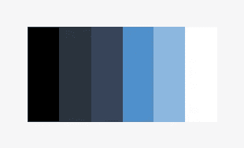
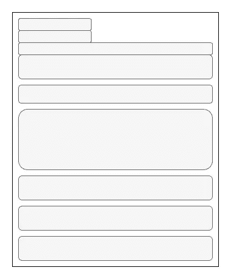
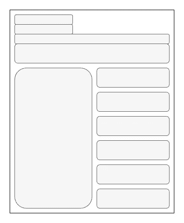
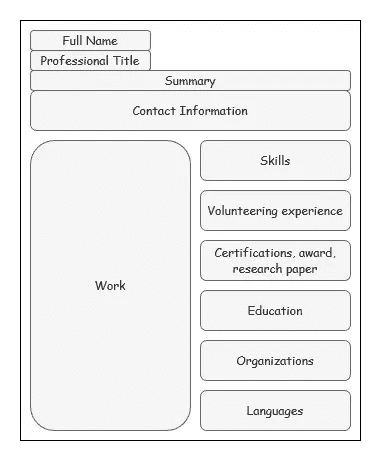
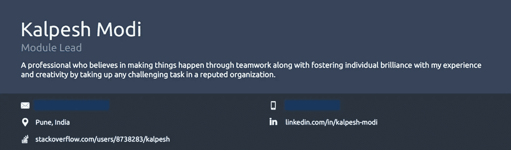
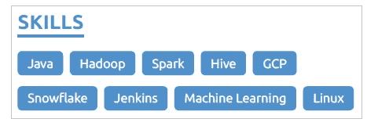
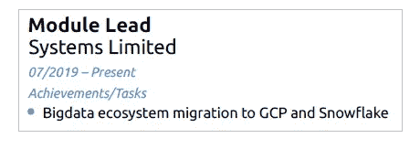
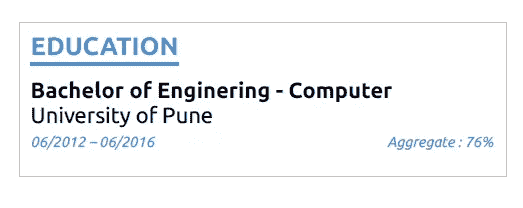
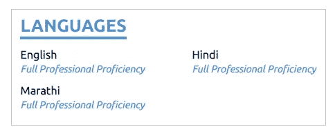

# 如何写一份有效的简历

> 原文：<https://betterprogramming.pub/how-to-write-an-effective-resume-445f0763a445>

## 设计和布局建议代表你的专业

照片由 [Pexels](https://www.pexels.com/photo/graphs-job-laptop-papers-590016/?utm_content=attributionCopyText&utm_medium=referral&utm_source=pexels) 的 [Lukas](https://www.pexels.com/@goumbik?utm_content=attributionCopyText&utm_medium=referral&utm_source=pexels) 拍摄

申请了几次你梦想中的工作却没有接到面试电话？你可能有很多相关的经验，但是如果你的简历不引人注目，被拒绝的可能性很大。

我的故事没有什么不同。我找工作的时候，每天都要申请几十个空缺。还好六个月没接到电话。幸运吗？是的。如果有人雇用我，我就不会学到这一课。同时，我得到了采访的机会。第一项任务是筛选简历。HR 分享了大约 150 份简历。我必须在规定的时间内浏览它们，同时还要管理其他任务。

我决定彻底研究每一份简历，以避免对任何人不公。然而，很快，我意识到有些人不值得公正。它们太长，几乎没有格式，难以阅读。研究了几份简历，我故意打开了我的。一份四页长、几乎没有格式化、没有任何信息的简历甚至在回收站里都找不到位置(Shift + del)。在这之后，我学习了简历设计、格式和技巧，使其更有意义。在撰写自己的简历之前，我还研究了数百份简历。真是奇迹。我开始每天接到 3-4 个电话。我的邮箱被面试电话淹没了。我收到了我梦想中的公司的邀请。剩下的都是历史了。

是时候把我的经验传授给那些还在努力让自己的梦想公司注意到自己的人了。

# 自我实现

在遵循这些建议之前，我建议浏览一下别人的简历，以实现自我。你会在阅读一份条理清晰的简历时体会到这种感觉有多好。

制作简历分为两个阶段:

1.  设计大纲
2.  内容编写和格式

# 阶段 1:设计大纲

在开始写简历之前，你需要把你大纲写好。

## 图片(可选)

申请亚洲的职位时，招聘人员希望在你的求职申请中看到一张照片。他们更喜欢穿着白色背景的正装拍照。

## 选择调色板

配色方案的一致性很重要。在制作简历之前选择你的调色板。默认情况下，黑色和白色是调色板的一部分。

再选一种颜色，比如蓝色，然后选两种较亮和两种较暗的颜色。所以调色板看起来像:

蓝色主题调色板

在制作简历时，只使用这些颜色。我将在这篇文章中使用相同的调色板。

## 单页和多页简历

有一份多页的简历并不意味着你非常合格。招聘人员可能更喜欢先阅读简短的简历。强烈推荐单页简历。

## 一列与两列布局

两栏布局是可选的，但是强烈建议只在一栏中写简历，以增加可读性。然而，如果你觉得一栏布局的空间太大，那就选择两栏布局。

一列布局

两列布局

## 简历部分

将你的简历分成不同的部分。一些常见的部分是:

*   联系信息
*   简历摘要或目标(可选)
*   技能
*   工作经验
*   教育
*   认证和奖励(可选)
*   志愿服务经历(可选)
*   语言(可选)
*   个人项目(可选)

包含部分的两栏简历布局

根据你的背景，你写在简历上的内容会有所不同。在第二阶段，你将了解在每一部分下写什么以及如何格式化。

# 阶段 2:内容编写和格式化

我将带您浏览前面提到的每个部分，并解释如何格式化它们。

## 联系信息

这是任何简历的必备部分。联系信息应该放在简历的顶部。

在这里，您可以包括:

*   全名:名和姓
*   职称:你在当前单位的职称
*   个人邮件:你经常访问的邮件
*   电话号码(带国家代码)
*   地点:城市和国家
*   社交媒体:LinkedIn 是职业界最广泛接受的社交平台。一个必须包括一个 LinkedIn 个人资料链接下的联系信息。添加前准备一个简化的自定义 LinkedIn URL。还建议突出任何社区贡献。将个人资料链接添加到您的社区特定平台(如果有)。例如，IT 人员可以添加他们的 GitHub 和 StackOverflow 配置文件。

联系信息和简历摘要

## 简历摘要或目标

这是可选的，但是很好。简历总结是对你的工作经历和成就的 2-3 句总结。简历目标是你解释职业目标的陈述。

有经验的专业人士应该选择摘要。想改变这个领域的学生或专业人士应该追求目标。

摘要应该用过去时态，而目标应该用现在时态。

简历摘要或目标应放在联系信息之后。

## 技能

技能

招聘人员首先关注的是技能。如果你的技能符合他们的要求，他们会继续阅读你的简历。这并不意味着你应该列出你所有的技能。技能必须与你申请的工作相关。如果你申请的是会计工作，没人会在意你的唱功

考虑到技能部分在简历中的重要性，它应该被放在更高的位置。我建议把它放在总结/目标下面。

## 工作经验

列出所有你做过的相关工作。您可以包括:

*   职称
*   公司名称
*   雇用日期
*   任务或成就

工作经验

只要有可能，考虑列出比任务更突出的成就。试着在成就中提及数字或百分比来突出自己。考虑下面的句子:

1.  销量增加。
2.  连续三个月销售额增长 30%。

哪个听起来更可信？第二个，对吗？列出的成就越多，你的应用价值就越大。

列举任务/成就时使用过去式。

## 教育

对于大多数工作来说，毕业是强制性的。最好突出你的学历。如果你是著名学院或大学的校友，不要忘记突出它。有声望的标签有助于你从其他申请者中脱颖而出，增加被选中的机会。

您可以包括:

*   学位名称
*   研究所/大学名称
*   出席日期
*   GPA(如果适用)

如果你有学位，先前的教育证书可以跳过。

教育科

## 认证和奖励

享有盛誉的认证和奖励有助于你脱颖而出。如果它与你申请的工作相关，那么除了联系信息之外，认证的标志可以在顶部突出显示。

## 志愿者经历

志愿者经历有助于将你描绘成一个对某项事业充满热情的人。

## 语言

有时候，语言能力可以帮助你从其他候选人中脱颖而出。例如，在加拿大的一些省份，法语比英语更受欢迎。在这些省份做生意的公司会更喜欢讲法语的候选人，而不是讲英语的。所以最好让你的潜在雇主意识到你的熟练程度。

在说明语言能力时要诚实，否则你会发现自己处于尴尬的境地。

语文科

## 个人项目

个人项目可以帮助你展示你对自己领域的热情。如果你有博客、社交媒体页面、成功故事、对社区有价值的贡献或任何相关项目，请随意将它们列在个人项目下。