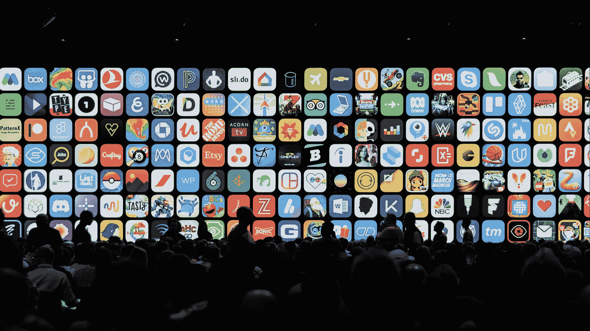
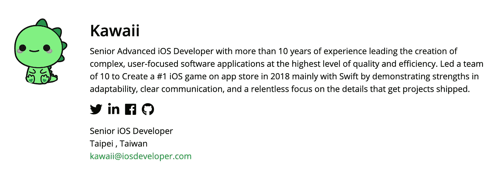
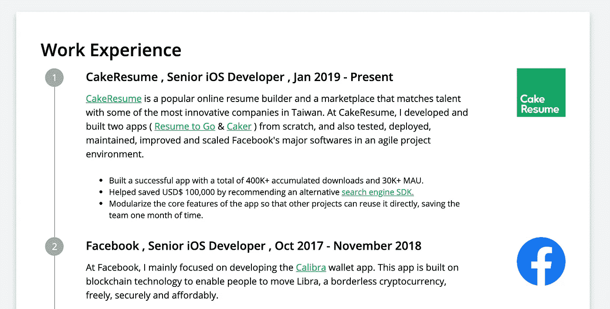
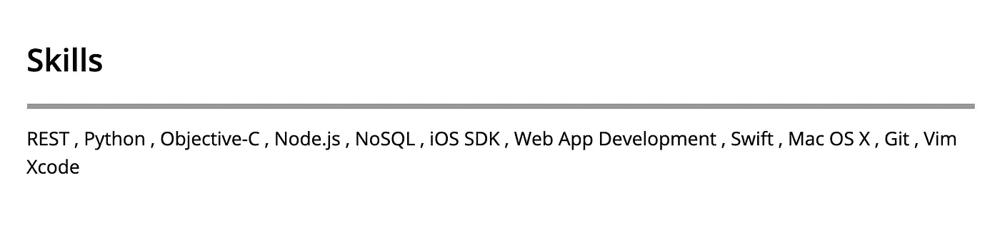
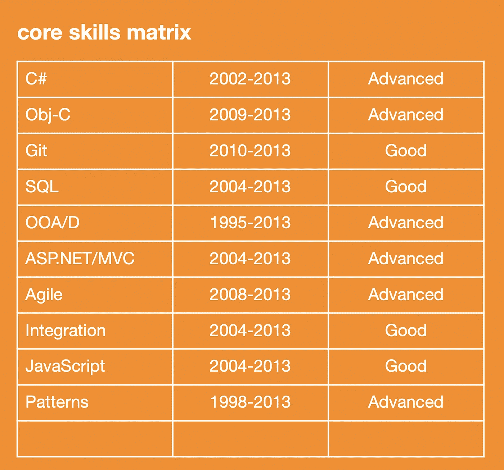

# 如何写一份能让你获得面试机会的 iOS 开发者简历

> 原文：<https://betterprogramming.pub/how-to-write-an-ios-developer-resume-that-will-land-you-an-interview-43cf66c6d4fa>

## 从采访者的角度来看，这是一篇面向初至中级 iOS 开发人员的文章



来源: [Mac Stories](https://www.macstories.net/ios/some-of-apples-forgotten-ios-apps/)

最近，我一直在帮助许多有前途的公司在 [CakeResume](https://www.cakeresume.com/) 寻找 iOS 开发者。在阅读许多简历时，出现了一些常见的问题。

出于这个原因，我决定写这篇文章来分享一些想法，关于如何提高 iOS 开发人员的简历写作技巧，如何使你的简历更具可读性，以及如何让它容易被公司找到。

希望这能给每个开发人员一个更好的机会找到他们梦想中的工作。

这篇文章中的一些提示和指南将直接来自 CakeResume 的免费电子书，你可以在这里找到，还有一些是我的个人建议。

# 在线简历生成器

在我们开始写一份出色的简历之前，试着想一想你想要的简历格式。个人建议软件开发人员用在线简历生成器写简历，比如 [CakeResume](https://www.cakeresume.com/) (免费)。

[](https://www.cakeresume.com/) [## CakeResume -免费在线简历生成器

### 写一份令人印象深刻的简历，获得梦想中的工作。CakeResume 提供了 50 多个简历模板来帮助你制作…

www.cakeresume.com](https://www.cakeresume.com/) 

以下是在线简历生成器的一些优势:

*   他们帮助你用最新的设计制作简历，给你未来的雇主留下好印象。
*   它们节省你的时间。尤其是对于那些不知道从哪里开始，又不想乱来调整列和边框的人。
*   它们有助于确保您不会遗漏任何重要信息。
*   他们使更新简历和交换信息变得容易。你可以稍微修改一下简历，为不同的雇主量身定制信息。

# 1.从基础开始

## **您的联系方式**

联系信息应该放在简历的顶部，并且包括尽可能多的你愿意分享的细节。

## **汇总报表**

你的总结陈述应该包含一个简短的、令人信服的职业成就和未来目标的概要。

当你写它的时候，记住一些事情:

*   我应该包括哪些关键词，以确保目标受众继续阅读我简历的其余部分？
*   是什么使我有别于其他申请人？
*   阅读职位描述，记住关键词和关键短语。他们在找什么？如果你能提到你主要在 [Swift](https://developer.apple.com/swift/) 或 [Objective-C](https://developer.apple.com/library/archive/documentation/Cocoa/Conceptual/ObjectiveC/Introduction/introObjectiveC.html) 中编码，那就更好了。例如，您可以这样写:



## **教育**

除非你是刚毕业的大学生，否则没必要列出你的 GPA。你的成绩比你的 GPA 更重要。

# 2.经验和技能

## **工作经历**

在这一部分，你需要以简洁的方式展示细节。使用突出的行动词汇来打动目标受众，但避免夸张。

突出与你申请的职位相关的信息，并保持简短。

然而，请不要夸大你的经历，因为面试官会问你简历上的所有内容。记住——少即是多。

这就是如何一步一步地展示你的经历。

```
// First things first, write down your company name, your title, and the time period you have been working here
```

ABC 公司，高级 iOS 开发者，2015 年至今

```
// a short intro if your company is not well known 
```

ABC 公司是一家让世界变得更美好的公司，我们正在努力解决人们的问题。

```
// a short summary of your work here 
```

在 ABC 公司，我从头开始开发和构建了两个应用程序...

```
// List a few major achievements
```

*   构建了一个成功的应用程序，总共...下载和...毛。
*   帮助了…
*   模块化的核心功能…

你的工作经历应该这样呈现:



这就是该说的都说了，该做的都做了

## 技能

对于一个软件开发人员来说，这部分是让你脱颖而出的最重要的板块。在这里尽量做到诚实和清楚。

这一部分需要包含关键的行业术语，说明与你申请的工作相关的技能。

如果某项技能与职位不直接相关，但可能与行业相关，那么就包括在内。这给了你一个更好的机会被招聘者找到。

看看下面展示你技能的例子。

*   **如何不呈现自己的技能。** 尽量不要像下面这个例子一样呈现自己的技能。看起来你知道很多东西，但是你对这些语言和框架有多熟悉呢？你是刚从 [Node.js](https://nodejs.org/) 开始还是用它创建了一个像 pro 一样的后端 web 应用？如果你刚刚开始学习一项新技能，不要把它放在简历上。这可以避免招聘人员推荐你做你不胜任的工作。



*   **如何展现自己的技能。具体说明你的熟练程度，并且要诚实。通过陈述你的熟练程度，阅读你简历的人会更快地对你有一个更清晰的了解，这会节省你们双方的时间。**


*   **展示你技能的另一个好方法:**



# 3.投资组合

作为一名招聘人员或雇主，招聘是有风险的，而且是一项昂贵的业务——他们必须对你是否是一名好员工做出有根据的猜测，他们只有几次面试(也许还有一两次测试)来做出决定。

这个投资组合让雇佣你的人更容易消除风险。你可以证明你有他们想要的技能。所以，建立投资组合很重要。

然而，请记住，给你的应用程序一个链接并不是建立你的作品集。一个线框或你的应用程序的视觉效果，而不包括你的想法，也是一个糟糕的主意。

看看下面的两个例子:

[](https://www.cakeresume.com/works/ios-app) [## iOS App——包去哪了？——尹琪琪作品集

### 因為網際網路的發達，現在網購已經越來越普遍，不出門就能購買商品深受大家的喜愛，在包裹寄送的過程中，除了期待之外還有苦苦的等待，每一件包裹都被賦予一個「包裹查詢編號」，可以透過此編號查詢包裹現在的出貨狀況、到達與否等等訊息。使用者可以透過此 A…

www.cakeresume.com](https://www.cakeresume.com/works/ios-app) [](https://www.cakeresume.com/works/hilearningmobile) [## HiLearningMobile - 方紹安's Portfolio

### 簡介: 學生端課堂相關,使用手機回答老師的問題或進行搶答問題, 與老師端傳遞文字或圖片訊息. 相關技術: 登入流程身分驗證,Swift & Objective-C brige, Restful API 串接,JSON parsing…

www.cakeresume.com](https://www.cakeresume.com/works/hilearningmobile) 

请记住——当你建立自己的投资组合时，谈论这些事情:

*   你的应用程序是做什么的？
*   你贡献了什么？
*   你的应用程序的成就。
*   用于构建应用程序的语言、框架或模式。

然而，如果你足够资深或有经验，你可能很容易通过招聘人员进行的第一阶段筛选。因此，你可能不需要在纸上解释太多你的工作。

你可以简单地在简历中列出你的应用程序的超链接，技术经理会直接对其进行评估。他们知道该问你什么。

# 4.好好利用超链接

如果你决定用在线简历制作工具制作你的简历，你有使用超链接的优势。即使你把你的在线版本转换成 PDF，你的链接仍然有效。

## 何时使用超链接

*   你想展示你正在开发的应用程序，你可以简单地提供应用商店链接
*   你要提到你用过的第三方服务或者 SDK。
*   你想在你的个人博客或媒体上展示你之前试图解决的问题的解决方案。

# 5.巨大的 iOS 工作机会

如果你遵循了上面的步骤，你现在就可以开始找工作了。

CakeResume 上有一些很棒的机会；下面我列举了几个。

[](https://www.cakeresume.com/companies/garmin/jobs/mobile-app-iOS) [## Garmin Asia _Android / iOS 軟體工程師(Mobile Apps) - CakeResume Job Search

### 【角色/职责】1。参与 Garmin iOS 应用程序开发，为全球数百万用户提供服务…

www.cakeresume.com](https://www.cakeresume.com/companies/garmin/jobs/mobile-app-iOS) [](https://www.cakeresume.com/companies/pic-collage/jobs/engineer-manager) [## iOS Developer - PicCollage 拼貼趣 Jobs - CakeResume Job Search

### 我们正在寻找有经验的 iOS 开发人员加入我们的团队，来制作供数百万人使用的产品…

www.cakeresume.com](https://www.cakeresume.com/companies/pic-collage/jobs/engineer-manager) [](https://www.cakeresume.com/companies/shopee-singapore/jobs/software-engineer-mobile-app-ios) [## 软件工程师:手机 App - iOS - Shopee - CakeResume 求职

### 开发新的业务功能并构建可重用的组件将 UI / UX 设计转化为高质量的代码探索…

www.cakeresume.com](https://www.cakeresume.com/companies/shopee-singapore/jobs/software-engineer-mobile-app-ios) 

想要更多的简历灵感，请看这里的数千份简历样本。